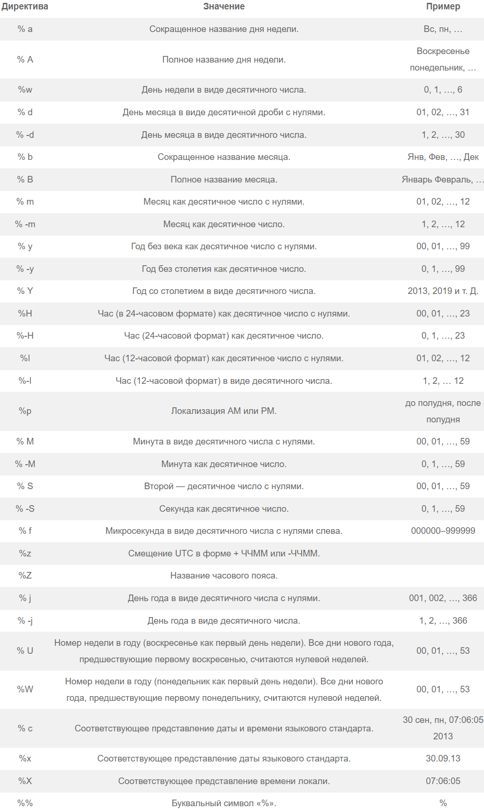

<div align="center">
  <h1> 30 Дней Python: День 16 - Python Date time </h1>
  <a class="header-badge" target="_blank" href="https://www.linkedin.com/in/asabeneh/">
  
  </a>
  <a class="header-badge" target="_blank" href="https://twitter.com/Asabeneh">
  
  </a>

  <sub>Автор:
  <a href="https://www.linkedin.com/in/asabeneh/" target="_blank">Asabeneh Yetayeh</a><br>
  <small>Второе издание: Июль, 2021</small>
  </sub>

</div>

[<< День 15](../15_Day_Python_type_errors/15_python_type_errors.md) | [День 17 >>](../17_Day_Exception_handling/17_exception_handling.md)


- [📘 День 16](#-день-16)
  - [Python *datetime*](#python-datetime)
    - [Получение информации о *datetime*](#получение-информации-о-datetime)
    - [Форматирование вывода даты с использованием *strftime*](#форматирование-вывода-даты-с-использованием-strftime)
    - [Преобразование строки в объект datetime с помощью **strptime**](#преобразование-строки-в-объект-datetime-с-помощью-strptime)
    - [Использование *date* из модуля *datetime*](#использование-date-из-модуля-datetime)
    - [Объект Time для возвращения времени](#объект-time-для-возвращения-времени)
    - [Разница между двумя временными точками](#разница-между-двумя-временными-точками)
    - [Разница между двумя временными точками с использованием *timedelta*](#разница-между-двумя-временными-точками-с-использованием-timedelta)
  - [💻 Упражнения: День 16](#-упражнения-день-16)
# 📘 День 16

## Python *datetime*

В Python есть модуль под названием datetime, который позволяет нам работать с датой и временем. 

```py
import datetime
print(dir(datetime))
['MAXYEAR', 'MINYEAR', '__builtins__', '__cached__', '__doc__', '__file__', '__loader__', '__name__', '__package__', '__spec__', 'date', 'datetime', 'datetime_CAPI', 'sys', 'time', 'timedelta', 'timezone', 'tzinfo']
```

С помощью встроенных команд dir или help можно узнать доступные функции в определенном модуле. Как видите, в модуле datetime есть множество функций, но мы сосредоточимся на date, datetime, time и timedelta. Давайте рассмотрим каждый из них отдельно.

### Получение информации о *datetime*

```py
from datetime import datetime
now = datetime.now()
print(now)                      # 2021-07-08 07:34:46.549883
day = now.day                   # 8
month = now.month               # 7
year = now.year                 # 2021
hour = now.hour                 # 7
minute = now.minute             # 38
second = now.second
timestamp = now.timestamp()
print(day, month, year, hour, minute)
print('timestamp', timestamp)
print(f'{day}/{month}/{year}, {hour}:{minute}')  # 8/7/2021, 7:38
```

**now.timestamp()** возвращает временную метку **(timestamp)** для объекта **now** типа datetime. Временная метка представляет количество секунд, прошедших с **полуночи 1 января 1970 года** по координированному всемирному времени (UTC) до указанного момента now. Это полезно для представления даты и времени в числовом формате или для сравнения временных отметок между разными моментами времени.

### Форматирование вывода даты с использованием *strftime*

```py
from datetime import datetime
new_year = datetime(2020, 1, 1)
print(new_year)      # 2020-01-01 00:00:00
day = new_year.day
month = new_year.month
year = new_year.year
hour = new_year.hour
minute = new_year.minute
second = new_year.second
print(day, month, year, hour, minute) #1 1 2020 0 0
print(f'{day}/{month}/{year}, {hour}:{minute}')  # 1/1/2020, 0:0

```

Форматирование даты и времени с использованием метода strftime и его документацию можно найти [здесь](https://strftime.org/).

```py
from datetime import datetime
# текущая дата и время
now = datetime.now()
t = now.strftime("%H:%M:%S")
print("time:", t)
time_one = now.strftime("%m/%d/%Y, %H:%M:%S")
# формат месяц/день/год H:M:S
print("time one:", time_one)
time_two = now.strftime("%d/%m/%Y, %H:%M:%S")
# формат день/месяц/год H:M:S
print("time two:", time_two)
```

```sh
time: 01:05:01
time one: 12/05/2019, 01:05:01
time two: 05/12/2019, 01:05:01
```

Здесь вы можете увидеть все символы и примеры strftime, которые мы используем для форматирования времени.



### Преобразование строки в объект datetime с помощью **strptime**
[Здесь](https://docs-python.ru/standart-library/modul-datetime-python/kody-formatirovanija-strftime-strptime-modulja-datetime/)  вы можете прочитать документацию, которая поможет вам понять форматы.

```py
from datetime import datetime
date_string = "5 December, 2019"
print("date_string =", date_string)
date_object = datetime.strptime(date_string, "%d %B, %Y")
print("date_object =", date_object)
```

```sh
date_string = 5 December, 2019
date_object = 2019-12-05 00:00:00
```

### Использование *date* из модуля *datetime*

```py
from datetime import date
d = date(2020, 1, 1)
print(d)
print('Сегодняшняя дата:', d.today())    # 2019-12-05
# запрос сегодняшней даты
today = date.today()
print("Текущий год:", today.year)   # 2019
print("Текущий месяц:", today.month) # 12
print("Текущий день:", today.day)     # 5
```

### Объект Time для возвращения времени

```py
from datetime import time
# time(часы = 0, минуты = 0, секунды = 0)
a = time()
print("a =", a)
# time(часы, минуты и секунды)
b = time(10, 30, 50)
print("b =", b)
# time(часы, минуты и секунды)
c = time(hour=10, minute=30, second=50)
print("c =", c)
# time(часы, минуты, секунды и милисекунды)
d = time(10, 30, 50, 200555)
print("d =", d)
```

output  
a = 00:00:00  
b = 10:30:50  
c = 10:30:50  
d = 10:30:50.200555

### Разница между двумя временными точками

```py
from datetime import date
today = date(year=2019, month=12, day=5)
new_year = date(year=2020, month=1, day=1)
time_left_for_newyear = new_year - today
print('Оставшееся время до нового года: ', time_left_for_newyear) # Оставшееся время до нового года: 27 дней, 0:00:00

from datetime import datetime
t1 = datetime(year = 2019, month = 12, day = 5, hour = 0, minute = 59, second = 0)
t2 = datetime(year = 2020, month = 1, day = 1, hour = 0, minute = 0, second = 0)
diff = t2 - t1
print('Оставшееся время до нового года:', diff) # Оставшееся время до нового года: 26 дней, 23:01:00
```

### Разница между двумя временными точками с использованием *timedelta*

```py
from datetime import timedelta
t1 = timedelta(weeks=12, days=10, hours=4, seconds=20)
t2 = timedelta(days=7, hours=5, minutes=3, seconds=30)
t3 = t1 - t2
print("t3 =", t3)
```

```sh
    date_string = 5 December, 2019
    date_object = 2019-12-05 00:00:00
    t3 = 86 days, 22:56:50
```

🌕 Ты великолепен. Теперь ты на 16 шагов ближе к мечте. Теперь давай закрепим материал и потренируем наш мозг!

## 💻 Упражнения: День 16

1. Получить текущий день, месяц, год, час, минуту и отметку времени из модуля datetime.
2. Отформатируйте текущую дату в формате "%m/%d/%Y, %H:%M:%S":
3. Сегодня 5 декабря, 2019. Преобразуйте эту строку в объект time.
4. Рассчитайте разницу между сегодняшней датой и новым годом.
5. Рассчитайте разницу между 1 января 1970 и сегодняшней датой.
6. Подумайте, как мы можем использовать модуль datetime? Прмеры:
   - Анализ временных рядов.
   - Получение временной точки для любых действий в приложении.
   - Добавление записей на блоге или других платформах, где требуется отображение даты и времени публикаций.

🎉 ПОЗДРАВЛЯЕМ ! 🎉

[<< День 15](../15_Day_Python_type_errors/15_python_type_errors.md) | [День 17 >>](../17_Day_Exception_handling/17_exception_handling.md)
