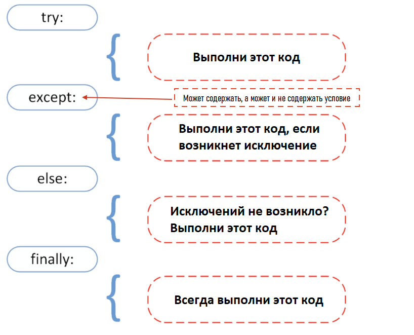

<div align="center">
  <h1> 30 Days Of Python: Day 17 - Exception Handling </h1>
  <a class="header-badge" target="_blank" href="https://www.linkedin.com/in/asabeneh/">
  
  </a>
  <a class="header-badge" target="_blank" href="https://twitter.com/Asabeneh">
  
  </a>

  <sub>Author:
  <a href="https://www.linkedin.com/in/asabeneh/" target="_blank">Asabeneh Yetayeh</a><br>
  <small> Second Edition: July, 2021</small>
  </sub>
</div>

[<< Day 16](../16_Day_Python_date_time/16_python_datetime.md) | [Day 18 >>](../18_Day_Regular_expressions/18_regular_expressions.md)


- [📘 Day 17](#-day-17)
  - [Exception Handling](#exception-handling)
  - [Packing and Unpacking Arguments in Python](#packing-and-unpacking-arguments-in-python)
    - [Unpacking](#unpacking)
      - [Unpacking Lists](#unpacking-lists)
      - [Unpacking Dictionaries](#unpacking-dictionaries)
    - [Packing](#packing)
    - [Packing Lists](#packing-lists)
      - [Packing Dictionaries](#packing-dictionaries)
  - [Spreading in Python](#spreading-in-python)
  - [Enumerate](#enumerate)
  - [Zip](#zip)
  - [Exercises: Day 17](#exercises-day-17)

# 📘 Day 17

## Exception Handling

Python uses _try_ and _except_ to handle errors gracefully. A graceful exit (or graceful handling) of errors is a simple programming idiom - a program detects a serious error condition and "exits gracefully", in a controlled manner as a result. Often the program prints a descriptive error message to a terminal or log as part of the graceful exit, this makes our application more robust. The cause of an exception is often external to the program itself. An example of exceptions could be an incorrect input, wrong file name, unable to find a file, a malfunctioning IO device. Graceful handling of errors prevents our applications from crashing.

We have covered the different Python _error_ types in the previous section. If we use _try_ and _except_ in our program, then it will not raise errors in those blocks.



```py
try:
    code in this block if things go well
except:
    code in this block run if things go wrong
```

**Example:**

```py
try:
    print(10 + '5')
except:
    print('Something went wrong')
```

In the example above the second operand is a string. We could change it to float or int to add it with the number to make it work. But without any changes, the second block, _except_, will be executed.

**Example:**

```py
try:
    name = input('Enter your name:')
    year_born = input('Year you were born:')
    age = 2019 - year_born
    print(f'You are {name}. And your age is {age}.')
except:
    print('Something went wrong')
```

```sh
Something went wrong
```

In the above example, the exception block will run and we do not know exactly the problem. To analyze the problem, we can use the different error types with except.

In the following example, it will handle the error and will also tell us the kind of error raised.

```py
try:
    name = input('Enter your name:')
    year_born = input('Year you were born:')
    age = 2019 - year_born
    print(f'You are {name}. And your age is {age}.')
except TypeError:
    print('Type error occured')
except ValueError:
    print('Value error occured')
except ZeroDivisionError:
    print('zero division error occured')
```

```sh
Enter your name:Asabeneh
Year you born:1920
Type error occured
```

In the code above the output is going to be _TypeError_.
Now, let's add an additional block:

```py
try:
    name = input('Enter your name:')
    year_born = input('Year you born:')
    age = 2019 - int(year_born)
    print('You are {name}. And your age is {age}.')
except TypeError:
    print('Type error occur')
except ValueError:
    print('Value error occur')
except ZeroDivisionError:
    print('zero division error occur')
else:
    print('I usually run with the try block')
finally:
    print('I alway run.')
```

```sh
Enter your name:Asabeneh
Year you born:1920
You are Asabeneh. And your age is 99.
I usually run with the try block
I alway run.
```

It is also shorten the above code as follows:
```py
try:
    name = input('Enter your name:')
    year_born = input('Year you born:')
    age = 2019 - int(year_born)
    print('You are {name}. And your age is {age}.')
except Exception as e:
    print(e)

```

## Packing and Unpacking Arguments in Python

We use two operators:

- \* for tuples
- \*\* for dictionaries

Let us take as an example below. It takes only arguments but we have list. We can unpack the list and changes to argument.

### Unpacking

#### Unpacking Lists

```py
def sum_of_five_nums(a, b, c, d, e):
    return a + b + c + d + e

lst = [1, 2, 3, 4, 5]
print(sum_of_five_nums(lst)) # TypeError: sum_of_five_nums() missing 4 required positional arguments: 'b', 'c', 'd', and 'e'
```

When we run the this code, it raises an error, because this function takes numbers (not a list) as arguments. Let us unpack/destructure the list.

```py
def sum_of_five_nums(a, b, c, d, e):
    return a + b + c + d + e

lst = [1, 2, 3, 4, 5]
print(sum_of_five_nums(*lst))  # 15
```

We can also use unpacking in the range built-in function that expects a start and an end.

```py
numbers = range(2, 7)  # normal call with separate arguments
print(list(numbers)) # [2, 3, 4, 5, 6]
args = [2, 7]
numbers = range(*args)  # call with arguments unpacked from a list
print(numbers)      # [2, 3, 4, 5,6]

```

A list or a tuple can also be unpacked like this:

```py
countries = ['Finland', 'Sweden', 'Norway', 'Denmark', 'Iceland']
fin, sw, nor, *rest = countries
print(fin, sw, nor, rest)   # Finland Sweden Norway ['Denmark', 'Iceland']
numbers = [1, 2, 3, 4, 5, 6, 7]
one, *middle, last = numbers
print(one, middle, last)      #  1 [2, 3, 4, 5, 6] 7
```

#### Unpacking Dictionaries

```py
def unpacking_person_info(name, country, city, age):
    return f'{name} lives in {country}, {city}. He is {age} year old.'
dct = {'name':'Asabeneh', 'country':'Finland', 'city':'Helsinki', 'age':250}
print(unpacking_person_info(**dct)) # Asabeneh lives in Finland, Helsinki. He is 250 years old.
```

### Packing

Sometimes we never know how many arguments need to be passed to a python function. We can use the packing method to allow our function to take unlimited number or arbitrary number of arguments.

### Packing Lists

```py
def sum_all(*args):
    s = 0
    for i in args:
        s += i
    return s
print(sum_all(1, 2, 3))             # 6
print(sum_all(1, 2, 3, 4, 5, 6, 7)) # 28
```

#### Packing Dictionaries

```py
def packing_person_info(**kwargs):
    # check the type of kwargs and it is a dict type
    # print(type(kwargs))
	# Printing dictionary items
    for key in kwargs:
        print("{key} = {kwargs[key]}")
    return kwargs

print(packing_person_info(name="Asabeneh",
      country="Finland", city="Helsinki", age=250))
```

```sh
name = Asabeneh
country = Finland
city = Helsinki
age = 250
{'name': 'Asabeneh', 'country': 'Finland', 'city': 'Helsinki', 'age': 250}
```

## Spreading in Python

Like in JavaScript, spreading is possible in Python. Let us check it in an example below:

```py
lst_one = [1, 2, 3]
lst_two = [4, 5, 6, 7]
lst = [0, *list_one, *list_two]
print(lst)          # [0, 1, 2, 3, 4, 5, 6, 7]
country_lst_one = ['Finland', 'Sweden', 'Norway']
country_lst_two = ['Denmark', 'Iceland']
nordic_countries = [*country_lst_one, *country_lst_two]
print(nordic_countries)  # ['Finland', 'Sweden', 'Norway', 'Denmark', 'Iceland']
```

## Enumerate

If we are interested in an index of a list, we use *enumerate* built-in function to get the index of each item in the list.

```py
for index, item in enumerate([20, 30, 40]):
    print(index, item)
```

```py
for index, i in enumerate(countries):
    print('hi')
    if i == 'Finland':
        print('The country {i} has been found at index {index}')
```

```sh
The country Finland has been found at index 1.
```

## Zip

Sometimes we would like to combine lists when looping through them. See the example below:

```py
fruits = ['banana', 'orange', 'mango', 'lemon', 'lime']                    
vegetables = ['Tomato', 'Potato', 'Cabbage','Onion', 'Carrot']
fruits_and_veges = []
for f, v in zip(fruits, vegetables):
    fruits_and_veges.append({'fruit':f, 'veg':v})

print(fruits_and_veges)
```

```sh
[{'fruit': 'banana', 'veg': 'Tomato'}, {'fruit': 'orange', 'veg': 'Potato'}, {'fruit': 'mango', 'veg': 'Cabbage'}, {'fruit': 'lemon', 'veg': 'Onion'}, {'fruit': 'lime', 'veg': 'Carrot'}]
```

🌕 You are determined. You are 17 steps a head to your way to greatness. Now do some exercises for your brain and muscles.

## Exercises: Day 17

1. names = ['Finland', 'Sweden', 'Norway','Denmark','Iceland', 'Estonia','Russia']. Unpack the first five countries and store them in a variable nordic_countries, store Estonia and Russia in es, and ru respectively.

🎉 CONGRATULATIONS ! 🎉

[<< Day 16](../16_Day_Python_date_time/16_python_datetime.md) | [Day 18 >>](../18_Day_Regular_expressions/18_regular_expressions.md)