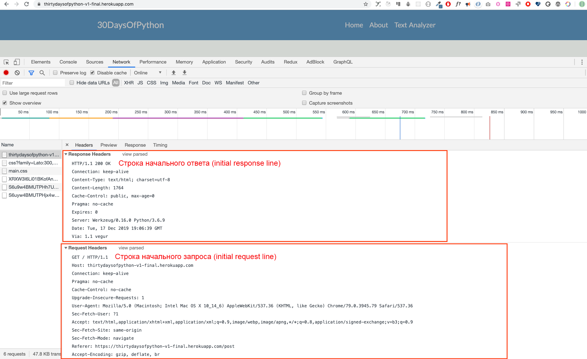

<div align="center">
  <h1> 30 Days Of Python: Day 28 - API </h1>
  <a class="header-badge" target="_blank" href="https://www.linkedin.com/in/asabeneh/">
  
  </a>
  <a class="header-badge" target="_blank" href="https://twitter.com/Asabeneh">
  
  </a>

<sub>Author:
<a href="https://www.linkedin.com/in/asabeneh/" target="_blank">Asabeneh Yetayeh</a><br>
<small>Second Edition: July, 2021</small>
</sub>

</div>
</div>

[<< Day 27](../27_Day_Python_with_mongodb/27_python_with_mongodb.md) | [Day 29 >>](../29_Day_Building_API/29_building_API.md)


- [📘 Day 28](#-day-28)
- [Application Programming Interface(API)](#application-programming-interfaceapi)
  - [API](#api)
  - [Building API](#building-api)
  - [HTTP(Hypertext Transfer Protocol)](#httphypertext-transfer-protocol)
  - [Structure of HTTP](#structure-of-http)
  - [Initial Request Line(Status Line)](#initial-request-linestatus-line)
    - [Initial Response Line(Status Line)](#initial-response-linestatus-line)
    - [Header Fields](#header-fields)
    - [The message body](#the-message-body)
    - [Request Methods](#request-methods)
  - [💻 Exercises: Day 28](#-exercises-day-28)

# 📘 Day 28

# Application Programming Interface(API)

## API

API stands for Application Programming Interface. The kind of API we will cover in this section is going to be Web APIs.
Web APIs are the defined interfaces through which interactions happen between an enterprise and applications that use its assets, which also is a Service Level Agreement (SLA) to specify the functional provider and expose the service path or URL for its API users.

In the context of web development, an API is defined as a set of specifications, such as Hypertext Transfer Protocol (HTTP) request messages, along with a definition of the structure of response messages, usually in an XML or a JavaScript Object Notation (JSON) format.

Web API has been moving away from Simple Object Access Protocol (SOAP) based web services and service-oriented architecture (SOA) towards more direct representational state transfer (REST) style web resources.

Social media services, web APIs have allowed web communities to share content and data between communities and different platforms. 

Using API, content that is created in one place dynamically can be posted and updated to multiple locations on the web.

For example, Twitter's REST API allows developers to access core Twitter data and the Search API provides methods for developers to interact with Twitter Search and trends data.

Many applications provide API end points. Some  examples of API such as the countries [API](https://restcountries.eu/rest/v2/all), [cat's breed API](https://api.thecatapi.com/v1/breeds).

In this section, we will cover a RESTful API that uses HTTP request methods to GET, PUT, POST and DELETE data.

## Building API

RESTful API is an application program interface (API) that uses HTTP requests to GET, PUT, POST and DELETE data. In the previous sections, we have learned about python, flask and mongoDB. We will use the knowledge we acquire to develop a RESTful API using Python flask and mongoDB database. Every application which has CRUD(Create, Read, Update, Delete) operation has an API to create data, to get data, to update data or to delete data from a database.

To build an API, it is good to understand HTTP protocol and HTTP request and response cycle.

## HTTP(Hypertext Transfer Protocol)

HTTP is an established communication protocol between a client and a server. A client in this case is a browser and server is the place where you access data. HTTP is a network protocol used to deliver resources which could be files on the World Wide Web, whether they are HTML files, image files, query results, scripts, or other file types.

A browser is an HTTP client because it sends requests to an HTTP server (Web server), which then sends responses back to the client.

## Structure of HTTP

HTTP uses client-server model. An HTTP client opens a connection and sends a request message to an HTTP server and the HTTP server returns response message which is the requested resources. When the request response cycle completes the server closes the connection.


The format of the request and response messages are similar. Both kinds of messages have

- an initial line,
- zero or more header lines,
- a blank line (i.e. a CRLF by itself), and
- an optional message body (e.g. a file, or query data, or query output).

Let us an example of request and response messages by navigating this site:https://thirtydaysofpython-v1-final.herokuapp.com/. This site has been deployed on Heroku free dyno and in some months may not work because of high request. Support this work to make the server run all the time. 



## Initial Request Line(Status Line)

The initial request line is different from the response.
A request line has three parts, separated by spaces:

- method name(GET, POST, HEAD)
- path of the requested resource,
- the version of HTTP being used. eg GET / HTTP/1.1

GET is the most common HTTP that helps to get or read resource and POST is a common request method to create resource.

### Initial Response Line(Status Line)

The initial response line, called the status line, also has three parts separated by spaces:

- HTTP version
- Response status code that gives the result of the request, and a reason which describes the status code. Example of status lines are:
  HTTP/1.0 200 OK
  or
  HTTP/1.0 404 Not Found
  Notes:

The most common status codes are:
200 OK: The request succeeded, and the resulting resource (e.g. file or script output) is returned in the message body.
500 Server Error
A complete list of HTTP status code can be found [here](https://httpstatuses.com/). It can be also found [here](https://httpstatusdogs.com/).

### Header Fields

As you have seen in the above screenshot, header lines provide information about the request or response, or about the object sent in the message body.

```sh
GET / HTTP/1.1
Host: thirtydaysofpython-v1-final.herokuapp.com
Connection: keep-alive
Pragma: no-cache
Cache-Control: no-cache
Upgrade-Insecure-Requests: 1
User-Agent: Mozilla/5.0 (Macintosh; Intel Mac OS X 10_14_6) AppleWebKit/537.36 (KHTML, like Gecko) Chrome/79.0.3945.79 Safari/537.36
Sec-Fetch-User: ?1
Accept: text/html,application/xhtml+xml,application/xml;q=0.9,image/webp,image/apng,*/*;q=0.8,application/signed-exchange;v=b3;q=0.9
Sec-Fetch-Site: same-origin
Sec-Fetch-Mode: navigate
Referer: https://thirtydaysofpython-v1-final.herokuapp.com/post
Accept-Encoding: gzip, deflate, br
Accept-Language: en-GB,en;q=0.9,fi-FI;q=0.8,fi;q=0.7,en-CA;q=0.6,en-US;q=0.5,fr;q=0.4
```

### The message body

An HTTP message may have a body of data sent after the header lines. In a response, this is where the requested resource is returned to the client (the most common use of the message body), or perhaps explanatory text if there's an error. In a request, this is where user-entered data or uploaded files are sent to the server.

If an HTTP message includes a body, there are usually header lines in the message that describe the body. In particular,

The Content-Type: header gives the MIME-type of the data in the body(text/html, application/json, text/plain, text/css, image/gif).
The Content-Length: header gives the number of bytes in the body.

### Request Methods

The GET, POST, PUT and DELETE are the HTTP request methods which we are going to implement an API or a CRUD operation application.

1. GET: GET method is used to retrieve and get information from the given server using a given URI. Requests using GET should only retrieve data and should have no other effect on the data.

2. POST: POST request is used to create data and send data to the server, for example, creating a new post, file upload, etc. using HTML forms.

3. PUT: Replaces all current representations of the target resource with the uploaded content and we use it modify or update data.

4. DELETE: Removes data

## 💻 Exercises: Day 28

1. Read about API and HTTP

🎉 CONGRATULATIONS ! 🎉

[<< Day 27](../27_Day_Python_with_mongodb/27_python_with_mongodb.md) | [Day 29 >>](../29_Day_Building_API/29_building_API.md)
