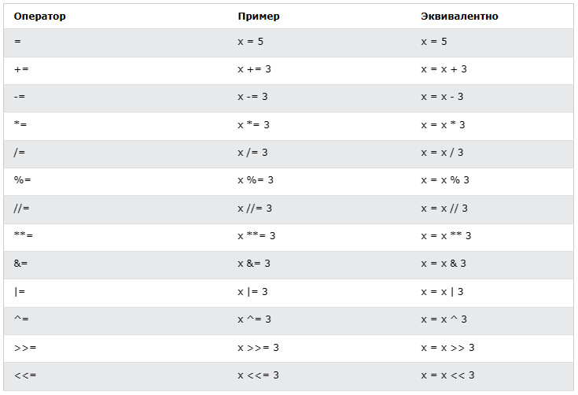
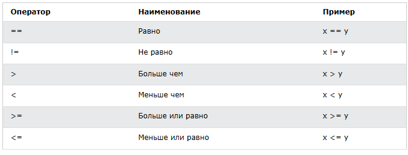
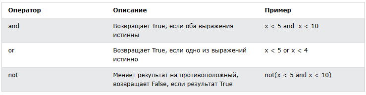

<div align="center">
  <h1> 30 天 Python：第三天 - 运算符</h1>
  <a class="header-badge" target="_blank" href="https://www.linkedin.com/in/asabeneh/">
  
  </a>
  <a class="header-badge" target="_blank" href="https://twitter.com/Asabeneh">
  
  </a>

<sub>作者:
<a href="https://www.linkedin.com/in/asabeneh/" target="_blank">Asabeneh Yetayeh</a><br>
<small> 第二版：2021 年 7 月</small>
</sub>
</div>

[<< 第二天](./02_variables_builtin_functions.md) | [第四天 >>](./04_strings.md)


阅读大约需要：12m
- [📘 第三天](#-第三天)
  - [Boolean](#boolean)
  - [运算符](#运算符)
    - [赋值运算符](#赋值运算符)
    - [算术运算符](#算术运算符)
    - [比较运算符](#比较运算符)
    - [逻辑运算符](#逻辑运算符)
  - [💻 练习 - 第三天](#-练习---第三天)

# 📘 第三天

## Boolean

布尔类型表示两个值之一：_True_ 或 _False_。一旦我们开始使用比较运算符，这些数据类型的使用将变得清晰。第一个字母 **T** 表示 True，**F** 表示 False，与 JavaScript 不同，Python 的布尔类型的首字母应该是大写。

**示例: 布尔类型的值**

```py
print(True)
print(False)
```

## 运算符

Python 语言支持多种类型的运算符。在本节中，我们将重点介绍其中的一些。

### 赋值运算符

赋值运算符用于将值赋值给变量。让我们以 = 为例。在数学中，等号表示两个值相等，但在 Python 中，它表示我们正在将一个值存储在某个变量中，我们称之为赋值或将值分配给变量。下表显示了不同类型的 Python 赋值运算符，摘自 [w3school](https://www.w3schools.com/python/python_operators.asp)。



### 算术运算符：

- 加(+)： a + b
- 减(-)： a - b
- 乘(*)： a * b
- 除(/)： a / b
- 模运算(%)： a % b
- 整除(//)： a // b
- 指数运算(**)： a ** b


**示例：整型**

```py
# Python 中的算术运算符
# 整型

print('Addition: ', 1 + 2)        # 3
print('Subtraction: ', 2 - 1)     # 1
print('Multiplication: ', 2 * 3)  # 6
print ('Division: ', 4 / 2)       # 2.0  Python 中的除法运算符返回浮点数
print('Division: ', 6 / 2)        # 3.0         
print('Division: ', 7 / 2)        # 3.5
print('Division without the remainder: ', 7 // 2)   # 3,  返回商的整数部分
print ('Division without the remainder: ',7 // 3)   # 2
print('Modulus: ', 3 % 2)         # 1, 返回余数
print('Exponentiation: ', 2 ** 3) # 8 代表 2 * 2 * 2
```

**示例：浮点数**

```py
# 浮点数
print('Floating Point Number, PI', 3.14)
print('Floating Point Number, gravity', 9.81)
```

**示例：复数**

```py
# 复数
print('Complex number: ', 1 + 1j)
print('Multiplying complex numbers: ',(1 + 1j) * (1 - 1j))
```

让我们声明一个变量并分配一个数字类型。我下面使用单个字符变量，但请不要养成这样命名变量的习惯。变量名应始终便于记忆。

**示例：**

```python
# 首先声明变量

a = 3 # a 是一个变量名，3 是一个整型值
b = 2 # b 是一个变量名，2 是一个整型值

# 进行算术运算，并将结果赋值给变量
total = a + b
diff = a - b
product = a * b
division = a / b
remainder = a % b
floor_division = a // b
exponential = a ** b

# 应该使用 sum 而不是 total，但 sum 是一个内置函数 - 尽量避免覆盖内置函数
print(total) # 如果不打印标签字符串，就不知道值是怎么计算出来的
print('a + b = ', total)
print('a - b = ', diff)
print('a * b = ', product)
print('a / b = ', division)
print('a % b = ', remainder)
print('a // b = ', floor_division)
print('a ** b = ', exponentiation)
```

**示例：**

```py
print('== Addition, Subtraction, Multiplication, Division, Modulus ==')

# 声明变量，并把声明语句放在一起
num_one = 3
num_two = 4

# 算术运算
total = num_one + num_two
diff = num_two - num_one
product = num_one * num_two
div = num_two / num_one
remainder = num_two % num_one

# 使用标签打印值
print('total: ', total)
print('difference: ', diff)
print('product: ', product)
print('division: ', div)
print('remainder: ', remainder)
```

让我们开始使用小数点并开始利用我们已经知道的知识来计算（面积、体积、密度、重量、周长、距离、力）。

**示例：**

```py
# 计算圆的面积
radius = 10                                 # 圆的半径
area_of_circle = 3.14 * radius ** 2         # 两个 * 符号表示指数或幂
print('Area of a circle:', area_of_circle)

# 计算矩形面积
length = 10
width = 20
area_of_rectangle = length * width
print('Area of rectangle:', area_of_rectangle)

# 计算物体重量
mass = 75
gravity = 9.81
weight = mass * gravity
print(weight, 'N')                         # 为重量添加单位

# 计算液体密度
mass = 75 # 单位是 Kg
volume = 0.075 # 单位是 m³
density = mass / volume # 1000 Kg/m³

```

### 比较运算符

在编程中，我们使用比较运算符来比较两个值。我们检查一个值是否大于或小于或等于另一个值。下表显示了 Python 比较运算符，摘自 [w3shool](https://www.w3schools.com/python/python_operators.asp)。


**示例：比较运算符**

```py
print(3 > 2)     # True, 因为3大于2
print(3 >= 2)    # True, 因为3大于2
print(3 < 2)     # False,  因为3大于2
print(2 < 3)     # True, 因为2小于3
print(2 <= 3)    # True, 因为2小于3
print(3 == 2)    # False, 因为3不等于2
print(3 != 2)    # True, 因为3不等于2
print(len('mango') == len('avocado'))  # False
print(len('mango') != len('avocado'))  # True
print(len('mango') < len('avocado'))   # True
print(len('milk') != len('meat'))      # False
print(len('milk') == len('meat'))      # True
print(len('tomato') == len('potato'))  # True
print(len('python') > len('dragon'))   # False


# 比较得到 True 或者 False

print('True == True: ', True == True)
print('True == False: ', True == False)
print('False == False:', False == False)
```

除了上述比较运算符之外，Python 还使用：

- _is_: 如果变量相等，返回 True(x is y)
- _is not_: 如果变量不相等，返回 True(x is not y)
- _in_: 如果列表包含某变量，返回 True(x in y)
- _not in_: 如果列表不包含某变量(x in y)

```py
print('1 is 1', 1 is 1)                   # True - 因为值相等
print('1 is not 2', 1 is not 2)           # True - 因为值不相等
print('A in Asabeneh', 'A' in 'Asabeneh') # True - 字符串中含有元素 A
print('B in Asabeneh', 'B' in 'Asabeneh') # False - 没有大写字母 B
print('coding' in 'coding for all') # True - 因为 coding 都在 'coding for all' 中
print('a in an:', 'a' in 'an')      # True
print('4 is 2 ** 2:', 4 is 2 ** 2)   # True
```

### 逻辑运算符

不像其他的编程语言，Python 使用关键字 _and_、_or_ 和 _not_ 作为逻辑运算符。逻辑运算符用于组合条件语句：



```py
print(3 > 2 and 4 > 3) # True - 因为两个语句都是 True
print(3 > 2 and 4 < 3) # False - 因为其中一个语句是 False
print(3 < 2 and 4 < 3) # False - 因为两个语句都是 False
print('True and True: ', True and True)
print(3 > 2 or 4 > 3)  # True - 因为两个语句都是 True
print(3 > 2 or 4 < 3)  # True - 因为其中一个语句是 True
print(3 < 2 or 4 < 3)  # False - 因为两个语句都是 False
print('True or False:', True or False)
print(not 3 > 2)     # False - 因为 3 > 2 是 True,  not True 得到 False
print(not True)      # False - not 运算符把 True 改为 False
print(not False)     # True
print(not not True)  # True
print(not not False) # False

```

🌕 精力充沛！你刚刚完成了第 3 天的挑战，在通往伟大的道路上又前进了三步。现在做一些练习来锻练你的大脑和肌肉。


## 💻 练习 - 第三天

1. 声明一个值是你年龄的整型变量
2. 声明一个值是你身高的浮点型变量
3. 声明一个值是复数变量
4. 编写一个脚本，提示用户输入三角形的底和高，并计算这个三角形的面积（面积 = 0.5 x b x h）。

```py
    输入底: 20
    输入高: 10
    三角形的面积是 100
```

5. 编写一个脚本，提示用户输入三角形的边 a、边 b 和边 c。计算三角形的周长（周长 = a + b + c）。

```py
    输入边 a: 5
    输入边 b: 4
    输入边 c: 3
    三角形的周长是 12
```
6. 提示用户输入矩形的长度和宽度。计算其面积（面积 = 长 x 宽）和周长（周长 = 2 x (长 + 宽)）
7. 提示用户输入圆的半径。计算面积（面积 = pi x r x r）和周长（周长 = 2 x pi x r），其中 pi = 3.14。
8. 计算 y = 2x -2 的斜率、x 截距和 y 截距
9. 斜率是 (m = y2-y1/x2-x1)。找到点 (2, 2) 和点 (6,10) 之间的斜率和[欧几里得距离](https://en.wikipedia.org/wiki/Euclidean_distance#:~:text=In%20mathematics%2C%20the%20Euclidean%20distance,being%20called%20the%20Pythagorean%20distance.)。
10. 比较练习 8 和练习 9 中的斜率。
11. 计算 y 的值（y = x^2 + 6x + 9）。尝试使用不同的 x 值，并找出 y 何时为 0。
12. 求出 'python' 和 'dragon' 的长度，并进行一个假的比较语句。
13. 使用 _and_ 运算符检查 'python' 和 'dragon' 中是否都有 'on'。
14. _I hope this course is not full of jargon_。使用 _in_ 运算符检查句子中是否有 _jargon_。
15. 'dragon' 和 'python' 中都没有 'on'。
16. 找到文本 _python_ 的长度，并将该值转换为浮点数，然后将其转换为字符串。
17. 偶数可以被 2 整除，余数为零。如何使用 Python 检查一个数字是偶数还是奇数？
18. 检查 7 除以 3 的Floor除法是否等于 2.7 的整数转换值。
19. 检查 '10' 的类型是否等于 10 的类型。
20. 检查 int('9.8') 是否等于 10。
21. 编写一个脚本，提示用户输入工时和时薪。计算用户的工资。

```py
输入工时: 40
输入时薪: 28
你每周的薪资是 1120
```


22. 编写一个脚本，提示用户输入年数。计算一个人可以活多少秒。假设一个人可以活一百年

```py
输入你已经活了多少年: 100
你已经活了 3153600000 秒.
```

23. 编写一个 Python 脚本，显示以下表格


```py
1 1 1 1 1
2 1 2 4 8
3 1 3 9 27
4 1 4 16 64
5 1 5 25 125
```

🎉 恭喜 ! 🎉

[<< 第二天](./02_variables_builtin_functions.md) | [第四天 >>](./04_strings.md)
