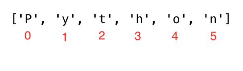

<div align="center">
  <h1> 30 天 Python：第四天 - Strings</h1>
  <a class="header-badge" target="_blank" href="https://www.linkedin.com/in/asabeneh/">
  
  </a>
  <a class="header-badge" target="_blank" href="https://twitter.com/Asabeneh">
  
  </a>

<sub>作者:
<a href="https://www.linkedin.com/in/asabeneh/" target="_blank">Asabeneh Yetayeh</a><br>
<small> 第二版：2021 年 7 月</small>
</sub>

</div>

[<< 第三天](./03_operators.md) | [第五天 >>](./05_lists.md)


阅读大约需要：20m

- [第四天](#第四天)
  - [字符串](#字符串)
    - [创建字符串](#创建字符串)
    - [字符串串联](#字符串串联)
    - [字符串中的转译序列](#字符串中的转译序列)
    - [字符串格式化](#字符串格式化)
      - [传统风格字符串格式化 (% 操作符)](#传统风格字符串格式化--操作符)
      - [新式字符串格式化 (str.format)](#新式字符串格式化-strformat)
      - [字符串插值 / f-Strings (Python 3.6+)](#字符串插值--f-strings-python-36)
    - [Python 字符串是字符序列](#python-字符串是字符序列)
      - [拆解字符](#拆解字符)
      - [通过索引获取字符串中的字符](#通过索引获取字符串中的字符)
      - [字符串切片](#字符串切片)
      - [字符串反转](#字符串反转)
      - [切片时跳过字符](#切片时跳过字符)
    - [字符串方法](#字符串方法)
  - [💻 练习 - 第四天](#-练习---第四天)

# 第四天

## 字符串

文本是一种字符串数据类型。任何以文本形式书写的数据类型都是字符串。任何用单引号、双引号或三引号括起来的数据都是字符串。有很多方法和内置函数来处理字符串类型的数据。使用 len() 方法获取字符串的长度。

### 创建字符串

```py
letter = 'P'                # 字符串可以是一个字符，也可以是一堆文字
print(letter)               # P
print(len(letter))          # 1
greeting = 'Hello, World!'  # 字符串使用单引号或双引号构建，"Hello, World!"
print(greeting)             # Hello, World!
print(len(greeting))        # 13
sentence = "I hope you are enjoying 30 days of Python Challenge"
print(sentence)
```

多行字符串使用三个单引号 (''') 或者三个双引号 (""") 创建。 以下为示例：

```py
multiline_string = '''I am a teacher and enjoy teaching.
I didn't find anything as rewarding as empowering people.
That is why I created 30 days of python.'''
print(multiline_string)

# 换种方式
multiline_string = """I am a teacher and enjoy teaching.
I didn't find anything as rewarding as empowering people.
That is why I created 30 days of python."""
print(multiline_string)
```

### 字符串串联

我们可以将字符串连接在一起。合并或连接字符串称为串联。请看下面的示例：

```py

first_name = 'Asabeneh'
last_name = 'Yetayeh'
space = ' '
full_name = first_name  +  space + last_name
print(full_name) # Asabeneh Yetayeh
# 使用 len() 内置函数获取字符串的长度
print(len(first_name))  # 8
print(len(last_name))   # 7
print(len(first_name) > len(last_name)) # True
print(len(full_name)) # 16
```

### 字符串中的转译序列

在 Python 和其他编程语言中，\ 后跟一个字符是转义序列。以下是一些常见的转义序列：

- \n: 换行
- \t: 制表符(4个空格)
- \\\\: 反斜杠
- \\': 单引号
- \\": 双引号

现在，让我们看看上面的转义序列的用法和示例。

```py
print('I hope everyone is enjoying the Python Challenge.\nAre you ?') # 换行
print('Days\tTopics\tExercises') # 增加一个制表符
print('Day 1\t5\t5')
print('Day 2\t6\t20')
print('Day 3\t5\t23')
print('Day 4\t1\t35')
print('This is a backslash  symbol (\\)') # 输出反斜杠
print('In every programming language it starts with \"Hello, World!\"') # 在单引号里写双引号

# 输出
I hope every one is enjoying the Python Challenge.
Are you ?
Days	Topics	Exercises
Day 1	5	    5
Day 2	6	    20
Day 3	5	    23
Day 4	1	    35
This is a backslash  symbol (\)
In every programming language it starts with "Hello, World!"
```

### 字符串格式化

#### 传统风格字符串格式化 (% 操作符)


在 Python 中有许多格式化字符串的方法。本节，我们将介绍其中一些方法。
“%”运算符用于格式化包含在“元组”（固定大小列表）中的一组变量，以及格式字符串，其中包含普通文本以及“参数说明符”、特殊符号如“%s”、“%d”、“%f”、“%.<small>数字</small>f”。

- %s - 字符串 (或者任何可以用字符串表述的对象，例如数字)
- %d - 整型
- %f - 浮点型
- "%.<small>小数位数</small>f" - 固定精度的浮点数

```py
# 仅字符串
first_name = 'Asabeneh'
last_name = 'Yetayeh'
language = 'Python'
formated_string = 'I am %s %s. I teach %s' %(first_name, last_name, language)
print(formated_string)

# 字符串和数字
radius = 10
pi = 3.14
area = pi * radius ** 2
formated_string = 'The area of circle with a radius %d is %.2f.' %(radius, area) # 2 表示小数点后的 2 位有效数字

python_libraries = ['Django', 'Flask', 'NumPy', 'Matplotlib','Pandas']
formated_string = 'The following are python libraries:%s' % (python_libraries)
print(formated_string) # 输出 "The following are python libraries:['Django', 'Flask', 'NumPy', 'Matplotlib','Pandas']"
```

#### 新式字符串格式化 (str.format)

这种格式化方式是在 Python 3 中引入的。

```py

first_name = 'Asabeneh'
last_name = 'Yetayeh'
language = 'Python'
formated_string = 'I am {} {}. I teach {}'.format(first_name, last_name, language)
print(formated_string)
a = 4
b = 3

print('{} + {} = {}'.format(a, b, a + b))
print('{} - {} = {}'.format(a, b, a - b))
print('{} * {} = {}'.format(a, b, a * b))
print('{} / {} = {:.2f}'.format(a, b, a / b)) # 限制保留两位小数
print('{} % {} = {}'.format(a, b, a % b))
print('{} // {} = {}'.format(a, b, a // b))
print('{} ** {} = {}'.format(a, b, a ** b))

# 输出
4 + 3 = 7
4 - 3 = 1
4 * 3 = 12
4 / 3 = 1.33
4 % 3 = 1
4 // 3 = 1
4 ** 3 = 64

# 字符串和数字
radius = 10
pi = 3.14
area = pi * radius ** 2
formated_string = 'The area of a circle with a radius {} is {:.2f}.'.format(radius, area) # 保留两位小数
print(formated_string)

```

#### 字符串插值 / f-Strings (Python 3.6+)

另一种新的字符串格式化是字符串插值，f-strings。字符串以 f 开头，我们可以在相应的位置注入数据。

```py
a = 4
b = 3
print(f'{a} + {b} = {a +b}')
print(f'{a} - {b} = {a - b}')
print(f'{a} * {b} = {a * b}')
print(f'{a} / {b} = {a / b:.2f}')
print(f'{a} % {b} = {a % b}')
print(f'{a} // {b} = {a // b}')
print(f'{a} ** {b} = {a ** b}')
```

### Python 字符串是字符序列

Python 字符串是字符序列，与其他 Python 有序对象 - 列表和元组 - 共享基本访问方法。从字符串中提取单个字符的最简单方法（以及从任何序列中提取单个成员的方法）是将它们解压缩到相应的变量中。

#### 拆解字符

```
language = 'Python'
a,b,c,d,e,f = language # 拆解字符串中的字符并赋值给变量
print(a) # P
print(b) # y
print(c) # t
print(d) # h
print(e) # o
print(f) # n
```

#### 通过索引获取字符串中的字符

在编程中，计数从零开始。因此，字符串的第一个字母位于零索引处，字符串的最后一个字母位于字符串长度减一处。



```py
language = 'Python'
first_letter = language[0]
print(first_letter) # P
second_letter = language[1]
print(second_letter) # y
last_index = len(language) - 1
last_letter = language[last_index]
print(last_letter) # n
```

如果我们想从右边开始，我们可以使用负索引。-1 是最后一个索引。

```py
language = 'Python'
last_letter = language[-1]
print(last_letter) # n
second_last = language[-2]
print(second_last) # o
```

#### 字符串切片

在 Python 中，我们可以将字符串切片为子字符串。

```py
language = 'Python'
first_three = language[0:3] # 从零索引开始，直到 3 但不包括 3
print(first_three) #Pyt
last_three = language[3:6]
print(last_three) # hon
# 另一种方式
last_three = language[-3:]
print(last_three)   # hon
last_three = language[3:]
print(last_three)   # hon
```

#### 字符串反转

我们可以轻松地反转字符串。

```py
greeting = 'Hello, World!'
print(greeting[::-1]) # !dlroW ,olleH
```

#### 切片时跳过字符

通过将步长参数传递给切片方法，可以在切片时跳过字符。


```py
language = 'Python'
pto = language[0:6:2] #
print(pto) # Pto
```

### 字符串方法

有许多字符串方法可以让我们格式化字符串。在下面的示例中，我们使用其中一些：

- capitalize(): 将字符串中的第一个字符转换为大写字母

```py
challenge = 'thirty days of python'
print(challenge.capitalize()) # 'Thirty days of python'
```

- count(): 返回字符串中子字符串的出现次数，count(子字符串，start=..，end=..)。start 是计数的起始索引，end 是计数的最后一个索引。

```py
challenge = 'thirty days of python'
print(challenge.count('y')) # 3
print(challenge.count('y', 7, 14)) # 1, 
print(challenge.count('th')) # 2`
```

- endswith(): 判断字符串是否以特定的子字符串结尾，返回 True 或 False

```py
challenge = 'thirty days of python'
print(challenge.endswith('on'))   # True
print(challenge.endswith('tion')) # False
```

- expandtabs(): 用空格替换制表符，默认制表符大小为 8。它接受制表符大小参数

```py
challenge = 'thirty\tdays\tof\tpython'
print(challenge.expandtabs())   # 'thirty  days    of      python'
print(challenge.expandtabs(10)) # 'thirty    days      of        python'
```

- find(): 返回子字符串第一次出现的索引，如果未找到则返回 -1

```py
challenge = 'thirty days of python'
print(challenge.find('y'))  # 5
print(challenge.find('th')) # 0
```

- rfind(): 返回子字符串最后一次出现的索引，如果未找到则返回 -1

```py
challenge = 'thirty days of python'
print(challenge.rfind('y'))  # 16
print(challenge.rfind('th')) # 17
```

- format(): 将字符串格式化为更美观的输出
有关字符串格式化的更多信息，请查看此[链接](https://www.programiz.com/python-programming/methods/string/format)

```py
first_name = 'Asabeneh'
last_name = 'Yetayeh'
age = 250
job = 'teacher'
country = 'Finland'
sentence = 'I am {} {}. I am a {}. I am {} years old. I live in {}.'.format(first_name, last_name, age, job, country)
print(sentence) # I am Asabeneh Yetayeh. I am 250 years old. I am a teacher. I live in Finland.

radius = 10
pi = 3.14
area = pi * radius ** 2
result = 'The area of a circle with radius {} is {}'.format(str(radius), str(area))
print(result) # The area of a circle with radius 10 is 314
```

- index(): 返回子字符串的最小索引，附加参数表示起始和结束索引（默认为 0，字符串长度为 - 1）。如果未找到子字符串，则会引发 valueError。

```py
challenge = 'thirty days of python'
sub_string = 'da'
print(challenge.index(sub_string))  # 7
print(challenge.index(sub_string, 9)) # error
```

- rindex(): 返回子字符串的最大索引，附加参数表示起始和结束索引（默认为 0，字符串长度为 - 1）。

```py
challenge = 'thirty days of python'
sub_string = 'da'
print(challenge.rindex(sub_string))  # 8
print(challenge.rindex(sub_string, 9)) # error
```

- isalnum(): 判断字符串字符是否都是字母数字字符

```py
challenge = 'ThirtyDaysPython'
print(challenge.isalnum()) # True

challenge = '30DaysPython'
print(challenge.isalnum()) # True

challenge = 'thirty days of python'
print(challenge.isalnum()) # False, 空格不是字母字符

challenge = 'thirty days of python 2019'
print(challenge.isalnum()) # False
```

- isalpha(): 判断字符串字符是否都是字母字符 (a-z and A-Z)

```py
challenge = 'thirty days of python'
print(challenge.isalpha()) # False, 空格不是字母字符
challenge = 'ThirtyDaysPython'
print(challenge.isalpha()) # True
num = '123'
print(num.isalpha())      # False
```

- isdecimal(): 判断符串中的所有字符是否都是十进制 (0-9)

```py
challenge = 'thirty days of python'
print(challenge.isdecimal())  # False
challenge = '123'
print(challenge.isdecimal())  # True
challenge = '\u00B2'
print(challenge.isdigit())   # False
challenge = '12 3'
print(challenge.isdecimal())  # False, 含有空格
```

- isdigit(): 判断字符串中的所有字符是否都是数字（0-9 和一些其他表示数字的 Unicode 字符）

```py
challenge = 'Thirty'
print(challenge.isdigit()) # False
challenge = '30'
print(challenge.isdigit())   # True
challenge = '\u00B2'
print(challenge.isdigit())   # True
```

- isnumeric(): 判断字符串中的所有字符是否都是数字或与数字相关（就像 isdigit()，只是接受更多符号，如 ½）

```py
num = '10'
print(num.isnumeric()) # True
num = '\u00BD' # ½
print(num.isnumeric()) # True
num = '10.5'
print(num.isnumeric()) # False
```

- isidentifier(): 判断有效的标识符 - 检查字符串是否是有效的变量名

```py
challenge = '30DaysOfPython'
print(challenge.isidentifier()) # False, 因为以数字开头
challenge = 'thirty_days_of_python'
print(challenge.isidentifier()) # True
```

- islower(): 判断字符串中的所有字母是否都是小写

```py
challenge = 'thirty days of python'
print(challenge.islower()) # True
challenge = 'Thirty days of python'
print(challenge.islower()) # False
```

- isupper(): 判断字符串中的所有字母是否都是大写

```py
challenge = 'thirty days of python'
print(challenge.isupper()) #  False
challenge = 'THIRTY DAYS OF PYTHON'
print(challenge.isupper()) # True
```

- join(): 返回连接后的字符串

```py
web_tech = ['HTML', 'CSS', 'JavaScript', 'React']
result = ' '.join(web_tech)
print(result) # 'HTML CSS JavaScript React'
```

```py
web_tech = ['HTML', 'CSS', 'JavaScript', 'React']
result = '# '.join(web_tech)
print(result) # 'HTML# CSS# JavaScript# React'
```

- strip(): 删除从字符串开头到结尾的所有给定字符

```py
challenge = 'thirty days of pythoonnn'
print(challenge.strip('noth')) # 'irty days of py'
```

- replace(): 用给定的字符串替换子字符串

```py
challenge = 'thirty days of python'
print(challenge.replace('python', 'coding')) # 'thirty days of coding'
```

- split(): 使用给定的字符串或空格作为分隔符来拆分字符串

```py
challenge = 'thirty days of python'
print(challenge.split()) # ['thirty', 'days', 'of', 'python']
challenge = 'thirty, days, of, python'
print(challenge.split(', ')) # ['thirty', 'days', 'of', 'python']
```

- title(): 返回标题大小写的字符串

```py
challenge = 'thirty days of python'
print(challenge.title()) # Thirty Days Of Python
```

- swapcase(): 将所有大写字符转换为小写字符，将所有小写字符转换为大写字符

```py
challenge = 'thirty days of python'
print(challenge.swapcase())   # THIRTY DAYS OF PYTHON
challenge = 'Thirty Days Of Python'
print(challenge.swapcase())  # tHIRTY dAYS oF pYTHON
```

- startswith(): 判断字符串是否以指定字符串开头

```py
challenge = 'thirty days of python'
print(challenge.startswith('thirty')) # True

challenge = '30 days of python'
print(challenge.startswith('thirty')) # False
```

🌕 你是一个非凡的人，你拥有非凡的潜力。你刚刚完成了第 4 天的挑战，你在成为伟人的路上已经迈出四步。现在做一些练习来锻练你的大脑和肌肉。

## 💻 练习 - 第四天

1. 将字符串 'Thirty', 'Days', 'Of', 'Python' 连接为一个字符串 'Thirty Days Of Python'。
2. 将字符串 'Coding', 'For', 'All' 连接为一个字符串 'Coding For All'。
3. 声明一个名为 company 的变量，并将其赋值为初始值 "Coding For All"。
4. 使用 _print()_ 打印变量 company。
5. 使用 _len()_ 方法和 _print()_ 打印 company 字符串的长度。
6. 使用 _upper()_ 方法将所有字符更改为大写字母。
7. 使用 _lower()_ 方法将所有字符更改为小写字母。
8. 使用 _capitalize()_、_title()_ 和 _swapcase()_ 方法格式化字符串 _Coding For All_。
9. 切片出 _Coding For All_ 字符串的第一个单词。
10. 使用 index、find 或其他方法检查 _Coding For All_ 字符串是否包含单词 Coding。
11. 将字符串 'Coding For All' 中的单词 coding 替换为 Python。
12. 使用 replace 方法或其他方法将 Python for Everyone 替换为 Python for All。
13. 使用空格作为分隔符拆分字符串 'Coding For All'。
14. 在逗号处拆分字符串 'Facebook, Google, Microsoft, Apple, IBM, Oracle, Amazon'。
15. 字符串 _Coding For All_ 中索引 0 处的字符是什么。
16. 字符串 _Coding For All_ 的最后一个索引是什么。
17. 字符串 _Coding For All_ 中索引 10 处的字符是什么。
18. 为字符串 'Python For Everyone' 创建首字母缩略词或缩写
19. 为名称 'Coding For All' 创建首字母缩略词或缩写。
20. 使用索引确定 'Coding For All' 中 C 第一次出现的位置。
21. 使用索引确定 'Coding For All' 中 F 第一次出现的位置。
22. 使用 rfind 确定 'Coding For All People' 中 l 最后一次出现的位置。
23. 使用 index 或 find 查找以下句子中单词 'because' 第一次出现的位置：'You cannot end a sentence with because because because is a conjunction'
24. 使用 rindex 查找以下句子中单词 because 最后一次出现的位置：'You cannot end a sentence with because because because is a conjunction'
25. 删除以下句子中短语 'because because because'：'You cannot end a sentence with because because because is a conjunction'
26. 查找以下句子中单词 'because' 第一次出现的位置：'You cannot end a sentence with because because because is a conjunction'
27. 删除以下句子中短语 'because 因为 because'：'You cannot end a sentence with because because because is a conjunction'
28. '\'Coding For All' 是否以子字符串 _Coding_ 开头？
29. 'Coding For All' 是否以子字符串 _coding_ 结尾？
30. '&nbsp;&nbsp; Coding For All &nbsp;&nbsp;&nbsp; &nbsp;' &nbsp;, 删除给定字符串中左右空格。
31. 当我们使用方法 isidentifier() 时，下列哪一个变量返回 True:
    - 30DaysOfPython
    - thirty_days_of_python
32. 以下列表包含一些 Python 库的名称：['Django', 'Flask', 'Bottle', 'Pyramid', 'Falcon']。使用空格连接字符串。
33. 使用换行转义序列分隔以下句子。
    ```py
    I am enjoying this challenge.
    I just wonder what is next.
    ```
34. 使用制表符专业序列输出以下内容。
    ```py
    Name      Age     Country   City
    Asabeneh  250     Finland   Helsinki
    ```
35. 使用字符串格式化方法输出以下内容:

```sh
radius = 10
area = 3.14 * radius ** 2
The area of a circle with radius 10 is 314 meters square.
```

36. 使用字符串格式化方法输出以下内容:

```sh
8 + 6 = 14
8 - 6 = 2
8 * 6 = 48
8 / 6 = 1.33
8 % 6 = 2
8 // 6 = 1
8 ** 6 = 262144
```

🎉 恭喜 ! 🎉

[<< 第三天](./03_operators.md) | [第五天 >>](./05_lists.md)


