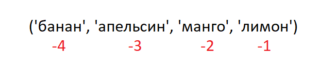

<div align="center">
  <h1> 30 天 Python：第六天 - Tuples</h1>
  <a class="header-badge" target="_blank" href="https://www.linkedin.com/in/asabeneh/">
  
  </a>
  <a class="header-badge" target="_blank" href="https://twitter.com/Asabeneh">
  
  </a>

<sub>Author:
<a href="https://www.linkedin.com/in/asabeneh/" target="_blank">Asabeneh Yetayeh</a><br>
<small> 第二版：2021 年 7 月</small>
</sub>

</div>

[<< 第五天](./05_lists.md) | [第七天 >>](./07_sets.md)


- [第六天:](#第六天)
  - [元组](#元组)
    - [如何创建元组](#如何创建元组)
    - [元组长度](#元组长度)
    - [获取元组项](#获取元组项)
    - [元组切片](#元组切片)
    - [将元组更改为列表](#将元组更改为列表)
    - [检索元组中的项](#检索元组中的项)
    - [连接元组](#连接元组)
    - [删除元组](#删除元组)
  - [💻 练习 - 第六天](#-练习---第六天)
    - [练习： 1级](#练习-1级)
    - [练习： 2级](#练习-2级)

# 第六天:

## 元组

元组是有序且不可变的不同数据类型的集合。一旦创建了元组，我们就无法更改其值。我们不能在元组中使用 add、insert、remove 方法，因为它是不可修改的（不可变的）。与列表不同，元组的方法很少。与元组相关的方法有：

- tuple()：创建一个空元组
- count()：计算元组中指定项的数量
- index()：查找元组中指定项的索引
- + 运算符：连接两个或多个元组并创建一个新元组

### 如何创建元组

- 创建一个空元组

  ```py
  # 语法
  empty_tuple = ()
  # 或使用元组构造函数
  empty_tuple = tuple()
  ```

- 创建一个具有初始值的元组

  ```py
  # 语法
  tpl = ('item1', 'item2','item3')
  ```

  ```py
  fruits = ('banana', 'orange', 'mango', 'lemon')
  ```


### 元组长度

我们使用 _len()_ 方法来获取元组的长度。

```py
# 语法
tpl = ('item1', 'item2', 'item3')
len(tpl)
```

### 获取元组项


- 正索引
  与列表数据类型类似，我们使用正索引或负索引来访问元组项。
  

  ```py
  # 语法
  tpl = ('item1', 'item2', 'item3')
  first_item = tpl[0]
  second_item = tpl[1]
  ```

  ```py
  fruits = ('banana', 'orange', 'mango', 'lemon')
  first_fruit = fruits[0]
  second_fruit = fruits[1]
  last_index =len(fruits) - 1
  last_fruit = fruits[las_index]
  ```

- 负索引
  负索引是从末尾开始的，-1 表示最后一项，-2 表示倒数第二项，列表/元组长度的负数表示第一项。
  

  ```py
  # 语法
  tpl = ('item1', 'item2', 'item3','item4')
  first_item = tpl[-4]
  second_item = tpl[-3]
  ```

  ```py
  fruits = ('banana', 'orange', 'mango', 'lemon')
  first_fruit = fruits[-4]
  second_fruit = fruits[-3]
  last_fruit = fruits[-1]
  ```

### 元组切片

我们可以通过指定开始和结束的索引范围来切出子元组，返回值是一个包含指定项的新元组。

- 正索引范围

  ```py
  # 语法
  tpl = ('item1', 'item2', 'item3','item4')
  all_items = tpl[0:4]         # 所有项
  all_items = tpl[0:]         # 所有项
  middle_two_items = tpl[1:3]  # 不包括索引 3 的项
  ```

  ```py
  fruits = ('banana', 'orange', 'mango', 'lemon')
  all_fruits = fruits[0:4]    # 所有项
  all_fruits= fruits[0:]      # 所有项
  orange_mango = fruits[1:3]  # 不包括索引 3 的项
  orange_to_the_rest = fruits[1:]
  ```

- 负索引范围

  ```py
  # 语法
  tpl = ('item1', 'item2', 'item3','item4')
  all_items = tpl[-4:]         # 所有项
  middle_two_items = tpl[-3:-1]  # 不包括索引 3 的项
  ```

  ```py

  fruits = ('banana', 'orange', 'mango', 'lemon')
  all_fruits = fruits[-4:]    # 所有项
  orange_mango = fruits[-3:-1]  # 不包括索引 3 的项
  orange_to_the_rest = fruits[-3:]
  ```

### 将元组更改为列表

我们可以将元组更改为列表，将列表更改为元组。如果我们想修改元组，我们应该将其更改为列表。

```py
# 语法
tpl = ('item1', 'item2', 'item3','item4')
lst = list(tpl)
```

```py
fruits = ('banana', 'orange', 'mango', 'lemon')
fruits = list(fruits)
fruits[0] = 'apple'
print(fruits)     # ['apple', 'orange', 'mango', 'lemon']
fruits = tuple(fruits)
print(fruits)     # ('apple', 'orange', 'mango', 'lemon')
```

### 检索元组中的项

我们可以使用 _in_ 检查元组中是否存在某个项，它返回一个布尔值。

```py
# 语法
tpl = ('item1', 'item2', 'item3','item4')
'item2' in tpl # True
```

```py
fruits = ('banana', 'orange', 'mango', 'lemon')
print('orange' in fruits) # True
print('apple' in fruits) # False
fruits[0] = 'apple' # TypeError: 'tuple' object does not support item assignment
```


### 连接元组

我们可以使用 + 运算符连接两个或多个元组

```py
# 语法
tpl1 = ('item1', 'item2', 'item3')
tpl2 = ('item4', 'item5','item6')
tpl3 = tpl1 + tpl2
```

```py
fruits = ('banana', 'orange', 'mango', 'lemon')
vegetables = ('Tomato', 'Potato', 'Cabbage','Onion', 'Carrot')
fruits_and_vegetables = fruits + vegetables
```

### 删除元组

不能删除元组中的单个项，但可以使用 _del_ 删除元组本身。

```py
# 语法
tpl1 = ('item1', 'item2', 'item3')
del tpl1

```

```py
fruits = ('banana', 'orange', 'mango', 'lemon')
del fruits
```


🌕 你太勇敢了，你做到了。你刚刚完成了第 6 天的挑战，你已向着伟大的目标迈出了 6 步。现在做一些练习来锻练你的大脑和肌肉。

## 💻 练习 - 第六天

### 练习： 1级

1. 创建一个空元组
1. 创建一个包含你姐妹和兄弟名字的元组（虚构的兄弟姐妹也可以）
1. 连接兄弟姐妹元组并将其分配给 siblings
1. 你有多少兄弟姐妹？
1. 修改兄弟姐妹元组并添加你父母的名字，然后将其分配给 family_members

### 练习： 2级

1. 从 family_members 中获取兄弟姐妹和父母
1. 创建 fruits、vegetables 和 animal products 元组。连接三个元组并将其分配给名为 food_stuff_tp 的变量。
1. 将 food_stuff_tp 元组更改为 food_stuff_lt 列表
1. 从 food_stuff_tp 元组或 food_stuff_lt 列表中切出中间项或项。
1. 从 food_staff_lt 列表中切出前三项和最后三项
1. 完全删除 food_staff_tp 元组
1. 检查元组中是否存在项：
- 检查 'Estonia' 是否在 nordic_country 元组中
- 检查 'Iceland' 是否在 nordic_country 元组中

  ```py
  nordic_countries = ('Denmark', 'Finland','Iceland', 'Norway', 'Sweden')
  ```


[<< 第五天](./05_lists.md) | [第七天 >>](./07_sets.md)
