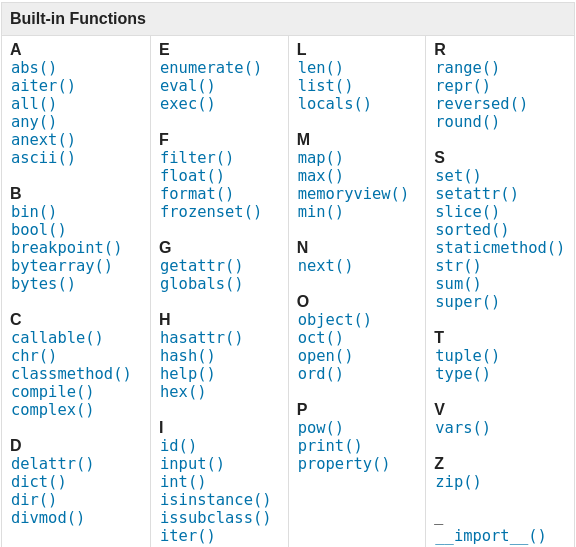
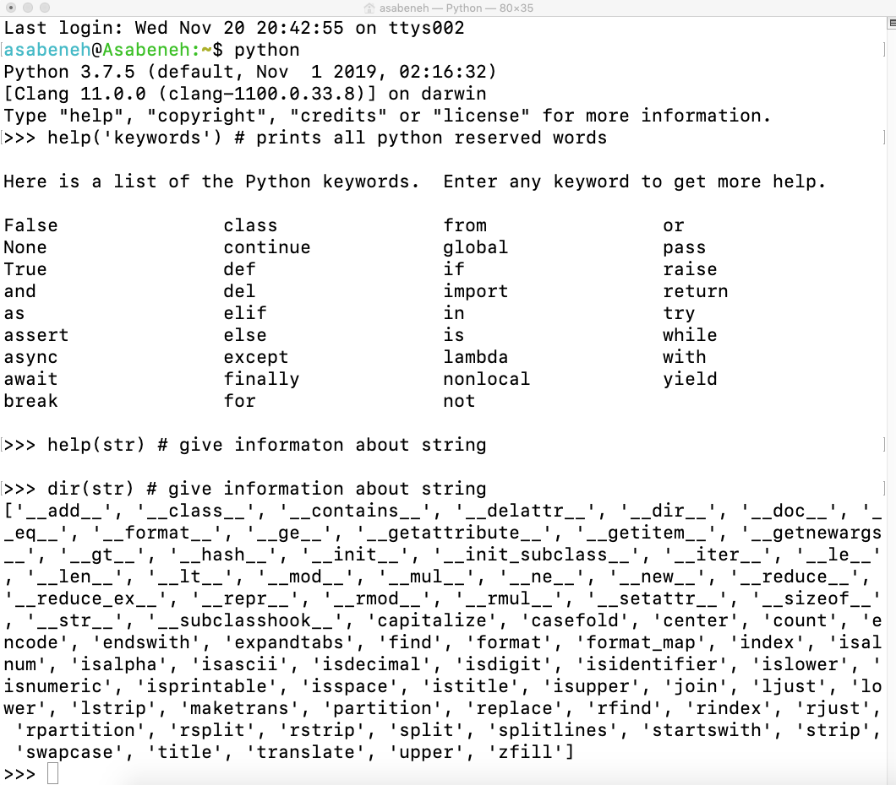
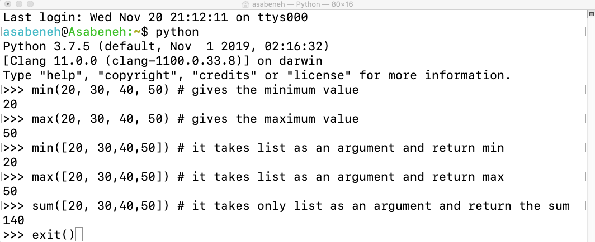

<div align="center">
  <h1> 30 Jours de Python : Jour 2 - Variables, Fonctions intégrées</h1>
  <a class="header-badge" target="_blank" href="https://www.linkedin.com/in/asabeneh/">
  
  </a>
  <a class="header-badge" target="_blank" href="https://twitter.com/Asabeneh">
  
  </a>

<sub>Auteur :
<a href="https://www.linkedin.com/in/asabeneh/" target="_blank">Asabeneh Yetayeh</a><br>
<small> Deuxième édition : juillet 2021</small>
</sub>

</div>

[<< Jour 1](./README_fr.md) | [Jour 3 >>](./03_operators_fr.md)


- [📘 Jour 2](#-jour-2)
  - [Fonctions intégrées](#fonctions-intégrées)
  - [Variables](#variables)
    - [Déclaration de plusieurs variables sur une ligne](#déclaration-de-plusieurs-variables-sur-une-ligne)
  - [Types de données](#types-de-données)
  - [Vérification des types de données et conversion](#vérification-des-types-de-données-et-conversion)
  - [Nombres](#nombres)
  - [💻 Exercices - Jour 2](#-exercices---jour-2)
    - [Exercices : Niveau 1](#exercices--niveau-1)
    - [Exercices : Niveau 2](#exercices--niveau-2)

# 📘 Jour 2

## Fonctions intégrées

Python dispose de nombreuses fonctions intégrées (built-in functions). Les fonctions intégrées sont disponibles globalement, ce qui signifie que vous pouvez les utiliser sans avoir à importer ou configurer quoi que ce soit. Voici quelques-unes des fonctions intégrées les plus couramment utilisées en Python : _print()_, _len()_, _type()_, _int()_, _float()_, _str()_, _input()_, _list()_, _dict()_, _min()_, _max()_, _sum()_, _sorted()_, _open()_, _file()_, _help()_ et _dir()_. Dans le tableau suivant, vous trouverez une liste exhaustive des fonctions intégrées de Python tirée de la [documentation Python](https://docs.python.org/3/library/functions.html).



Ouvrons le shell Python et commençons à utiliser certaines des fonctions intégrées les plus courantes.


Pratiquons davantage en utilisant différentes fonctions intégrées.



Comme vous pouvez le voir dans le terminal ci-dessus, Python possède des mots réservés. Nous n'utilisons pas les mots réservés pour déclarer des variables ou des fonctions. Nous aborderons les variables dans la section suivante.

Je pense que vous êtes désormais familiarisé avec les fonctions intégrées. Pratiquons encore une fois avant de passer à la section suivante.



## Variables

Les variables stockent des données dans la mémoire de l'ordinateur. Il est recommandé d'utiliser des variables mnémoniques dans de nombreux langages de programmation. Une variable mnémonique est un nom de variable facile à retenir et à associer. Une variable fait référence à une adresse mémoire dans laquelle les données sont stockées.
Un chiffre au début, un caractère spécial ou un trait d'union ne sont pas autorisés lors du nommage d'une variable. Une variable peut avoir un nom court (comme x, y, z), mais un nom plus descriptif (prénom, nom, âge, pays) est fortement recommandé.

Règles de nommage des variables en Python

- Un nom de variable doit commencer par une lettre ou le caractère de soulignement
- Un nom de variable ne peut pas commencer par un chiffre
- Un nom de variable ne peut contenir que des caractères alphanumériques et des traits de soulignement (A-z, 0-9 et \_ )
- Les noms de variables sont sensibles à la casse (firstname, Firstname, FirstName et FIRSTNAME sont des variables différentes)

Voici quelques exemples de noms de variables valides :

```shell
firstname
lastname
age
country
city
first_name
last_name
capital_city
_if # si on veut utiliser un mot réservé comme variable
year_2021
year2021
current_year_2021
birth_year
num1
num2
```

Noms de variables invalides

```shell
first-name
first@name
first$name
num-1
1num
```

Nous utiliserons la convention de nommage standard de Python adoptée par de nombreux développeurs Python. Les développeurs Python utilisent la convention de nommage snake_case. Nous utilisons un trait de soulignement après chaque mot pour une variable contenant plus d'un mot (ex. first_name, last_name, engine_rotation_speed). L'exemple ci-dessous illustre le nommage standard des variables ; le trait de soulignement est nécessaire lorsque le nom de la variable comporte plus d'un mot.

Lorsque nous assignons un certain type de données à une variable, cela s'appelle une déclaration de variable. Par exemple, dans l'exemple ci-dessous, mon prénom est affecté à la variable first_name. Le signe égal est un opérateur d'affectation. Affecter signifie stocker des données dans la variable. Le signe égal en Python n'est pas une égalité mathématique.

_Exemple :_

```py
# Variables en Python
first_name = 'Asabeneh'
last_name = 'Yetayeh'
country = 'Finland'
city = 'Helsinki'
age = 250
is_married = True
skills = ['HTML', 'CSS', 'JS', 'React', 'Python']
person_info = {
   'firstname':'Asabeneh',
   'lastname':'Yetayeh',
   'country':'Finland',
   'city':'Helsinki'
   }
```

Utilisons les fonctions intégrées _print()_ et _len()_. La fonction print accepte un nombre illimité d'arguments. Un argument est une valeur que l'on peut passer ou placer entre les parenthèses de la fonction, comme dans l'exemple ci-dessous.

**Exemple :**

```py
print('Hello, World!') # Le texte Hello, World! est un argument
print('Hello',',', 'World','!') # elle peut prendre plusieurs arguments, quatre arguments ont été passés
print(len('Hello, World!')) # elle ne prend qu'un seul argument
```

Affichons et trouvons aussi la longueur des variables déclarées plus haut :

**Exemple :**

```py
# Affichage des valeurs stockées dans les variables

print('First name:', first_name)
print('First name length:', len(first_name))
print('Last name: ', last_name)
print('Last name length: ', len(last_name))
print('Country: ', country)
print('City: ', city)
print('Age: ', age)
print('Married: ', is_married)
print('Skills: ', skills)
print('Person information: ', person_info)
```

### Déclaration de plusieurs variables sur une ligne

Plusieurs variables peuvent également être déclarées sur une seule ligne :

**Exemple :**

```py
first_name, last_name, country, age, is_married = 'Asabeneh', 'Yetayeh', 'Helsinki', 250, True

print(first_name, last_name, country, age, is_married)
print('First name:', first_name)
print('Last name: ', last_name)
print('Country: ', country)
print('Age: ', age)
print('Married: ', is_married)
```

Obtenir une entrée utilisateur à l'aide de la fonction intégrée _input()_. Assignons les données obtenues d'un utilisateur aux variables first_name et age.
**Exemple :**

```py
first_name = input('What is your name: ')
age = input('How old are you? ')

print(first_name)
print(age)
```

## Types de données

Il existe plusieurs types de données en Python. Pour identifier le type de données, nous utilisons la fonction intégrée _type_. Je voudrais vous demander de vous concentrer pour bien comprendre les différents types de données. En programmation, tout tourne autour des types de données. J'ai présenté les types de données au tout début et ils reviennent ici, car chaque sujet est lié aux types de données. Nous couvrirons les types de données plus en détail dans leurs sections respectives.

## Vérification des types de données et conversion

- Vérifier les types de données : Pour vérifier le type de données d'une certaine donnée/variable, nous utilisons _type_
  **Exemples :**

```py
# Différents types de données Python
# Déclarons des variables avec différents types de données

first_name = 'Asabeneh'     # str (chaîne de caractères)
last_name = 'Yetayeh'       # str
country = 'Finland'         # str
city = 'Helsinki'            # str
age = 250                   # int (entier), ce n'est pas mon vrai âge, ne vous inquiétez pas

# Affichage des types
print(type('Asabeneh'))          # str
print(type(first_name))          # str
print(type(10))                  # int
print(type(3.14))                # float
print(type(1 + 1j))              # complex (nombre complexe)
print(type(True))                # bool (booléen)
print(type([1, 2, 3, 4]))        # list (liste)
print(type({'name':'Asabeneh'})) # dict (dictionnaire)
print(type((1,2)))               # tuple (tuple)
print(type(zip([1,2],[3,4])))    # zip
```

- Conversion (casting) : Convertir un type de données en un autre type de données. Nous utilisons _int()_, _float()_, _str()_, _list_, _set_
  Lorsque nous effectuons des opérations arithmétiques, les nombres sous forme de chaînes doivent d'abord être convertis en int ou float, sinon une erreur sera renvoyée. Si nous concaténons un nombre avec une chaîne, le nombre doit d'abord être converti en chaîne. Nous parlerons de la concaténation dans la section sur les chaînes de caractères.

  **Exemples :**

```py
# int (entier) vers float (décimal)
num_int = 10
print('num_int',num_int)         # 10
num_float = float(num_int)
print('num_float:', num_float)   # 10.0

# float vers int
gravity = 9.81
print(int(gravity))             # 9

# int vers str (chaîne)
num_int = 10
print(num_int)                  # 10
num_str = str(num_int)
print(num_str)                  # '10'

# str vers int ou float
num_str = '10.6'
num_float = float(num_str)  # Convertit d'abord la chaîne en float
num_int = int(num_float)    # Ensuite convertit le float en int
print('num_int', num_int)      # 10
print('num_float', float(num_str))  # 10.6
num_int = int(num_float)
print('num_int', int(num_int))      # 10

# str vers list (liste)
first_name = 'Asabeneh'
print(first_name)               # 'Asabeneh'
first_name_to_list = list(first_name)
print(first_name_to_list)            # ['A', 's', 'a', 'b', 'e', 'n', 'e', 'h']
```

## Nombres

Types de données numériques en Python :

1. Entiers (Integers) : nombres (négatifs, zéro et positifs)
   Exemple :
   ... -3, -2, -1, 0, 1, 2, 3 ...

2. Nombres à virgule flottante (décimaux)
   Exemple :
   ... -3.5, -2.25, -1.0, 0.0, 1.1, 2.2, 3.5 ...

3. Nombres complexes
   Exemple :
   1 + j, 2 + 4j, 1 - 1j

🌕 Vous êtes formidable. Vous venez de terminer les défis du jour 2 et vous avez deux pas d'avance sur la voie de la réussite. Maintenant, faites quelques exercices pour votre cerveau et vos muscles.

## 💻 Exercices - Jour 2

### Exercices : Niveau 1

1. Dans 30DaysOfPython, créez un dossier appelé day_2. Dans ce dossier, créez un fichier nommé variables.py
2. Écrivez un commentaire Python disant 'Day 2: 30 Days of python programming'
3. Déclarez une variable de prénom et assignez-lui une valeur
4. Déclarez une variable de nom de famille et assignez-lui une valeur
5. Déclarez une variable de nom complet et assignez-lui une valeur
6. Déclarez une variable de pays et assignez-lui une valeur
7. Déclarez une variable de ville et assignez-lui une valeur
8. Déclarez une variable d'âge et assignez-lui une valeur
9. Déclarez une variable d'année et assignez-lui une valeur
10. Déclarez une variable is_married et assignez-lui une valeur
11. Déclarez une variable is_true et assignez-lui une valeur
12. Déclarez une variable is_light_on et assignez-lui une valeur
13. Déclarez plusieurs variables sur une seule ligne

### Exercices : Niveau 2

1. Vérifiez le type de données de toutes vos variables à l'aide de la fonction intégrée type()
2. Utilisez la fonction intégrée _len()_ pour trouver la longueur de votre prénom
3. Comparez la longueur de votre prénom et de votre nom de famille
4. Déclarez 5 comme num_one et 4 comme num_two
5. Additionnez num_one et num_two et assignez le résultat à une variable total
6. Soustrayez num_two de num_one et assignez le résultat à une variable diff
7. Multipliez num_two et num_one et assignez le résultat à une variable product
8. Divisez num_one par num_two et assignez le résultat à une variable division
9. Utilisez le modulo pour diviser num_two par num_one et assignez le résultat à une variable remainder
10. Calculez num_one à la puissance num_two et assignez le résultat à une variable exp
11. Trouvez la division entière (floor division) de num_one par num_two et assignez le résultat à une variable floor_division
12. Le rayon d'un cercle est de 30 mètres.
    1. Calculez l'aire du cercle et assignez la valeur à une variable nommée _area_of_circle_
    2. Calculez la circonférence du cercle et assignez la valeur à une variable nommée _circum_of_circle_
    3. Prenez le rayon comme entrée utilisateur et calculez l'aire.
13. Utilisez la fonction intégrée input() pour obtenir le prénom, le nom, le pays et l'âge d'un utilisateur et stockez les valeurs dans les noms de variables correspondants
14. Exécutez help('keywords') dans le shell Python ou dans votre fichier pour vérifier les mots réservés ou mots-clés de Python

🎉 FÉLICITATIONS ! 🎉

[<< Jour 1](./README_fr.md) | [Jour 3 >>](./03_operators_fr.md)
