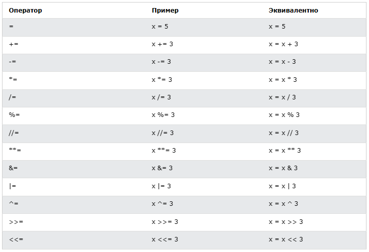
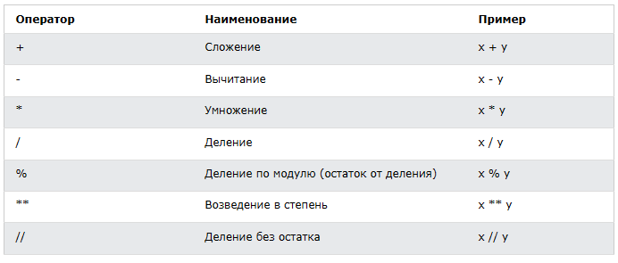
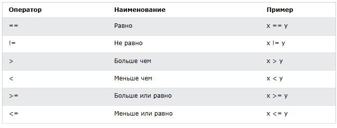
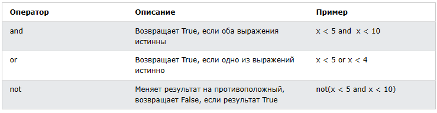

<div align="center">
  <h1> 30 Jours de Python : Jour 3 - Opérateurs</h1>
  <a class="header-badge" target="_blank" href="https://www.linkedin.com/in/asabeneh/">
  
  </a>
  <a class="header-badge" target="_blank" href="https://twitter.com/Asabeneh">
  
  </a>

<sub>Auteur :
<a href="https://www.linkedin.com/in/asabeneh/" target="_blank">Asabeneh Yetayeh</a><br>
<small> Deuxième édition : juillet 2021</small>
</sub>
</div>

[<< Jour 2](./02_variables_builtin_functions_fr.md) | [Jour 4 >>](./04_strings_fr.md)


- [📘 Jour 3](#-jour-3)
  - [Booléen](#booléen)
  - [Opérateurs](#opérateurs)
    - [Opérateurs d'affectation](#opérateurs-daffectation)
    - [Opérateurs arithmétiques](#opérateurs-arithmétiques)
    - [Opérateurs de comparaison](#opérateurs-de-comparaison)
    - [Opérateurs logiques](#opérateurs-logiques)
  - [💻 Exercices - Jour 3](#-exercices---jour-3)

# 📘 Jour 3

## Booléen

Un booléen est un type de données qui ne peut prendre que deux valeurs : _True_ (Vrai) ou _False_ (Faux). Leur utilité deviendra évidente quand nous commencerons à utiliser les opérateurs de comparaison. La première lettre **T** pour True et **F** pour False doit être en majuscule, contrairement à JavaScript.
**Exemple : Valeurs booléennes**

```py
print(True)
print(False)
```

## Opérateurs

Python propose plusieurs types d'opérateurs. Dans cette section, nous allons nous concentrer sur les principaux.

### Opérateurs d'affectation

Les opérateurs d'affectation servent à assigner des valeurs aux variables. Prenons le signe `=` comme exemple. En mathématiques, il indique une égalité entre deux valeurs, mais en Python, il signifie que l'on stocke une valeur dans une variable — on appelle cela une affectation. Le tableau ci-dessous présente les différents opérateurs d'affectation Python, tiré de [w3schools](https://www.w3schools.com/python/python_operators.asp).



### Opérateurs arithmétiques

- Addition(+) : a + b
- Soustraction(-) : a - b
- Multiplication(*) : a * b
- Division(/) : a / b
- Modulo(%) : a % b
- Division entière(//) : a // b
- Exponentiation(**) : a ** b



**Exemple : Entiers**

```py
# Opérations arithmétiques en Python
# Entiers

print('Addition : ', 1 + 2)        # 3
print('Soustraction : ', 2 - 1)     # 1
print('Multiplication : ', 2 * 3)  # 6
print ('Division : ', 4 / 2)       # 2.0  La division en Python donne un nombre flottant
print('Division : ', 6 / 2)        # 3.0         
print('Division : ', 7 / 2)        # 3.5
print('Division sans le reste : ', 7 // 2)   # 3, donne sans la partie décimale
print ('Division sans le reste : ',7 // 3)   # 2
print('Modulo : ', 3 % 2)         # 1, donne le reste
print('Exponentiation : ', 2 ** 3) # 8 signifie 2 * 2 * 2
```

**Exemple : Flottants**

```py
# Nombres flottants
print('Nombre flottant, PI', 3.14)
print('Nombre flottant, gravité', 9.81)
```

**Exemple : Nombres complexes**

```py
# Nombres complexes
print('Nombre complexe : ', 1 + 1j)
print('Multiplication de nombres complexes : ',(1 + 1j) * (1 - 1j))
```

Déclarons une variable et assignons-lui un type de données numérique. Je vais utiliser des noms de variables à un seul caractère, mais rappelez-vous de ne pas prendre l'habitude de déclarer ce genre de variables. Les noms de variables doivent toujours être explicites.

**Exemple :**

```python
# Déclaration des variables en premier

a = 3 # a est un nom de variable et 3 est un entier
b = 2 # b est un nom de variable et 2 est un entier

# Opérations arithmétiques et affectation du résultat à une variable
total = a + b
diff = a - b
product = a * b
division = a / b
remainder = a % b
floor_division = a // b
exponential = a ** b

# J'aurais dû utiliser sum au lieu de total, mais sum est une fonction intégrée - essayez d'éviter de masquer les fonctions intégrées
print(total) # si vous n'étiquetez pas votre print avec une chaîne, vous ne savez jamais d'où vient le résultat
print('a + b = ', total)
print('a - b = ', diff)
print('a * b = ', product)
print('a / b = ', division)
print('a % b = ', remainder)
print('a // b = ', floor_division)
print('a ** b = ', exponential)
```

**Exemple :**

```py
print('== Addition, Soustraction, Multiplication, Division, Modulo ==')

# Déclaration des valeurs et organisation
num_one = 3
num_two = 4

# Opérations arithmétiques
total = num_one + num_two
diff = num_two - num_one
product = num_one * num_two
div = num_two / num_one
remainder = num_two % num_one

# Affichage des résultats avec étiquettes
print('total : ', total)
print('différence : ', diff)
print('produit : ', product)
print('division : ', div)
print('reste : ', remainder)
```

Commençons à faire le lien et à utiliser ce que nous savons déjà pour calculer (aire, volume, densité, poids, périmètre, distance, force).

**Exemple :**

```py
# Calcul de l'aire d'un cercle
radius = 10                                 # rayon d'un cercle
area_of_circle = 3.14 * radius ** 2         # deux * signifie exposant ou puissance
print('Aire du cercle :', area_of_circle)

# Calcul de l'aire d'un rectangle
length = 10
width = 20
area_of_rectangle = length * width
print('Aire du rectangle :', area_of_rectangle)

# Calcul du poids d'un objet
mass = 75
gravity = 9.81
weight = mass * gravity
print(weight, 'N')                         # Ajout de l'unité au poids

# Calcul de la densité d'un liquide
mass = 75 # en Kg
volume = 0.075 # en mètres cubes
density = mass / volume # 1000 Kg/m^3
print(density, 'Kg/m^3') # Ajout de l'unité à la densité
```

### Opérateurs de comparaison

En programmation, nous comparons des valeurs à l'aide d'opérateurs de comparaison. Nous vérifions si une valeur est supérieure, inférieure ou égale à une autre. Le tableau suivant présente les opérateurs de comparaison Python, tiré de [w3schools](https://www.w3schools.com/python/python_operators.asp).


**Exemple : Opérateurs de comparaison**

```py
print(3 > 2)     # True, car 3 est supérieur à 2
print(3 >= 2)    # True, car 3 est supérieur à 2
print(3 < 2)     # False, car 3 est supérieur à 2
print(2 < 3)     # True, car 2 est inférieur à 3
print(2 <= 3)    # True, car 2 est inférieur à 3
print(3 == 2)    # False, car 3 n'est pas égal à 2
print(3 != 2)    # True, car 3 n'est pas égal à 2
print(len('mango') == len('avocado'))  # False
print(len('mango') != len('avocado'))  # True
print(len('mango') < len('avocado'))   # True
print(len('milk') != len('meat'))      # False
print(len('milk') == len('meat'))      # True
print(len('tomato') == len('potato'))  # True
print(len('python') > len('dragon'))   # False


# Comparer quelque chose donne soit True, soit False

print('True == True : ', True == True)
print('True == False : ', True == False)
print('False == False :', False == False)
```

En plus des opérateurs de comparaison ci-dessus, Python utilise :

- _is_ : Renvoie True si les deux variables sont le même objet (x is y)
- _is not_ : Renvoie True si les deux variables ne sont pas le même objet (x is not y)
- _in_ : Renvoie True si la liste interrogée contient un certain élément (x in y)
- _not in_ : Renvoie True si la liste interrogée ne contient pas un certain élément (x not in y)

```py
print('1 is 1', 1 is 1)                   # True - car les valeurs de données sont identiques
print('1 is not 2', 1 is not 2)           # True - car 1 n'est pas 2
print('A in Asabeneh', 'A' in 'Asabeneh') # True - A trouvé dans la chaîne
print('B not in Asabeneh', 'B' in 'Asabeneh') # False - il n'y a pas de B majuscule
print('coding' in 'coding for all') # True - car coding for all contient le mot coding
print('a in an:', 'a' in 'an')      # True
print('4 is 2 ** 2:', 4 is 2 ** 2)   # True
```

### Opérateurs logiques

Contrairement à d'autres langages de programmation, Python utilise les mots-clés _and_, _or_ et _not_ pour les opérateurs logiques. Les opérateurs logiques sont utilisés pour combiner des instructions conditionnelles :



```py
print(3 > 2 and 4 > 3) # True - car les deux instructions sont vraies
print(3 > 2 and 4 < 3) # False - car la deuxième instruction est fausse
print(3 < 2 and 4 < 3) # False - car les deux instructions sont fausses
print('True and True: ', True and True)
print(3 > 2 or 4 > 3)  # True - car les deux instructions sont vraies
print(3 > 2 or 4 < 3)  # True - car l'une des instructions est vraie
print(3 < 2 or 4 < 3)  # False - car les deux instructions sont fausses
print('True or False:', True or False)
print(not 3 > 2)     # False - car 3 > 2 est vrai, donc not True donne False
print(not True)      # False - Négation, l'opérateur not transforme true en false
print(not False)     # True
print(not not True)  # True
print(not not False) # False
```

🌕 Vous avez une énergie débordante. Vous venez de terminer le défi du Jour 3 et vous êtes trois pas de plus sur la voie de la grandeur. Faites maintenant quelques exercices pour votre cerveau et vos muscles.

## 💻 Exercices - Jour 3

1. Déclarez votre âge comme une variable de type entier.
2. Déclarez votre taille comme une variable de type flottant.
3. Déclarez une variable qui stocke un nombre complexe.
4. Écrivez un script qui demande à l'utilisateur d'entrer la base et la hauteur d'un triangle et calcule l'aire de ce triangle (aire = 0,5 x b x h).

```py
    Entrez la base : 20
    Entrez la hauteur : 10
    L'aire du triangle est 100
```

5. Écrivez un script qui demande à l'utilisateur d'entrer le côté a, le côté b et le côté c d'un triangle. Calculez le périmètre du triangle (périmètre = a + b + c).

```py
Entrez le côté a : 5
Entrez le côté b : 4
Entrez le côté c : 3
Le périmètre du triangle est 12
```

6. Obtenez la longueur et la largeur d'un rectangle à l'aide de la fonction input. Calculez son aire (aire = longueur x largeur) et son périmètre (périmètre = 2 x (longueur + largeur)).
7. Obtenez le rayon d'un cercle à l'aide de la fonction input. Calculez l'aire (aire = pi x r x r) et la circonférence (c = 2 x pi x r) où pi = 3,14.
8. Calculez la pente, l'ordonnée à l'origine et l'abscisse à l'origine de y = 2x - 2.
9. La pente est (m = y2-y1/x2-x1). Trouvez la pente et la [distance euclidienne](https://en.wikipedia.org/wiki/Euclidean_distance#:~:text=In%20mathematics%2C%20the%20Euclidean%20distance,being%20called%20the%20Pythagorean%20distance.) entre le point (2, 2) et le point (6, 10).
10. Comparez les pentes des tâches 8 et 9.
11. Calculez la valeur de y (y = x^2 + 6x + 9). Essayez différentes valeurs de x et déterminez à quelle valeur de x, y est égal à 0.
12. Trouvez la longueur de 'python' et 'dragon' et faites une déclaration de comparaison fausse.
13. Utilisez l'opérateur _and_ pour vérifier si 'on' se trouve à la fois dans 'python' et 'dragon'.
14. _I hope this course is not full of jargon_. Utilisez l'opérateur _in_ pour vérifier si _jargon_ est dans la phrase.
15. Il n'y a pas de 'on' dans dragon et python.
16. Trouvez la longueur du texte _python_ et convertissez la valeur en flottant, puis convertissez-la en chaîne de caractères.
17. Les nombres pairs sont divisibles par 2 et le reste est zéro. Comment vérifier si un nombre est pair ou non en Python ?
18. Vérifiez si la division entière de 7 par 3 est égale à la valeur convertie en entier de 2,7.
19. Vérifiez si le type de '10' est égal au type de 10.
20. Vérifiez si int('9.8') est égal à 10.
21. Écrivez un script qui demande à l'utilisateur d'entrer le nombre d'heures et le taux horaire. Calculez le salaire de la personne.

```py
Entrez les heures : 40
Entrez le taux horaire : 28
Votre salaire hebdomadaire est 1120
```

22. Écrivez un script qui demande à l'utilisateur d'entrer le nombre d'années vécues. Calculez le nombre de secondes qu'une personne peut vivre. Supposons qu'une personne peut vivre cent ans.

```py
Entrez le nombre d'années que vous avez vécues : 100
Vous avez vécu 3153600000 secondes.
```

23. Écrivez un script Python qui affiche le tableau suivant :

```py
1 1 1 1 1
2 1 2 4 8
3 1 3 9 27
4 1 4 16 64
5 1 5 25 125
```

🎉 FÉLICITATIONS ! 🎉

[<< Jour 2](./02_variables_builtin_functions_fr.md) | [Jour 4 >>](./04_strings_fr.md)
