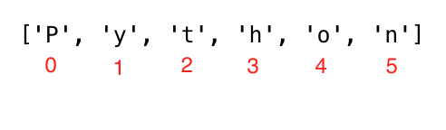

<div align="center">
  <h1> 30 Jours de Python : Jour 4 - Chaînes de caractères</h1>
  <a class="header-badge" target="_blank" href="https://www.linkedin.com/in/asabeneh/">
  
  </a>
  <a class="header-badge" target="_blank" href="https://twitter.com/Asabeneh">
  
  </a>

<sub>Auteur :
<a href="https://www.linkedin.com/in/asabeneh/" target="_blank">Asabeneh Yetayeh</a><br>
<small> Deuxième édition : juillet 2021</small>
</sub>

</div>

[<< Jour 3](../../03_Day_Operators/03_operators_fr.md) | [Jour 5 >>](../../05_Day_Lists/05_lists_fr.md)


- [Jour 4](#jour-4)
  - [Chaînes de caractères](#chaînes-de-caractères)
    - [Créer une chaîne](#créer-une-chaîne)
    - [Concaténation de chaînes](#concaténation-de-chaînes)
    - [Séquences d'échappement](#séquences-déchappement)
    - [Formatage de chaînes](#formatage-de-chaînes)
      - [Formatage à l'ancienne (opérateur %)](#formatage-à-lancienne-opérateur-)
      - [Formatage moderne (str.format)](#formatage-moderne-strformat)
      - [Interpolation / f-Strings (Python 3.6+)](#interpolation--f-strings-python-36)
    - [Les chaînes Python comme séquences de caractères](#les-chaînes-python-comme-séquences-de-caractères)
      - [Dépaquetage de caractères](#dépaquetage-de-caractères)
      - [Accéder aux caractères par indice](#accéder-aux-caractères-par-indice)
      - [Découpage (slicing) des chaînes](#découpage-slicing-des-chaînes)
      - [Inverser une chaîne](#inverser-une-chaîne)
      - [Sauter des caractères lors du découpage](#sauter-des-caractères-lors-du-découpage)
    - [Méthodes de chaînes](#méthodes-de-chaînes)
  - [💻 Exercices - Jour 4](#-exercices---jour-4)

# Jour 4

## Chaînes de caractères

Le texte est un type de données de type chaîne (string). Toute donnée écrite sous forme de texte est une chaîne. Les données entourées de guillemets simples, doubles ou triples sont des chaînes. Il existe différentes méthodes et fonctions intégrées pour manipuler les chaînes. Pour connaître la longueur d'une chaîne, on utilise la méthode `len()`.

### Créer une chaîne

```py
letter = 'P'                # Une chaîne peut être un seul caractère ou un texte
print(letter)               # P
print(len(letter))          # 1
greeting = 'Hello, World!'  # Une chaîne peut être créée avec des guillemets simples ou doubles
print(greeting)             # Hello, World!
print(len(greeting))        # 13
sentence = "I hope you are enjoying 30 days of Python Challenge"
print(sentence)
```

Une chaîne multiligne se crée avec trois guillemets simples (''') ou trois guillemets doubles ("""). Voir l'exemple ci-dessous.

```py
multiline_string = '''I am a teacher and enjoy teaching.
I didn't find anything as rewarding as empowering people.
That is why I created 30 days of python.'''
print(multiline_string)

# Autre façon de faire la même chose
multiline_string = """I am a teacher and enjoy teaching.
I didn't find anything as rewarding as empowering people.
That is why I created 30 days of python."""
print(multiline_string)
```

### Concaténation de chaînes

On peut connecter des chaînes entre elles. Fusionner ou connecter des chaînes s'appelle la concaténation. Voir l'exemple ci-dessous :

```py
first_name = 'Asabeneh'
last_name = 'Yetayeh'
space = ' '
full_name = first_name  +  space + last_name
print(full_name) # Asabeneh Yetayeh
# Vérification de la longueur d'une chaîne avec len()
print(len(first_name))  # 8
print(len(last_name))   # 7
print(len(first_name) > len(last_name)) # True
print(len(full_name)) # 16
```

### Séquences d'échappement

En Python et dans d'autres langages, `\` suivi d'un caractère forme une séquence d'échappement. Voici les caractères d'échappement les plus courants :

- \n : nouvelle ligne
- \t : tabulation (8 espaces)
- \\\\ : antislash
- \\' : guillemet simple (')
- \\" : guillemet double (")

Voyons maintenant leur utilisation avec des exemples.

```py
print('I hope everyone is enjoying the Python Challenge.\nAre you ?') # saut de ligne
print('Days\tTopics\tExercises') # tabulation ou 4 espaces
print('Day 1\t5\t5')
print('Day 2\t6\t20')
print('Day 3\t5\t23')
print('Day 4\t1\t35')
print('This is a backslash  symbol (\\)') # Pour écrire un antislash
print('In every programming language it starts with \"Hello, World!\"') # guillemet double dans une chaîne simple

# affichage
I hope every one is enjoying the Python Challenge.
Are you ?
Days  Topics  Exercises
Day 1	5	    5
Day 2	6	    20
Day 3	5	    23
Day 4	1	    35
This is a backslash  symbol (\)
In every programming language it starts with "Hello, World!"
```

### Formatage de chaînes

#### Formatage à l'ancienne (opérateur %)

Il existe plusieurs façons de formater les chaînes en Python. Nous allons en voir quelques-unes.
L'opérateur `%` permet de formater un ensemble de variables regroupées dans un tuple, associé à une chaîne de format contenant du texte normal et des « spécificateurs d'argument » comme `%s`, `%d`, `%f`, `%.<small>nombre de chiffres</small>f`.

- %s : Chaîne (ou tout objet ayant une représentation textuelle)
- %d : Entiers
- %f : Nombres flottants
- "%.<small>nombre de chiffres</small>f" : Flottants avec une précision fixe

```py
# Chaînes uniquement
first_name = 'Asabeneh'
last_name = 'Yetayeh'
language = 'Python'
formated_string = 'I am %s %s. I teach %s' %(first_name, last_name, language)
print(formated_string)

# Chaînes et nombres
radius = 10
pi = 3.14
area = pi * radius ** 2
formated_string = 'The area of circle with a radius %d is %.2f.' %(radius, area) # 2 chiffres après la virgule

python_libraries = ['Django', 'Flask', 'NumPy', 'Matplotlib','Pandas']
formated_string = 'The following are python libraries:%s' % (python_libraries)
print(formated_string) # "The following are python libraries:['Django', 'Flask', 'NumPy', 'Matplotlib','Pandas']"
```

#### Formatage moderne (str.format)

Ce format a été introduit dans Python 3.

```py

first_name = 'Asabeneh'
last_name = 'Yetayeh'
language = 'Python'
formated_string = 'I am {} {}. I teach {}'.format(first_name, last_name, language)
print(formated_string)
a = 4
b = 3

print('{} + {} = {}'.format(a, b, a + b))
print('{} - {} = {}'.format(a, b, a - b))
print('{} * {} = {}'.format(a, b, a * b))
print('{} / {} = {:.2f}'.format(a, b, a / b)) # limite à deux décimales
print('{} % {} = {}'.format(a, b, a % b))
print('{} // {} = {}'.format(a, b, a // b))
print('{} ** {} = {}'.format(a, b, a ** b))

# affichage
4 + 3 = 7
4 - 3 = 1
4 * 3 = 12
4 / 3 = 1.33
4 % 3 = 1
4 // 3 = 1
4 ** 3 = 64

# Chaînes et nombres
radius = 10
pi = 3.14
area = pi * radius ** 2
formated_string = 'The area of a circle with a radius {} is {:.2f}.'.format(radius, area) # 2 décimales
print(formated_string)

```

#### Interpolation / f-Strings (Python 3.6+)

Un autre formatage moderne est l'interpolation de chaînes, les f-strings. Les chaînes commencent par `f` et on peut y injecter les données directement aux positions correspondantes.

```py
a = 4
b = 3
print(f'{a} + {b} = {a +b}')
print(f'{a} - {b} = {a - b}')
print(f'{a} * {b} = {a * b}')
print(f'{a} / {b} = {a / b:.2f}')
print(f'{a} % {b} = {a % b}')
print(f'{a} // {b} = {a // b}')
print(f'{a} ** {b} = {a ** b}')
```

### Les chaînes Python comme séquences de caractères

Les chaînes Python sont des séquences de caractères et partagent leurs méthodes d'accès de base avec les autres séquences ordonnées de Python — listes et tuples. La façon la plus simple d'extraire des caractères individuels d'une chaîne (et des éléments d'une séquence) est de les dépaqueter (unpack) dans des variables correspondantes.

#### Dépaquetage de caractères

```
language = 'Python'
a,b,c,d,e,f = language # dépaquetage des caractères dans des variables
print(a) # P
print(b) # y
print(c) # t
print(d) # h
print(e) # o
print(f) # n
```

#### Accéder aux caractères par indice

En programmation, le comptage commence à zéro. Par conséquent, la première lettre d'une chaîne est à l'indice zéro et la dernière lettre est à l'indice (longueur de la chaîne moins un).



```py
language = 'Python'
first_letter = language[0]
print(first_letter) # P
second_letter = language[1]
print(second_letter) # y
last_index = len(language) - 1
last_letter = language[last_index]
print(last_letter) # n
```

Si l'on veut commencer par la droite, on peut utiliser des indices négatifs. -1 est le dernier indice.

```py
language = 'Python'
last_letter = language[-1]
print(last_letter) # n
second_last = language[-2]
print(second_last) # o
```

#### Découpage (slicing) des chaînes

En Python, on peut découper les chaînes en sous-chaînes.

```py
language = 'Python'
first_three = language[0:3] # commence à l'indice 0 et va jusqu'à 3 (non inclus)
print(first_three) #Pyt
last_three = language[3:6]
print(last_three) # hon
# Autre façon
last_three = language[-3:]
print(last_three)   # hon
last_three = language[3:]
print(last_three)   # hon
```

#### Inverser une chaîne

On peut facilement inverser une chaîne en Python.

```py
greeting = 'Hello, World!'
print(greeting[::-1]) # !dlroW ,olleH
```

#### Sauter des caractères lors du découpage

Il est possible de sauter des caractères lors du découpage en passant un argument de pas à la méthode de slice.

```py
language = 'Python'
pto = language[0:6:2] #
print(pto) # Pto
```

### Méthodes de chaînes

Il existe de nombreuses méthodes de chaînes qui permettent de les formater. En voici quelques-unes :

- capitalize() : Convertit le premier caractère de la chaîne en majuscule.

```py
challenge = 'thirty days of python'
print(challenge.capitalize()) # 'Thirty days of python'
```

- count() : Renvoie le nombre d'occurrences d'une sous-chaîne, count(sous-chaîne, début=.., fin=..). Le début est l'indice de départ et la fin l'indice d'arrêt.

```py
challenge = 'thirty days of python'
print(challenge.count('y')) # 3
print(challenge.count('y', 7, 14)) # 1, 
print(challenge.count('th')) # 2`
```

- endswith() : Vérifie si une chaîne se termine par une fin spécifiée.

```py
challenge = 'thirty days of python'
print(challenge.endswith('on'))   # True
print(challenge.endswith('tion')) # False
```

- expandtabs() : Remplace les tabulations par des espaces, taille par défaut 8. Accepte un argument de taille.

```py
challenge = 'thirty\tdays\tof\tpython'
print(challenge.expandtabs())   # 'thirty  days    of      python'
print(challenge.expandtabs(10)) # 'thirty    days      of        python'
```

- find() : Renvoie l'indice de la première occurrence d'une sous-chaîne, ou -1 si introuvable.

```py
challenge = 'thirty days of python'
print(challenge.find('y'))  # 5
print(challenge.find('th')) # 0
```

- rfind() : Renvoie l'indice de la dernière occurrence d'une sous-chaîne, ou -1 si introuvable.

```py
challenge = 'thirty days of python'
print(challenge.rfind('y'))  # 16
print(challenge.rfind('th')) # 17
```

- format() : Formate une chaîne pour un affichage plus lisible.
  Plus d'informations sur le formatage des chaînes sur ce [lien](https://www.programiz.com/python-programming/methods/string/format)

```py
first_name = 'Asabeneh'
last_name = 'Yetayeh'
age = 250
job = 'teacher'
country = 'Finland'
sentence = 'I am {} {}. I am a {}. I am {} years old. I live in {}.'.format(first_name, last_name, job, age, country)
print(sentence) # I am Asabeneh Yetayeh. I am 250 years old. I am a teacher. I live in Finland.

radius = 10
pi = 3.14
area = pi * radius ** 2
result = 'The area of a circle with radius {} is {}'.format(str(radius), str(area))
print(result) # The area of a circle with radius 10 is 314
```

- index() : Renvoie le plus petit indice d'une sous-chaîne ; des arguments supplémentaires indiquent les indices de début et de fin (par défaut 0 et longueur - 1). Lève une ValueError si la sous-chaîne n'est pas trouvée.

```py
challenge = 'thirty days of python'
sub_string = 'da'
print(challenge.index(sub_string))  # 7
print(challenge.index(sub_string, 9)) # error
```

- rindex() : Renvoie le plus grand indice d'une sous-chaîne ; des arguments supplémentaires indiquent les indices de début et de fin.

```py
challenge = 'thirty days of python'
sub_string = 'da'
print(challenge.rindex(sub_string))  # 7
print(challenge.rindex(sub_string, 9)) # error
print(challenge.rindex('on', 8)) # 19
```

- isalnum() : Vérifie si la chaîne est alphanumérique.

```py
challenge = 'ThirtyDaysPython'
print(challenge.isalnum()) # True

challenge = '30DaysPython'
print(challenge.isalnum()) # True

challenge = 'thirty days of python'
print(challenge.isalnum()) # False, l'espace n'est pas un caractère alphanumérique

challenge = 'thirty days of python 2019'
print(challenge.isalnum()) # False
```

- isalpha() : Vérifie si tous les caractères sont alphabétiques (a-z et A-Z).

```py
challenge = 'thirty days of python'
print(challenge.isalpha()) # False, l'espace est exclu
challenge = 'ThirtyDaysPython'
print(challenge.isalpha()) # True
num = '123'
print(num.isalpha())      # False
```

- isdecimal() : Vérifie si tous les caractères sont décimaux (0-9).

```py
challenge = 'thirty days of python'
print(challenge.isdecimal())  # False
challenge = '123'
print(challenge.isdecimal())  # True
challenge = '\u00B2'
print(challenge.isdigit())   # True 
challenge = '12 3'
print(challenge.isdecimal())  # False, espace non autorisé
```

- isdigit() : Vérifie si tous les caractères sont des chiffres (0-9 et certains caractères unicode numériques).

```py
challenge = 'Thirty'
print(challenge.isdigit()) # False
challenge = '30'
print(challenge.isdigit())   # True
challenge = '\u00B2'
print(challenge.isdigit())   # True
```

- isnumeric() : Vérifie si tous les caractères sont des nombres ou liés à des nombres (comme isdigit(), mais accepte plus de symboles, comme ½).

```py
num = '10'
print(num.isnumeric()) # True
num = '\u00BD' # ½
print(num.isnumeric()) # True
num = '10.5'
print(num.isnumeric()) # False
```

- isidentifier() : Vérifie si la chaîne est un identifiant valide (nom de variable valide).

```py
challenge = '30DaysOfPython'
print(challenge.isidentifier()) # False, car commence par un chiffre
challenge = 'thirty_days_of_python'
print(challenge.isidentifier()) # True
```

- islower() : Vérifie si tous les caractères alphabétiques sont en minuscules.

```py
challenge = 'thirty days of python'
print(challenge.islower()) # True
challenge = 'Thirty days of python'
print(challenge.islower()) # False
```

- isupper() : Vérifie si tous les caractères alphabétiques sont en majuscules.

```py
challenge = 'thirty days of python'
print(challenge.isupper()) #  False
challenge = 'THIRTY DAYS OF PYTHON'
print(challenge.isupper()) # True
```

- join() : Renvoie une chaîne concaténée.

```py
web_tech = ['HTML', 'CSS', 'JavaScript', 'React']
result = ' '.join(web_tech)
print(result) # 'HTML CSS JavaScript React'
```

```py
web_tech = ['HTML', 'CSS', 'JavaScript', 'React']
result = '# '.join(web_tech)
print(result) # 'HTML# CSS# JavaScript# React'
```

- strip() : Supprime tous les caractères donnés depuis le début et la fin de la chaîne.

```py
challenge = 'thirty days of pythoonnn'
print(challenge.strip('noth')) # 'irty days of py'
```

- replace() : Remplace une sous-chaîne par une autre.

```py
challenge = 'thirty days of python'
print(challenge.replace('python', 'coding')) # 'thirty days of coding'
```

- split() : Découpe la chaîne en utilisant la chaîne donnée ou l'espace comme séparateur.

```py
challenge = 'thirty days of python'
print(challenge.split()) # ['thirty', 'days', 'of', 'python']
challenge = 'thirty, days, of, python'
print(challenge.split(', ')) # ['thirty', 'days', 'of', 'python']
```

- title() : Renvoie une chaîne en format titre (première lettre de chaque mot en majuscule).

```py
challenge = 'thirty days of python'
print(challenge.title()) # Thirty Days Of Python
```

- swapcase() : Convertit les majuscules en minuscules et vice-versa.

```py
challenge = 'thirty days of python'
print(challenge.swapcase())   # THIRTY DAYS OF PYTHON
challenge = 'Thirty Days Of Python'
print(challenge.swapcase())  # tHIRTY dAYS oF pYTHON
```

- startswith() : Vérifie si la chaîne commence par une chaîne spécifiée.

```py
challenge = 'thirty days of python'
print(challenge.startswith('thirty')) # True

challenge = '30 days of python'
print(challenge.startswith('thirty')) # False
```

🌕 Vous êtes une personne extraordinaire avec un potentiel remarquable. Vous venez de terminer le défi du Jour 4 et vous êtes quatre pas de plus sur la voie de la grandeur. Faites maintenant quelques exercices pour votre cerveau et vos muscles.

## 💻 Exercices - Jour 4

1. Concaténez les chaînes 'Thirty', 'Days', 'Of', 'Python' en une seule chaîne, 'Thirty Days Of Python'.
2. Concaténez les chaînes 'Coding', 'For', 'All' en une seule chaîne, 'Coding For All'.
3. Déclarez une variable nommée `company` et assignez-lui la valeur initiale `"Coding For All"`.
4. Affichez la variable `company` en utilisant `_print()`.
5. Affichez la longueur de la chaîne `company` avec `_len()` et `_print()`.
6. Convertissez tous les caractères en majuscules avec `upper()`.
7. Convertissez tous les caractères en minuscules avec `lower()`.
8. Utilisez les méthodes `capitalize()`, `title()`, `swapcase()` pour formater la valeur de la chaîne `Coding For All`.
9. Découpez (slicez) le premier mot de la chaîne `Coding For All`.
10. Vérifiez si la chaîne `Coding For All` contient le mot `Coding` en utilisant `index()`, `find()` ou d'autres méthodes.
11. Remplacez le mot `coding` dans la chaîne `'Coding For All'` par `Python`.
12. Changez `"Python for Everyone"` en `"Python for All"` avec la méthode `replace()` ou une autre méthode.
13. Découpez la chaîne `'Coding For All'` en utilisant l'espace comme séparateur (`split()`).
14. Découpez la chaîne `"Facebook, Google, Microsoft, Apple, IBM, Oracle, Amazon"` au niveau de la virgule.
15. Quel est le caractère à l'indice 0 dans la chaîne `Coding For All` ?
16. Quel est le dernier indice de la chaîne `Coding For All` ?
17. Quel caractère se trouve à l'indice 10 dans la chaîne `"Coding For All"` ?
18. Créez un acronyme ou une abréviation pour le nom `'Python For Everyone'`.
19. Créez un acronyme ou une abréviation pour le nom `'Coding For All'`.
20. Utilisez `index()` pour déterminer la position de la première occurrence de `C` dans `Coding For All`.
21. Utilisez `index()` pour déterminer la position de la première occurrence de `F` dans `Coding For All`.
22. Utilisez `rfind()` pour déterminer la position de la dernière occurrence de `l` dans `Coding For All People`.
23. Utilisez `index()` ou `find()` pour trouver la position de la première occurrence du mot `'because'` dans la phrase : `'You cannot end a sentence with because because because is a conjunction'`.
24. Utilisez `rindex()` pour trouver la position de la dernière occurrence du mot `because` dans la phrase : `'You cannot end a sentence with because because because is a conjunction'`.
25. Extrayez (slicez) l'expression `'because because because'` de la phrase : `'You cannot end a sentence with because because because is a conjunction'`.
26. Trouvez la position de la première occurrence du mot `'because'` dans la phrase : `'You cannot end a sentence with because because because is a conjunction'`.
27. Extrayez (slicez) l'expression `'because because because'` de la phrase : `'You cannot end a sentence with because because because is a conjunction'`.
28. Est-ce que `'Coding For All'` commence par la sous-chaîne `Coding` ?
29. Est-ce que `'Coding For All'` se termine par la sous-chaîne `coding` ?
30. `'&nbsp;&nbsp; Coding For All &nbsp;&nbsp;&nbsp; &nbsp;'`, supprimez les espaces de début et de fin dans la chaîne donnée.
31. Parmi les variables suivantes, lesquelles renvoient `True` avec la méthode `isidentifier()` ?
    - 30DaysOfPython
    - thirty_days_of_python
32. La liste suivante contient les noms de certaines bibliothèques Python : `['Django', 'Flask', 'Bottle', 'Pyramid', 'Falcon']`. Joignez la liste avec un dièse suivi d'un espace.
33. Utilisez la séquence d'échappement de nouvelle ligne pour séparer les phrases suivantes :
    ```py
    I am enjoying this challenge.
    I just wonder what is next.
    ```
34. Utilisez la séquence d'échappement de tabulation pour écrire les lignes suivantes :
    ```py
    Name      Age     Country   City
    Asabeneh  250     Finland   Helsinki
    ```
35. Utilisez la méthode de formatage de chaînes pour afficher ce qui suit :

```sh
radius = 10
area = 3.14 * radius ** 2
The area of a circle with radius 10 is 314 meters square.
```

36. Réalisez ce qui suit en utilisant les méthodes de formatage de chaînes :

```sh
8 + 6 = 14
8 - 6 = 2
8 * 6 = 48
8 / 6 = 1.33
8 % 6 = 2
8 // 6 = 1
8 ** 6 = 262144
```

🎉 FÉLICITATIONS ! 🎉

[<< Jour 3](../../03_Day_Operators/03_operators_fr.md) | [Jour 5 >>](../../05_Day_Lists/05_lists_fr.md)
