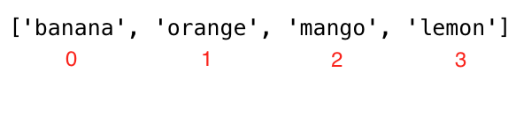

<div align="center">
  <h1> 30 Jours de Python : Jour 5 - Listes</h1>
  <a class="header-badge" target="_blank" href="https://www.linkedin.com/in/asabeneh/">
  
  </a>
  <a class="header-badge" target="_blank" href="https://twitter.com/Asabeneh">
  
  </a>

<sub>Auteur :
<a href="https://www.linkedin.com/in/asabeneh/" target="_blank">Asabeneh Yetayeh</a><br>
<small> Deuxième édition : juillet 2021</small>
</sub>

</div>

[<< Jour 4](./04_strings_fr.md) | [Jour 6 >>](./06_tuples_fr.md)


- [Jour 5](#jour-5)
  - [Listes](#listes)
    - [Comment créer une liste](#comment-créer-une-liste)
    - [Accéder aux éléments d'une liste par indice positif](#accéder-aux-éléments-dune-liste-par-indice-positif)
    - [Accéder aux éléments d'une liste par indice négatif](#accéder-aux-éléments-dune-liste-par-indice-négatif)
    - [Dépaquetage d'éléments d'une liste](#dépaquetage-déléments-dune-liste)
    - [Découper des éléments d'une liste](#découper-des-éléments-dune-liste)
    - [Modifier une liste](#modifier-une-liste)
    - [Vérifier la présence d'un élément](#vérifier-la-présence-dun-élément)
    - [Ajouter des éléments à une liste](#ajouter-des-éléments-à-une-liste)
    - [Insérer des éléments dans une liste](#insérer-des-éléments-dans-une-liste)
    - [Supprimer des éléments d'une liste](#supprimer-des-éléments-dune-liste)
    - [Supprimer avec Pop](#supprimer-avec-pop)
    - [Supprimer avec Del](#supprimer-avec-del)
    - [Vider une liste](#vider-une-liste)
    - [Copier une liste](#copier-une-liste)
    - [Concaténer des listes](#concaténer-des-listes)
    - [Compter les occurrences](#compter-les-occurrences)
    - [Trouver l'indice d'un élément](#trouver-lindice-dun-élément)
    - [Inverser une liste](#inverser-une-liste)
    - [Trier une liste](#trier-une-liste)
  - [💻 Exercices : Jour 5](#-exercices--jour-5)
    - [Exercices : Niveau 1](#exercices--niveau-1)
    - [Exercices : Niveau 2](#exercices--niveau-2)

# Jour 5

## Listes

Il existe quatre types de données de collection en Python :

- **Liste** : une collection ordonnée et modifiable. Accepte les doublons.
- **Tuple** : une collection ordonnée et non modifiable (immuable). Accepte les doublons.
- **Ensemble (Set)** : une collection non ordonnée, non indexée et non modifiable, mais on peut y ajouter de nouveaux éléments. Les doublons ne sont pas autorisés.
- **Dictionnaire (Dictionary)** : une collection non ordonnée, modifiable et indexée. Pas de doublons.

Une liste est une collection de différents types de données, ordonnée et modifiable (muable). Une liste peut être vide ou contenir des éléments de différents types.

### Comment créer une liste

En Python, on peut créer une liste de deux façons :

- En utilisant la fonction intégrée `list()`

```py
# syntaxe
lst = list()
```

```py
empty_list = list() # une liste vide, sans élément
print(len(empty_list)) # 0
```

- En utilisant les crochets, []

```py
# syntaxe
lst = []
```

```py
empty_list = [] # une liste vide, sans élément
print(len(empty_list)) # 0
```

Listes avec valeurs initiales. On utilise _len()_ pour connaître la longueur d'une liste.

```py
fruits = ['banana', 'orange', 'mango', 'lemon']                     # liste de fruits
vegetables = ['Tomato', 'Potato', 'Cabbage','Onion', 'Carrot']      # liste de légumes
animal_products = ['milk', 'meat', 'butter', 'yoghurt']             # liste de produits animaux
web_techs = ['HTML', 'CSS', 'JS', 'React','Redux', 'Node', 'MongDB'] # liste de technologies web
countries = ['Finland', 'Estonia', 'Denmark', 'Sweden', 'Norway']

# Affichage des listes et de leur longueur
print('Fruits:', fruits)
print('Nombre de fruits:', len(fruits))
print('Légumes:', vegetables)
print('Nombre de légumes:', len(vegetables))
print('Produits animaux:',animal_products)
print('Nombre de produits animaux:', len(animal_products))
print('Technologies web:', web_techs)
print('Nombre de technologies web:', len(web_techs))
print('Pays:', countries)
print('Nombre de pays:', len(countries))
```

```sh
sortie
Fruits: ['banana', 'orange', 'mango', 'lemon']
Nombre de fruits: 4
Légumes: ['Tomato', 'Potato', 'Cabbage', 'Onion', 'Carrot']
Nombre de légumes: 5
Produits animaux: ['milk', 'meat', 'butter', 'yoghurt']
Nombre de produits animaux: 4
Technologies web: ['HTML', 'CSS', 'JS', 'React', 'Redux', 'Node', 'MongDB']
Nombre de technologies web: 7
Pays: ['Finland', 'Estonia', 'Denmark', 'Sweden', 'Norway']
Nombre de pays: 5
```

- Les listes peuvent contenir des éléments de différents types

```py
 lst = ['Asabeneh', 250, True, {'country':'Finland', 'city':'Helsinki'}] # liste contenant différents types de données
```

### Accéder aux éléments d'une liste par indice positif

On accède à chaque élément d'une liste par son indice. L'indice d'une liste commence à 0. L'image ci-dessous montre clairement où l'indice commence.



```py
fruits = ['banana', 'orange', 'mango', 'lemon']
first_fruit = fruits[0] # on accède au premier élément via son indice
print(first_fruit)      # banana
second_fruit = fruits[1]
print(second_fruit)     # orange
last_fruit = fruits[3]
print(last_fruit) # lemon
# Dernier indice
last_index = len(fruits) - 1
last_fruit = fruits[last_index]
```

### Accéder aux éléments d'une liste par indice négatif

L'indice négatif signifie que l'on commence par la fin : -1 correspond au dernier élément, -2 à l'avant-dernier, etc.


```py
fruits = ['banana', 'orange', 'mango', 'lemon']
first_fruit = fruits[-4]
last_fruit = fruits[-1]
second_last = fruits[-2]
print(first_fruit)      # banana
print(last_fruit)       # lemon
print(second_last)      # mango
```

### Dépaquetage d'éléments d'une liste

```py
lst = ['item1','item2','item3', 'item4', 'item5']
first_item, second_item, third_item, *rest = lst
print(first_item)     # item1
print(second_item)    # item2
print(third_item)     # item3
print(rest)           # ['item4', 'item5']

```

```py
# Premier exemple
fruits = ['banana', 'orange', 'mango', 'lemon','lime','apple']
first_fruit, second_fruit, third_fruit, *rest = fruits 
print(first_fruit)     # banana
print(second_fruit)    # orange
print(third_fruit)     # mango
print(rest)           # ['lemon','lime','apple']
# Deuxième exemple de dépaquetage
first, second, third,*rest, tenth = [1,2,3,4,5,6,7,8,9,10]
print(first)          # 1
print(second)         # 2
print(third)          # 3
print(rest)           # [4,5,6,7,8,9]
print(tenth)          # 10
# Troisième exemple de dépaquetage
countries = ['Germany', 'France','Belgium','Sweden','Denmark','Finland','Norway','Iceland','Estonia']
gr, fr, bg, sw, *scandic, es = countries
print(gr) 
print(fr)
print(bg)
print(sw)
print(scandic)
print(es)
```

### Découper des éléments d'une liste

- **Indice positif** : on peut spécifier une plage d'indices positifs en indiquant le début, la fin et le pas. La valeur renvoyée est une nouvelle liste (valeurs par défaut : début = 0, fin = len(lst) - 1, pas = 1).

```py
fruits = ['banana', 'orange', 'mango', 'lemon']
all_fruits = fruits[0:4] # renvoie tous les fruits
# donne aussi le même résultat
all_fruits = fruits[0:] # si on ne fixe pas de fin, on prend tout le reste
orange_and_mango = fruits[1:3] # n'inclut pas le premier indice
orange_mango_lemon = fruits[1:]
orange_and_lemon = fruits[::2] # on utilise un 3e argument, le pas. Prend un élément sur deux - ['banana', 'mango']
```

- **Indice négatif** : on peut spécifier une plage d'indices négatifs.

```py
fruits = ['banana', 'orange', 'mango', 'lemon']
all_fruits = fruits[-4:] # renvoie tous les fruits
orange_and_mango = fruits[-3:-1] # n'inclut pas le dernier indice, ['orange', 'mango']
orange_mango_lemon = fruits[-3:] # de -3 jusqu'à la fin, ['orange', 'mango', 'lemon']
reverse_fruits = fruits[::-1] # un pas négatif prend la liste en ordre inverse, ['lemon', 'mango', 'orange', 'banana']
```

### Modifier une liste

Une liste est une collection ordonnée d'éléments modifiable (muable). Modifions la liste de fruits.

```py
fruits = ['banana', 'orange', 'mango', 'lemon']
fruits[0] = 'avocado'
print(fruits)       #  ['avocado', 'orange', 'mango', 'lemon']
fruits[1] = 'apple'
print(fruits)       #  ['avocado', 'apple', 'mango', 'lemon']
last_index = len(fruits) - 1
fruits[last_index] = 'lime'
print(fruits)        #  ['avocado', 'apple', 'mango', 'lime']
```

### Vérifier la présence d'un élément

On vérifie si un élément est membre d'une liste avec l'opérateur *in*.

```py
fruits = ['banana', 'orange', 'mango', 'lemon']
does_exist = 'banana' in fruits
print(does_exist)  # True
does_exist = 'lime' in fruits
print(does_exist)  # False
```

### Ajouter des éléments à une liste

Pour ajouter un élément à la fin d'une liste existante, on utilise la méthode *append()*.

```py
# syntaxe
lst = list()
lst.append(item)
```

```py
fruits = ['banana', 'orange', 'mango', 'lemon']
fruits.append('apple')
print(fruits)           # ['banana', 'orange', 'mango', 'lemon', 'apple']
fruits.append('lime')   # ['banana', 'orange', 'mango', 'lemon', 'apple', 'lime']
print(fruits)
```

### Insérer des éléments dans une liste

On peut utiliser la méthode *insert()* pour insérer un élément à un indice précis dans une liste. Les autres éléments sont décalés vers la droite. La méthode *insert()* prend deux arguments : l'indice et l'élément à insérer.

```py
# syntaxe
lst = ['item1', 'item2']
lst.insert(index, item)
```

```py
fruits = ['banana', 'orange', 'mango', 'lemon']
fruits.insert(2, 'apple') # insère apple entre orange et mango
print(fruits)           # ['banana', 'orange', 'apple', 'mango', 'lemon']
fruits.insert(3, 'lime')   # ['banana', 'orange', 'apple', 'lime', 'mango', 'lemon']
print(fruits)
```

### Supprimer des éléments d'une liste

La méthode `remove()` supprime un élément spécifié de la liste.

```py
# syntaxe
lst = ['item1', 'item2']
lst.remove(item)
```

```py
fruits = ['banana', 'orange', 'mango', 'lemon', 'banana']
fruits.remove('banana')
print(fruits)  # ['orange', 'mango', 'lemon', 'banana'] - supprime la première occurrence
fruits.remove('lemon')
print(fruits)  # ['orange', 'mango', 'banana']
```

### Supprimer avec Pop

La méthode *pop()* supprime l'élément à l'indice spécifié (ou le dernier élément si aucun indice n'est donné).

```py
# syntaxe
lst = ['item1', 'item2']
lst.pop()       # dernier élément
lst.pop(index)
```

```py
fruits = ['banana', 'orange', 'mango', 'lemon']
fruits.pop()
print(fruits)       # ['banana', 'orange', 'mango']

fruits.pop(0)
print(fruits)       # ['orange', 'mango']
```

### Supprimer avec Del

Le mot-clé *del* supprime l'élément à l'indice spécifié et peut aussi supprimer une plage d'éléments. Il peut aussi supprimer complètement la liste.

```py
# syntaxe
lst = ['item1', 'item2']
del lst[index] # un seul élément
del lst        # supprime complètement la liste
```

```py
fruits = ['banana', 'orange', 'mango', 'lemon', 'kiwi', 'lime']
del fruits[0]
print(fruits)       # ['orange', 'mango', 'lemon', 'kiwi', 'lime']
del fruits[1]
print(fruits)       # ['orange', 'lemon', 'kiwi', 'lime']
del fruits[1:3]     # supprime les éléments entre les indices donnés (sans inclure l'indice 3)
print(fruits)       # ['orange', 'lime']
del fruits
print(fruits)       # NameError: name 'fruits' is not defined
```

### Vider une liste

La méthode *clear()* vide la liste.

```py
# syntaxe
lst = ['item1', 'item2']
lst.clear()
```

```py
fruits = ['banana', 'orange', 'mango', 'lemon']
fruits.clear()
print(fruits)       # []
```

### Copier une liste

On peut copier une liste en la réaffectant à une nouvelle variable : `list2 = list1`. Mais `list2` est alors une référence de `list1` : toute modification dans `list2` modifie aussi `list1` d'origine. Pour éviter cela, on utilise _copy()_.

```py
# syntaxe
lst = ['item1', 'item2']
lst_copy = lst.copy()
```

```py
fruits = ['banana', 'orange', 'mango', 'lemon']
fruits_copy = fruits.copy()
print(fruits_copy)       # ['banana', 'orange', 'mango', 'lemon']
```

### Concaténer des listes

Il y a plusieurs façons de joindre (concaténer) deux listes ou plus en Python.

- **Opérateur +**

```py
# syntaxe
list3 = list1 + list2
```

```py
positive_numbers = [1, 2, 3, 4, 5]
zero = [0]
negative_numbers = [-5,-4,-3,-2,-1]
integers = negative_numbers + zero + positive_numbers
print(integers) # [-5, -4, -3, -2, -1, 0, 1, 2, 3, 4, 5]
fruits = ['banana', 'orange', 'mango', 'lemon']
vegetables = ['Tomato', 'Potato', 'Cabbage', 'Onion', 'Carrot']
fruits_and_vegetables = fruits + vegetables
print(fruits_and_vegetables ) # ['banana', 'orange', 'mango', 'lemon', 'Tomato', 'Potato', 'Cabbage', 'Onion', 'Carrot']
```

- **Concaténation avec `extend()`**
  La méthode *extend()* permet d'ajouter une liste à une autre.

```py
# syntaxe
list1 = ['item1', 'item2']
list2 = ['item3', 'item4', 'item5']
list1.extend(list2) # ['item1', 'item2', 'item3', 'item4', 'item5']
```

```py
num1 = [0, 1, 2, 3]
num2= [4, 5, 6]
num1.extend(num2)
print('Nombres:', num1) # Nombres: [0, 1, 2, 3, 4, 5, 6]
negative_numbers = [-5,-4,-3,-2,-1]
positive_numbers = [1, 2, 3,4,5]
zero = [0]

negative_numbers.extend(zero)
negative_numbers.extend(positive_numbers)
print('Entiers:', negative_numbers) # Entiers: [-5, -4, -3, -2, -1, 0, 1, 2, 3, 4, 5]
fruits = ['banana', 'orange', 'mango', 'lemon']
vegetables = ['Tomato', 'Potato', 'Cabbage', 'Onion', 'Carrot']
fruits.extend(vegetables)
print('Fruits et légumes:', fruits ) # Fruits et légumes: ['banana', 'orange', 'mango', 'lemon', 'Tomato', 'Potato', 'Cabbage', 'Onion', 'Carrot']
```

### Compter les occurrences

La méthode *count()* renvoie le nombre de fois qu'un élément apparaît dans une liste.

```py
# syntaxe
lst = ['item1', 'item2']
lst.count(item)
```

```py
fruits = ['banana', 'orange', 'mango', 'lemon']
print(fruits.count('orange'))   # 1
ages = [22, 19, 24, 25, 26, 24, 25, 24]
print(ages.count(24))           # 3
```

### Trouver l'indice d'un élément

La méthode *index()* renvoie l'indice d'un élément dans la liste.

```py
# syntaxe
lst = ['item1', 'item2']
lst.index(item)
```

```py
fruits = ['banana', 'orange', 'mango', 'lemon']
print(fruits.index('orange'))   # 1
ages = [22, 19, 24, 25, 26, 24, 25, 24]
print(ages.index(24))           # 2, la première occurrence
```

### Inverser une liste

La méthode *reverse()* inverse l'ordre d'une liste.

```py
# syntaxe
lst = ['item1', 'item2']
lst.reverse()

```

```py
fruits = ['banana', 'orange', 'mango', 'lemon']
fruits.reverse()
print(fruits) # ['lemon', 'mango', 'orange', 'banana']
ages = [22, 19, 24, 25, 26, 24, 25, 24]
ages.reverse()
print(ages) # [24, 25, 24, 26, 25, 24, 19, 22]
```

### Trier une liste

Pour trier une liste, on peut utiliser la méthode _sort()_ ou la fonction intégrée _sorted()_. La méthode _sort()_ réordonne les éléments de la liste en ordre croissant et modifie la liste d'origine. Si l'argument reverse de _sort()_ est true, la liste est triée en ordre décroissant.

- `sort()` : modifie la liste d'origine

  ```py
  # syntaxe
  lst = ['item1', 'item2']
  lst.sort()                # croissant
  lst.sort(reverse=True)    # décroissant
  ```

  **Exemple :**

  ```py
  fruits = ['banana', 'orange', 'mango', 'lemon']
  fruits.sort()
  print(fruits)             # tri alphabétique, ['banana', 'lemon', 'mango', 'orange']
  fruits.sort(reverse=True)
  print(fruits) # ['orange', 'mango', 'lemon', 'banana']
  ages = [22, 19, 24, 25, 26, 24, 25, 24]
  ages.sort()
  print(ages) #  [19, 22, 24, 24, 24, 25, 25, 26]
 
  ages.sort(reverse=True)
  print(ages) #  [26, 25, 25, 24, 24, 24, 22, 19]
  ```

  `sorted()` : renvoie la liste triée sans modifier la liste d'origine.
  **Exemple :**

  ```py
  fruits = ['banana', 'orange', 'mango', 'lemon']
  print(sorted(fruits))   # ['banana', 'lemon', 'mango', 'orange']
  # Ordre inverse
  fruits = ['banana', 'orange', 'mango', 'lemon']
  fruits = sorted(fruits,reverse=True)
  print(fruits)     # ['orange', 'mango', 'lemon', 'banana']
  ```

🌕 Vous êtes appliqué et vous avez déjà accompli beaucoup de choses. Vous venez de terminer le défi du Jour 5 et vous êtes cinq pas de plus sur la voie de la grandeur. Faites maintenant quelques exercices pour votre cerveau et vos muscles.

## 💻 Exercices : Jour 5

### Exercices : Niveau 1

1. Déclarez une liste vide.
2. Déclarez une liste avec plus de 5 éléments.
3. Trouvez la longueur de votre liste.
4. Obtenez le premier élément, l'élément du milieu et le dernier élément de la liste.
5. Déclarez une liste appelée `mixed_data_types` contenant (votre nom, âge, taille, situation matrimoniale, adresse).
6. Déclarez une variable liste nommée `it_companies` et assignez-lui les valeurs initiales Facebook, Google, Microsoft, Apple, IBM, Oracle et Amazon.
7. Affichez la liste en utilisant _print()_.
8. Affichez le nombre d'entreprises dans la liste.
9. Affichez la première, celle du milieu et la dernière entreprise.
10. Affichez la liste après avoir modifié l'une des entreprises.
11. Ajoutez une entreprise IT à `it_companies`.
12. Insérez une entreprise IT au milieu de la liste.
13. Changez l'un des noms de `it_companies` en majuscules (IBM exclu !).
14. Joignez les `it_companies` avec une chaîne `'#;&nbsp; '`.
15. Vérifiez si une certaine entreprise existe dans la liste `it_companies`.
16. Triez la liste avec la méthode `sort()`.
17. Inversez la liste en ordre décroissant avec la méthode `reverse()`.
18. Découpez les 3 premières entreprises de la liste.
19. Découpez les 3 dernières entreprises de la liste.
20. Découpez l'entreprise du milieu (ou les entreprises du milieu) de la liste.
21. Supprimez la première entreprise IT de la liste.
22. Supprimez l'entreprise du milieu (ou les entreprises du milieu) de la liste.
23. Supprimez la dernière entreprise IT de la liste.
24. Supprimez toutes les entreprises IT de la liste.
25. Détruisez la liste des entreprises IT.
26. Joignez les listes suivantes :

    ```py
    front_end = ['HTML', 'CSS', 'JS', 'React', 'Redux']
    back_end = ['Node','Express', 'MongoDB']
    ```

27. Après avoir joint les listes à la question 26, copiez la liste jointe et assignez-la à une variable `full_stack`, puis insérez Python et SQL après Redux.

### Exercices : Niveau 2

1. Voici une liste de 10 âges d'étudiants :

```sh
ages = [19, 22, 19, 24, 20, 25, 26, 24, 25, 24]
```

- Triez la liste et trouvez l'âge minimum et maximum.
- Ajoutez à nouveau l'âge minimum et l'âge maximum à la liste.
- Trouvez l'âge médian (un élément du milieu ou deux éléments du milieu divisés par deux).
- Trouvez l'âge moyen (somme de tous les éléments divisée par leur nombre).
- Trouvez l'étendue des âges (max moins min).
- Comparez la valeur de (min - moyenne) et (max - moyenne), en utilisant _abs()_.

2. Trouvez le(s) pays du milieu dans la [liste des pays](https://github.com/Asabeneh/30-Days-Of-Python/tree/master/data/countries.py).
3. Divisez la liste des pays en deux listes égales ; si le nombre est impair, un pays de plus pour la première moitié.
4. `['China', 'Russia', 'USA', 'Finland', 'Sweden', 'Norway', 'Denmark']`. Dépaquetez les trois premiers pays et le reste comme pays scandinaves.

🎉 FÉLICITATIONS ! 🎉

[<< Jour 4](./04_strings_fr.md) | [Jour 6 >>](./06_tuples_fr.md)
