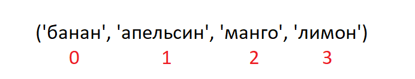
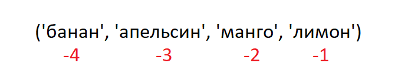

<div align="center">
  <h1> 30 Jours de Python : Jour 6 - Tuples</h1>
  <a class="header-badge" target="_blank" href="https://www.linkedin.com/in/asabeneh/">
  
  </a>
  <a class="header-badge" target="_blank" href="https://twitter.com/Asabeneh">
  
  </a>

<sub>Auteur :
<a href="https://www.linkedin.com/in/asabeneh/" target="_blank">Asabeneh Yetayeh</a><br>
<small> Deuxième édition : juillet 2021</small>
</sub>

</div>

[<< Jour 5](./05_lists_fr.md) | [Jour 7 >>](./07_sets_fr.md)


- [Jour 6 :](#jour-6)
  - [Tuples](#tuples)
    - [Créer un tuple](#créer-un-tuple)
    - [Longueur d'un tuple](#longueur-dun-tuple)
    - [Accéder aux éléments d'un tuple](#accéder-aux-éléments-dun-tuple)
    - [Découper un tuple](#découper-un-tuple)
    - [Convertir un tuple en liste](#convertir-un-tuple-en-liste)
    - [Vérifier la présence d'un élément dans un tuple](#vérifier-la-présence-dun-élément-dans-un-tuple)
    - [Joindre des tuples](#joindre-des-tuples)
    - [Supprimer des tuples](#supprimer-des-tuples)
  - [💻 Exercices : Jour 6](#-exercices--jour-6)
    - [Exercices : Niveau 1](#exercices--niveau-1)
    - [Exercices : Niveau 2](#exercices--niveau-2)

# Jour 6 :

## Tuples

Un tuple est une collection ordonnée et non modifiable (immuable) de différents types de données. Les tuples s'écrivent entre parenthèses, (). Une fois qu'un tuple est créé, on ne peut pas modifier ses valeurs. On ne peut pas utiliser les méthodes add, insert, remove sur un tuple car il n'est pas modifiable (muable). Contrairement à la liste, le tuple a peu de méthodes. Méthodes liées aux tuples :

- tuple() : créer un tuple vide
- count() : compter le nombre d'occurrences d'un élément dans un tuple
- index() : trouver l'indice d'un élément dans un tuple
- `+` : concaténer deux tuples ou plus pour en créer un nouveau

### Créer un tuple

- Tuple vide : création d'un tuple vide

  ```py
  # syntaxe
  empty_tuple = ()
  # ou en utilisant le constructeur tuple
  empty_tuple = tuple()
  ```

- Tuple avec valeurs initiales

  ```py
  # syntaxe
  tpl = ('item1', 'item2','item3')
  ```

  ```py
  fruits = ('banana', 'orange', 'mango', 'lemon')
  ```

### Longueur d'un tuple

On utilise la méthode _len()_ pour obtenir la longueur d'un tuple.

```py
# syntaxe
tpl = ('item1', 'item2', 'item3')
len(tpl)
```

### Accéder aux éléments d'un tuple

- Indexation positive
  Comme pour le type liste, on utilise l'indexation positive ou négative pour accéder aux éléments d'un tuple.
  

  ```py
  # Syntaxe
  tpl = ('item1', 'item2', 'item3')
  first_item = tpl[0]
  second_item = tpl[1]
  ```

  ```py
  fruits = ('banana', 'orange', 'mango', 'lemon')
  first_fruit = fruits[0]
  second_fruit = fruits[1]
  last_index = len(fruits) - 1
  last_fruit = fruits[last_index]
  ```

- Indexation négative
  L'indexation négative signifie que l'on commence par la fin : -1 correspond au dernier élément, -2 à l'avant-dernier, et la valeur négative de la longueur du tuple/de la liste correspond au premier élément.
  

  ```py
  # Syntaxe
  tpl = ('item1', 'item2', 'item3','item4')
  first_item = tpl[-4]
  second_item = tpl[-3]
  ```

  ```py
  fruits = ('banana', 'orange', 'mango', 'lemon')
  first_fruit = fruits[-4]
  second_fruit = fruits[-3]
  last_fruit = fruits[-1]
  ```

### Découper un tuple

On peut extraire un sous-tuple en spécifiant une plage d'indices de début et de fin dans le tuple ; la valeur renvoyée sera un nouveau tuple contenant les éléments spécifiés.

- Plage d'indices positifs

  ```py
  # Syntaxe
  tpl = ('item1', 'item2', 'item3','item4')
  all_items = tpl[0:4]         # tous les éléments
  all_items = tpl[0:]         # tous les éléments
  middle_two_items = tpl[1:3]  # n'inclut pas l'élément à l'indice 3
  ```

  ```py
  fruits = ('banana', 'orange', 'mango', 'lemon')
  all_fruits = fruits[0:4]    # tous les éléments
  all_fruits = fruits[0:]      # tous les éléments
  orange_mango = fruits[1:3]  # n'inclut pas l'élément à l'indice 3
  orange_to_the_rest = fruits[1:]
  ```

- Plage d'indices négatifs

  ```py
  # Syntaxe
  tpl = ('item1', 'item2', 'item3','item4')
  all_items = tpl[-4:]         # tous les éléments
  middle_two_items = tpl[-3:-1]  # n'inclut pas l'élément à l'indice 3 (-1)
  ```

  ```py
  fruits = ('banana', 'orange', 'mango', 'lemon')
  all_fruits = fruits[-4:]    # tous les éléments
  orange_mango = fruits[-3:-1]  # n'inclut pas l'élément à l'indice 3
  orange_to_the_rest = fruits[-3:]
  ```

### Convertir un tuple en liste

On peut convertir des tuples en listes et des listes en tuples. Un tuple est immuable ; si on veut modifier un tuple, on doit le convertir en liste.

```py
# Syntaxe
tpl = ('item1', 'item2', 'item3','item4')
lst = list(tpl)
```

```py
fruits = ('banana', 'orange', 'mango', 'lemon')
fruits = list(fruits)
fruits[0] = 'apple'
print(fruits)     # ['apple', 'orange', 'mango', 'lemon']
fruits = tuple(fruits)
print(fruits)     # ('apple', 'orange', 'mango', 'lemon')
```

### Vérifier la présence d'un élément dans un tuple

On peut vérifier si un élément existe ou non dans un tuple avec _in_, qui renvoie un booléen.

```py
# Syntaxe
tpl = ('item1', 'item2', 'item3','item4')
'item2' in tpl # True
```

```py
fruits = ('banana', 'orange', 'mango', 'lemon')
print('orange' in fruits) # True
print('apple' in fruits) # False
fruits[0] = 'apple' # TypeError: 'tuple' object does not support item assignment
```

### Joindre des tuples

On peut joindre deux tuples ou plus avec l'opérateur +.

```py
# syntaxe
tpl1 = ('item1', 'item2', 'item3')
tpl2 = ('item4', 'item5','item6')
tpl3 = tpl1 + tpl2
```

```py
fruits = ('banana', 'orange', 'mango', 'lemon')
vegetables = ('Tomato', 'Potato', 'Cabbage','Onion', 'Carrot')
fruits_and_vegetables = fruits + vegetables
```

### Supprimer des tuples

Il n'est pas possible de supprimer un seul élément d'un tuple, mais il est possible de supprimer le tuple lui-même avec _del_.

```py
# syntaxe
tpl1 = ('item1', 'item2', 'item3')
del tpl1

```

```py
fruits = ('banana', 'orange', 'mango', 'lemon')
del fruits
```

🌕 Vous êtes si courageux, vous êtes arrivé jusqu'ici. Vous venez de terminer les défis du jour 6 et vous êtes à six pas de plus sur la voie de la grandeur. Faites maintenant quelques exercices pour votre cerveau et vos muscles.

## 💻 Exercices : Jour 6

### Exercices : Niveau 1

1. Créez un tuple vide.
2. Créez un tuple contenant les prénoms de vos sœurs et de vos frères (les frères et sœurs imaginaires sont acceptés).
3. Joignez les tuples frères et sœurs et assignez-les à siblings.
4. Combien de frères et sœurs avez-vous ?
5. Modifiez le tuple siblings en ajoutant le prénom de votre père et de votre mère, puis assignez-le à family_members.

### Exercices : Niveau 2

1. Dépaquetez siblings et parents à partir de family_members.
2. Créez des tuples fruits, légumes et produits animaux. Joignez les trois tuples et assignez-les à une variable appelée food_stuff_tp.
3. Convertissez le tuple food_stuff_tp en une liste food_stuff_lt.
4. Découpez l'élément ou les éléments du milieu du tuple food_stuff_tp ou de la liste food_stuff_lt.
5. Découpez les trois premiers et les trois derniers éléments de la liste food_stuff_lt.
6. Supprimez complètement le tuple food_stuff_tp.
7. Vérifiez si un élément existe dans le tuple :

   - Vérifiez si 'Estonia' est un pays nordique.
   - Vérifiez si 'Iceland' est un pays nordique.

   ```py
   nordic_countries = ('Denmark', 'Finland','Iceland', 'Norway', 'Sweden')
   ```

[<< Jour 5](./05_lists_fr.md) | [Jour 7 >>](./07_sets_fr.md)
