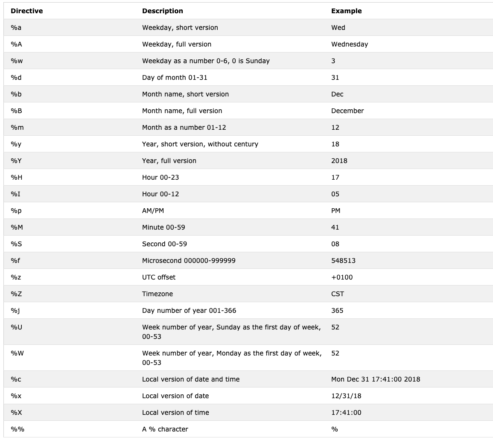

<div align="center">
  <h1> 30 Jours de Python : Jour 16 - Date et heure en Python</h1>
  <a class="header-badge" target="_blank" href="https://www.linkedin.com/in/asabeneh/">
  
  </a>
  <a class="header-badge" target="_blank" href="https://twitter.com/Asabeneh">
  
  </a>

  <sub>Auteur :
  <a href="https://www.linkedin.com/in/asabeneh/" target="_blank">Asabeneh Yetayeh</a><br>
  <small>Deuxième édition : juillet 2021</small>
  </sub>
</div>

[<< Jour 15](./15_python_type_errors_fr.md) | [Jour 17 >>](./17_exception_handling_fr.md)


- [📘 Jour 16](#-jour-16)
  - [Datetime en Python](#datetime-en-python)
    - [Obtenir des informations sur *datetime*](#obtenir-des-informations-sur-datetime)
    - [Formater la sortie de date avec *strftime*](#formater-la-sortie-de-date-avec-strftime)
    - [Chaîne en heure avec *strptime*](#chaîne-en-heure-avec-strptime)
    - [Utiliser *date* depuis *datetime*](#utiliser-date-depuis-datetime)
    - [Objets Time pour représenter l'heure](#objets-time-pour-représenter-lheure)
    - [Différence entre deux instants avec](#différence-entre-deux-instants-avec)
    - [Différence entre deux instants avec *timedelta*](#différence-entre-deux-instants-avec-timedelta)
  - [💻 Exercices : Jour 16](#-exercices--jour-16)

# 📘 Jour 16

## Datetime en Python

Python dispose du module _datetime_ pour gérer les dates et les heures.

```py
import datetime
print(dir(datetime))
['MAXYEAR', 'MINYEAR', '__builtins__', '__cached__', '__doc__', '__file__', '__loader__', '__name__', '__package__', '__spec__', 'date', 'datetime', 'datetime_CAPI', 'sys', 'time', 'timedelta', 'timezone', 'tzinfo']
```

Avec les commandes intégrées dir ou help, il est possible de connaître les fonctions disponibles dans un module donné. Comme vous pouvez le voir, le module datetime contient de nombreuses fonctions, mais nous nous concentrerons sur _date_, _datetime_, _time_ et _timedelta_. Voyons-les une par une.

### Obtenir des informations sur *datetime*

```py
from datetime import datetime
now = datetime.now()
print(now)                      # 2021-07-08 07:34:46.549883
day = now.day                   # 8
month = now.month               # 7
year = now.year                 # 2021
hour = now.hour                 # 7
minute = now.minute             # 38
second = now.second
timestamp = now.timestamp()
print(day, month, year, hour, minute)
print('timestamp', timestamp)
print(f'{day}/{month}/{year}, {hour}:{minute}')  # 8/7/2021, 7:38
```

Le timestamp (ou timestamp Unix) est le nombre de secondes écoulées depuis le 1er janvier 1970 UTC.

### Formater la sortie de date avec *strftime*

```py
from datetime import datetime
new_year = datetime(2020, 1, 1)
print(new_year)      # 2020-01-01 00:00:00
day = new_year.day
month = new_year.month
year = new_year.year
hour = new_year.hour
minute = new_year.minute
second = new_year.second
print(day, month, year, hour, minute) #1 1 2020 0 0
print(f'{day}/{month}/{year}, {hour}:{minute}')  # 1/1/2020, 0:0

```

Pour formater la date et l'heure, on utilise la méthode *strftime* ; la documentation se trouve [ici](https://strftime.org/).

```py
from datetime import datetime
# date et heure actuelles
now = datetime.now()
t = now.strftime("%H:%M:%S")
print("heure :", t)           # heure : 18:21:40
time_one = now.strftime("%m/%d/%Y, %H:%M:%S")
# format mm/dd/YY H:M:S
print("heure une :", time_one)        # heure une : 06/28/2022, 18:21:40
time_two = now.strftime("%d/%m/%Y, %H:%M:%S")
# format dd/mm/YY H:M:S
print("heure deux :", time_two)        # heure deux : 28/06/2022, 18:21:40
```

```sh
heure : 01:05:01
heure une : 12/05/2019, 01:05:01
heure deux : 05/12/2019, 01:05:01
```

Voici tous les symboles _strftime_ que nous utilisons pour formater l'heure. Un exemple de tous les formats pour ce module.



### Convertir une chaîne en objet datetime avec *strptime*
Voici une [documentation](https://www.programiz.com/python-programming/datetime/strptime) qui aide à comprendre le format.

```py
from datetime import datetime
date_string = "5 December, 2019"
print("chaîne_date =", date_string)     # chaîne_date = 5 December, 2019
date_object = datetime.strptime(date_string, "%d %B, %Y")
print("objet_date =", date_object)     # objet_date = 2019-12-05 00:00:00
```

```sh
chaîne_date = 5 December, 2019
objet_date = 2019-12-05 00:00:00
```

### Utiliser *date* depuis *datetime*

```py
from datetime import date
d = date(2020, 1, 1)
print(d)        # 2020-01-01
print('Date actuelle :', d.today())    # 2019-12-05
# objet date pour la date d'aujourd'hui
today = date.today()
print("Année actuelle :", today.year)   # 2019
print("Mois actuel :", today.month) # 12
print("Jour actuel :", today.day)     # 5
```

### Objets Time pour représenter l'heure

```py
from datetime import time
# time(heure = 0, minute = 0, seconde = 0)
a = time()
print("a =", a)     # a = 00:00:00
# time(heure, minute et seconde)
b = time(10, 30, 50)
print("b =", b)     # b = 10:30:50
# time(heure, minute et seconde)
c = time(hour=10, minute=30, second=50)
print("c =", c)     # c = 10:30:50
# time(heure, minute, seconde, microseconde)
d = time(10, 30, 50, 200555)
print("d =", d)     # d = 10:30:50.200555
```

Sortie  
a = 00:00:00  
b = 10:30:50  
c = 10:30:50  
d = 10:30:50.200555

### Différence entre deux instants avec

```py
from datetime import date, datetime
today = date(year=2019, month=12, day=5)
new_year = date(year=2020, month=1, day=1)
time_left_for_newyear = new_year - today
# Temps restant avant le nouvel an : 27 days, 0:00:00
print('Temps restant avant le nouvel an : ', time_left_for_newyear)  # Temps restant avant le nouvel an :  27 days, 0:00:00

t1 = datetime(year = 2019, month = 12, day = 5, hour = 0, minute = 59, second = 0)
t2 = datetime(year = 2020, month = 1, day = 1, hour = 0, minute = 0, second = 0)
diff = t2 - t1
print('Temps restant avant le nouvel an :', diff) # Temps restant avant le nouvel an : 26 days, 23: 01: 00
```

### Différence entre deux instants avec *timedelta*

```py
from datetime import timedelta
t1 = timedelta(weeks=12, days=10, hours=4, seconds=20)
t2 = timedelta(days=7, hours=5, minutes=3, seconds=30)
t3 = t1 - t2
print("t3 =", t3)
```

```sh
    date_string = 5 December, 2019
    date_object = 2019-12-05 00:00:00
    t3 = 86 days, 22:56:50
```

🌕 Vous êtes extraordinaire. Vous avez franchi 16 étapes vers la grandeur. Faites maintenant quelques exercices pour votre cerveau et vos muscles.

## 💻 Exercices : Jour 16

1. Obtenez le jour, le mois, l'année, l'heure, la minute et le timestamp actuels depuis le module datetime.
2. Formatez la date actuelle en utilisant ce format : "%m/%d/%Y, %H:%M:%S"
3. Aujourd'hui nous sommes le 5 décembre 2019. Convertissez cette chaîne de date en objet time.
4. Calculez la différence de temps entre maintenant et le nouvel an.
5. Calculez la différence de temps entre le 1er janvier 1970 et maintenant.
6. Réfléchissez : à quoi pouvez-vous utiliser le module datetime ? Exemples :
   - Analyse de séries temporelles
   - Obtenir un timestamp de toute activité dans une application
   - Ajouter des articles sur un blog

🎉 FÉLICITATIONS ! 🎉

[<< Jour 15](./15_python_type_errors_fr.md) | [Jour 17 >>](./17_exception_handling_fr.md)
