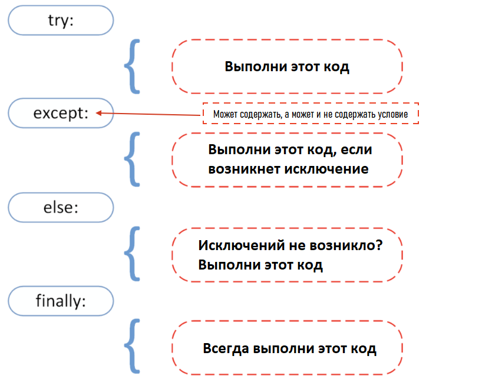

<div align="center">
  <h1> 30 Jours de Python : Jour 17 - Gestion des exceptions</h1>
  <a class="header-badge" target="_blank" href="https://www.linkedin.com/in/asabeneh/">
  
  </a>
  <a class="header-badge" target="_blank" href="https://twitter.com/Asabeneh">
  
  </a>

  <sub>Auteur :
  <a href="https://www.linkedin.com/in/asabeneh/" target="_blank">Asabeneh Yetayeh</a><br>
  <small> Deuxième édition : juillet 2021</small>
  </sub>
</div>

[<< Jour 16](./16_python_datetime_fr.md) | [Jour 18 >>](./18_regular_expressions_fr.md)


- [📘 Jour 17](#-jour-17)
  - [Gestion des exceptions](#gestion-des-exceptions)
  - [Empaquetage et dépaquetage d'arguments en Python](#empaquetage-et-dépaquetage-darguments-en-python)
    - [Dépaquetage](#dépaquetage)
      - [Dépaquetage de listes](#dépaquetage-de-listes)
      - [Dépaquetage de dictionnaires](#dépaquetage-de-dictionnaires)
    - [Empaquetage](#empaquetage)
    - [Empaquetage de listes](#empaquetage-de-listes)
      - [Empaquetage de dictionnaires](#empaquetage-de-dictionnaires)
  - [Dispersion en Python](#dispersion-en-python)
  - [Enumerate](#enumerate)
  - [Zip](#zip)
  - [Exercices : Jour 17](#exercices--jour-17)

# 📘 Jour 17

## Gestion des exceptions

Python utilise _try_ et _except_ pour gérer les erreurs avec élégance. Une sortie élégante (ou gestion élégante) des erreurs est un idiome de programmation simple : un programme détecte une condition d'erreur grave et « se termine élégamment », de manière contrôlée. Souvent, le programme affiche un message d'erreur descriptif dans un terminal ou un journal dans le cadre de la sortie élégante, ce qui rend notre application plus robuste. La cause d'une exception est souvent externe au programme lui-même. Un exemple d'exception pourrait être une entrée incorrecte, un nom de fichier erroné, l'impossibilité de trouver un fichier, un périphérique d'E/S défectueux. La gestion élégante des erreurs empêche nos applications de planter.

Nous avons couvert les différents types d'erreurs Python dans la section précédente. Si nous utilisons _try_ et _except_ dans notre programme, il ne lèvera pas d'erreurs dans ces blocs.



```py
try:
    code in this block if things go well
except:
    code in this block run if things go wrong
```

**Exemple :**

```py
try:
    print(10 + '5')
except:
    print('Something went wrong')
```

Dans l'exemple ci-dessus, le second opérande est une chaîne. Nous pourrions le convertir en float ou int pour l'additionner au nombre et le faire fonctionner. Mais sans aucune modification, le second bloc, _except_, sera exécuté.

**Exemple :**

```py
try:
    name = input('Enter your name:')
    year_born = input('Year you were born:')
    age = 2019 - year_born
    print(f'You are {name}. And your age is {age}.')
except:
    print('Something went wrong')
```

```sh
Something went wrong
```

Dans l'exemple ci-dessus, le bloc d'exception sera exécuté et nous ne savons pas exactement quel est le problème. Pour analyser le problème, nous pouvons utiliser les différents types d'erreurs avec except.

Dans l'exemple suivant, l'erreur sera gérée et le type d'erreur levée nous sera également indiqué.

```py
try:
    name = input('Enter your name:')
    year_born = input('Year you were born:')
    age = 2019 - year_born
    print(f'You are {name}. And your age is {age}.')
except TypeError:
    print('Type error occured')
except ValueError:
    print('Value error occured')
except ZeroDivisionError:
    print('zero division error occured')
```

```sh
Enter your name:Asabeneh
Year you born:1920
Type error occured
```

Dans le code ci-dessus, la sortie sera _TypeError_.
Maintenant, ajoutons un bloc supplémentaire :

```py
try:
    name = input('Enter your name:')
    year_born = input('Year you born:')
    age = 2019 - int(year_born)
    print(f'You are {name}. And your age is {age}.')
except TypeError:
    print('Type error occur')
except ValueError:
    print('Value error occur')
except ZeroDivisionError:
    print('zero division error occur')
else:
    print('I usually run with the try block')
finally:
    print('I alway run.')
```

```sh
Enter your name:Asabeneh
Year you born:1920
You are Asabeneh. And your age is 99.
I usually run with the try block
I alway run.
```

On peut aussi raccourcir le code ci-dessus comme suit :

```py
try:
    name = input('Enter your name:')
    year_born = input('Year you born:')
    age = 2019 - int(year_born)
    print(f'You are {name}. And your age is {age}.')
except Exception as e:
    print(e)

```

## Empaquetage et dépaquetage d'arguments en Python

Nous utilisons deux opérateurs :

- \* pour les tuples
- \*\* pour les dictionnaires

Prenons l'exemple ci-dessous. Elle ne prend que des arguments, mais nous avons une liste. Nous pouvons dépaqueter la liste et la transformer en arguments.

### Dépaquetage

#### Dépaquetage de listes

```py
def sum_of_five_nums(a, b, c, d, e):
    return a + b + c + d + e

lst = [1, 2, 3, 4, 5]
print(sum_of_five_nums(lst)) # TypeError: sum_of_five_nums() missing 4 required positional arguments: 'b', 'c', 'd', and 'e'
```

Quand nous exécutons ce code, il lève une erreur, car cette fonction prend des nombres (pas une liste) comme arguments. Dépaquetons/déstructurons la liste.

```py
def sum_of_five_nums(a, b, c, d, e):
    return a + b + c + d + e

lst = [1, 2, 3, 4, 5]
print(sum_of_five_nums(*lst))  # 15
```

On peut aussi utiliser le dépaquetage dans la fonction intégrée range qui attend un début et une fin.

```py
numbers = range(2, 7)  # appel normal avec des arguments séparés
print(list(numbers)) # [2, 3, 4, 5, 6]
args = [2, 7]
numbers = range(*args)  # appel avec des arguments dépaquetés depuis une liste
print(numbers)      # [2, 3, 4, 5,6]

```

Une liste ou un tuple peut aussi être dépaqueté comme ceci :

```py
countries = ['Finland', 'Sweden', 'Norway', 'Denmark', 'Iceland']
fin, sw, nor, *rest = countries
print(fin, sw, nor, rest)   # Finland Sweden Norway ['Denmark', 'Iceland']
numbers = [1, 2, 3, 4, 5, 6, 7]
one, *middle, last = numbers
print(one, middle, last)      #  1 [2, 3, 4, 5, 6] 7
```

#### Dépaquetage de dictionnaires

```py
def unpacking_person_info(name, country, city, age):
    return f'{name} lives in {country}, {city}. He is {age} year old.'
dct = {'name':'Asabeneh', 'country':'Finland', 'city':'Helsinki', 'age':250}
print(unpacking_person_info(**dct)) # Asabeneh lives in Finland, Helsinki. He is 250 years old.
```

### Empaquetage

Parfois, on ne sait jamais combien d'arguments doivent être passés à une fonction Python. Nous pouvons utiliser la méthode d'empaquetage pour permettre à notre fonction de prendre un nombre illimité ou arbitraire d'arguments.

### Empaquetage de listes

```py
def sum_all(*args):
    s = 0
    for i in args:
        s += i
    return s
print(sum_all(1, 2, 3))             # 6
print(sum_all(1, 2, 3, 4, 5, 6, 7)) # 28
```

#### Empaquetage de dictionnaires

```py
def packing_person_info(**kwargs):
    # check the type of kwargs and it is a dict type
    # print(type(kwargs))
    # Printing dictionary items
    for key in kwargs:
        print(f"{key} = {kwargs[key]}")
    return kwargs

print(packing_person_info(name="Asabeneh",
      country="Finland", city="Helsinki", age=250))
```

```sh
name = Asabeneh
country = Finland
city = Helsinki
age = 250
{'name': 'Asabeneh', 'country': 'Finland', 'city': 'Helsinki', 'age': 250}
```

## Dispersion en Python

Comme en JavaScript, la dispersion (spreading) est possible en Python. Regardons un exemple ci-dessous :

```py
lst_one = [1, 2, 3]
lst_two = [4, 5, 6, 7]
lst = [0, *lst_one, *lst_two]
print(lst)          # [0, 1, 2, 3, 4, 5, 6, 7]
country_lst_one = ['Finland', 'Sweden', 'Norway']
country_lst_two = ['Denmark', 'Iceland']
nordic_countries = [*country_lst_one, *country_lst_two]
print(nordic_countries)  # ['Finland', 'Sweden', 'Norway', 'Denmark', 'Iceland']
```

## Enumerate

Si nous voulons connaître l'indice d'une liste, nous utilisons la fonction intégrée _enumerate_ pour obtenir l'indice de chaque élément de la liste.

```py
for index, item in enumerate([20, 30, 40]):
    print(index, item)
```

```py
countries = ['Finland', 'Sweden', 'Norway', 'Denmark', 'Iceland']
for index, i in enumerate(countries):
    if i == 'Finland':
        print(f'The country {i} has been found at index {index}')
```

```sh
The country Finland has been found at index 0.
```

## Zip

Parfois, nous souhaitons combiner des listes en les parcourant. Voir l'exemple ci-dessous :

```py
fruits = ['banana', 'orange', 'mango', 'lemon', 'lime']                    
vegetables = ['Tomato', 'Potato', 'Cabbage','Onion', 'Carrot']
fruits_and_veges = []
for f, v in zip(fruits, vegetables):
    fruits_and_veges.append({'fruit':f, 'veg':v})

print(fruits_and_veges)
```

```sh
[{'fruit': 'banana', 'veg': 'Tomato'}, {'fruit': 'orange', 'veg': 'Potato'}, {'fruit': 'mango', 'veg': 'Cabbage'}, {'fruit': 'lemon', 'veg': 'Onion'}, {'fruit': 'lime', 'veg': 'Carrot'}]
```

🌕 Vous êtes déterminé. Vous avez franchi 17 étapes vers la grandeur. Faites maintenant quelques exercices pour votre cerveau et vos muscles.

## Exercices : Jour 17

1. names = ['Finland', 'Sweden', 'Norway','Denmark','Iceland', 'Estonia','Russia']. Dépaquetez les cinq premiers pays et stockez-les dans une variable nordic_countries, stockez Estonia et Russia dans es et ru respectivement.


🎉 FÉLICITATIONS ! 🎉

[<< Jour 16](./16_python_datetime_fr.md) | [Jour 18 >>](./18_regular_expressions_fr.md)
