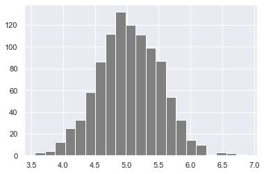
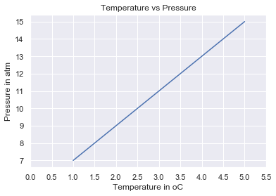
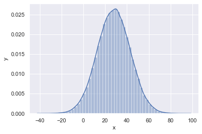

<div align="center">
  <h1> 30 Jours de Python : Jour 24 - Statistiques</h1>
  <a class="header-badge" target="_blank" href="https://www.linkedin.com/in/asabeneh/">
  
  </a>
  <a class="header-badge" target="_blank" href="https://twitter.com/Asabeneh">
  
  </a>

<sub>Auteur :
<a href="https://www.linkedin.com/in/asabeneh/" target="_blank">Asabeneh Yetayeh</a><br>
<small>Deuxième édition : juillet 2021</small>
</sub>
</div>

[<< Jour 23](./23_virtual_environment_fr.md) | [Jour 25 >>](./25_pandas_fr.md)


- [📘 Jour 24](#-jour-24)
  - [Python pour l'analyse statistique](#python-pour-lanalyse-statistique)
  - [Statistiques](#statistiques)
  - [Données](#données)
  - [Module Statistics](#module-statistics)
- [NumPy](#numpy)

# 📘 Jour 24

## Python pour l'analyse statistique

## Statistiques

Les statistiques sont la discipline qui étudie la _collecte_, l'_organisation_, l'_affichage_, l'_analyse_, l'_interprétation_ et la _présentation_ des données.
Les statistiques sont une branche des mathématiques qui est recommandée comme prérequis pour la science des données et l'apprentissage automatique. Les statistiques sont un domaine très vaste, mais nous nous concentrerons dans cette section uniquement sur la partie la plus pertinente.
Après avoir terminé ce défi, vous pourrez poursuivre la voie du développement web, de l'analyse de données, de l'apprentissage automatique et de la science des données. Quel que soit le chemin que vous suivrez, à un moment donné de votre carrière, vous obtiendrez des données sur lesquelles vous pourrez travailler. Avoir des connaissances statistiques vous aidera à prendre des décisions basées sur les données, _les données parlent d'elles-mêmes comme on dit_.

## Données

Qu'est-ce qu'une donnée ? Une donnée est tout ensemble de caractères qui est rassemblé et traduit dans un but précis, généralement l'analyse. Il peut s'agir de n'importe quel caractère, y compris du texte et des nombres, des images, des sons ou des vidéos. Si les données ne sont pas mises en contexte, elles n'ont aucun sens pour un humain ou un ordinateur. Pour donner un sens aux données, nous devons travailler sur les données en utilisant différents outils.

Le flux de travail de l'analyse de données, de la science des données ou de l'apprentissage automatique commence par les données. Les données peuvent être fournies par une source de données ou être créées. Il existe des données structurées et non structurées.

Les données peuvent être trouvées dans un petit ou un grand format. La plupart des types de données que nous obtiendrons ont été couverts dans la section sur la gestion des fichiers.

## Module Statistics

Le module Python _statistics_ fournit des fonctions pour calculer des statistiques mathématiques sur des données numériques. Le module n'est pas destiné à être un concurrent des bibliothèques tierces comme NumPy, SciPy, ou des progiciels statistiques complets propriétaires destinés aux statisticiens professionnels comme Minitab, SAS et Matlab. Il vise le niveau des calculatrices graphiques et scientifiques.

# NumPy

Dans la première section, nous avons défini Python comme un excellent langage de programmation généraliste en soi, mais avec l'aide d'autres bibliothèques populaires (numpy, scipy, matplotlib, pandas, etc.), il devient un environnement puissant pour le calcul scientifique.

NumPy est la bibliothèque de base pour le calcul scientifique en Python. Elle fournit un objet tableau multidimensionnel haute performance et des outils pour travailler avec des tableaux.

Jusqu'à présent, nous avons utilisé vscode, mais à partir de maintenant, je recommande d'utiliser Jupyter Notebook. Pour accéder à Jupyter Notebook, installons [anaconda](https://www.anaconda.com/). Si vous utilisez anaconda, la plupart des paquets courants sont inclus et vous n'avez pas besoin d'installer de paquets si vous avez installé anaconda.

```sh
asabeneh@Asabeneh:~/Desktop/30DaysOfPython$ pip install numpy
```

## Importer NumPy

Jupyter notebook est disponible si vous préférez [jupyter notebook](https://github.com/Asabeneh/data-science-for-everyone/blob/master/numpy/numpy.ipynb)

```py
    # Comment importer numpy
    import numpy as np
    # Comment vérifier la version du paquet numpy
    print('numpy:', np.__version__)
    # Vérification des méthodes disponibles
    print(dir(np))
```

## Créer un tableau numpy

### Créer des tableaux numpy d'entiers

```py
    # Création d'une liste Python
    python_list = [1,2,3,4,5]

    # Vérification des types de données
    print('Type:', type (python_list)) # <class 'list'>
    #
    print(python_list) # [1, 2, 3, 4, 5]

    two_dimensional_list = [[0,1,2], [3,4,5], [6,7,8]]

    print(two_dimensional_list)  # [[0, 1, 2], [3, 4, 5], [6, 7, 8]]

    # Création d'un tableau Numpy (Numerical Python) à partir d'une liste Python

    numpy_array_from_list = np.array(python_list)
    print(type (numpy_array_from_list))   # <class 'numpy.ndarray'>
    print(numpy_array_from_list) # array([1, 2, 3, 4, 5])
```

### Créer des tableaux numpy flottants

Création d'un tableau numpy flottant à partir d'une liste avec un paramètre de type de données flottant

```py
    # Liste Python
    python_list = [1,2,3,4,5]

    numy_array_from_list2 = np.array(python_list, dtype=float)
    print(numy_array_from_list2) # array([1., 2., 3., 4., 5.])
```

### Créer des tableaux numpy booléens

Création d'un tableau numpy booléen à partir d'une liste

```py
    numpy_bool_array = np.array([0, 1, -1, 0, 0], dtype=bool)
    print(numpy_bool_array) # array([False,  True,  True, False, False])
```

### Créer un tableau multidimensionnel avec numpy

Un tableau numpy peut avoir une ou plusieurs lignes et colonnes

```py
    two_dimensional_list = [[0,1,2], [3,4,5], [6,7,8]]
    numpy_two_dimensional_list = np.array(two_dimensional_list)
    print(type (numpy_two_dimensional_list))
    print(numpy_two_dimensional_list)
```

```sh
    <class 'numpy.ndarray'>
    [[0 1 2]
     [3 4 5]
     [6 7 8]]
```

### Convertir un tableau numpy en liste

```python
# Nous pouvons toujours reconvertir un tableau en liste Python en utilisant tolist().
np_to_list = numpy_array_from_list.tolist()
print(type (np_to_list))
print('tableau unidimensionnel :', np_to_list)
print('tableau bidimensionnel : ', numpy_two_dimensional_list.tolist())
```

```sh
    <class 'list'>
    tableau unidimensionnel : [1, 2, 3, 4, 5]
    tableau bidimensionnel :  [[0, 1, 2], [3, 4, 5], [6, 7, 8]]
```

### Créer un tableau numpy à partir d'un tuple

```py
# Tableau numpy à partir d'un tuple
# Création d'un tuple en Python
python_tuple = (1,2,3,4,5)
print(type (python_tuple)) # <class 'tuple'>
print('python_tuple: ', python_tuple) # python_tuple:  (1, 2, 3, 4, 5)

numpy_array_from_tuple = np.array(python_tuple)
print(type (numpy_array_from_tuple)) # <class 'numpy.ndarray'>
print('numpy_array_from_tuple: ', numpy_array_from_tuple) # numpy_array_from_tuple:  [1 2 3 4 5]
```

### Forme d'un tableau numpy

La méthode shape fournit la forme du tableau sous forme de tuple. Le premier élément est la ligne et le second la colonne. Si le tableau est unidimensionnel, il retourne la taille du tableau.

```py
    nums = np.array([1, 2, 3, 4, 5])
    print(nums)
    print('forme de nums : ', nums.shape)
    numpy_two_dimensional_list = np.array([[0,1,2],[3,4,5],[6,7,8]])
    print(numpy_two_dimensional_list)
    print('forme de numpy_two_dimensional_list : ', numpy_two_dimensional_list.shape)
    three_by_four_array = np.array([[0, 1, 2, 3],
        [4,5,6,7],
        [8,9,10,11]]))
    print(three_by_four_array)
    print('forme de three_by_four_array : ', three_by_four_array.shape)

```

```sh
    [1 2 3 4 5]
    forme de nums :  (5,)
    [[0 1 2]
     [3 4 5]
     [6 7 8]]
    forme de numpy_two_dimensional_list :  (3, 3)
    (3, 4)
```

### Type de données d'un tableau numpy

Types de données : str, int, float, complex, bool, list, None

```py
int_lists = [-3, -2, -1, 0, 1, 2,3]
int_array = np.array(int_lists)
float_array = np.array(int_lists, dtype=float)

print(int_array)
print(int_array.dtype)
print(float_array)
print(float_array.dtype)
```

```sh
    [-3 -2 -1  0  1  2  3]
    int64
    [-3. -2. -1.  0.  1.  2.  3.]
    float64
```

### Taille d'un tableau numpy

Dans numpy, pour connaître le nombre d'éléments dans un tableau numpy, nous utilisons size

```py
numpy_array_from_list = np.array([1, 2, 3, 4, 5])
two_dimensional_list = np.array([[0, 1, 2],
                              [3, 4, 5],
                              [6, 7, 8]])

print('La taille :', numpy_array_from_list.size) # 5
print('La taille :', two_dimensional_list.size)  # 3

```

```sh
    La taille : 5
    La taille : 9
```

## Opérations mathématiques avec numpy

Un tableau NumPy n'est pas exactement comme une liste Python. Pour effectuer des opérations mathématiques sur une liste Python, nous devons parcourir les éléments, mais numpy permet d'effectuer n'importe quelle opération mathématique sans boucle.
Opérations mathématiques :

- Addition (+)
- Soustraction (-)
- Multiplication (\*)
- Division (/)
- Modulo (%)
- Division entière (//)
- Exponentiation (\*\*)

### Addition

```py
# Opération mathématique
# Addition
numpy_array_from_list = np.array([1, 2, 3, 4, 5])
print('tableau original : ', numpy_array_from_list)
ten_plus_original = numpy_array_from_list  + 10
print(ten_plus_original)

```

```sh
    tableau original :  [1 2 3 4 5]
    [11 12 13 14 15]
```

### Soustraction

```python
# Soustraction
numpy_array_from_list = np.array([1, 2, 3, 4, 5])
print('tableau original : ', numpy_array_from_list)
ten_minus_original = numpy_array_from_list  - 10
print(ten_minus_original)
```

```sh
    tableau original :  [1 2 3 4 5]
    [-9 -8 -7 -6 -5]
```

### Multiplication

```python
# Multiplication
numpy_array_from_list = np.array([1, 2, 3, 4, 5])
print('tableau original : ', numpy_array_from_list)
ten_times_original = numpy_array_from_list * 10
print(ten_times_original)
```

```sh
    tableau original :  [1 2 3 4 5]
    [10 20 30 40 50]
```

### Division

```python
# Division
numpy_array_from_list = np.array([1, 2, 3, 4, 5])
print('tableau original : ', numpy_array_from_list)
ten_times_original = numpy_array_from_list / 10
print(ten_times_original)
```

```sh
    tableau original :  [1 2 3 4 5]
    [0.1 0.2 0.3 0.4 0.5]
```

### Modulo

```python
# Modulo ; Trouver le reste
numpy_array_from_list = np.array([1, 2, 3, 4, 5])
print('tableau original : ', numpy_array_from_list)
ten_times_original = numpy_array_from_list % 3
print(ten_times_original)
```

```sh
    tableau original :  [1 2 3 4 5]
    [1 2 0 1 2]
```

### Division entière

```py
# Division entière : le résultat de la division sans le reste
numpy_array_from_list = np.array([1, 2, 3, 4, 5])
print('tableau original : ', numpy_array_from_list)
ten_times_original = numpy_array_from_list // 10
print(ten_times_original)
```

### Exponentiation

```py
# L'exponentiation consiste à élever un nombre à la puissance d'un autre :
numpy_array_from_list = np.array([1, 2, 3, 4, 5])
print('tableau original : ', numpy_array_from_list)
ten_times_original = numpy_array_from_list  ** 2
print(ten_times_original)
```

```sh
    tableau original :  [1 2 3 4 5]
    [ 1  4  9 16 25]
```

## Vérification des types de données

```py
# Nombres entiers et flottants
numpy_int_arr = np.array([1,2,3,4])
numpy_float_arr = np.array([1.1, 2.0,3.2])
numpy_bool_arr = np.array([-3, -2, 0, 1,2,3], dtype='bool')

print(numpy_int_arr.dtype)
print(numpy_float_arr.dtype)
print(numpy_bool_arr.dtype)
```

```sh
    int64
    float64
    bool
```

### Conversion de types

Nous pouvons convertir les types de données d'un tableau numpy

1. Int en Float

```py
numpy_int_arr = np.array([1,2,3,4], dtype = 'float')
numpy_int_arr
```

    array([1., 2., 3., 4.])

2. Float en Int

```py
numpy_int_arr = np.array([1., 2., 3., 4.], dtype = 'int')
numpy_int_arr
```

```sh
    array([1, 2, 3, 4])
```

3. Int en booléen

```py
np.array([-3, -2, 0, 1,2,3], dtype='bool')

```

```sh
    array([ True,  True, False,  True,  True,  True])
```

4. Int en str

```py
numpy_float_list.astype('int').astype('str')
```

```sh
    array(['1', '2', '3'], dtype='<U21')
```

## Tableaux multidimensionnels

```py
# Tableau 2 dimensions
two_dimension_array = np.array([(1,2,3),(4,5,6), (7,8,9)])
print(type (two_dimension_array))
print(two_dimension_array)
print('Forme : ', two_dimension_array.shape)
print('Taille :', two_dimension_array.size)
print('Type de données :', two_dimension_array.dtype)
```

```sh
    <class 'numpy.ndarray'>
    [[1 2 3]
     [4 5 6]
     [7 8 9]]
    Forme :  (3, 3)
    Taille : 9
    Type de données : int64
```

### Obtenir des éléments d'un tableau numpy

```py
# Tableau 2 dimensions
two_dimension_array = np.array([[1,2,3],[4,5,6], [7,8,9]])
first_row = two_dimension_array[0]
second_row = two_dimension_array[1]
third_row = two_dimension_array[2]
print('Première ligne :', first_row)
print('Deuxième ligne :', second_row)
print('Troisième ligne : ', third_row)
```

```sh
    Première ligne : [1 2 3]
    Deuxième ligne : [4 5 6]
    Troisième ligne :  [7 8 9]
```

```py
first_column= two_dimension_array[:,0]
second_column = two_dimension_array[:,1]
third_column = two_dimension_array[:,2]
print('Première colonne :', first_column)
print('Deuxième colonne :', second_column)
print('Troisième colonne : ', third_column)
print(two_dimension_array)

```

```sh
    Première colonne : [1 4 7]
    Deuxième colonne : [2 5 8]
    Troisième colonne :  [3 6 9]
    [[1 2 3]
     [4 5 6]
     7 8 9]]
```

## Decouper un tableau numpy

Le découpage (slicing) dans numpy est similaire au découpage dans une liste Python

```py
two_dimension_array = np.array([[1,2,3],[4,5,6], [7,8,9]])
first_two_rows_and_columns = two_dimension_array[0:2, 0:2]
print(first_two_rows_and_columns)
```

```sh
    [[1 2]
     [4 5]]
```

### Comment inverser les lignes et le tableau entier ?

```py
two_dimension_array[::]
```

```sh
    array([[1, 2, 3],
           [4, 5, 6],
           [7, 8, 9]])
```

### Inverser les positions des lignes et des colonnes

```py
    two_dimension_array = np.array([[1,2,3],[4,5,6], [7,8,9]])
    two_dimension_array[::-1,::-1]
```

```sh
    array([[9, 8, 7],
           [6, 5, 4],
           [3, 2, 1]])
```

## Comment représenter les valeurs manquantes ?

```python
    print(two_dimension_array)
    two_dimension_array[1,1] = 55
    two_dimension_array[1,2] =44
    print(two_dimension_array)
```

```sh
    [[1 2 3]
     [4 5 6]
     [7 8 9]]
    [[ 1  2  3]
     [ 4 55 44]
     [ 7  8  9]]
```

```py
    # Numpy Zéros
    # numpy.zeros(shape, dtype=float, order='C')
    numpy_zeroes = np.zeros((3,3),dtype=int,order='C')
    numpy_zeroes
```

```sh
    array([[0, 0, 0],
           [0, 0, 0],
           [0, 0, 0]])
```

```py
# Numpy Zéros
numpy_ones = np.ones((3,3),dtype=int,order='C')
print(numpy_ones)
```

```sh
    [[1 1 1]
     [1 1 1]
     [1 1 1]]
```

```py
twoes = numpy_ones * 2
```

```py
# Remodeler (Reshape)
# numpy.reshape(), numpy.flatten()
first_shape  = np.array([(1,2,3), (4,5,6)])
print(first_shape)
reshaped = first_shape.reshape(3,2)
print(reshaped)

```

```sh
    [[1 2 3]
     [4 5 6]]
    [[1 2]
     [3 4]
     [5 6]]
```

```py
flattened = reshaped.flatten()
flattened
```

```sh
    array([1, 2, 3, 4, 5, 6])
```

```py
    ## Empilement horizontal
    np_list_one = np.array([1,2,3])
    np_list_two = np.array([4,5,6])

    print(np_list_one + np_list_two)

    print('Ajout horizontal :', np.hstack((np_list_one, np_list_two)))
```

```sh
    [5 7 9]
    Ajout horizontal : [1 2 3 4 5 6]
```

```py
    ## Empilement vertical
    print('Ajout vertical :', np.vstack((np_list_one, np_list_two)))
```

```sh
    Ajout vertical : [[1 2 3]
     [4 5 6]]
```

#### Générer des nombres aléatoires

```py
    # Générer un nombre flottant aléatoire
    random_float = np.random.random()
    random_float
```

```sh
    0.018929887384753874
```

```py
    # Générer des nombres flottants aléatoires
    random_floats = np.random.random(5)
    random_floats
```

```sh
    array([0.26392192, 0.35842215, 0.87908478, 0.41902195, 0.78926418])
```

```py
    # Générer un entier aléatoire entre 0 et 10

    random_int = np.random.randint(0, 11)
    random_int
```

```sh
    4
```

```py
    # Générer des entiers aléatoires entre 2 et 11, et créer un tableau d'une ligne
    random_int = np.random.randint(2,10, size=4)
    random_int
```

```sh
    array([8, 8, 8, 2])
```

```py
    # Générer des entiers aléatoires entre 0 et 10
    random_int = np.random.randint(2,10, size=(3,3))
    random_int
```

```sh
    array([[3, 5, 3],
           [7, 3, 6],
           [2, 3, 3]])
```

### Générer des nombres aléatoires

```py
    # np.random.normal(mu, sigma, size)
    normal_array = np.random.normal(79, 15, 80)
    normal_array

```

```sh
    array([ 89.49990595,  82.06056961, 107.21445842,  38.69307086,
             47.85259157,  93.07381061,  76.40724259,  78.55675184,
             72.17358173,  47.9888899 ,  65.10370622,  76.29696568,
             95.58234254,  68.14897213,  38.75862686, 122.5587927 ,
             67.0762565 ,  95.73990864,  81.97454563,  92.54264805,
             59.37035153,  77.76828101,  52.30752166,  64.43109931,
             62.63695351,  90.04616138,  75.70009094,  49.87586877,
             80.22002414,  68.56708848,  76.27791052,  67.24343975,
             81.86363935,  78.22703433, 102.85737041,  65.15700341,
             84.87033426,  76.7569997 ,  64.61321853,  67.37244562,
             74.4068773 ,  58.65119655,  71.66488727,  53.42458179,
             70.26872028,  60.96588544,  83.56129414,  72.14255326,
             81.00787609,  71.81264853,  72.64168853,  86.56608717,
             94.94667321,  82.32676973,  70.5165446 ,  85.43061003,
             72.45526212,  87.34681775,  87.69911217, 103.02831489,
             75.28598596,  67.17806893,  92.41274447, 101.06662611,
             87.70013935,  70.73980645,  46.40368207,  50.17947092,
             61.75618542,  90.26191397,  78.63968639,  70.84550744,
             88.91826581, 103.91474733,  66.3064638 ,  79.49726264,
             70.81087439,  83.90130623,  87.58555972,  59.95462521])
```

## Numpy et les statistiques

```py
import matplotlib.pyplot as plt
import seaborn as sns
sns.set()
plt.hist(normal_array, color="grey", bins=50)
```

```sh
    (array([2., 0., 0., 0., 1., 2., 2., 0., 2., 0., 0., 1., 2., 2., 1., 4., 3.,
             4., 2., 7., 2., 2., 5., 4., 2., 4., 3., 2., 1., 5., 3., 0., 3., 2.,
             1., 0., 0., 1., 3., 0., 1., 0., 0., 0., 0., 0., 0., 0., 0., 1.]),
     array([ 38.69307086,  40.37038529,  42.04769973,  43.72501417,
              45.4023286 ,  47.07964304,  48.75695748,  50.43427191,
              52.11158635,  53.78890079,  55.46621523,  57.14352966,
              58.8208441 ,  60.49815854,  62.17547297,  63.85278741,
              65.53010185,  67.20741628,  68.88473072,  70.56204516,
              72.23935959,  73.91667403,  75.59398847,  77.27130291,
              78.94861734,  80.62593178,  82.30324622,  83.98056065,
              85.65787509,  87.33518953,  89.01250396,  90.6898184 ,
              92.36713284,  94.04444727,  95.72176171,  97.39907615,
              99.07639058, 100.75370502, 102.43101946, 104.1083339 ,
             105.78564833, 107.46296277, 109.14027721, 110.81759164,
             112.49490608, 114.17222052, 115.84953495, 117.52684939,
             119.20416383, 120.88147826, 122.5587927 ]),
     <a list of 50 Patch objects>)
```

### Matrice avec numpy

```py

four_by_four_matrix = np.matrix(np.ones((4,4), dtype=float))
```

```py
four_by_four_matrix
```

```sh
matrix([[1., 1., 1., 1.],
            [1., 1., 1., 1.],
            [1., 1., 1., 1.],
            [1., 1., 1., 1.]])
```

```py
np.asarray(four_by_four_matrix)[2] = 2
four_by_four_matrix
```

```sh

matrix([[1., 1., 1., 1.],
            [1., 1., 1., 1.],
            [2., 2., 2., 2.],
            [1., 1., 1., 1.]])
```

### Numpy numpy.arange()

#### Qu'est-ce que Arrange ?

Parfois, vous voulez créer des valeurs régulièrement espacées dans un intervalle défini. Par exemple, vous voulez créer des valeurs de 1 à 10 ; vous pouvez utiliser la fonction numpy.arange()

```py
# créer une liste en utilisant range(début, fin, pas)
lst = range(0, 11, 2)
lst
```

```python
range(0, 11, 2)
```

```python
for l in lst:
    print(l)
```

```sh 0
    2
    4
    6
    8
    10
```

```py
# Similaire à range, arange numpy.arange(start, stop, step)
whole_numbers = np.arange(0, 20, 1)
whole_numbers
```

```sh
array([ 0,  1,  2,  3,  4,  5,  6,  7,  8,  9, 10, 11, 12, 13, 14, 15, 16,
           17, 18, 19])
```

```py
natural_numbers = np.arange(1, 20, 1)
natural_numbers
```

```py
odd_numbers = np.arange(1, 20, 2)
odd_numbers
```

```sh
    array([ 1,  3,  5,  7,  9, 11, 13, 15, 17, 19])
```

```py
even_numbers = np.arange(2, 20, 2)
even_numbers
```

```sh
    array([ 2,  4,  6,  8, 10, 12, 14, 16, 18])
```

### Créer une séquence de nombres avec linspace

```py
# numpy.linspace()
# numpy.logspace() in Python with Example
# Par exemple, peut être utilisé pour créer 10 valeurs de 1 à 5 régulièrement espacées.
np.linspace(1.0, 5.0, num=10)
```

```sh
    array([1.        , 1.44444444, 1.88888889, 2.33333333, 2.77777778,
           3.22222222, 3.66666667, 4.11111111, 4.55555556, 5.        ])
```

```py
# pour ne pas inclure la dernière valeur de l'intervalle
np.linspace(1.0, 5.0, num=5, endpoint=False)
```

```
array([1. , 1.8, 2.6, 3.4, 4.2])
```

```py
# LogSpace
# LogSpace retourne des nombres régulièrement espacés sur une échelle logarithmique. Logspace a les mêmes paramètres que np.linspace.

# Syntaxe :

# numpy.logspace(start, stop, num, endpoint)

np.logspace(2, 4.0, num=4)
```

```sh

array([  100.        ,   464.15888336,  2154.43469003, 10000.        ])
```

```py
# pour vérifier la taille d'un tableau
x = np.array([1,2,3], dtype=np.complex128)
```

```py
x
```

```sh
    array([1.+0.j, 2.+0.j, 3.+0.j])
```

```py
x.itemsize
```

```sh
16
```

```py
# Indexation et découpage de tableaux NumPy en Python
np_list = np.array([(1,2,3), (4,5,6)])
np_list

```

```sh
    array([[1, 2, 3],
           [4, 5, 6]])
```

```py
print('Première ligne : ', np_list[0])
print('Deuxième ligne : ', np_list[1])

```

```sh

    Première ligne :  [1 2 3]
    Deuxième ligne :  [4 5 6]
```

```p
print('Première colonne : ', np_list[:,0])
print('Deuxième colonne : ', np_list[:,1])
print('Troisième colonne : ', np_list[:,2])

```

```sh
    Première colonne :  [1 4]
    Deuxième colonne :  [2 5]
    Troisième colonne :  [3 6]
```

### Fonctions statistiques de NumPy avec exemples

NumPy a des fonctions statistiques très utiles pour trouver le minimum, le maximum, la moyenne, la médiane, le centile, l'écart type et la variance, etc. à partir des éléments donnés dans le tableau.
Les fonctions sont expliquées ci-dessous :
Fonction statistique
Numpy est équipé de fonctions statistiques robustes comme listé ci-dessous

- Fonctions Numpy
  - Min np.min()
  - Max np.max()
  - Mean np.mean()
  - Median np.median()
  - Variance
  - Percentile
  - Écart type np.std()

```python
np_normal_dis = np.random.normal(5, 0.5, 100)
np_normal_dis
## min, max, mean, median, sd
print('min : ', two_dimension_array.min())
print('max : ', two_dimension_array.max())
print('mean : ',two_dimension_array.mean())
# print('median : ', two_dimension_array.median())
print('sd : ', two_dimension_array.std())
```

    min :  1
    max :  55
    mean :  14.777777777777779
    sd :  18.913709183069525

```python
min :  1
max :  55
mean :  14.777777777777779
sd :  18.913709183069525
```

```python
print(two_dimension_array)
print('Colonne avec le minimum : ', np.amin(two_dimension_array,axis=0))
print('Colonne avec le maximum : ', np.amax(two_dimension_array,axis=0))
print('=== Ligne ==')
print('Ligne avec le minimum : ', np.amin(two_dimension_array,axis=1))
print('Ligne avec le maximum : ', np.amax(two_dimension_array,axis=1))
```

    [[ 1  2  3]
     [ 4 55 44]
     [ 7  8  9]]
    Colonne avec le minimum :  [1 2 3]
    Colonne avec le maximum :  [ 7 55 44]
    === Ligne ==
    Ligne avec le minimum :  [1 4 7]
    Ligne avec le maximum :  [ 3 55  9]

### Comment créer des séquences répétitives ?

```python
a = [1,2,3]

# Répéter tout 'a' deux fois
print('Tile :   ', np.tile(a, 2))

# Répéter chaque élément de 'a' deux fois
print('Repeat : ', np.repeat(a, 2))

```

    Tile :    [1 2 3 1 2 3]
    Repeat :  [1 1 2 2 3 3]

### Comment générer des nombres aléatoires ?

```python
# Un nombre aléatoire entre [0,1)
one_random_num = np.random.random()
one_random_in = np.random
print(one_random_num)
```

    0.6149403282678213

```python
0.4763968133790438
```

    0.4763968133790438

```python
# Nombres aléatoires entre [0,1) de forme 2,3
r = np.random.random(size=[2,3])
print(r)
```

    [[0.13031737 0.4429537  0.1129527 ]
     [0.76811539 0.88256594 0.6754075 ]]

```python
print(np.random.choice(['a', 'e', 'i', 'o', 'u'], size=10))
```

    ['u' 'o' 'o' 'i' 'e' 'e' 'u' 'o' 'u' 'a']

```python
['i' 'u' 'e' 'o' 'a' 'i' 'e' 'u' 'o' 'i']
```

    ['iueoaieuoi']

```python
## Nombres aléatoires entre [0, 1] de forme 2, 2
rand = np.random.rand(2,2)
rand
```

    array([[0.97992598, 0.79642484],
           [0.65263629, 0.55763145]])

```python
rand2 = np.random.randn(2,2)
rand2

```

    array([[ 1.65593322, -0.52326621],
           [ 0.39071179, -2.03649407]])

```python
# Entiers aléatoires entre [0, 10) de forme 2,5
rand_int = np.random.randint(0, 10, size=[5,3])
rand_int
```

    array([[0, 7, 5],
           [4, 1, 4],
           [3, 5, 3],
           [4, 3, 8],
           [4, 6, 7]])

```py
from scipy import stats
np_normal_dis = np.random.normal(5, 0.5, 1000) # moyenne, écart type, nombre d'échantillons
np_normal_dis
## min, max, mean, median, sd
print('min : ', np.min(np_normal_dis))
print('max : ', np.max(np_normal_dis))
print('mean : ', np.mean(np_normal_dis))
print('median : ', np.median(np_normal_dis))
print('mode : ', stats.mode(np_normal_dis))
print('sd : ', np.std(np_normal_dis))
```

```sh

    min :  3.557811005458804
    max :  6.876317743643499
    mean :  5.035832048106663
    median :  5.020161980441937
    mode :  ModeResult(mode=array([3.55781101]), count=array([1]))
    sd :  0.489682424165213

```

```python
plt.hist(np_normal_dis, color="grey", bins=21)
plt.show()
```



```python
# numpy.dot() : Produit scalaire en Python avec Numpy
# Produit scalaire
# Numpy est une bibliothèque puissante pour le calcul matriciel. Par exemple, vous pouvez calculer le produit scalaire avec np.dot

# Syntaxe

# numpy.dot(x, y, out=None)
```

### Algèbre linéaire

1. Produit scalaire

```python
## Algèbre linéaire
### Produit scalaire : produit de deux tableaux
f = np.array([1,2,3])
g = np.array([4,5,3])
### 1*4+2*5 + 3*6
np.dot(f, g)  # 23
```

### Multiplication de matrices NumPy avec np.matmul()

```python
### Matmul : produit matriciel de deux tableaux
h = [[1,2],[3,4]]
i = [[5,6],[7,8]]
### 1*5+2*7 = 19
np.matmul(h, i)
```

```sh
    array([[19, 22],
           [43, 50]])

```

```py
## Déterminant d'une matrice 2*2
### 5*8-7*6np.linalg.det(i)
```

```python
np.linalg.det(i)
```

    -1.999999999999999

```python
Z = np.zeros((8,8))
Z[1::2,::2] = 1
Z[::2,1::2] = 1
```

```python
Z
```

    array([[0., 1., 0., 1., 0., 1., 0., 1.],
           [1., 0., 1., 0., 1., 0., 1., 0.],
           [0., 1., 0., 1., 0., 1., 0., 1.],
           [1., 0., 1., 0., 1., 0., 1., 0.],
           [0., 1., 0., 1., 0., 1., 0., 1.],
           [1., 0., 1., 0., 1., 0., 1., 0.],
           [0., 1., 0., 1., 0., 1., 0., 1.],
           [1., 0., 1., 0., 1., 0., 1., 0.]])

```python
new_list = [ x + 2 for x in range(0, 11)]
```

```python
new_list
```

    [2, 3, 4, 5, 6, 7, 8, 9, 10, 11, 12]

```python
[2, 3, 4, 5, 6, 7, 8, 9, 10, 11, 12]
```

    [2, 3, 4, 5, 6, 7, 8, 9, 10, 11, 12]

```python
np_arr = np.array(range(0, 11))
np_arr + 2
```

array([ 2, 3, 4, 5, 6, 7, 8, 9, 10, 11, 12])

Nous utilisons les équations linéaires pour des quantités qui ont une relation linéaire. Voir l'exemple ci-dessous :

```python
temp = np.array([1,2,3,4,5])
pressure = temp * 2 + 5
pressure
```

array([ 7, 9, 11, 13, 15])

```python
plt.plot(temp,pressure)
plt.xlabel('Température en oC')
plt.ylabel('Pression en atm')
plt.title('Température vs Pression')
plt.xticks(np.arange(0, 6, step=0.5))
plt.show()
```



Pour tracer la distribution normale gaussienne en utilisant numpy. Comme vous pouvez le voir ci-dessous, numpy peut générer des nombres aléatoires. Pour créer un échantillon aléatoire, nous avons besoin de la moyenne (mu), de sigma (écart type) et du nombre de points de données.

```python
mu = 28
sigma = 15
samples = 100000

x = np.random.normal(mu, sigma, samples)
ax = sns.distplot(x);
ax.set(xlabel="x", ylabel='y')
plt.show()
```



# Résumé

Pour résumer, les principales différences avec les listes Python sont :

1. Les tableaux supportent les opérations vectorisées, contrairement aux listes.
1. Une fois qu'un tableau est créé, vous ne pouvez pas changer sa taille. Vous devez créer un nouveau tableau ou écraser l'existant.
1. Chaque tableau a un et un seul dtype. Tous les éléments doivent être de ce dtype.
1. Un tableau numpy équivalent occupe beaucoup moins d'espace qu'une liste Python de listes.
1. Les tableaux numpy supportent l'indexation booléenne.

## 💻 Exercices : Jour 24

1. Répétez tous les exemples

🎉 FÉLICITATIONS ! 🎉

[<< Jour 23](./23_virtual_environment_fr.md) | [Jour 25 >>](./25_pandas_fr.md)
