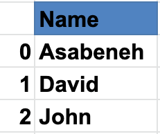
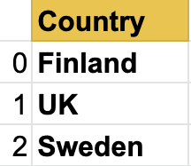
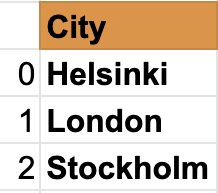
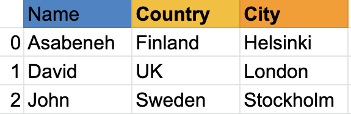
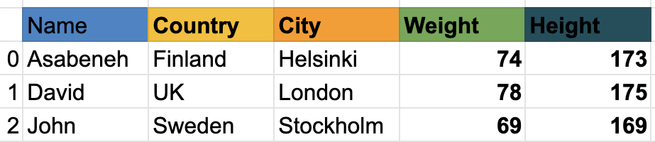

<div align="center">
  <h1> 30 Jours de Python : Jour 25 - Pandas </h1>
  <a class="header-badge" target="_blank" href="https://www.linkedin.com/in/asabeneh/">
  
  </a>
  <a class="header-badge" target="_blank" href="https://twitter.com/Asabeneh">
  
  </a>

  <sub>Auteur :
  <a href="https://www.linkedin.com/in/asabeneh/" target="_blank">Asabeneh Yetayeh</a><br>
  <small>Deuxième édition : juillet 2021</small>
  </sub>

</div>

[<< Jour 24](./24_statistics_fr.md) | [Jour 26 >>](./26_python_web_fr.md)


- [📘 Jour 25](#-jour-25)
  - [Pandas](#pandas)
    - [Installer Pandas](#installer-pandas)
    - [Importer Pandas](#importer-pandas)
    - [Créer une série Pandas avec l'index par défaut](#créer-une-série-pandas-avec-lindex-par-défaut)
    - [Créer une série Pandas avec un index personnalisé](#créer-une-série-pandas-avec-un-index-personnalisé)
    - [Créer une série Pandas à partir d'un dictionnaire](#créer-une-série-pandas-à-partir-dun-dictionnaire)
    - [Créer une série Pandas constante](#créer-une-série-pandas-constante)
    - [Créer une série Pandas avec Linspace](#créer-une-série-pandas-avec-linspace)
  - [DataFrames](#dataframes)
    - [Créer des DataFrames à partir d'une liste de listes](#créer-des-dataframes-à-partir-dune-liste-de-listes)
    - [Créer un DataFrame avec un dictionnaire](#créer-un-dataframe-avec-un-dictionnaire)
    - [Créer des DataFrames à partir d'une liste de dictionnaires](#créer-des-dataframes-à-partir-dune-liste-de-dictionnaires)
  - [Lire un fichier CSV avec Pandas](#lire-un-fichier-csv-avec-pandas)
    - [Exploration des données](#exploration-des-données)
  - [Modifier un DataFrame](#modifier-un-dataframe)
    - [Créer un DataFrame](#créer-un-dataframe)
    - [Ajouter une nouvelle colonne](#ajouter-une-nouvelle-colonne)
    - [Modifier les valeurs d'une colonne](#modifier-les-valeurs-dune-colonne)
    - [Formater les colonnes d'un DataFrame](#formater-les-colonnes-dun-dataframe)
  - [Vérifier les types de données des colonnes](#vérifier-les-types-de-données-des-colonnes)
    - [Indexation booléenne](#indexation-booléenne)
  - [Exercices : Jour 25](#exercices-jour-25)

# 📘 Jour 25

## Pandas

Pandas est une bibliothèque open source, haute performance et facile à utiliser, fournissant des structures de données et des outils d'analyse de données pour le langage de programmation Python.
Pandas ajoute des structures de données et des outils conçus pour travailler avec des données tabulaires, à savoir les *Series* et les *DataFrames*.
Pandas fournit des outils de manipulation de données :

- remaniement (reshaping)
- fusion (merging)
- tri (sorting)
- découpage (slicing)
- agrégation (aggregation)
- imputation (imputation)
Si vous utilisez anaconda, vous n'avez pas besoin d'installer pandas.

### Installer Pandas

Pour Mac :
```py
pip install conda
conda install pandas
```

Pour Windows :
```py
pip install conda
pip install pandas
```

La structure de données de Pandas est basée sur les *Series* et les *DataFrames*.

Une *series* est une *colonne* et un DataFrame est une *table multidimensionnelle* composée d'un ensemble de *series*. Pour créer une série pandas, nous devons utiliser numpy pour créer un tableau unidimensionnel ou une liste Python.
Voyons un exemple de série :

Série Pandas des noms



Série des pays



Série des villes



Comme vous pouvez le voir, une série pandas est juste une colonne de données. Si nous voulons avoir plusieurs colonnes, nous utilisons les data frames. L'exemple ci-dessous montre les DataFrames pandas.

Voyons un exemple de data frame pandas :



Un data frame est un ensemble de lignes et de colonnes. Regardez le tableau ci-dessous ; il a beaucoup plus de colonnes que l'exemple ci-dessus :



Ensuite, nous verrons comment importer pandas et comment créer des Series et des DataFrames avec pandas.

### Importer Pandas

```python
import pandas as pd # importation de pandas en tant que pd
import numpy  as np # importation de numpy en tant que np
```

### Créer une série Pandas avec l'index par défaut

```python
nums = [1, 2, 3, 4,5]
s = pd.Series(nums)
print(s)
```

```sh
    0    1
    1    2
    2    3
    3    4
    4    5
    dtype: int64
```

### Créer une série Pandas avec un index personnalisé

```python
nums = [1, 2, 3, 4, 5]
s = pd.Series(nums, index=[1, 2, 3, 4, 5])
print(s)
```

```sh
    1    1
    2    2
    3    3
    4    4
    5    5
    dtype: int64
```

```python
fruits = ['Orange','Banana','Mango']
fruits = pd.Series(fruits, index=[1, 2, 3])
print(fruits)
```

```sh
    1    Orange
    2    Banana
    3    Mango
    dtype: object
```

### Créer une série Pandas à partir d'un dictionnaire

```python
dct = {'name':'Asabeneh','country':'Finland','city':'Helsinki'}
```

```python
s = pd.Series(dct)
print(s)
```

```sh
    name       Asabeneh
    country     Finland
    city       Helsinki
    dtype: object
```

### Créer une série Pandas constante

```python
s = pd.Series(10, index = [1, 2, 3])
print(s)
```

```sh
    1    10
    2    10
    3    10
    dtype: int64
```

### Créer une série Pandas avec Linspace

```python
s = pd.Series(np.linspace(5, 20, 10)) # linspace(début, fin, éléments)
print(s)
```

```sh
    0     5.000000
    1     6.666667
    2     8.333333
    3    10.000000
    4    11.666667
    5    13.333333
    6    15.000000
    7    16.666667
    8    18.333333
    9    20.000000
    dtype: float64
```

## DataFrames

Les data frames pandas peuvent être créés de différentes manières.

### Créer des DataFrames à partir d'une liste de listes

```python
data = [
    ['Asabeneh', 'Finland', 'Helsink'],
    ['David', 'UK', 'London'],
    ['John', 'Sweden', 'Stockholm']
]
df = pd.DataFrame(data, columns=['Names','Country','City'])
print(df)
```

<table border="1" class="dataframe">
  <thead>
    <tr style="text-align: right;">
      <th></th>
      <th>Names</th>
      <th>Country</th>
      <th>City</th>
    </tr>
  </thead>
  <tbody>
    <tr>
      <td>0</td>
      <td>Asabeneh</td>
      <td>Finland</td>
      <td>Helsink</td>
    </tr>
    <tr>
      <td>1</td>
      <td>David</td>
      <td>UK</td>
      <td>London</td>
    </tr>
    <tr>
      <td>2</td>
      <td>John</td>
      <td>Sweden</td>
      <td>Stockholm</td>
    </tr>
  </tbody>
</table>

### Créer un DataFrame avec un dictionnaire

```python
data = {'Name': ['Asabeneh', 'David', 'John'], 'Country':[
    'Finland', 'UK', 'Sweden'], 'City': ['Helsiki', 'London', 'Stockholm']}
df = pd.DataFrame(data)
print(df)
```

<table border="1" class="dataframe">
  <thead>
    <tr style="text-align: right;">
      <th></th>
      <th>Name</th>
      <th>Country</th>
      <th>City</th>
    </tr>
  </thead>
  <tbody>
    <tr>
      <td>0</td>
      <td>Asabeneh</td>
      <td>Finland</td>
      <td>Helsiki</td>
    </tr>
    <tr>
      <td>1</td>
      <td>David</td>
      <td>UK</td>
      <td>London</td>
    </tr>
    <tr>
      <td>2</td>
      <td>John</td>
      <td>Sweden</td>
      <td>Stockholm</td>
    </tr>
  </tbody>
</table>

### Créer des DataFrames à partir d'une liste de dictionnaires

```python
data = [
    {'Name': 'Asabeneh', 'Country': 'Finland', 'City': 'Helsinki'},
    {'Name': 'David', 'Country': 'UK', 'City': 'London'},
    {'Name': 'John', 'Country': 'Sweden', 'City': 'Stockholm'}]
df = pd.DataFrame(data)
print(df)
```

<table border="1" class="dataframe">
  <thead>
    <tr style="text-align: right;">
      <th></th>
      <th>Name</th>
      <th>Country</th>
      <th>City</th>
    </tr>
  </thead>
  <tbody>
    <tr>
      <td>0</td>
      <td>Asabeneh</td>
      <td>Finland</td>
      <td>Helsinki</td>
    </tr>
    <tr>
      <td>1</td>
      <td>David</td>
      <td>UK</td>
      <td>London</td>
    </tr>
    <tr>
      <td>2</td>
      <td>John</td>
      <td>Sweden</td>
      <td>Stockholm</td>
    </tr>
  </tbody>
</table>

## Lire un fichier CSV avec Pandas

Pour télécharger le fichier CSV nécessaire dans cet exemple, la console ou la ligne de commande suffit :

```sh
curl -O https://raw.githubusercontent.com/Asabeneh/30-Days-Of-Python/master/data/weight-height.csv
```

Placez le fichier téléchargé dans votre répertoire de travail.

```python
import pandas as pd

df = pd.read_csv('weight-height.csv')
print(df)
```

### Exploration des données

Lisons seulement les 5 premières lignes avec head()

```python
print(df.head()) # donne cinq lignes, on peut augmenter le nombre en passant un argument à head()
```


<table border="1" class="dataframe">
  <thead>
    <tr style="text-align: right;">
      <th></th>
      <th>Gender</th>
      <th>Height</th>
      <th>Weight</th>
    </tr>
  </thead>
  <tbody>
    <tr>
      <td>0</td>
      <td>Male</td>
      <td>73.847017</td>
      <td>241.893563</td>
    </tr>
    <tr>
      <td>1</td>
      <td>Male</td>
      <td>68.781904</td>
      <td>162.310473</td>
    </tr>
    <tr>
      <td>2</td>
      <td>Male</td>
      <td>74.110105</td>
      <td>212.740856</td>
    </tr>
    <tr>
      <td>3</td>
      <td>Male</td>
      <td>71.730978</td>
      <td>220.042470</td>
    </tr>
    <tr>
      <td>4</td>
      <td>Male</td>
      <td>69.881796</td>
      <td>206.349801</td>
    </tr>
  </tbody>
</table>

Explorons également les derniers enregistrements du dataframe avec la méthode tail().

```python
print(df.tail()) # tail donne les cinq dernières lignes, on peut augmenter le nombre en passant un argument à tail()
```

<table border="1" class="dataframe">
  <thead>
    <tr style="text-align: right;">
      <th></th>
      <th>Gender</th>
      <th>Height</th>
      <th>Weight</th>
    </tr>
  </thead>
  <tbody>
    <tr>
      <td>9995</td>
      <td>Female</td>
      <td>66.172652</td>
      <td>136.777454</td>
    </tr>
    <tr>
      <td>9996</td>
      <td>Female</td>
      <td>67.067155</td>
      <td>170.867906</td>
    </tr>
    <tr>
      <td>9997</td>
      <td>Female</td>
      <td>63.867992</td>
      <td>128.475319</td>
    </tr>
    <tr>
      <td>9998</td>
      <td>Female</td>
      <td>69.034243</td>
      <td>163.852461</td>
    </tr>
    <tr>
      <td>9999</td>
      <td>Female</td>
      <td>61.944246</td>
      <td>113.649103</td>
    </tr>
  </tbody>
</table>

Comme vous pouvez le voir, le fichier csv a trois colonnes : Gender, Height et Weight. Si le DataFrame avait beaucoup de lignes, il serait difficile de connaître toutes les colonnes. Par conséquent, nous devons utiliser une méthode pour connaître les colonnes. Nous ne connaissons pas non plus le nombre de lignes. Utilisons la méthode shape.

```python
print(df.shape) # comme vous pouvez le voir, 10000 lignes et trois colonnes
```

    (10000, 3)

Obtenons toutes les colonnes en utilisant columns.

```python
print(df.columns)
```

    Index(['Gender', 'Height', 'Weight'], dtype='object')

Maintenant, obtenons une colonne spécifique en utilisant la clé de la colonne

```python
heights = df['Height'] # c'est maintenant une série
```

```python
print(heights)
```

```sh
    0       73.847017
    1       68.781904
    2       74.110105
    3       71.730978
    4       69.881796
              ...
    9995    66.172652
    9996    67.067155
    9997    63.867992
    9998    69.034243
    9999    61.944246
    Name: Height, Length: 10000, dtype: float64
```

```python
weights = df['Weight'] # c'est maintenant une série
```

```python
print(weights)
```

```sh
    0       241.893563
    1       162.310473
    2       212.740856
    3       220.042470
    4       206.349801
              ...
    9995    136.777454
    9996    170.867906
    9997    128.475319
    9998    163.852461
    9999    113.649103
    Name: Weight, Length: 10000, dtype: float64
```

```python
print(len(heights) == len(weights))
```

    True

La méthode describe() fournit des valeurs statistiques descriptives d'un ensemble de données.

```python
print(heights.describe()) # donne des informations statistiques sur les données de taille
```

```sh
    count    10000.000000
    mean        66.367560
    std          3.847528
    min         54.263133
    25%         63.505620
    50%         66.318070
    75%         69.174262
    max         78.998742
    Name: Height, dtype: float64
```

```python
print(weights.describe())
```

```sh
    count    10000.000000
    mean       161.440357
    std         32.108439
    min         64.700127
    25%        135.818051
    50%        161.212928
    75%        187.169525
    max        269.989699
    Name: Weight, dtype: float64
```

```python
print(df.describe())  # describe peut aussi donner des informations statistiques d'un DataFrame
```

<table border="1" class="dataframe">
  <thead>
    <tr style="text-align: right;">
      <th></th>
      <th>Height</th>
      <th>Weight</th>
    </tr>
  </thead>
  <tbody>
    <tr>
      <td>count</td>
      <td>10000.000000</td>
      <td>10000.000000</td>
    </tr>
    <tr>
      <td>mean</td>
      <td>66.367560</td>
      <td>161.440357</td>
    </tr>
    <tr>
      <td>std</td>
      <td>3.847528</td>
      <td>32.108439</td>
    </tr>
    <tr>
      <td>min</td>
      <td>54.263133</td>
      <td>64.700127</td>
    </tr>
    <tr>
      <td>25%</td>
      <td>63.505620</td>
      <td>135.818051</td>
    </tr>
    <tr>
      <td>50%</td>
      <td>66.318070</td>
      <td>161.212928</td>
    </tr>
    <tr>
      <td>75%</td>
      <td>69.174262</td>
      <td>187.169525</td>
    </tr>
    <tr>
      <td>max</td>
      <td>78.998742</td>
      <td>269.989699</td>
    </tr>
  </tbody>
</table>

De la même manière que describe(), la méthode info() donne aussi des informations sur l'ensemble de données.

## Modifier un DataFrame

Modifier un DataFrame :
    * Nous pouvons créer un nouveau DataFrame
    * Nous pouvons créer une nouvelle colonne et l'ajouter au DataFrame,
    * nous pouvons supprimer une colonne existante d'un DataFrame,
    * nous pouvons modifier une colonne existante dans un DataFrame,
    * nous pouvons changer le type de données des valeurs d'une colonne dans le DataFrame

### Créer un DataFrame

Comme toujours, nous importons d'abord les paquets nécessaires. Importons pandas et numpy, les deux meilleurs amis du monde.

```python
import pandas as pd
import numpy as np
data = [
    {"Name": "Asabeneh", "Country":"Finland","City":"Helsinki"},
    {"Name": "David", "Country":"UK","City":"London"},
    {"Name": "John", "Country":"Sweden","City":"Stockholm"}]
df = pd.DataFrame(data)
print(df)
```

<table border="1" class="dataframe">
  <thead>
    <tr style="text-align: right;">
      <th></th>
      <th>Name</th>
      <th>Country</th>
      <th>City</th>
    </tr>
  </thead>
  <tbody>
    <tr>
      <td>0</td>
      <td>Asabeneh</td>
      <td>Finland</td>
      <td>Helsinki</td>
    </tr>
    <tr>
      <td>1</td>
      <td>David</td>
      <td>UK</td>
      <td>London</td>
    </tr>
    <tr>
      <td>2</td>
      <td>John</td>
      <td>Sweden</td>
      <td>Stockholm</td>
    </tr>
  </tbody>
</table>

Ajouter une colonne à un DataFrame est comme ajouter une clé à un dictionnaire.

Utilisons d'abord l'exemple précédent pour créer un DataFrame. Après avoir créé le DataFrame, nous allons commencer à modifier les colonnes et leurs valeurs.

### Ajouter une nouvelle colonne

Ajoutons une colonne weight dans le DataFrame

```python
weights = [74, 78, 69]
df['Weight'] = weights
df
```

<table border="1" class="dataframe">
  <thead>
    <tr style="text-align: right;">
      <th></th>
      <th>Name</th>
      <th>Country</th>
      <th>City</th>
      <th>Weight</th>
    </tr>
  </thead>
  <tbody>
    <tr>
      <td>0</td>
      <td>Asabeneh</td>
      <td>Finland</td>
      <td>Helsinki</td>
      <td>74</td>
    </tr>
    <tr>
      <td>1</td>
      <td>David</td>
      <td>UK</td>
      <td>London</td>
      <td>78</td>
    </tr>
    <tr>
      <td>2</td>
      <td>John</td>
      <td>Sweden</td>
      <td>Stockholm</td>
      <td>69</td>
    </tr>
  </tbody>
</table>

Ajoutons aussi une colonne height dans le DataFrame

```python
heights = [173, 175, 169]
df['Height'] = heights
print(df)
```

<table border="1" class="dataframe">
  <thead>
    <tr style="text-align: right;">
      <th></th>
      <th>Name</th>
      <th>Country</th>
      <th>City</th>
      <th>Weight</th>
      <th>Height</th>
    </tr>
  </thead>
  <tbody>
    <tr>
      <td>0</td>
      <td>Asabeneh</td>
      <td>Finland</td>
      <td>Helsinki</td>
      <td>74</td>
      <td>173</td>
    </tr>
    <tr>
      <td>1</td>
      <td>David</td>
      <td>UK</td>
      <td>London</td>
      <td>78</td>
      <td>175</td>
    </tr>
    <tr>
      <td>2</td>
      <td>John</td>
      <td>Sweden</td>
      <td>Stockholm</td>
      <td>69</td>
      <td>169</td>
    </tr>
  </tbody>
</table>

Comme vous pouvez le voir dans le DataFrame ci-dessus, nous avons ajouté de nouvelles colonnes, Weight et Height. Ajoutons une colonne supplémentaire appelée BMI (Body Mass Index) en calculant leur IMC à partir de leur masse et de leur taille. L'IMC est la masse divisée par la taille au carré (en mètres) - Weight/Height * Height.

Comme vous pouvez le voir, la taille est en centimètres, nous devons donc la convertir en mètres. Modifions la ligne Height.

### Modifier les valeurs d'une colonne

```python
df['Height'] = df['Height'] * 0.01
df
```

<table border="1" class="dataframe">
  <thead>
    <tr style="text-align: right;">
      <th></th>
      <th>Name</th>
      <th>Country</th>
      <th>City</th>
      <th>Weight</th>
      <th>Height</th>
    </tr>
  </thead>
  <tbody>
    <tr>
      <td>0</td>
      <td>Asabeneh</td>
      <td>Finland</td>
      <td>Helsinki</td>
      <td>74</td>
      <td>1.73</td>
    </tr>
    <tr>
      <td>1</td>
      <td>David</td>
      <td>UK</td>
      <td>London</td>
      <td>78</td>
      <td>1.75</td>
    </tr>
    <tr>
      <td>2</td>
      <td>John</td>
      <td>Sweden</td>
      <td>Stockholm</td>
      <td>69</td>
      <td>1.69</td>
    </tr>
  </tbody>
</table>

```python
# Utiliser des fonctions rend notre code propre, mais vous pouvez calculer l'IMC sans
def calculate_bmi ():
    weights = df['Weight']
    heights = df['Height']
    bmi = []
    for w,h in zip(weights, heights):
        b = w/(h*h)
        bmi.append(b)
    return bmi

bmi = calculate_bmi()

```


```python
df['BMI'] = bmi
df
```

<table border="1" class="dataframe">
  <thead>
    <tr style="text-align: right;">
      <th></th>
      <th>Name</th>
      <th>Country</th>
      <th>City</th>
      <th>Weight</th>
      <th>Height</th>
      <th>BMI</th>
    </tr>
  </thead>
  <tbody>
    <tr>
      <td>0</td>
      <td>Asabeneh</td>
      <td>Finland</td>
      <td>Helsinki</td>
      <td>74</td>
      <td>1.73</td>
      <td>24.725183</td>
    </tr>
    <tr>
      <td>1</td>
      <td>David</td>
      <td>UK</td>
      <td>London</td>
      <td>78</td>
      <td>1.75</td>
      <td>25.469388</td>
    </tr>
    <tr>
      <td>2</td>
      <td>John</td>
      <td>Sweden</td>
      <td>Stockholm</td>
      <td>69</td>
      <td>1.69</td>
      <td>24.158818</td>
    </tr>
  </tbody>
</table>

### Formater les colonnes d'un DataFrame

Les valeurs de la colonne BMI du DataFrame sont des flottants avec beaucoup de chiffres significatifs après la virgule. Changeons-les pour un seul chiffre significatif après la virgule.

```python
df['BMI'] = round(df['BMI'], 1)
print(df)
```

<table border="1" class="dataframe">
  <thead>
    <tr style="text-align: right;">
      <th></th>
      <th>Name</th>
      <th>Country</th>
      <th>City</th>
      <th>Weight</th>
      <th>Height</th>
      <th>BMI</th>
    </tr>
  </thead>
  <tbody>
    <tr>
      <td>0</td>
      <td>Asabeneh</td>
      <td>Finland</td>
      <td>Helsinki</td>
      <td>74</td>
      <td>1.73</td>
      <td>24.7</td>
    </tr>
    <tr>
      <td>1</td>
      <td>David</td>
      <td>UK</td>
      <td>London</td>
      <td>78</td>
      <td>1.75</td>
      <td>25.5</td>
    </tr>
    <tr>
      <td>2</td>
      <td>John</td>
      <td>Sweden</td>
      <td>Stockholm</td>
      <td>69</td>
      <td>1.69</td>
      <td>24.2</td>
    </tr>
  </tbody>
</table>

Les informations dans le DataFrame semblent encore incomplètes, ajoutons les colonnes birth year et current year.

```python
birth_year = ['1769', '1985', '1990']
current_year = pd.Series(2020, index=[0, 1,2])
df['Birth Year'] = birth_year
df['Current Year'] = current_year
df
```

<table border="1" class="dataframe">
  <thead>
    <tr style="text-align: right;">
      <th></th>
      <th>Name</th>
      <th>Country</th>
      <th>City</th>
      <th>Weight</th>
      <th>Height</th>
      <th>BMI</th>
      <th>Birth Year</th>
      <th>Current Year</th>
    </tr>
  </thead>
  <tbody>
    <tr>
      <td>0</td>
      <td>Asabeneh</td>
      <td>Finland</td>
      <td>Helsinki</td>
      <td>74</td>
      <td>1.73</td>
      <td>24.7</td>
      <td>1769</td>
      <td>2020</td>
    </tr>
    <tr>
      <td>1</td>
      <td>David</td>
      <td>UK</td>
      <td>London</td>
      <td>78</td>
      <td>1.75</td>
      <td>25.5</td>
      <td>1985</td>
      <td>2020</td>
    </tr>
    <tr>
      <td>2</td>
      <td>John</td>
      <td>Sweden</td>
      <td>Stockholm</td>
      <td>69</td>
      <td>1.69</td>
      <td>24.2</td>
      <td>1990</td>
      <td>2020</td>
    </tr>
  </tbody>
</table>

## Vérifier les types de données des colonnes

```python
print(df.Weight.dtype)
```

```sh
    dtype('int64')
```

```python
df['Birth Year'].dtype # c'est un objet chaîne, nous devons le changer en nombre

```

```python
df['Birth Year'] = df['Birth Year'].astype('int')
print(df['Birth Year'].dtype) # vérifions le type maintenant
```

```sh
    dtype('int32')
```

Faisons de même pour l'année courante :

```python
df['Current Year'] = df['Current Year'].astype('int')
df['Current Year'].dtype
```

```sh
    dtype('int32')
```

Maintenant, les valeurs des colonnes birth year et current year sont des entiers. Nous pouvons calculer l'âge.

```python
ages = df['Current Year'] - df['Birth Year']
ages
```

    0    251
    1     35
    2     30
    dtype: int32

```python
df['Ages'] = ages
print(df)
```

<table border="1" class="dataframe">
  <thead>
    <tr style="text-align: right;">
      <th></th>
      <th>Name</th>
      <th>Country</th>
      <th>City</th>
      <th>Weight</th>
      <th>Height</th>
      <th>BMI</th>
      <th>Birth Year</th>
      <th>Current Year</th>
      <th>Ages</th>
    </tr>
  </thead>
  <tbody>
    <tr>
      <td>0</td>
      <td>Asabeneh</td>
      <td>Finland</td>
      <td>Helsinki</td>
      <td>74</td>
      <td>1.73</td>
      <td>24.7</td>
      <td>1769</td>
      <td>2019</td>
      <td>250</td>
    </tr>
    <tr>
      <td>1</td>
      <td>David</td>
      <td>UK</td>
      <td>London</td>
      <td>78</td>
      <td>1.75</td>
      <td>25.5</td>
      <td>1985</td>
      <td>2019</td>
      <td>34</td>
    </tr>
    <tr>
      <td>2</td>
      <td>John</td>
      <td>Sweden</td>
      <td>Stockholm</td>
      <td>69</td>
      <td>1.69</td>
      <td>24.2</td>
      <td>1990</td>
      <td>2019</td>
      <td>29</td>
    </tr>
  </tbody>
</table>

La personne de la première ligne a vécu 251 ans. Il est peu probable que quelqu'un vive aussi longtemps. Soit c'est une erreur de saisie, soit les données sont falsifiées. Remplaçons donc cette valeur par la moyenne des colonnes sans inclure la valeur aberrante.

mean = (35 + 30) / 2

```python
mean = (35 + 30) / 2
print('Moyenne : ', mean) # il est bon d'ajouter une description à la sortie, pour savoir de quoi il s'agit
```

```sh
   Moyenne :  32.5
```

### Indexation booléenne

```python
print(df[df['Ages'] > 120])
```

<table border="1" class="dataframe">
  <thead>
    <tr style="text-align: right;">
      <th></th>
      <th>Name</th>
      <th>Country</th>
      <th>City</th>
      <th>Weight</th>
      <th>Height</th>
      <th>BMI</th>
      <th>Birth Year</th>
      <th>Current Year</th>
      <th>Ages</th>
    </tr>
  </thead>
  <tbody>
    <tr>
      <td>0</td>
      <td>Asabeneh</td>
      <td>Finland</td>
      <td>Helsinki</td>
      <td>74</td>
      <td>1.73</td>
      <td>24.7</td>
      <td>1769</td>
      <td>2020</td>
      <td>251</td>
    </tr>
  </tbody>
</table>


```python
print(df[df['Ages'] < 120])
```

<table border="1" class="dataframe">
  <thead>
    <tr style="text-align: right;">
      <th></th>
      <th>Name</th>
      <th>Country</th>
      <th>City</th>
      <th>Weight</th>
      <th>Height</th>
      <th>BMI</th>
      <th>Birth Year</th>
      <th>Current Year</th>
      <th>Ages</th>
    </tr>
  </thead>
  <tbody>
    <tr>
      <td>1</td>
      <td>David</td>
      <td>UK</td>
      <td>London</td>
      <td>78</td>
      <td>1.75</td>
      <td>25.5</td>
      <td>1985</td>
      <td>2020</td>
      <td>35</td>
    </tr>
    <tr>
      <td>2</td>
      <td>John</td>
      <td>Sweden</td>
      <td>Stockholm</td>
      <td>69</td>
      <td>1.69</td>
      <td>24.2</td>
      <td>1990</td>
      <td>2020</td>
      <td>30</td>
    </tr>
  </tbody>
</table>

## Exercices : Jour 25

1. Lisez le fichier hacker_news.csv depuis le dossier data
1. Obtenez les cinq premières lignes
1. Obtenez les cinq dernières lignes
1. Obtenez la colonne title sous forme de série pandas
1. Comptez le nombre de lignes et de colonnes
    - Filtrez les titres qui contiennent python
    - Filtrez les titres qui contiennent JavaScript
    - Explorez les données et donnez-leur un sens

🎉 FÉLICITATIONS ! 🎉

[<< Jour 24](./24_statistics_fr.md) | [Jour 26 >>](./26_python_web_fr.md)
