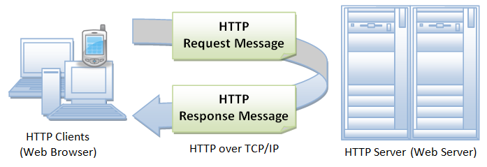
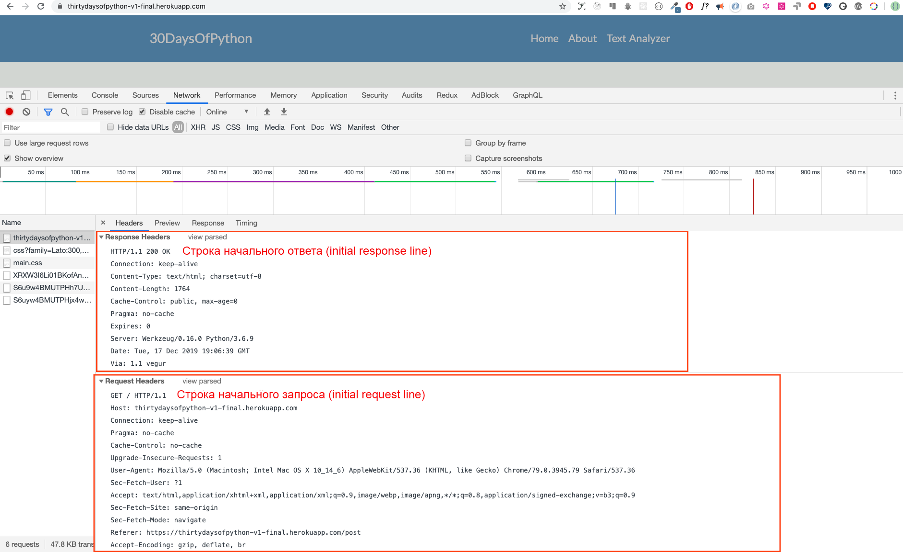

<div align="center">
  <h1> 30 Jours de Python : Jour 28 - API </h1>
  <a class="header-badge" target="_blank" href="https://www.linkedin.com/in/asabeneh/">
  
  </a>
  <a class="header-badge" target="_blank" href="https://twitter.com/Asabeneh">
  
  </a>

<sub>Auteur :
<a href="https://www.linkedin.com/in/asabeneh/" target="_blank">Asabeneh Yetayeh</a><br>
<small>Deuxième édition : juillet 2021</small>
</sub>

</div>

[<< Jour 27](./27_python_with_mongodb_fr.md) | [Jour 29 >>](./29_building_API_fr.md)


- [📘 Jour 28](#-jour-28)
- [Interface de Programmation d'Application (API)](#interface-de-programmation-dapplication-api)
  - [API](#api)
  - [Construire une API](#construire-une-api)
  - [HTTP (Hypertext Transfer Protocol)](#http-hypertext-transfer-protocol)
  - [Structure de HTTP](#structure-de-http)
  - [Ligne de requête initiale (ligne de statut)](#ligne-de-requête-initiale-ligne-de-statut)
    - [Ligne de réponse initiale (ligne de statut)](#ligne-de-réponse-initiale-ligne-de-statut)
    - [Champs d'en-tête](#champs-dentête)
    - [Le corps du message](#le-corps-du-message)
    - [Méthodes de requête](#méthodes-de-requête)
  - [💻 Exercices : Jour 28](#-exercices-jour-28)

# 📘 Jour 28

# Interface de Programmation d'Application (API)

## API

API signifie Application Programming Interface (Interface de Programmation d'Application). Le type d'API que nous couvrirons dans cette section sera les API Web.
Les API Web sont les interfaces définies à travers lesquelles les interactions se produisent entre une entreprise et les applications qui utilisent ses ressources, ce qui est également un accord de niveau de service (SLA) pour spécifier le fournisseur fonctionnel et exposer le chemin du service ou l'URL pour ses utilisateurs d'API.

Dans le contexte du développement web, une API est définie comme un ensemble de spécifications, telles que les messages de requête HTTP (Hypertext Transfer Protocol), ainsi qu'une définition de la structure des messages de réponse, généralement au format XML ou JSON (JavaScript Object Notation).

Les API Web ont évolué des services web basés sur SOAP (Simple Object Access Protocol) et de l'architecture orientée services (SOA) vers des ressources web de style REST (Representational State Transfer) plus direct.

Les services de médias sociaux, les API Web ont permis aux communautés web de partager du contenu et des données entre communautés et différentes plateformes.

En utilisant l'API, le contenu créé à un endroit peut être dynamiquement publié et mis à jour à plusieurs endroits sur le web.

Par exemple, l'API REST de Twitter permet aux développeurs d'accéder aux données principales de Twitter, et l'API Search fournit des méthodes permettant aux développeurs d'interagir avec les données de recherche et les tendances de Twitter.

De nombreuses applications fournissent des points d'accès API. Quelques exemples d'API comme l'API des [pays](https://restcountries.eu/rest/v2/all), l'API des [races de chats](https://api.thecatapi.com/v1/breeds).

Dans cette section, nous couvrirons une API RESTful qui utilise les méthodes de requête HTTP pour GET, PUT, POST et DELETE les données.

## Construire une API

Une API RESTful est une interface de programmation d'application qui utilise des requêtes HTTP pour GET, PUT, POST et DELETE les données. Dans les sections précédentes, nous avons appris Python, Flask et MongoDB. Nous utiliserons les connaissances acquises pour développer une API RESTful avec Python Flask et la base de données MongoDB. Chaque application qui a une opération CRUD (Create, Read, Update, Delete) a une API pour créer des données, obtenir des données, mettre à jour des données ou supprimer des données d'une base de données.

Pour construire une API, il est bon de comprendre le protocole HTTP et le cycle de requête et réponse HTTP.

## HTTP (Hypertext Transfer Protocol)

HTTP est un protocole de communication établi entre un client et un serveur. Un client dans ce cas est un navigateur et le serveur est l'endroit où vous accédez aux données. HTTP est un protocole réseau utilisé pour délivrer des ressources qui pourraient être des fichiers sur le World Wide Web, qu'il s'agisse de fichiers HTML, de fichiers image, de résultats de requêtes, de scripts ou d'autres types de fichiers.

Un navigateur est un client HTTP car il envoie des requêtes à un serveur HTTP (serveur web), qui renvoie ensuite des réponses au client.

## Structure de HTTP

HTTP utilise un modèle client-serveur. Un client HTTP ouvre une connexion et envoie un message de requête à un serveur HTTP, et le serveur HTTP renvoie un message de réponse contenant les ressources demandées. Lorsque le cycle requête-réponse se termine, le serveur ferme la connexion.



Le format des messages de requête et de réponse est similaire. Les deux types de messages ont :

- une ligne initiale,
- zéro ou plusieurs lignes d'en-tête,
- une ligne vide (un CRLF seul), et
- un corps de message optionnel (par exemple, un fichier, des données de requête, ou le résultat d'une requête).

Prenons un exemple de messages de requête et de réponse en naviguant sur ce site : https://thirtydaysofpython-v1-final.herokuapp.com/. Ce site a été déployé sur le dyno gratuit Heroku et dans quelques mois, il pourrait ne plus fonctionner à cause de nombreuses requêtes. Soutenez ce travail pour que le serveur fonctionne en permanence.



## Ligne de requête initiale (ligne de statut)

La ligne de requête initiale est différente de la réponse.
Une ligne de requête a trois parties, séparées par des espaces :

- le nom de la méthode (GET, POST, HEAD)
- le chemin de la ressource demandée,
- la version de HTTP utilisée. ex : GET / HTTP/1.1

GET est la méthode HTTP la plus courante qui aide à obtenir ou lire une ressource, et POST est une méthode de requête courante pour créer une ressource.

### Ligne de réponse initiale (ligne de statut)

La ligne de réponse initiale, appelée ligne de statut, a également trois parties séparées par des espaces :

- La version HTTP
- Le code de statut de la réponse qui donne le résultat de la requête, et une raison qui décrit le code de statut. Exemples de lignes de statut :
  HTTP/1.0 200 OK
  ou
  HTTP/1.0 404 Not Found
  Notes :

Les codes de statut les plus courants sont :
200 OK : La requête a réussi, et la ressource résultante (par exemple, un fichier ou le résultat d'un script) est retournée dans le corps du message.
500 Erreur serveur
Une liste complète des codes de statut HTTP peut être trouvée [ici](https://httpstatuses.com/). Elle peut aussi être trouvée [ici](https://httpstatusdogs.com/).

### Champs d'en-tête

Comme vous l'avez vu dans la capture d'écran ci-dessus, les lignes d'en-tête fournissent des informations sur la requête ou la réponse, ou sur l'objet envoyé dans le corps du message.

```sh
GET / HTTP/1.1
Host: thirtydaysofpython-v1-final.herokuapp.com
Connection: keep-alive
Pragma: no-cache
Cache-Control: no-cache
Upgrade-Insecure-Requests: 1
User-Agent: Mozilla/5.0 (Macintosh; Intel Mac OS X 10_14_6) AppleWebKit/537.36 (KHTML, like Gecko) Chrome/79.0.3945.79 Safari/537.36
Sec-Fetch-User: ?1
Accept: text/html,application/xhtml+xml,application/xml;q=0.9,image/webp,image/apng,*/*;q=0.8,application/signed-exchange;v=b3;q=0.9
Sec-Fetch-Site: same-origin
Sec-Fetch-Mode: navigate
Referer: https://thirtydaysofpython-v1-final.herokuapp.com/post
Accept-Encoding: gzip, deflate, br
Accept-Language: en-GB,en;q=0.9,fi-FI;q=0.8,fi;q=0.7,en-CA;q=0.6,en-US;q=0.5,fr;q=0.4
```

### Le corps du message

Un message HTTP peut avoir un corps de données envoyé après les lignes d'en-tête. Dans une réponse, c'est là que la ressource demandée est retournée au client (l'utilisation la plus courante du corps du message), ou peut-être un texte explicatif s'il y a une erreur. Dans une requête, c'est là que les données saisies par l'utilisateur ou les fichiers téléchargés sont envoyés au serveur.

Si un message HTTP inclut un corps, il y a généralement des lignes d'en-tête dans le message qui décrivent le corps. En particulier :

L'en-tête Content-Type: donne le type MIME des données dans le corps (text/html, application/json, text/plain, text/css, image/gif).
L'en-tête Content-Length: donne le nombre d'octets dans le corps.

### Méthodes de requête

Les méthodes de requête GET, POST, PUT et DELETE sont les méthodes de requête HTTP que nous allons implémenter pour une API ou une application CRUD.

1. GET : La méthode GET est utilisée pour récupérer et obtenir des informations depuis un serveur donné en utilisant une URI donnée. Les requêtes utilisant GET ne doivent que récupérer des données et ne doivent avoir aucun autre effet sur les données.

2. POST : La requête POST est utilisée pour créer des données et envoyer des données au serveur, par exemple, créer un nouveau post, télécharger un fichier, etc. en utilisant des formulaires HTML.

3. PUT : Remplace toutes les représentations actuelles de la ressource cible par le contenu téléchargé et nous l'utilisons pour modifier ou mettre à jour des données.

4. DELETE : Supprime des données

## 💻 Exercices : Jour 28

1. Lisez à propos de l'API et de HTTP

🎉 FÉLICITATIONS ! 🎉

[<< Jour 27](./27_python_with_mongodb_fr.md) | [Jour 29 >>](./29_building_API_fr.md)
