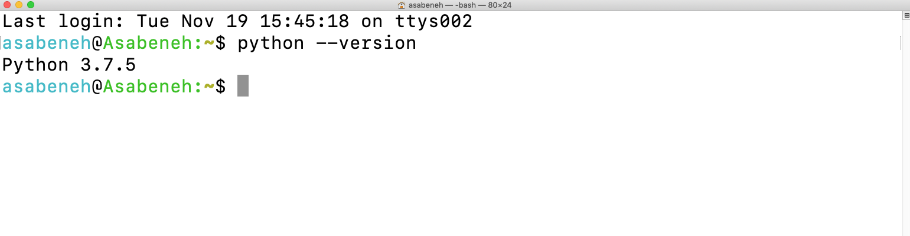
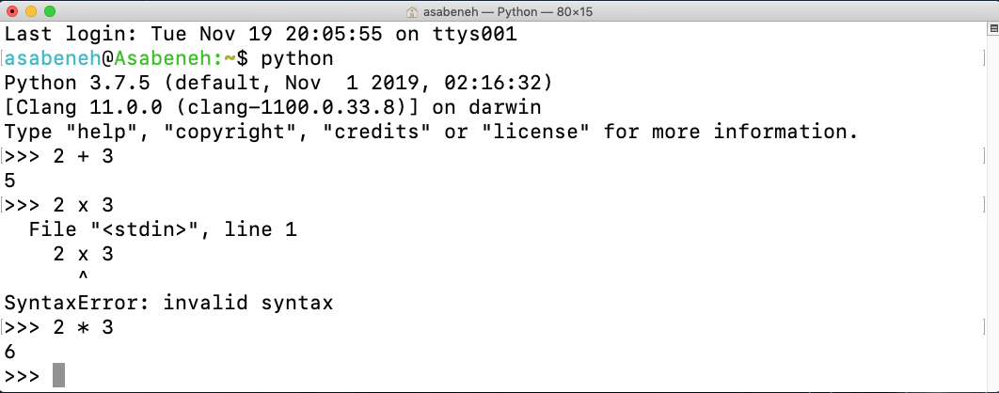
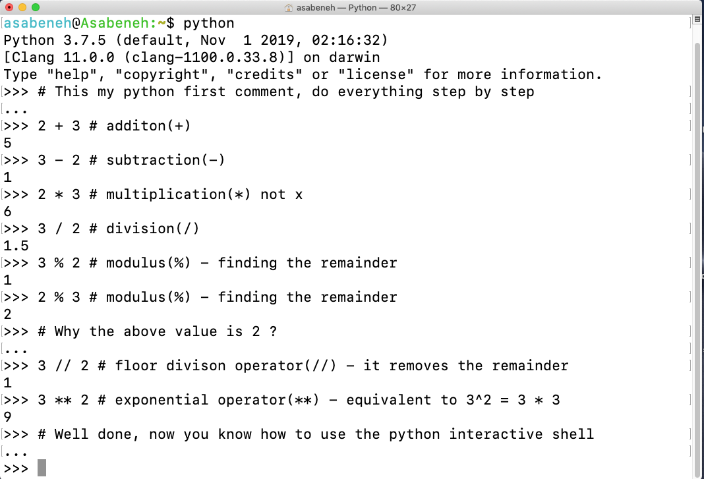
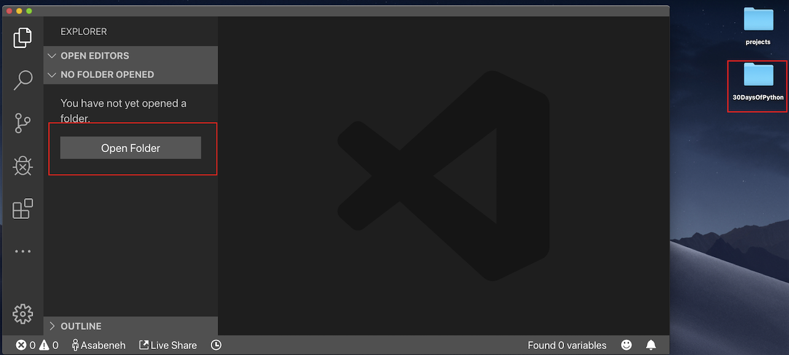
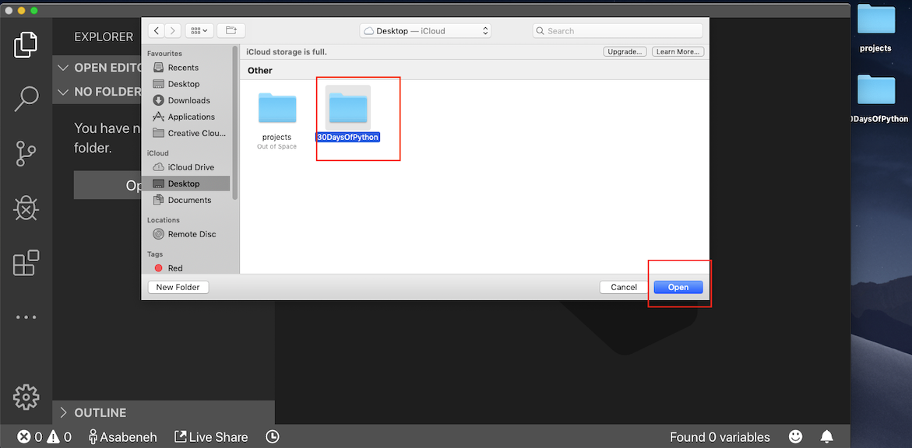
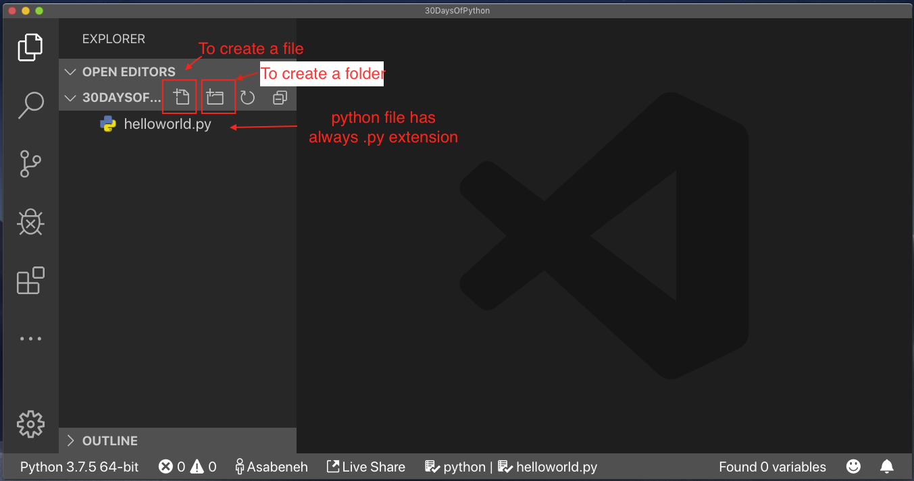
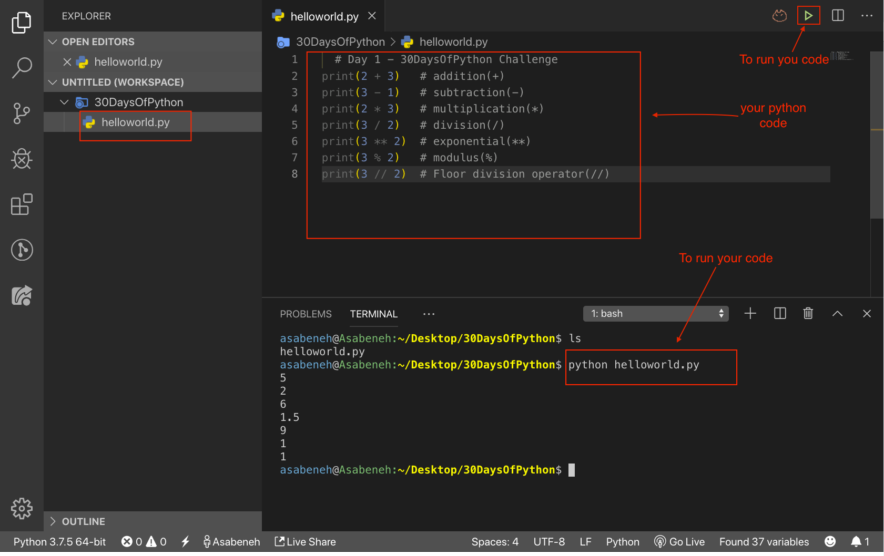

# 🐍 30 Jours de Python

| # Jour | Sujet |
| :---: | :---: |
| 01 | [Introduction](./README_fr.md) |
| 02 | [Variables et fonctions intégrées](./02_Day_Variables_builtin_functions/02_variables_builtin_functions_fr.md) |
| 03 | [Opérateurs](./03_operators_fr.md) |
| 04 | [Chaînes de caractères](./04_strings_fr.md) |
| 05 | [Listes](./05_Day_Lists/05_lists_fr.md) |
| 06 | [Tuples](./06_Day_Tuples/06_tuples_fr.md) |
| 07 | [Ensembles](./07_Day_Sets/07_sets_fr.md) |
| 08 | [Dictionnaires](./08_Day_Dictionaries/08_dictionaries_fr.md) |
| 09 | [Conditionnelles](./09_Day_Conditionals/09_conditionals_fr.md) |
| 10 | [Boucles](./10_Day_Loops/10_loops_fr.md) |
| 11 | [Fonctions](./11_Day_Functions/11_functions_fr.md) |
| 12 | [Modules](./12_Day_Modules/12_modules_fr.md) |
| 13 | [Compréhension de listes](./13_Day_List_comprehension/13_list_comprehension_fr.md) |
| 14 | [Fonctions d'ordre supérieur](./14_Day_Higher_order_functions/14_higher_order_functions_fr.md) |
| 15 | [Types d'erreurs en Python](./15_Day_Python_type_errors/15_python_type_errors_fr.md) |
| 16 | [Dates et heures en Python](./16_Day_Python_date_time/16_python_datetime_fr.md) |
| 17 | [Gestion des exceptions](./17_Day_Exception_handling/17_exception_handling_fr.md) |
| 18 | [Expressions régulières](./18_Day_Regular_expressions/18_regular_expressions_fr.md) |
| 19 | [Gestion de fichiers](./19_Day_File_handling/19_file_handling_fr.md) |
| 20 | [Gestionnaire de paquets](./20_Day_Python_package_manager/20_python_package_manager_fr.md) |
| 21 | [Classes et objets](./21_Day_Classes_and_objects/21_classes_and_objects_fr.md) |
| 22 | [Web scraping](./22_Day_Web_scraping/22_web_scraping_fr.md) |
| 23 | [Environnements virtuels](./23_Day_Virtual_environment/23_virtual_environment_fr.md) |
| 24 | [Statistiques](./24_Day_Statistics/24_statistics_fr.md) |
| 25 | [Pandas](./25_Day_Pandas/25_pandas_fr.md) |
| 26 | [Python sur le web](./26_Day_Python_web/26_python_web_fr.md) |
| 27 | [Python et MongoDB](./27_Day_Python_with_mongodb/27_python_with_mongodb_fr.md) |
| 28 | [API](./28_Day_API/28_API_fr.md) |
| 29 | [Construire une API](./29_Day_Building_API/29_building_API_fr.md) |
| 30 | [Conclusions](./30_Day_Conclusions/30_conclusions_fr.md) |

<small>🧡🧡🧡 BON CODAGE 🧡🧡🧡</small>

---

<div>
<h2>💖 Sponsors</h2>

<p>Un immense merci à nos formidables sponsors qui soutiennent mes contributions open source et la série des défis <strong>30 Days of Challenge</strong> !</p>

<h3>Sponsors Actuels</h3>
<hr />
<div align="center">
  <a href="https://ref.wisprflow.ai/MPMzRGE" target="_blank" rel="noopener noreferrer">
    <picture>
      <source media="(prefers-color-scheme: dark)" srcset="https://raw.githubusercontent.com/Asabeneh/asabeneh/master/images/Wispr_Flow-Logo-white.png" />
      
    </picture>
  </a>

  <h1>
    <a href="https://ref.wisprflow.ai/MPMzRGE" target="_blank" rel="noopener noreferrer">
      Parlez au code, restez dans le Flow.
    </a>
  </h1>

  <h2>
    <a href="https://ref.wisprflow.ai/MPMzRGE" target="_blank" rel="noopener noreferrer">
      Flow est conçu pour les développeurs qui vivent dans leurs outils. Parlez, donnez plus de contexte et obtenez de meilleurs résultats.
    </a>
  </h2>
</div>
<hr />
<div align="center">
  <a href="https://client.petrosky.io/aff.php?aff=402" target="_blank" rel="noopener noreferrer">
    <picture>
      <source media="(prefers-color-scheme: dark)" srcset="https://raw.githubusercontent.com/Asabeneh/asabeneh/master/images/petrosky-logo-white.png" />
      
    </picture>
  </a>

  <h1>
    <a href="https://client.petrosky.io/aff.php?aff=402" target="_blank" rel="noopener noreferrer">
      Un hébergement pour l'ensemble de votre parcours !
    </a>
  </h1>

  <h2>
    <a href="https://client.petrosky.io/aff.php?aff=402" target="_blank" rel="noopener noreferrer">
      Des services d'hébergement VPS abordables pour tous vos besoins.
    </a>
  </h2>
</div>

---

### 🙌 Devenir Sponsor

Vous pouvez soutenir ce projet en devenant sponsor sur **[GitHub Sponsors](https://github.com/sponsors/asabeneh)** ou via [PayPal](https://www.paypal.me/asabeneh).

Chaque contribution, petite ou grande, fait une énorme différence. Merci pour votre soutien ! 🌟

---

<div align="center">
  <h1> 30 Jours de Python : Jour 1 - Introduction</h1>
  <a class="header-badge" target="_blank" href="https://www.linkedin.com/in/asabeneh/">
  
  </a>
  <a class="header-badge" target="_blank" href="https://twitter.com/Asabeneh">
  
  </a>

<sub>Auteur :
<a href="https://www.linkedin.com/in/asabeneh/" target="_blank">Asabeneh Yetayeh</a><br>
<small>Deuxième édition : juillet 2021</small>
</sub>

</div>

🇧🇷 [Portuguese](./Portuguese/README.md) | 🇨🇳 [中文](./Chinese/README.md)

[Aller au Jour 2 >>](./02_Day_Variables_builtin_functions/02_variables_builtin_functions_fr.md)


- [🐍 30 Jours de Python](#-30-jours-de-python)
  - [🙌 Devenir Sponsor](#-devenir-sponsor)
- [📘 Jour 1](#-jour-1)
  - [Bienvenue !](#bienvenue-)
  - [Introduction](#introduction)
  - [Pourquoi choisir Python ?](#pourquoi-choisir-python-)
  - [Configuration de l'environnement](#configuration-de-lenvironnement)
    - [Installer Python](#installer-python)
    - [Le Shell Python](#le-shell-python)
    - [Installer Visual Studio Code](#installer-visual-studio-code)
      - [Comment utiliser Visual Studio Code](#comment-utiliser-visual-studio-code)
  - [Bases de Python](#bases-de-python)
    - [Syntaxe de Python](#syntaxe-de-python)
    - [Indentation en Python](#indentation-en-python)
    - [Commentaires](#commentaires)
    - [Types de données](#types-de-données)
      - [Nombres](#nombres)
      - [Chaînes de caractères](#chaînes-de-caractères)
      - [Booléens](#booléens)
      - [Listes](#listes)
      - [Dictionnaires](#dictionnaires)
      - [Tuples](#tuples)
      - [Ensembles](#ensembles)
    - [Vérifier les types de données](#vérifier-les-types-de-données)
    - [Fichiers Python](#fichiers-python)
  - [💻 Exercices - Jour 1](#-exercices---jour-1)
    - [Exercices : Niveau 1](#exercices--niveau-1)
    - [Exercices : Niveau 2](#exercices--niveau-2)
    - [Exercices : Niveau 3](#exercices--niveau-3)

# 📘 Jour 1

## Bienvenue !

**Félicitations** pour avoir décidé de participer au défi de programmation *30 Jours de Python*. Dans ce défi, vous apprendrez tout ce dont vous avez besoin pour devenir un programmeur Python et assimilerez l'ensemble des concepts fondamentaux de la programmation. À la fin du défi, vous recevrez un certificat de réussite *30DaysOfPython*.

Si vous souhaitez participer activement, rejoignez le groupe Telegram [30DaysOfPython challenge](https://t.me/ThirtyDaysOfPython).

## Introduction

Python est un langage de programmation de haut niveau, polyvalent, open source, interprété et orienté objet. Il a été créé par le programmeur néerlandais Guido van Rossum. Le nom du langage provient de l'émission comique britannique *Monty Python's Flying Circus*. La première version a été publiée le 20 février 1991. Ce défi de 30 jours vous aidera à apprendre progressivement la version la plus récente de Python, Python 3. Chaque jour couvre un sujet différent avec des explications claires, des exemples concrets et de nombreux exercices et projets pratiques.

Le défi convient aussi bien aux grands débutants qu'aux professionnels qui souhaitent acquérir des compétences en Python. Le terminer peut prendre de 30 à 100 jours ; les membres actifs du groupe Telegram ont statistiquement beaucoup plus de chances d'aller jusqu'au bout.

Ce défi a été initialement rédigé en anglais simple, puis traduit en plusieurs langues. Il est conçu pour être motivant, accessible et exigeant. Il demande un réel engagement pour être mené à bien. Si vous apprenez mieux avec des vidéos, visitez la chaîne Washera sur YouTube : <a href="https://www.youtube.com/channel/UC7PNRuno1rzYPb1xLa4yktw">Washera YouTube channel</a>. Vous pouvez commencer par la vidéo [Python for absolute beginners](https://youtu.be/OCCWZheOesI). Abonnez-vous, posez vos questions dans les commentaires et soyez proactif ; l'auteur finit toujours par remarquer les étudiants impliqués.

L'auteur apprécie grandement vos retours et le partage de son contenu. Vous pouvez laisser votre témoignage ici : [link](https://www.asabeneh.com/testimonials)

## Pourquoi choisir Python ?

Python est un langage doté d'une syntaxe très proche du langage humain, ce qui le rend simple à apprendre, à lire et à utiliser.
Il est utilisé dans de nombreuses industries et par les plus grandes entreprises de la tech (y compris Google). Il sert à développer des applications web, des logiciels de bureau, des scripts d'administration système et des bibliothèques d'intelligence artificielle. Python est d'ailleurs le langage roi au sein de la communauté de la science des données (Data Science) et du Machine Learning. Python est en train de conquérir le monde, apprenez à le maîtriser avant de vous laisser dépasser !

## Configuration de l'environnement

### Installer Python

Pour exécuter des scripts écrits en Python, vous devez installer l'interpréteur. Visitez la page de téléchargement officielle de Python : [https://www.python.org/](https://www.python.org/).

Si vous utilisez Windows, cliquez sur le bouton encerclé en rouge sur l'image du site.

[](https://www.python.org/)

Si vous utilisez macOS, cliquez sur le bouton correspondant.

[](https://www.python.org/)

Pour vérifier si Python est correctement installé, ouvrez votre terminal et exécutez la commande suivante :

```shell
python3 --version
```



Sur mon terminal, la version affichée est Python 3.7.5. Votre version peut différer, mais elle doit impérativement être 3.6 ou supérieure. Si la version s'affiche, Python est installé avec succès. Vous pouvez passer à la section suivante.

### Le Shell Python

Python étant un langage interprété, il n'a pas besoin d'être compilé en amont. Il exécute le code ligne par ligne. Python inclut par défaut un *Shell Python* (interpréteur interactif), également appelé REPL (Read Eval Print Loop). Il permet d'exécuter des commandes Python uniques et d'en voir le résultat instantanément.

Le Shell Python reste en attente de vos instructions. Lorsque vous écrivez du code, il l'interprète et affiche le résultat à la ligne suivante.
Ouvrez votre terminal ou invite de commande (cmd) et tapez :

```shell
python3
```


L'interpréteur interactif de Python s'ouvre et affiche l'invite `>>>` indiquant qu'il est prêt. Écrivez votre premier script et appuyez sur Entrée.


Génial ! Vous avez écrit votre tout premier script Python directement dans le Shell. Comment quitter cette interface ?
Pour fermer le shell interactif, tapez simplement **exit()** juste après le symbole `>>>` et appuyez sur Entrée.


Vous savez désormais comment ouvrir et fermer l'interpréteur interactif.

Si vous écrivez du code syntaxiquement incorrect, Python lèvera une erreur. Faisons une erreur intentionnelle pour voir ce qui se passe :


L'erreur indique `SyntaxError: invalid syntax`. Utiliser la lettre `x` pour effectuer une multiplication n'est pas valide en Python ; l'opérateur correct est l'astérisque (`*`). L'erreur vous signale exactement ce qui doit être corrigé.

Le processus de recherche et de correction des erreurs s'appelle le **débogage** (debugging). Corrigeons le bug en remplaçant `x` par `*` :



L'erreur est corrigée, le code s'exécute et produit le résultat attendu. En tant que développeur, vous ferez face à ce genre d'erreurs quotidiennement. Apprendre à déboguer est une compétence essentielle. Pour devenir efficace, vous devez apprendre à reconnaître les différents types d'erreurs : `SyntaxError`, `IndexError`, `NameError`, `ModuleNotFoundError`, `KeyError`, `ImportError`, `AttributeError`, `TypeError`, `ValueError`, `ZeroDivisionError`, etc. Nous les détaillerons dans les chapitres suivants.

Pratiquons encore un peu dans le Shell Python. Rouvrez votre terminal et tapez `python3`.


Faisons quelques opérations mathématiques de base : addition, soustraction, multiplication, division, modulo et puissance.

Avant de coder, posons les calculs :

- 2 + 3 = 5
- 3 - 2 = 1
- 3 \* 2 = 6
- 3 / 2 = 1.5
- 3 \*\* 2 = 3 × 3 = 9

En Python, nous avons également :

- 3 % 2 = 1 (Modulo : donne le reste de la division entière)
- 3 // 2 = 1 (Division entière : effectue la division et supprime la partie décimale)

Traduisons cela en code Python dans le Shell. Commençons par écrire un commentaire.

Un **commentaire** est une portion de texte complètement ignorée par Python lors de l'exécution. Il sert exclusivement à documenter le code et à améliorer sa lisibilité pour les humains. En Python, un commentaire commence par le symbole dièse (`#`).

```python
# Les commentaires commencent par un dièse
# Ceci est un commentaire Python car il commence par (#)
```



Avant de continuer, pratiquez un peu : fermez le Shell avec `exit()`, rouvrez-le et essayez d'afficher du texte (des chaînes de caractères) comme ceci :


### Installer Visual Studio Code

Le Shell Python est très pratique pour tester de courts fragments de code, mais il devient inutilisable pour de vrais projets. Dans un cadre professionnel, les développeurs utilisent des éditeurs de code ou des IDE. Dans ce défi, nous utiliserons Visual Studio Code. VS Code est un éditeur de texte open source, gratuit et extrêmement populaire. Je vous recommande vivement de le télécharger, mais si vous préférez un autre outil, vous êtes libre de l'utiliser.

[](https://code.visualstudio.com/)

Si vous avez installé Visual Studio Code, voyons comment l'utiliser. Vous pouvez aussi regarder ce [tutoriel vidéo](https://www.youtube.com/watch?v=bn7Cx4z-vSo) dédié à la configuration de VS Code pour Python.

#### Comment utiliser Visual Studio Code

Ouvrez Visual Studio Code en double-cliquant sur son icône. Prenez le temps de vous familiariser avec l'interface et les différentes icônes légendées ci-dessous.


Créez un dossier nommé `30DaysOfPython` sur votre bureau, puis ouvrez-le dans Visual Studio Code via le menu ou l'écran d'accueil.





Une fois le dossier ouvert, vous aurez accès aux raccourcis pour créer des fichiers et des dossiers. J'ai créé le premier fichier sous le nom de `helloworld.py`, faites de même de votre côté.



Lorsque vous avez fini de coder pour la journée, vous pouvez fermer votre projet proprement depuis l'éditeur :


Félicitations, votre environnement de développement est entièrement prêt. Place au code !

## Bases de Python

### Syntaxe de Python

Un script Python peut être écrit et testé directement dans le Shell interactif ou rédigé dans un éditeur de texte. Les fichiers contenant du code Python doivent obligatoirement porter l'extension `.py`.

### Indentation en Python

L'indentation désigne les espaces blancs insérés en début de ligne de texte. Dans la majorité des langages de programmation, l'indentation sert uniquement à rendre le code plus lisible. **En Python, l'indentation est obligatoire et sert à définir les blocs de code.** Là où d'autres langages utilisent des accolades `{ }`, Python utilise des espaces. Une mauvaise indentation provoquera immédiatement une erreur d'exécution (`IndentationError`).


### Commentaires

Les commentaires sont cruciaux pour documenter vos scripts. Python n'exécute pas le texte écrit à l'intérieur d'un commentaire.

**Exemple : Commentaire sur une seule ligne**

```shell
# Ceci est le premier commentaire
# Ceci est le deuxième commentaire
# Python est en train de conquérir le monde
```

**Exemple : Commentaire multiligne (Docstring)**

On peut utiliser des triples guillemets (`"""`) pour insérer des commentaires sur plusieurs lignes, à condition qu'ils ne soient pas assignés à une variable.

```shell
"""Ceci est un commentaire multiligne.
Il peut s'étendre sur plusieurs lignes.
Python est vraiment un langage formidable.
"""
```

### Types de données

Python gère nativement plusieurs types de données fondamentaux. Voici un rapide survol pour vous familiariser avec eux (nous les étudierons en profondeur très bientôt).

#### Nombres

- **Entiers (Int) :** Nombres positifs, négatifs ou nuls, sans virgule.
  Exemple : `... -3, -2, -1, 0, 1, 2, 3 ...`
- **Flottants (Float) :** Nombres à virgule (représentée par un point).
  Exemple : `... -3.5, -2.25, -1.0, 0.0, 1.1, 2.2, 3.5 ...`
- **Complexes (Complex) :** Nombres contenant une partie imaginaire.
  Exemple : `1 + j, 2 + 4j`

#### Chaînes de caractères (String)

Une suite de caractères entourée de guillemets simples ou doubles. Pour un texte de plusieurs phrases, on utilise les triples guillemets.

**Exemples :**

```py
'Asabeneh'
'Finlande'
'Python'
"J'adore enseigner"
"""J'espère que vous appréciez ce tout premier jour
du défi 30 Jours de Python."""
```

#### Booléens (Boolean)

Un type de donnée qui ne peut prendre que deux valeurs : `True` (Vrai) ou `False` (Faux). Attention, la première lettre doit toujours être une majuscule.

**Exemple :**

```python
True   # La lumière est-elle allumée ? Si oui, la valeur est True.
False  # La lumière est-elle allumée ? Si non, la valeur est False.
```

#### Listes (List)

Une collection ordonnée d'éléments qui permet de stocker différents types de données. C'est l'équivalent des tableaux (Arrays) en JavaScript.

**Exemples :**

```py
[0, 1, 2, 3, 4, 5]  # Une liste contenant uniquement des nombres
['Banane', 'Orange', 'Mangue', 'Avocat']  # Une liste uniquement de chaînes
['Banane', 10, False, 9.81]  # Une liste mélangeant plusieurs types de données
```

#### Dictionnaires (Dictionary)

Une collection non ordonnée de données stockées sous la forme de paires `clé: valeur`.

**Exemple :**

```py
{
'first_name': 'Asabeneh',
'last_name': 'Yetayeh',
'country': 'Finlande',
'age': 250,
'is_married': True,
'skills': ['JS', 'React', 'Node', 'Python']
}
```

#### Tuples

Une collection ordonnée d'éléments, similaire à une liste, mais qui présente une différence majeure : **un tuple est immuable**. Il est impossible de le modifier après sa création.

**Exemples :**

```py
('Asabeneh', 'Pawel', 'Brook', 'Abraham', 'Lidiya')  # Liste de noms figée
('Terre', 'Jupiter', 'Neptune', 'Mars', 'Vénus')  # Les planètes
```

#### Ensembles (Set)

Une collection non ordonnée d'éléments. Contrairement aux listes ou aux tuples, un ensemble ne peut stocker que des **éléments uniques** (les doublons sont automatiquement supprimés). L'ordre des éléments n'a aucune importance.

**Exemples :**

```py
{2, 4, 3, 5}
{3.14, 9.81, 2.7}
```

### Vérifier les types de données

Pour connaître le type d'une donnée ou d'une variable, on utilise la fonction native **`type()`**. Regardez les exemples d'utilisation directement depuis le terminal :


### Fichiers Python

Ouvrez votre dossier de projet `30DaysOfPython`. À l'intérieur, localisez ou créez le fichier `helloworld.py`. Nous allons maintenant reproduire ce que nous avons fait dans le Shell, mais au sein de notre fichier de code.

*Note importante :* Le Shell interactif affiche directement les résultats sans qu'on ait besoin de lui demander. Dans un fichier de script sur VS Code, vous devez impérativement utiliser la fonction intégrée **`print()`** pour afficher un résultat dans la console. Elle peut prendre un ou plusieurs arguments séparés par des virgules : `print('argument1', 'argument2')`.

**Exemple dans le fichier `helloworld.py` :**

```py
# Jour 1 - Défi 30DaysOfPython

print(2 + 3)             # Addition (+)
print(3 - 1)             # Soustraction (-)
print(2 * 3)             # Multiplication (*)
print(3 / 2)             # Division (/)
print(3 ** 2)            # Puissance (**)
print(3 % 2)             # Modulo (%)
print(3 // 2)            # Division entière (//)

# Vérification des types de données
print(type(10))                  # <class 'int'> (Entier)
print(type(3.14))                # <class 'float'> (Flottant)
print(type(1 + 3j))              # <class 'complex'> (Nombre complexe)
print(type('Asabeneh'))          # <class 'str'> (Chaîne de caractères)
print(type([1, 2, 3]))           # <class 'list'> (Liste)
print(type({'name': 'Asabeneh'})) # <class 'dict'> (Dictionnaire)
print(type({9.8, 3.14, 2.7}))    # <class 'set'> (Ensemble)
print(type((9.8, 3.14, 2.7)))    # <class 'tuple'> (Tuple)
```

Pour exécuter votre code : cliquez sur le bouton de lecture vert en haut à droite de VS Code, ou ouvrez votre terminal dans le bon dossier et tapez `python3 helloworld.py`.



Vous êtes incroyable ! Vous venez de terminer le Jour 1. C'est un excellent début sur la voie de la maîtrise de Python. Pratiquez dès maintenant avec ces quelques exercices.

## 💻 Exercices - Jour 1

### Exercices : Niveau 1

1. Vérifiez la version de Python que vous utilisez actuellement.
2. Ouvrez le Shell interactif de Python et effectuez les opérations suivantes en utilisant les nombres **3** et **4** comme opérandes :
   - Addition (+)
   - Soustraction (-)
   - Multiplication (\*)
   - Modulo (%)
   - Division (/)
   - Puissance (\*\*)
   - Division entière (//)
3. Écrivez les chaînes de caractères suivantes dans le Shell interactif :
   - Votre prénom
   - Votre nom de famille
   - Votre pays de résidence
   - La phrase : "J'apprécie les 30 jours de Python"
4. Vérifiez le type des données suivantes à l'aide de la fonction appropriée :
   - `10`
   - `9.8`
   - `3.14`
   - `4 - 4j`
   - `['Asabeneh', 'Python', 'Finlande']`
   - Votre prénom
   - Votre nom de famille
   - Votre pays de résidence

### Exercices : Niveau 2

1. Créez un sous-dossier nommé `day_1` à l'intérieur de votre dossier `30DaysOfPython`. Dans ce dossier `day_1`, créez un fichier nommé `helloworld.py`. Répétez l'ensemble des questions du Niveau 1 (1, 2, 3 et 4) à l'intérieur de ce fichier. N'oubliez pas d'encadrer vos instructions avec la fonction `print()` pour que les résultats s'affichent. Utilisez votre terminal pour naviguer jusqu'au dossier et exécutez votre script.

### Exercices : Niveau 3

1. Écrivez dans un script un exemple concret pour chacun des types de données Python suivants : Nombres (Entier, Flottant, Complexe), Chaîne de caractères, Booléen, Liste, Tuple, Ensemble et Dictionnaire.
2. Calculez la distance euclidienne entre les points $(2, 3)$ et $(10, 8)$. *Indice : vous pouvez vous référer à la formule mathématique de la [distance euclidienne](https://en.wikipedia.org/wiki/Euclidean_distance).*

🎉 FÉLICITATIONS ! 🎉

[Aller au Jour 2 >>](./02_Day_Variables_builtin_functions/02_variables_builtin_functions_fr.md)
