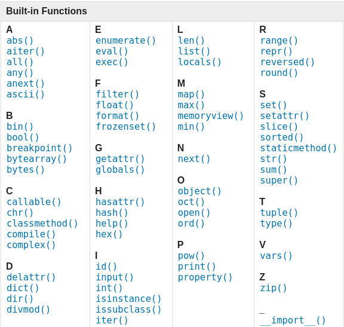
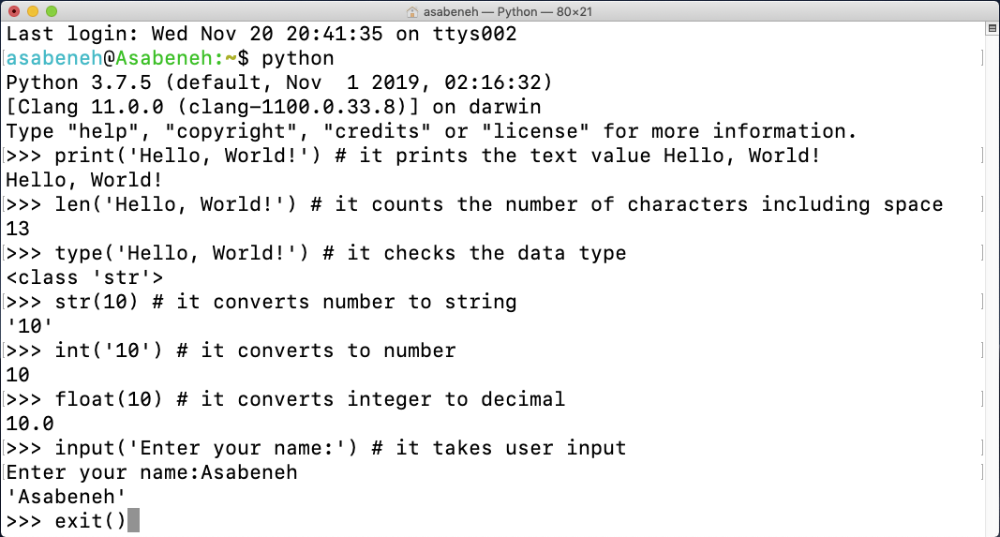
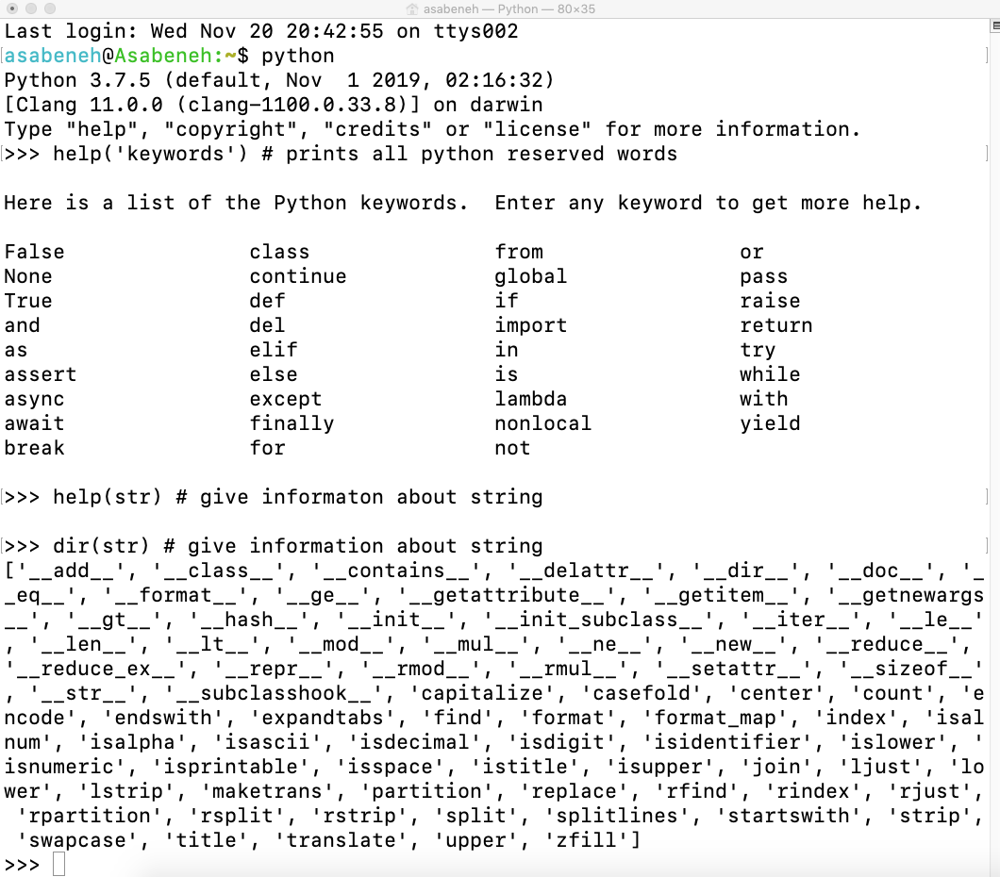
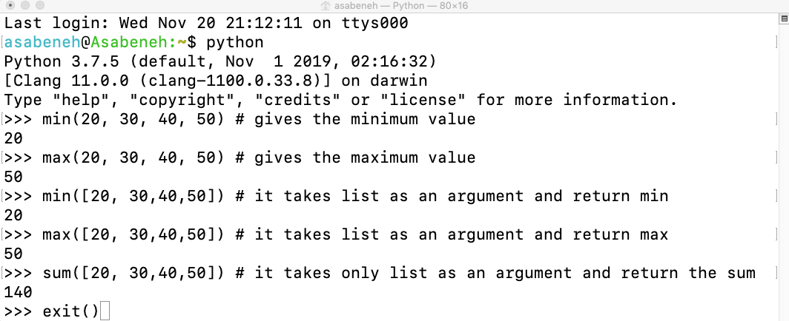

<div align="center">
  <h1> 30 Days Of Python: Ημέρα 2 - Μεταβλητές, Ενσωματωμένες συναρτήσεις</h1>
  <a class="header-badge" target="_blank" href="https://www.linkedin.com/in/asabeneh/">
  
  </a>
  <a class="header-badge" target="_blank" href="https://twitter.com/Asabeneh">
  
  </a>

<sub>Συγγραφέας:
<a href="https://www.linkedin.com/in/asabeneh/" target="_blank">Asabeneh Yetayeh</a><br>
<small> Δεύτερη έκδοση: Ιούλιος 2021</small>
</sub>

</div>

[<< Ημέρα 1](../readme.md) | [Ημέρα 3 >>](../../03_Day_Operators/03_operators.md)


- [📘 Ημέρα 2](#-ημέρα-2)
  - [Ενσωματωμένες συναρτήσεις (Built-in functions)](#ενσωματωμένες-συναρτήσεις-built-in-functions)
  - [Μεταβλητές (Variables)](#μεταβλητές-variables)
    - [Δήλωση πολλών μεταβλητών σε μία γραμμή](#δήλωση-πολλών-μεταβλητών-σε-μία-γραμμή)
  - [Τύποι δεδομένων (Data Types)](#τύποι-δεδομένων-data-types)
  - [Έλεγχος τύπων δεδομένων και Casting](#έλεγχος-τύπων-δεδομένων-και-casting)
  - [Αριθμοί (Numbers)](#αριθμοί-numbers)
  - [💻 Ασκήσεις - Ημέρα 2](#-ασκήσεις---ημέρα-2)
    - [Ασκήσεις: Επίπεδο 1](#ασκήσεις-επίπεδο-1)
    - [Ασκήσεις: Επίπεδο 2](#ασκήσεις-επίπεδο-2)

# 📘 Ημέρα 2

## Ενσωματωμένες συναρτήσεις (Built-in functions)

Στην Python υπάρχουν πολλές **ενσωματωμένες συναρτήσεις** (built-in functions). Είναι διαθέσιμες παντού, δηλαδή μπορείς να τις χρησιμοποιήσεις χωρίς να κάνεις **import** και χωρίς καμία επιπλέον ρύθμιση. Μερικές από τις πιο συνηθισμένες είναι οι εξής: _print()_, _len()_, _type()_, _int()_, _float()_, _str()_, _input()_, _list()_, _dict()_, _min()_, _max()_, _sum()_, _sorted()_, _open()_, _file()_, _help()_ και _dir()_. Στον παρακάτω πίνακα θα δεις μια πλήρη λίστα από την [τεκμηρίωση της Python](https://docs.python.org/3/library/functions.html).



Ας ανοίξουμε το **Python shell** και ας ξεκινήσουμε να χρησιμοποιούμε μερικές από τις πιο συνηθισμένες ενσωματωμένες συναρτήσεις.



Ας εξασκηθούμε λίγο ακόμη, χρησιμοποιώντας διαφορετικές ενσωματωμένες συναρτήσεις.



Όπως βλέπεις στο **terminal** παραπάνω, η Python έχει **δεσμευμένες λέξεις** (reserved words). Αυτές δεν τις χρησιμοποιούμε ως ονόματα μεταβλητών ή συναρτήσεων. Τις μεταβλητές θα τις δούμε στην επόμενη ενότητα.

Πιστεύω ότι μέχρι εδώ έχεις εξοικειωθεί με τις ενσωματωμένες συναρτήσεις. Ας κάνουμε μία τελευταία εξάσκηση και μετά προχωράμε παρακάτω.



## Μεταβλητές (Variables)

Οι **μεταβλητές** (variables) αποθηκεύουν δεδομένα στη μνήμη του υπολογιστή. Σε πολλές γλώσσες προγραμματισμού προτείνεται να χρησιμοποιείς **εύκολα απομνημονεύσιμα ονόματα**. Δηλαδή ένα όνομα που το θυμάσαι εύκολα και καταλαβαίνεις αμέσως τι κρατάει. Η μεταβλητή δείχνει σε μια θέση μνήμης όπου βρίσκονται τα δεδομένα.

Όταν δίνεις όνομα σε μια μεταβλητή, **δεν** επιτρέπεται να ξεκινά με αριθμό, ούτε να έχει ειδικούς χαρακτήρες ή παύλα (`-`). Μπορεί να έχει σύντομο όνομα (όπως **x**, **y**, **z**), αλλά είναι πολύ καλύτερο να έχει περιγραφικό όνομα (όπως **firstname**, **lastname**, **age**, **country**).

**Κανόνες ονοματοδοσίας μεταβλητών στην Python**

- Το όνομα πρέπει να ξεκινά με γράμμα ή με **κάτω παύλα** (`_`)
- Το όνομα **δεν** μπορεί να ξεκινά με αριθμό
- Επιτρέπονται μόνο γράμματα, αριθμοί και κάτω παύλες (**A-z**, **0-9** και `_`)
- Τα ονόματα ξεχωρίζουν πεζά και κεφαλαία (**case-sensitive**). Δηλαδή τα **firstname**, **Firstname**, **FirstName** και **FIRSTNAME** είναι τέσσερις διαφορετικές μεταβλητές

Παρακάτω βλέπεις μερικά **έγκυρα** ονόματα μεταβλητών:

```shell
firstname
lastname
age
country
city
first_name
last_name
capital_city
_if # if we want to use reserved word as a variable
year_2021
year2021
current_year_2021
birth_year
num1
num2
```

**Μη έγκυρα ονόματα μεταβλητών**

```shell
first-name
first@name
first$name
num-1
1num
```

Θα ακολουθήσουμε το συνηθισμένο στυλ ονομάτων της Python, αυτό που χρησιμοποιούν οι περισσότεροι προγραμματιστές. Λέγεται **snake_case**: όταν το όνομα έχει περισσότερες από μία λέξεις, τις χωρίζουμε με κάτω παύλα (π.χ. **first_name**, **last_name**, **engine_rotation_speed**). Η κάτω παύλα είναι απαραίτητη όταν το όνομα αποτελείται από πάνω από μία λέξη.

Όταν βάζουμε μια τιμή σε μια μεταβλητή, αυτό λέγεται **δήλωση μεταβλητής**. Για παράδειγμα, παρακάτω το όνομά μου μπαίνει στη μεταβλητή **first_name**. Το σύμβολο ίσον (`=`) είναι **τελεστής ανάθεσης** (assignment operator): αποθηκεύει δεδομένα μέσα στη μεταβλητή. Στην Python το ίσον **δεν** σημαίνει ισότητα, όπως στα μαθηματικά.

**Παράδειγμα:**

```py
# Variables in Python
first_name = 'Asabeneh'
last_name = 'Yetayeh'
country = 'Finland'
city = 'Helsinki'
age = 250
is_married = True
skills = ['HTML', 'CSS', 'JS', 'React', 'Python']
person_info = {
   'firstname':'Asabeneh',
   'lastname':'Yetayeh',
   'country':'Finland',
   'city':'Helsinki'
   }
```

Ας χρησιμοποιήσουμε τις ενσωματωμένες συναρτήσεις _print()_ και _len()_. Η _print()_ δέχεται όσα **ορίσματα** (arguments) θέλεις. Όρισμα είναι η τιμή που βάζουμε μέσα στις παρενθέσεις της συνάρτησης. Δες το παράδειγμα:

**Παράδειγμα:**

```py
print('Hello, World!') # The text Hello, World! is an argument
print('Hello',',', 'World','!') # it can take multiple arguments, four arguments have been passed
print(len('Hello, World!')) # it takes only one argument
```

Ας εμφανίσουμε τις τιμές των μεταβλητών που δηλώσαμε πιο πάνω και ας βρούμε και το μήκος τους:

**Παράδειγμα:**

```py
# Printing the values stored in the variables

print('First name:', first_name)
print('First name length:', len(first_name))
print('Last name: ', last_name)
print('Last name length: ', len(last_name))
print('Country: ', country)
print('City: ', city)
print('Age: ', age)
print('Married: ', is_married)
print('Skills: ', skills)
print('Person information: ', person_info)
```

### Δήλωση πολλών μεταβλητών σε μία γραμμή

Μπορούμε να δηλώσουμε και **πολλές μεταβλητές σε μία γραμμή**:

**Παράδειγμα:**

```py
first_name, last_name, country, age, is_married = 'Asabeneh', 'Yetayeh', 'Helsink', 250, True

print(first_name, last_name, country, age, is_married)
print('First name:', first_name)
print('Last name: ', last_name)
print('Country: ', country)
print('Age: ', age)
print('Married: ', is_married)
```

Για να πάρουμε δεδομένα από τον χρήστη χρησιμοποιούμε την ενσωματωμένη συνάρτηση _input()_. Ας αποθηκεύσουμε αυτά που γράφει ο χρήστης στις μεταβλητές **first_name** και **age**.

**Παράδειγμα:**

```py
first_name = input('What is your name: ')
age = input('How old are you? ')

print(first_name)
print(age)
```

## Τύποι δεδομένων (Data Types)

Στην Python υπάρχουν διάφοροι **τύποι δεδομένων** (data types). Για να δούμε τι τύπος είναι κάτι, χρησιμοποιούμε την ενσωματωμένη συνάρτηση _type()_. Είναι σημαντικό να καταλάβεις καλά τους τύπους δεδομένων. Στον προγραμματισμό σχεδόν τα πάντα έχουν να κάνουν με αυτούς. Τους είδαμε από την πρώτη μέρα και επανέρχονται συνέχεια, γιατί κάθε θέμα συνδέεται μαζί τους. Θα τους δούμε πιο αναλυτικά στις ενότητες που τους αφορούν.

## Έλεγχος τύπων δεδομένων και Casting

- **Έλεγχος τύπου δεδομένων:** Για να δούμε τον τύπο μιας τιμής ή μιας μεταβλητής χρησιμοποιούμε τη _type()_
  **Παραδείγματα:**

```py
# Different python data types
# Let's declare variables with various data types

first_name = 'Asabeneh'     # str
last_name = 'Yetayeh'       # str
country = 'Finland'         # str
city= 'Helsinki'            # str
age = 250                   # int, it is not my real age, don't worry about it

# Printing out types
print(type('Asabeneh'))          # str
print(type(first_name))          # str
print(type(10))                  # int
print(type(3.14))                # float
print(type(1 + 1j))              # complex
print(type(True))                # bool
print(type([1, 2, 3, 4]))        # list
print(type({'name':'Asabeneh'})) # dict
print(type((1,2)))               # tuple
print(type(zip([1,2],[3,4])))    # zip
```

- **Casting:** σημαίνει να μετατρέψουμε έναν τύπο δεδομένων σε έναν άλλο. Χρησιμοποιούμε τις _int()_, _float()_, _str()_, _list()_ και _set()_.
  Όταν κάνουμε αριθμητικές πράξεις, οι αριθμοί που είναι γραμμένοι ως **string** πρέπει πρώτα να γίνουν **int** ή **float**, αλλιώς θα βγει **error**. Αν θέλουμε να ενώσουμε (**concatenate**) έναν αριθμό με ένα κείμενο, ο αριθμός πρέπει πρώτα να γίνει string. Για τη συνένωση θα μιλήσουμε στην ενότητα των **String**.

  **Παραδείγματα:**

```py
# int to float
num_int = 10
print('num_int',num_int)         # 10
num_float = float(num_int)
print('num_float:', num_float)   # 10.0

# float to int
gravity = 9.81
print(int(gravity))             # 9

# int to str
num_int = 10
print(num_int)                  # 10
num_str = str(num_int)
print(num_str)                  # '10'

# str to int or float
num_str = '10.6'
num_float = float(num_str)  # Convert the string to a float first
num_int = int(num_float)    # Then convert the float to an integer
print('num_int', int(num_str))      # 10
print('num_float', float(num_str))  # 10.6
num_int = int(num_float)
print('num_int', int(num_int))      # 10

# str to list
first_name = 'Asabeneh'
print(first_name)               # 'Asabeneh'
first_name_to_list = list(first_name)
print(first_name_to_list)            # ['A', 's', 'a', 'b', 'e', 'n', 'e', 'h']
```

## Αριθμοί (Numbers)

Τύποι αριθμών στην Python:

1. **Integer:** ακέραιοι αριθμοί (αρνητικοί, μηδέν και θετικοί)
   **Παράδειγμα:**
   ... -3, -2, -1, 0, 1, 2, 3 ...

2. **Float:** δεκαδικοί αριθμοί
   **Παράδειγμα:**
   ... -3.5, -2.25, -1.0, 0.0, 1.1, 2.2, 3.5 ...

3. **Complex:** μιγαδικοί αριθμοί
   **Παράδειγμα:**
   1 + j, 2 + 4j, 1 - 1j

🌕 Είσαι φοβερός/η. Μόλις ολοκλήρωσες τις προκλήσεις της ημέρας 2 και είσαι δύο βήματα πιο κοντά στον στόχο σου. Τώρα κάνε μερικές ασκήσεις για εξάσκηση.

## 💻 Ασκήσεις - Ημέρα 2

### Ασκήσεις: Επίπεδο 1

1. Μέσα στον φάκελο **30DaysOfPython** δημιούργησε έναν φάκελο με όνομα **day_2**. Μέσα σε αυτόν δημιούργησε ένα αρχείο με όνομα **variables.py**
2. Γράψε ένα σχόλιο (comment) που να λέει `'Day 2: 30 Days of python programming'`
3. Δήλωσε μια μεταβλητή για το όνομά σου (**first_name**) και δώσε της μια τιμή
4. Δήλωσε μια μεταβλητή για το επίθετό σου (**last_name**) και δώσε της μια τιμή
5. Δήλωσε μια μεταβλητή για το πλήρες όνομά σου (**full_name**) και δώσε της μια τιμή
6. Δήλωσε μια μεταβλητή **country** και δώσε της μια τιμή
7. Δήλωσε μια μεταβλητή **city** και δώσε της μια τιμή
8. Δήλωσε μια μεταβλητή **age** και δώσε της μια τιμή
9. Δήλωσε μια μεταβλητή **year** και δώσε της μια τιμή
10. Δήλωσε μια μεταβλητή **is_married** και δώσε της μια τιμή
11. Δήλωσε μια μεταβλητή **is_true** και δώσε της μια τιμή
12. Δήλωσε μια μεταβλητή **is_light_on** και δώσε της μια τιμή
13. Δήλωσε **πολλές μεταβλητές σε μία γραμμή**

### Ασκήσεις: Επίπεδο 2

1. Έλεγξε τον τύπο δεδομένων όλων των μεταβλητών σου με την ενσωματωμένη συνάρτηση **type()**
2. Με την ενσωματωμένη συνάρτηση _len()_ βρες πόσοι χαρακτήρες έχει το **first_name** σου
3. Σύγκρινε το μήκος του **first_name** με το μήκος του **last_name**
4. Δήλωσε το **5** ως **num_one** και το **4** ως **num_two**
5. Πρόσθεσε τα **num_one** και **num_two** και αποθήκευσε το αποτέλεσμα στη μεταβλητή **total**
6. Αφαίρεσε το **num_two** από το **num_one** και αποθήκευσε το αποτέλεσμα στη μεταβλητή **diff**
7. Πολλαπλασίασε τα **num_two** και **num_one** και αποθήκευσε το αποτέλεσμα στη μεταβλητή **product**
8. Διαίρεσε το **num_one** με το **num_two** και αποθήκευσε το αποτέλεσμα στη μεταβλητή **division**
9. Βρες το υπόλοιπο της διαίρεσης (**modulus**) του **num_two** με το **num_one** και αποθήκευσέ το στη μεταβλητή **remainder**
10. Ύψωσε το **num_one** στη δύναμη του **num_two** και αποθήκευσε το αποτέλεσμα στη μεταβλητή **exp**
11. Κάνε ακέραια διαίρεση (**floor division**) του **num_one** με το **num_two** και αποθήκευσε το αποτέλεσμα στη μεταβλητή **floor_division**
12. Η ακτίνα ενός κύκλου είναι **30 μέτρα**.
    1. Υπολόγισε το εμβαδόν του κύκλου και αποθήκευσέ το στη μεταβλητή _area_of_circle_
    2. Υπολόγισε την περιφέρεια του κύκλου και αποθήκευσέ την στη μεταβλητή _circum_of_circle_
    3. Ζήτα την ακτίνα από τον χρήστη με **input()** και υπολόγισε ξανά το εμβαδόν
13. Με την ενσωματωμένη συνάρτηση **input()** πάρε από τον χρήστη **first_name**, **last_name**, **country** και **age** και αποθήκευσέ τα στις αντίστοιχες μεταβλητές
14. Τρέξε **help('keywords')** στο Python shell ή στο αρχείο σου, για να δεις τις δεσμευμένες λέξεις (reserved words / keywords) της Python

🎉 ΣΥΓΧΑΡΗΤΗΡΙΑ ! 🎉

[<< Ημέρα 1](../readme.md) | [Ημέρα 3 >>](../../03_Day_Operators/03_operators.md)
