# 🐍 30 Days Of Python

|# Ημέρα | Θέματα                                                    |
|------|:---------------------------------------------------------:|
| 01  |  [Εισαγωγή](./readme.md)|
| 02  |  [Μεταβλητές, Built-in Functions](./02_Day_Variables_builtin_functions/02_variables_builtin_functions.md)|
| 03  |  [Operators](../03_Day_Operators/03_operators.md)|
| 04  |  [Strings](../04_Day_Strings/04_strings.md)|
| 05  |  [Lists](../05_Day_Lists/05_lists.md)|
| 06  |  [Tuples](../06_Day_Tuples/06_tuples.md)|
| 07  |  [Sets](../07_Day_Sets/07_sets.md)|
| 08  |  [Dictionaries](../08_Day_Dictionaries/08_dictionaries.md)|
| 09  |  [Conditionals](../09_Day_Conditionals/09_conditionals.md)|
| 10  |  [Loops](../10_Day_Loops/10_loops.md)|
| 11  |  [Functions](../11_Day_Functions/11_functions.md)|
| 12  |  [Modules](../12_Day_Modules/12_modules.md)|
| 13  |  [List Comprehension](../13_Day_List_comprehension/13_list_comprehension.md)|
| 14  |  [Higher Order Functions](../14_Day_Higher_order_functions/14_higher_order_functions.md)|
| 15  |  [Python Type Errors](../15_Day_Python_type_errors/15_python_type_errors.md)|
| 16 |  [Python Date time](../16_Day_Python_date_time/16_python_datetime.md) |
| 17 |  [Exception Handling](../17_Day_Exception_handling/17_exception_handling.md)|
| 18 |  [Regular Expressions](../18_Day_Regular_expressions/18_regular_expressions.md)|
| 19 |  [File Handling](../19_Day_File_handling/19_file_handling.md)|
| 20 |  [Python Package Manager](../20_Day_Python_package_manager/20_python_package_manager.md)|
| 21 |  [Classes and Objects](../21_Day_Classes_and_objects/21_classes_and_objects.md)|
| 22 |  [Web Scraping](../22_Day_Web_scraping/22_web_scraping.md)|
| 23 |  [Virtual Environment](../23_Day_Virtual_environment/23_virtual_environment.md)|
| 24 |  [Statistics](../24_Day_Statistics/24_statistics.md)|
| 25 |  [Pandas](../25_Day_Pandas/25_pandas.md)|
| 26 |  [Python web](../26_Day_Python_web/26_python_web.md)|
| 27 |  [Python with MongoDB](../27_Day_Python_with_mongodb/27_python_with_mongodb.md)|
| 28 |  [API](../28_Day_API/28_API.md)|
| 29 |  [Building API](../29_Day_Building_API/29_building_API.md)|
| 30 |  [Συμπεράσματα](../30_Day_Conclusions/30_conclusions.md)|


<small>🧡🧡🧡 ΚΑΛΟ CODING 🧡🧡🧡</small>

---
<div>
<h2>💖 Χορηγοί</h2>

<p>Οι υπέροχοι χορηγοί μας που στηρίζουν τη συνεισφορά μου στο open source και τη σειρά <strong>30 Days of Challenge</strong>!</p>

<h3>Τρέχοντες χορηγοί</h3>
<hr />
<div align="center">
  <a href="https://ref.wisprflow.ai/MPMzRGE" target="_blank" rel="noopener noreferrer">
    <picture>
      <!-- Dark mode -->
      <source media="(prefers-color-scheme: dark)" srcset="https://raw.githubusercontent.com/Asabeneh/asabeneh/master/images/Wispr_Flow-Logo-white.png" />
      <!-- Light mode (fallback) -->
      
    </picture>
  </a>

  <h1>
    <a href="https://ref.wisprflow.ai/MPMzRGE" target="_blank" rel="noopener noreferrer">
      Talk to code, stay in the Flow.
    </a>
  </h1>

  <h2>
    <a href="https://ref.wisprflow.ai/MPMzRGE" target="_blank" rel="noopener noreferrer">
      Το Flow είναι φτιαγμένο για developers που ζουν μέσα στα εργαλεία τους. Μίλα, δώσε περισσότερο context, πάρε καλύτερα αποτελέσματα.
    </a>
  </h2>
</div>
<hr />
<div align="center">
  <a href="https://client.petrosky.io/aff.php?aff=402" target="_blank" rel="noopener noreferrer">
    <picture>
      <!-- Dark mode -->
      <source media="(prefers-color-scheme: dark)" srcset="https://raw.githubusercontent.com/Asabeneh/asabeneh/master/images/petrosky-logo-white.png" />
      <!-- Light mode (fallback) -->
      
    </picture>
  </a>

  <h1>
    <a href="https://client.petrosky.io/aff.php?aff=402" target="_blank" rel="noopener noreferrer">
      A hosting for your entire journey!
    </a>
  </h1>

  <h2>
    <a href="https://client.petrosky.io/aff.php?aff=402" target="_blank" rel="noopener noreferrer">
      Affordable VPS Hosting Services For All Your  Needs
    </a>
  </h2>
</div>
</div>

---

### 🙌 Γίνε χορηγός

Μπορείς να στηρίξεις αυτό το project γίνοντας χορηγός στο **[GitHub Sponsors](https://github.com/sponsors/asabeneh)** ή μέσω [PayPal](https://www.paypal.me/asabeneh).

Κάθε συνεισφορά, μεγάλη ή μικρή, κάνει τεράστια διαφορά. Ευχαριστούμε για τη στήριξή σου! 🌟

---

<div align="center">
  <h1> 30 Days Of Python: Ημέρα 1 - Εισαγωγή</h1>
  <a class="header-badge" target="_blank" href="https://www.linkedin.com/in/asabeneh/">
  
  </a>
  <a class="header-badge" target="_blank" href="https://twitter.com/Asabeneh">
  
  </a>

  <sub>Συγγραφέας:
  <a href="https://www.linkedin.com/in/asabeneh/" target="_blank">Asabeneh Yetayeh</a><br>
  <small> Δεύτερη έκδοση: Ιούλιος 2021</small>
  </sub>
</div>

🇧🇷 [Portuguese](../Portuguese/README.md)
🇨🇳 [中文](../Chinese/README.md)
🇫🇷[French](../French/README_fr.md)
🇬🇷 [Ελληνικά](./readme.md)
[Ημέρα 2 >>](./02_Day_Variables_builtin_functions/02_variables_builtin_functions.md)

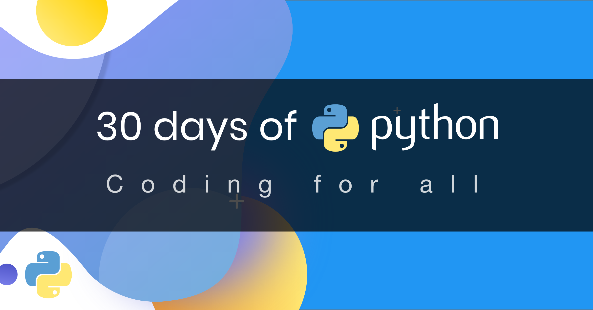

- [🐍 30 Days Of Python](#-30-days-of-python)
    - [🙌 Γίνε χορηγός](#-γίνε-χορηγός)
- [📘 Ημέρα 1](#-ημέρα-1)
  - [Καλώς ήρθες](#καλώς-ήρθες)
  - [Εισαγωγή](#εισαγωγή)
  - [Γιατί Python;](#γιατί-python)
  - [Ρύθμιση περιβάλλοντος](#ρύθμιση-περιβάλλοντος)
    - [Εγκατάσταση Python](#εγκατάσταση-python)
    - [Python Shell](#python-shell)
    - [Εγκατάσταση Visual Studio Code](#εγκατάσταση-visual-studio-code)
      - [Πώς να χρησιμοποιήσεις το Visual Studio Code](#πώς-να-χρησιμοποιήσεις-το-visual-studio-code)
  - [Βασική Python](#βασική-python)
    - [Python Syntax](#python-syntax)
    - [Python Indentation](#python-indentation)
    - [Comments](#comments)
    - [Data types](#data-types)
      - [Number](#number)
      - [String](#string)
      - [Booleans](#booleans)
      - [List](#list)
      - [Dictionary](#dictionary)
      - [Tuple](#tuple)
      - [Set](#set)
    - [Checking Data types](#checking-data-types)
    - [Python File](#python-file)
  - [💻 Ασκήσεις - Ημέρα 1](#-ασκήσεις---ημέρα-1)
    - [Άσκηση: Επίπεδο 1](#άσκηση-επίπεδο-1)
    - [Άσκηση: Επίπεδο 2](#άσκηση-επίπεδο-2)
    - [Άσκηση: Επίπεδο 3](#άσκηση-επίπεδο-3)

# 📘 Ημέρα 1

## Καλώς ήρθες

**Συγχαρητήρια** που αποφάσισες να συμμετάσχεις στην πρόκληση προγραμματισμού _30 days of Python_. Σε αυτή την πρόκληση θα μάθεις ό,τι χρειάζεσαι για να γίνεις προγραμματιστής Python και ολόκληρη την έννοια του προγραμματισμού. Στο τέλος της πρόκλησης θα λάβεις πιστοποιητικό της πρόκλησης _30DaysOfPython_.

Αν θέλεις να συμμετέχεις ενεργά στην πρόκληση, μπορείς να μπεις στην ομάδα Telegram [30DaysOfPython challenge](https://t.me/ThirtyDaysOfPython).

## Εισαγωγή

Η Python είναι μια γλώσσα προγραμματισμού υψηλού επιπέδου (high-level) για προγραμματισμό γενικής χρήσης. Είναι ανοιχτού κώδικα (open source), διερμηνευόμενη (interpreted) και αντικειμενοστρεφής (object-oriented). Τη δημιούργησε ο Ολλανδός προγραμματιστής Guido van Rossum. Το όνομα της Python προήλθε από τη βρετανική κωμική σειρά σκίτσων *Monty Python's Flying Circus*.  Η πρώτη έκδοση κυκλοφόρησε στις 20 Φεβρουαρίου 1991. Αυτή η πρόκληση 30 days of Python θα σε βοηθήσει να μάθεις την πιο πρόσφατη έκδοση της Python, την Python 3, βήμα προς βήμα. Τα θέματα χωρίζονται σε 30 ημέρες και κάθε ημέρα περιλαμβάνει αρκετά θέματα με κατανοητές εξηγήσεις, παραδείγματα από τον πραγματικό κόσμο και πολλές πρακτικές ασκήσεις και projects.

Η πρόκληση είναι σχεδιασμένη για αρχάριους και επαγγελματίες που θέλουν να μάθουν Python. Μπορεί να χρειαστούν από 30 έως 100 ημέρες για να την ολοκληρώσεις. Όσοι συμμετέχουν ενεργά στην ομάδα Telegram έχουν υψηλή πιθανότητα να την ολοκληρώσουν.

Η πρόκληση είναι εύκολη στην ανάγνωση, γραμμένη σε καθημερινή γλώσσα, ενδιαφέρουσα, ενθαρρυντική και ταυτόχρονα πολύ απαιτητική. Πρέπει να αφιερώσεις αρκετό χρόνο για να την τελειώσεις. Αν μαθαίνεις καλύτερα με εικόνα, μπορείς να βρεις τα μαθήματα στο κανάλι YouTube <a href="https://www.youtube.com/channel/UC7PNRuno1rzYPb1xLa4yktw"> Washera</a>. Μπορείς να ξεκινήσεις από το [Python for Absolute Beginners video](https://youtu.be/OCCWZheOesI). Κάνε εγγραφή στο κανάλι, σχολίασε και κάνε ερωτήσεις στα βίντεο του YouTube και να είσαι ενεργός· ο συγγραφέας τελικά θα σε προσέξει.

Ο συγγραφέας θέλει να ακούσει τη γνώμη σου για την πρόκληση· μοιράσου τις σκέψεις σου για το 30DaysOfPython. Μπορείς να αφήσεις τη μαρτυρία σου σε αυτό το [link](https://www.asabeneh.com/testimonials).

## Γιατί Python;

Είναι μια γλώσσα προγραμματισμού πολύ κοντά στην ανθρώπινη γλώσσα και γι' αυτό είναι εύκολη στην εκμάθηση και τη χρήση.
Η Python χρησιμοποιείται από διάφορους κλάδους και εταιρείες (συμπεριλαμβανομένης της Google). Έχει χρησιμοποιηθεί για την ανάπτυξη web εφαρμογών, desktop εφαρμογών, system administration και βιβλιοθηκών machine learning. Η Python είναι ιδιαίτερα δημοφιλής στην κοινότητα του data science και του machine learning. Ελπίζω αυτό να είναι αρκετό για να σε πείσει να ξεκινήσεις να μαθαίνεις Python. Η Python κατακτά τον κόσμο και εσύ τα πας μια χαρά πριν σε κατακτήσει εκείνη.

## Ρύθμιση περιβάλλοντος

### Εγκατάσταση Python

Για να τρέξεις ένα Python script πρέπει να εγκαταστήσεις την Python. Ας [κατεβάσουμε](https://www.python.org/) την Python.
Αν χρησιμοποιείς Windows, πάτησε το κουμπί που είναι κυκλωμένο με κόκκινο.

[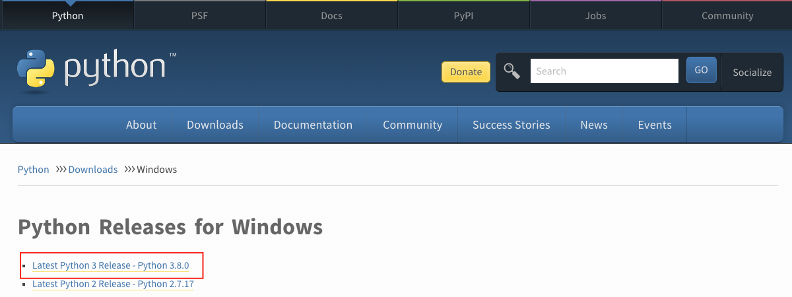](https://www.python.org/)

Αν χρησιμοποιείς macOS, πάτησε το κουμπί που είναι κυκλωμένο με κόκκινο.

[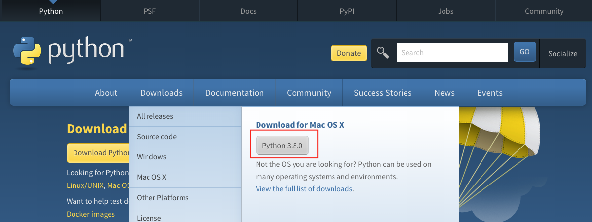](https://www.python.org/)

Για να ελέγξεις αν η Python είναι εγκατεστημένη, γράψε την παρακάτω εντολή στο terminal της συσκευής σου.

```shell
python3 --version
```

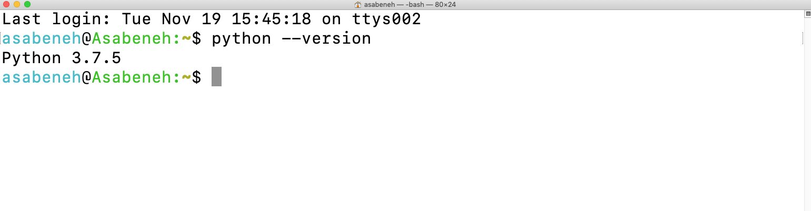

Όπως βλέπεις από το terminal, αυτή τη στιγμή χρησιμοποιώ την έκδοση _Python 3.7.5_. Η δική σου έκδοση μπορεί να διαφέρει, αλλά πρέπει να είναι 3.6 ή νεότερη. Αν κατάφερες να δεις την έκδοση της Python, μπράβο. Η Python έχει εγκατασταθεί στον υπολογιστή σου. Συνέχισε στην επόμενη ενότητα.

### Python Shell

Η Python είναι διερμηνευόμενη γλώσσα (interpreted scripting language), οπότε δεν χρειάζεται compile. Δηλαδή εκτελεί τον κώδικα γραμμή προς γραμμή. Η Python συνοδεύεται από ένα _Python Shell (Python Interactive Shell)_. Χρησιμοποιείται για να εκτελέσεις μία εντολή Python και να πάρεις το αποτέλεσμα.

Το Python Shell περιμένει κώδικα Python από τον χρήστη. Όταν εισάγεις τον κώδικα, τον διερμηνεύει και εμφανίζει το αποτέλεσμα στην επόμενη γραμμή.
Άνοιξε το terminal ή το command prompt (cmd) και γράψε:

```shell
python
```

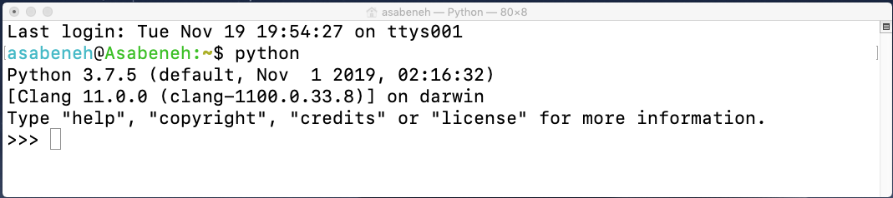

Το Python interactive shell άνοιξε και περιμένει να γράψεις κώδικα Python (Python script). Θα γράψεις το Python script σου δίπλα στο σύμβολο `>>>` και μετά θα πατήσεις Enter.
Ας γράψουμε το πρώτο μας script στο Python scripting shell.

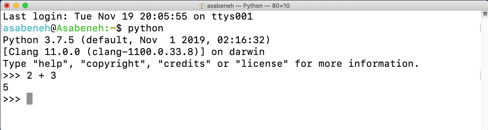

Μπράβο, έγραψες το πρώτο σου Python script στο Python interactive shell. Πώς κλείνουμε το Python interactive shell;
Για να κλείσεις το shell, δίπλα στο σύμβολο `>>>` γράψε την εντολή **exit()** και πάτησε Enter.

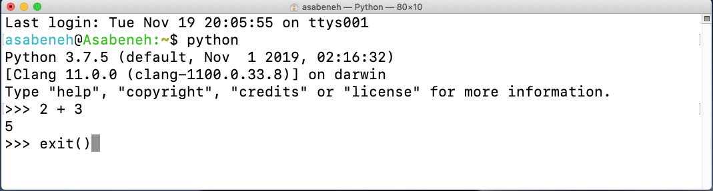

Τώρα ξέρεις πώς να ανοίγεις το Python interactive shell και πώς να βγαίνεις από αυτό.

Η Python θα σου δώσει αποτελέσματα αν γράψεις scripts που καταλαβαίνει· διαφορετικά επιστρέφει errors. Ας κάνουμε επίτηδες ένα λάθος για να δούμε τι θα επιστρέψει η Python.

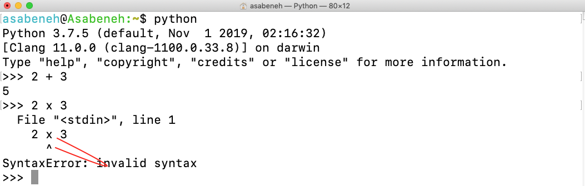

Όπως βλέπεις από το error που επέστρεψε, η Python είναι αρκετά έξυπνη ώστε να καταλαβαίνει το λάθος που κάναμε, το οποίο ήταν _Syntax Error: invalid syntax_. Η χρήση του `x` ως πολλαπλασιασμού στην Python είναι syntax error, επειδή το (`x`) δεν είναι έγκυρη σύνταξη στην Python. Αντί για (`x`) χρησιμοποιούμε αστερίσκο (`*`) για πολλαπλασιασμό. Το error δείχνει καθαρά τι πρέπει να διορθώσεις.

Η διαδικασία εντοπισμού και αφαίρεσης errors από ένα πρόγραμμα ονομάζεται _debugging_. Ας το κάνουμε debug βάζοντας `*` στη θέση του `x`.

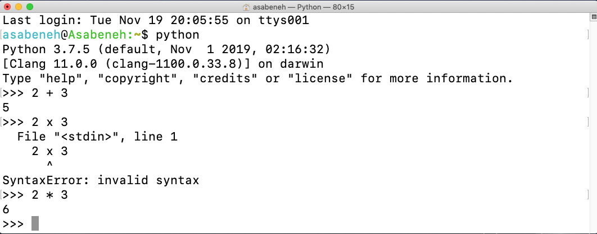

Το bug διορθώθηκε, ο κώδικας έτρεξε και πήραμε το αποτέλεσμα που περιμέναμε. Ως προγραμματιστής θα βλέπεις τέτοια errors καθημερινά. Είναι καλό να ξέρεις πώς να κάνεις debug. Για να γίνεις καλός στο debugging πρέπει να καταλαβαίνεις τι είδους errors αντιμετωπίζεις. Μερικά από τα Python errors που μπορεί να συναντήσεις είναι _SyntaxError_, _IndexError_, _NameError_, _ModuleNotFoundError_, _KeyError_, _ImportError_, _AttributeError_, _TypeError_, _ValueError_, _ZeroDivisionError_ κ.ά. Θα δούμε περισσότερα για τους διαφορετικούς **_error types_** της Python σε επόμενες ενότητες.

Ας εξασκηθούμε περισσότερο στο πώς χρησιμοποιούμε το Python interactive shell. Πήγαινε στο terminal ή στο command prompt και γράψε τη λέξη **python**.


Το Python interactive shell άνοιξε. Ας κάνουμε μερικές βασικές μαθηματικές πράξεις (addition, subtraction, multiplication, division, modulus, exponentiation).

Ας κάνουμε πρώτα λίγα μαθηματικά πριν γράψουμε οποιονδήποτε κώδικα Python:

- 2 + 3 = 5
- 3 - 2 = 1
- 3 \* 2 = 6
- 3 / 2 = 1.5
- 3 \*\* 2 = 3 x 3 = 9

Στην Python έχουμε και τις παρακάτω επιπλέον πράξεις:

- 3 % 2 = 1 => δηλαδή βρίσκουμε το υπόλοιπο (remainder)
- 3 // 2 = 1 => δηλαδή αφαιρούμε το υπόλοιπο

Ας μετατρέψουμε τις παραπάνω μαθηματικές εκφράσεις σε κώδικα Python. Το Python shell είναι ανοιχτό και ας γράψουμε ένα comment στην αρχή του shell.

Ένα _comment_ είναι μέρος του κώδικα που δεν εκτελείται από την Python. Έτσι μπορούμε να αφήσουμε κείμενο στον κώδικά μας για να τον κάνουμε πιο ευανάγνωστο. Η Python δεν τρέχει το μέρος του comment. Ένα comment στην Python ξεκινά με το σύμβολο hash (`#`).
Έτσι γράφεις ένα comment στην Python:

```shell
 # comment starts with hash
 # this is a python comment, because it starts with a (#) symbol
```

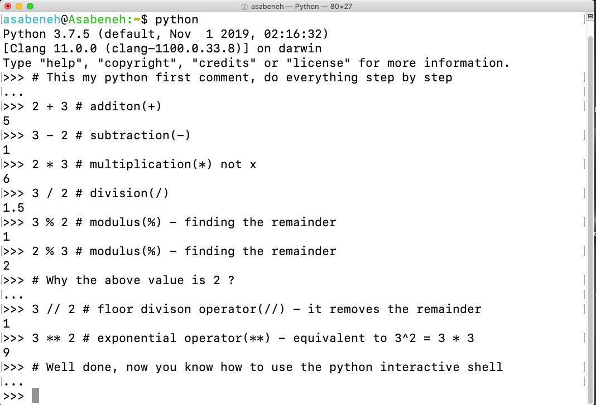

Πριν προχωρήσουμε στην επόμενη ενότητα, ας εξασκηθούμε λίγο ακόμη στο Python interactive shell. Κλείσε το ανοιχτό shell γράφοντας _exit()_ και άνοιξέ το ξανά για να εξασκηθούμε στο πώς γράφουμε κείμενο στο Python shell.

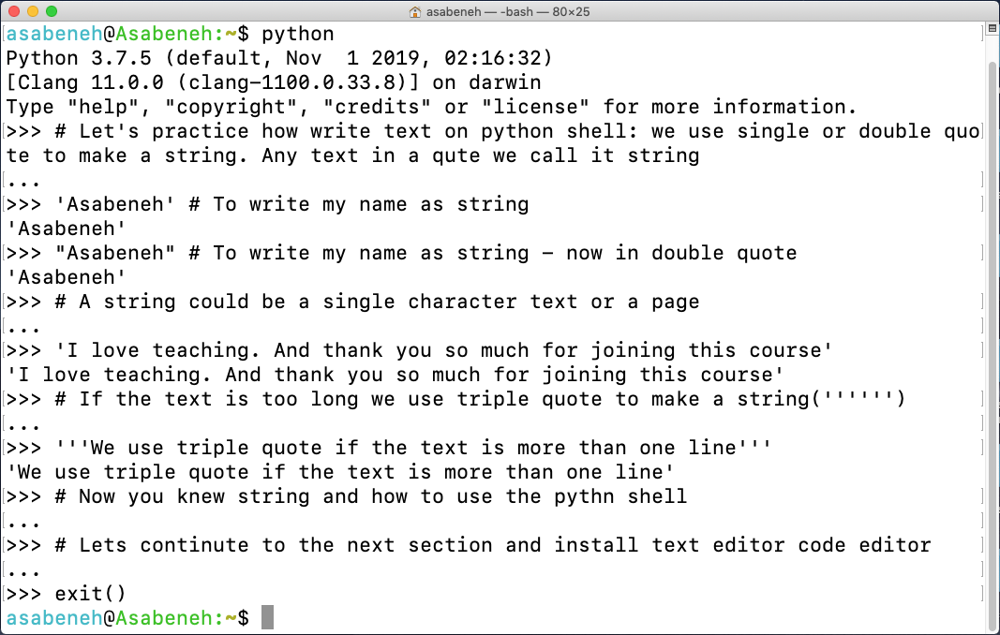

### Εγκατάσταση Visual Studio Code

Το Python interactive shell είναι καλό για να δοκιμάζεις μικρά scripts, αλλά δεν είναι κατάλληλο για μεγάλο project. Στο πραγματικό περιβάλλον εργασίας οι προγραμματιστές χρησιμοποιούν διαφορετικούς code editors για να γράφουν κώδικα. Σε αυτή την πρόκληση 30 days of Python θα χρησιμοποιήσουμε το Visual Studio Code. Το Visual Studio Code είναι ένας πολύ δημοφιλής text editor ανοιχτού κώδικα. Είμαι fan του vscode και θα σου πρότεινα να το [κατεβάσεις](https://code.visualstudio.com/), αλλά αν προτιμάς άλλους editors, συνέχισε με ό,τι έχεις.

[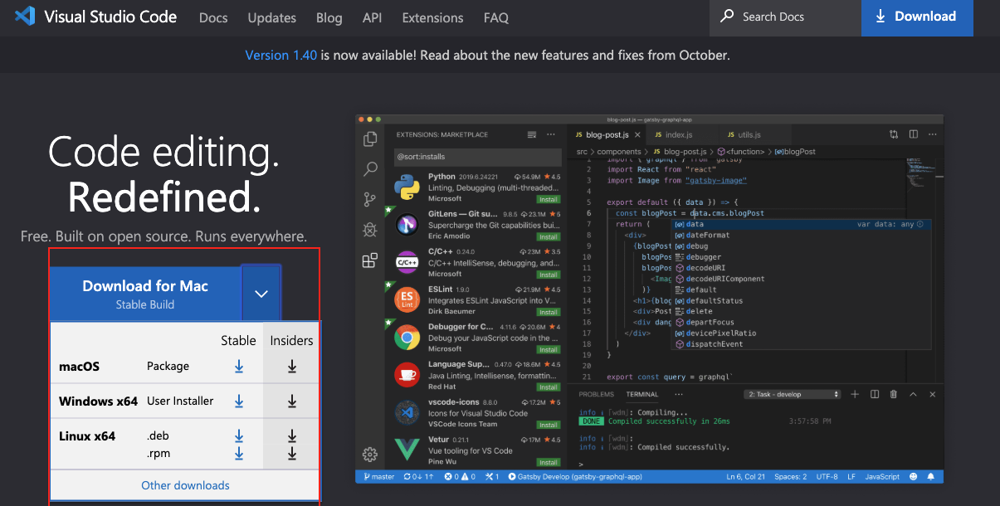](https://code.visualstudio.com/)

Αν εγκατέστησες το Visual Studio Code, ας δούμε πώς το χρησιμοποιούμε.
Αν προτιμάς βίντεο, μπορείς να ακολουθήσεις αυτό το Visual Studio Code for Python [Video tutorial](https://www.youtube.com/watch?v=bn7Cx4z-vSo)

#### Πώς να χρησιμοποιήσεις το Visual Studio Code

Άνοιξε το Visual Studio Code κάνοντας διπλό κλικ στο εικονίδιο του Visual Studio. Όταν το ανοίξεις θα δεις μια διεπαφή σαν αυτή. Δοκίμασε να αλληλεπιδράσεις με τα εικονίδια που είναι σημειωμένα.


Δημιούργησε έναν φάκελο με όνομα 30DaysOfPython στην επιφάνεια εργασίας. Στη συνέχεια άνοιξέ τον με το Visual Studio Code.

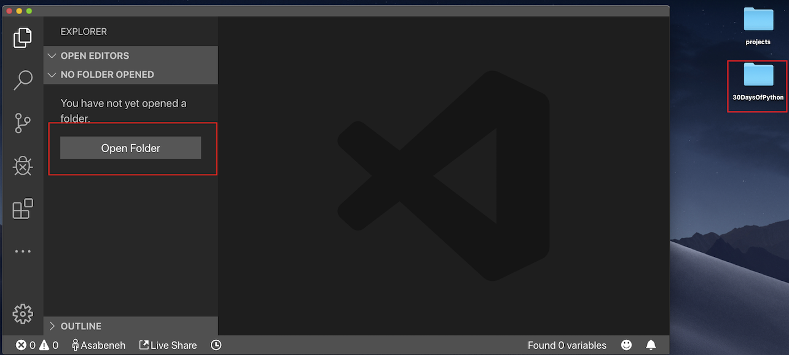

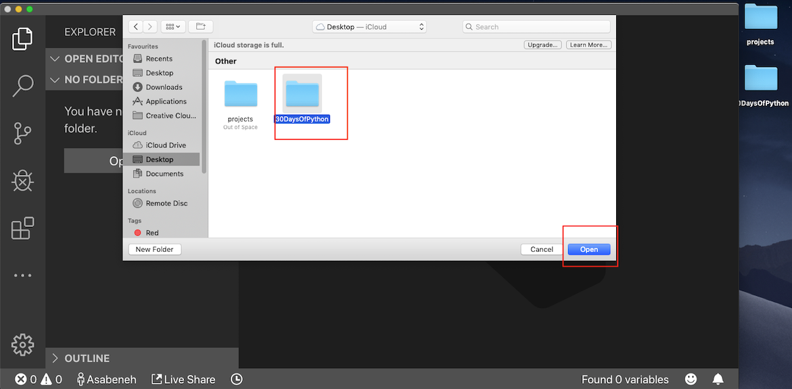

Αφού το ανοίξεις, θα δεις συντομεύσεις για δημιουργία αρχείων και φακέλων μέσα στον φάκελο του project 30DaysOfPython. Όπως βλέπεις παρακάτω, δημιούργησα το πρώτο αρχείο, `helloworld.py`. Μπορείς να κάνεις το ίδιο.

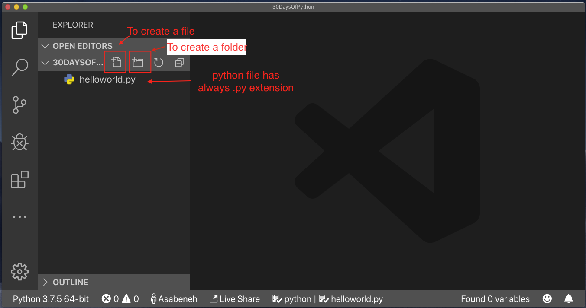

Μετά από μια μεγάλη μέρα coding, θέλεις να κλείσεις τον code editor, σωστά; Έτσι κλείνεις το ανοιχτό project.

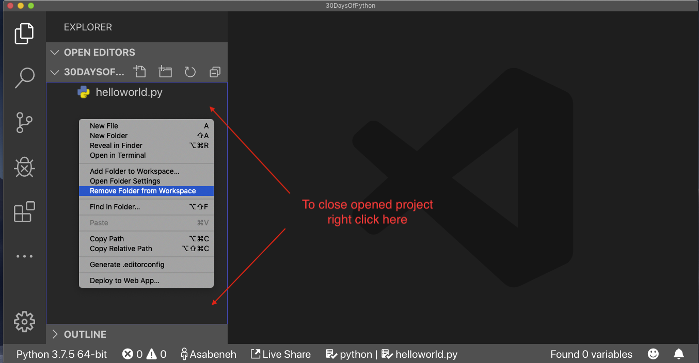

Συγχαρητήρια, ολοκλήρωσες τη ρύθμιση του περιβάλλοντος ανάπτυξης. Ας ξεκινήσουμε να γράφουμε κώδικα.

## Βασική Python

### Python Syntax

Ένα Python script μπορεί να γραφτεί στο Python interactive shell ή στον code editor. Ένα αρχείο Python έχει κατάληξη `.py`.

### Python Indentation

Το indentation είναι κενό διάστημα (white space) σε ένα κείμενο. Σε πολλές γλώσσες το indentation χρησιμοποιείται για να αυξήσει την αναγνωσιμότητα του κώδικα· στην Python όμως το indentation δημιουργεί μπλοκ κώδικα. Σε άλλες γλώσσες προγραμματισμού χρησιμοποιούνται άγκιστρα `{}` (curly brackets) αντί για indentation. Ένα από τα πιο συνηθισμένα bugs όταν γράφεις κώδικα Python είναι το λάθος indentation.

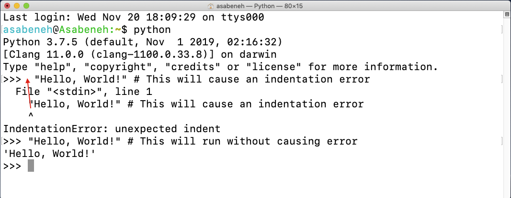

### Comments

Τα comments παίζουν κρίσιμο ρόλο στην αναγνωσιμότητα του κώδικα και επιτρέπουν στους προγραμματιστές να αφήνουν σημειώσεις μέσα στον κώδικα. Στην Python, οποιοδήποτε κείμενο προηγείται από το σύμβολο hash (`#`) θεωρείται comment και δεν εκτελείται όταν τρέχει ο κώδικας.

**Παράδειγμα: Single Line Comment**

```shell
    # This is the first comment
    # This is the second comment
    # Python is eating the world
```

**Παράδειγμα: Multiline Comment**

Τα triple quotes μπορούν να χρησιμοποιηθούν για multiline comment αν δεν έχουν ανατεθεί σε variable.

```shell
"""This is multiline comment
multiline comment takes multiple lines.
python is eating the world   
"""
```

### Data types

Στην Python υπάρχουν διάφοροι data types. Ας ξεκινήσουμε με τους πιο συνηθισμένους. Διαφορετικοί data types θα καλυφθούν λεπτομερώς σε άλλες ενότητες. Προς το παρόν, ας δούμε τους διάφορους data types και ας εξοικειωθούμε μαζί τους. Δεν χρειάζεται να τους κατανοήσεις πλήρως τώρα.

#### Number

- Integer: ακέραιοι αριθμοί (αρνητικοί, μηδέν και θετικοί)
    Παράδειγμα:
    ... -3, -2, -1, 0, 1, 2, 3 ...
- Float: δεκαδικός αριθμός
    Παράδειγμα
    ... -3.5, -2.25, -1.0, 0.0, 1.1, 2.2, 3.5 ...
- Complex
    Παράδειγμα
    1 + j, 2 + 4j

#### String

Μια συλλογή από έναν ή περισσότερους χαρακτήρες μέσα σε μονά ή διπλά εισαγωγικά. Αν το string είναι μεγαλύτερο από μία πρόταση, χρησιμοποιούμε triple quotes.

**Παράδειγμα:**

```py
'Asabeneh'
'Finland'
'Python'
'I love teaching'
'I hope you are enjoying the first day of 30DaysOfPython Challenge'
```

#### Booleans

Ένας boolean data type είναι είτε τιμή `True` είτε `False`. Τα T και F πρέπει να είναι πάντα κεφαλαία.

**Παράδειγμα:**

```python
    True  #  Είναι αναμμένο το φως; Αν είναι αναμμένο, η τιμή είναι True
    False # Είναι αναμμένο το φως; Αν είναι σβηστό, η τιμή είναι False
```

#### List

Η Python list είναι μια διατεταγμένη συλλογή (ordered collection) που επιτρέπει την αποθήκευση στοιχείων διαφορετικών data types. Μια list μοιάζει με array στη JavaScript.

**Παράδειγμα:**

```py
[0, 1, 2, 3, 4, 5]  # όλα ίδια data types - list με αριθμούς
['Banana', 'Orange', 'Mango', 'Avocado'] # όλα ίδια data types - list με strings (φρούτα)
['Finland','Estonia', 'Sweden','Norway'] # όλα ίδια data types - list με strings (χώρες)
['Banana', 10, False, 9.81] # διαφορετικοί data types στη list - string, integer, boolean και float
```

#### Dictionary

Ένα αντικείμενο Python dictionary είναι μια μη διατεταγμένη συλλογή δεδομένων σε μορφή ζεύγους key-value.

**Παράδειγμα:**

```py
{
'first_name':'Asabeneh',
'last_name':'Yetayeh',
'country':'Finland',
'age':250,
'is_married':True,
'skills':['JS', 'React', 'Node', 'Python']
}
```

#### Tuple

Το tuple είναι μια διατεταγμένη συλλογή διαφορετικών data types όπως η list, αλλά τα tuples δεν μπορούν να τροποποιηθούν αφού δημιουργηθούν. Είναι immutable.

**Παράδειγμα:**

```py
('Asabeneh', 'Pawel', 'Brook', 'Abraham', 'Lidiya') # Ονόματα
```

```py
('Earth', 'Jupiter', 'Neptune', 'Mars', 'Venus', 'Saturn', 'Uranus', 'Mercury') # πλανήτες
```

#### Set

Το set είναι μια συλλογή data types παρόμοια με list και tuple. Σε αντίθεση με list και tuple, το set δεν είναι διατεταγμένη συλλογή στοιχείων. Όπως στα μαθηματικά, το set στην Python αποθηκεύει μόνο μοναδικά στοιχεία.

Σε επόμενες ενότητες θα δούμε αναλυτικά κάθε data type της Python.

**Παράδειγμα:**

```py
{2, 4, 3, 5}
{3.14, 9.81, 2.7} # η σειρά δεν έχει σημασία στο set
```

### Checking Data types

Για να ελέγξουμε τον data type κάποιων δεδομένων/variable χρησιμοποιούμε τη συνάρτηση **type**. Στο παρακάτω terminal θα δεις διαφορετικούς data types της Python:

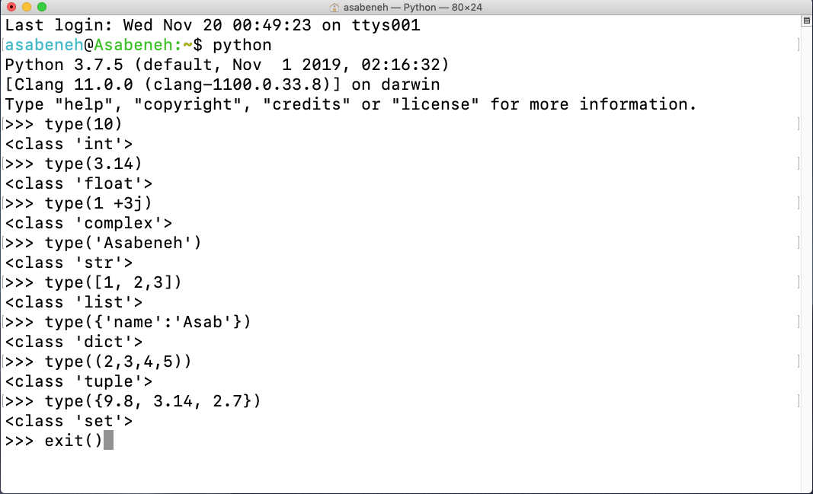

### Python File

Πρώτα άνοιξε τον φάκελο του project σου, 30DaysOfPython. Αν δεν έχεις αυτόν τον φάκελο, δημιούργησε έναν φάκελο με όνομα 30DaysOfPython. Μέσα σε αυτόν τον φάκελο, δημιούργησε ένα αρχείο με όνομα helloworld.py. Τώρα ας κάνουμε ό,τι κάναμε στο Python interactive shell, χρησιμοποιώντας το Visual Studio Code.

Το Python interactive shell εκτύπωνε χωρίς να χρησιμοποιεί **print**, αλλά στο Visual Studio Code για να δούμε το αποτέλεσμα πρέπει να χρησιμοποιήσουμε μια built-in function _print()_. Η built-in function _print()_ δέχεται ένα ή περισσότερα arguments ως εξής _print('arument1', 'argument2', 'argument3')_. Δες τα παραδείγματα παρακάτω.

**Παράδειγμα:**

Το όνομα του αρχείου είναι `helloworld.py`

```py
# Day 1 - 30DaysOfPython Challenge

print(2 + 3)             # addition(+)
print(3 - 1)             # subtraction(-)
print(2 * 3)             # multiplication(*)
print(3 / 2)             # division(/)
print(3 ** 2)            # exponential(**)
print(3 % 2)             # modulus(%)
print(3 // 2)            # Floor division operator(//)

# Checking data types
print(type(10))          # Int
print(type(3.14))        # Float
print(type(1 + 3j))      # Complex number
print(type('Asabeneh'))  # String
print(type([1, 2, 3]))   # List
print(type({'name':'Asabeneh'})) # Dictionary
print(type({9.8, 3.14, 2.7}))    # Set
print(type((9.8, 3.14, 2.7)))    # Tuple
```

Για να τρέξεις το αρχείο Python, δες την εικόνα παρακάτω. Μπορείς να το τρέξεις είτε πατώντας το πράσινο κουμπί στο Visual Studio Code είτε πληκτρολογώντας _python helloworld.py_ στο terminal.

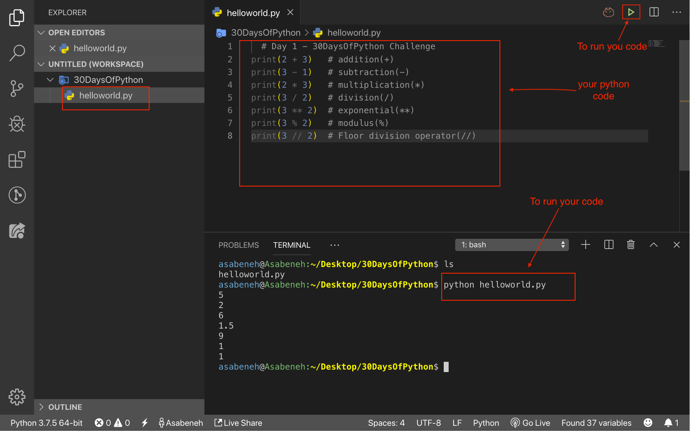

🌕  Είσαι υπέροχος/η. Μόλις ολοκλήρωσες την πρόκληση της ημέρας 1 και είσαι στον δρόμο προς τη μεγαλοσύνη. Τώρα κάνε μερικές ασκήσεις για τον εγκέφαλο και τους μύες σου.

## 💻 Ασκήσεις - Ημέρα 1

### Άσκηση: Επίπεδο 1

1. Έλεγξε την έκδοση Python που χρησιμοποιείς
2. Άνοιξε το Python interactive shell και κάνε τις παρακάτω πράξεις. Τα operands είναι 3 και 4.
   - addition(+)
   - subtraction(-)
   - multiplication(\*)
   - modulus(%)
   - division(/)
   - exponential(\*\*)
   - floor division operator(//)
3. Γράψε strings στο Python interactive shell. Τα strings είναι τα εξής:
   - Το όνομά σου
   - Το επίθετό σου
   - Η χώρα σου
   - I am enjoying 30 days of python
4. Έλεγξε τους data types των παρακάτω δεδομένων:
   - 10
   - 9.8
   - 3.14
   - 4 - 4j
   - ['Asabeneh', 'Python', 'Finland']
   - Το όνομά σου
   - Το επίθετό σου
   - Η χώρα σου

### Άσκηση: Επίπεδο 2

1. Δημιούργησε έναν φάκελο με όνομα day_1 μέσα στον φάκελο 30DaysOfPython. Μέσα στον φάκελο day_1, δημιούργησε ένα αρχείο Python helloworld.py και επανάλαβε τις ερωτήσεις 1, 2, 3 και 4. Θυμήσου να χρησιμοποιείς _print()_ όταν εργάζεσαι σε αρχείο Python. Πήγαινε στον φάκελο όπου αποθήκευσες το αρχείο και τρέξε το.

### Άσκηση: Επίπεδο 3

1. Γράψε ένα παράδειγμα για διαφορετικούς Python data types όπως Number (Integer, Float, Complex), String, Boolean, List, Tuple, Set και Dictionary.
2. Βρες την [Euclidean distance](https://en.wikipedia.org/wiki/Euclidean_distance#:~:text=In%20mathematics%2C%20the%20Euclidean%20distance,being%20called%20the%20Pythagorean%20distance.) μεταξύ των σημείων (2, 3) και (10, 8)

🎉 ΣΥΓΧΑΡΗΤΗΡΙΑ ! 🎉

[Ημέρα 2 >>](./02_Day_Variables_builtin_functions/02_variables_builtin_functions.md)
