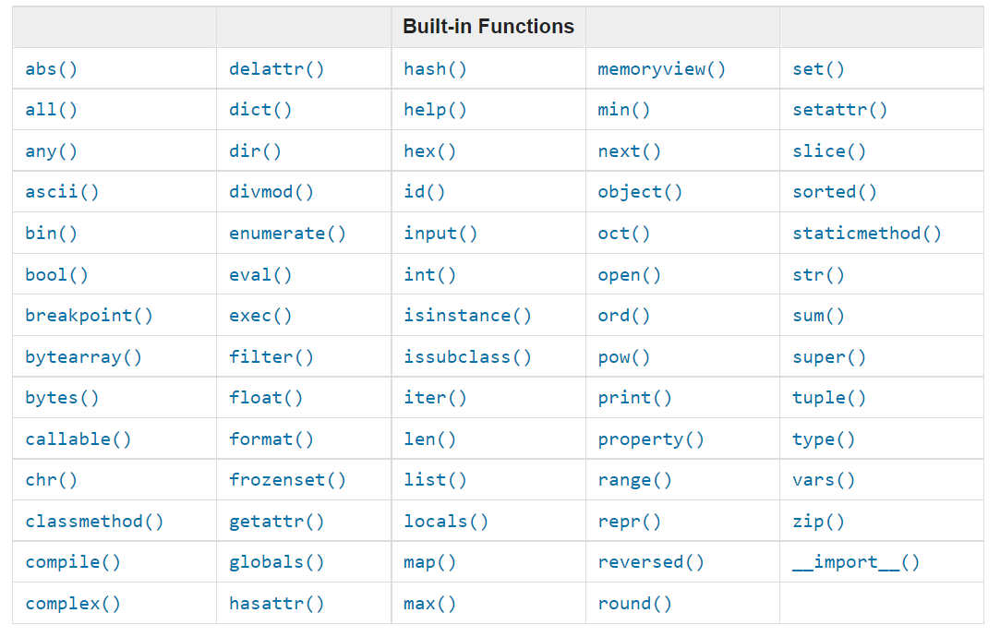

<div align="center">
  <h1> 30 Days Of Python: Day 2 - Variables, Builtin Functions</h1>
  <a class="header-badge" target="_blank" href="https://www.linkedin.com/in/asabeneh/">
  
  </a>
  <a class="header-badge" target="_blank" href="https://twitter.com/Asabeneh">
  
  </a>

<sub>Author:
<a href="https://www.linkedin.com/in/asabeneh/" target="_blank">Asabeneh Yetayeh</a><br>
<small> Second Edition: July, 2021</small>
</sub>

</div>

[<< Day 1](../Readme_Khmer_Ver.md) | [Day 3 >>](../03_Day_Operators/03_Day_Operators.md)


- [📘 Day 2](#-day-2)
  - [អនុគមន៍ដែកមានស្រេច](#អនុគមន៍ដែលមានស្រេច)
  - [អថេរ](#អថេរ)
    - [បង្កើតអថេរច្រើននៅជួរតែមួយ](#បង្កើតអថេរច្រើននៅជួរតែមួយ)
  - [ប្រភេទទិន្នន័យ](#ប្រភេទទិន្នន័យ)
  - [ពិនិត្យមើប្រភេទទិន្នន័យ](#ពិនិត្យមើប្រភេទទិន្នន័យ)
  - [លេខ](#លេខ)

# 📘 Day 2

## អនុគមន៍ដែលមានស្រេច

នៅក្នុង Python យើងមានអនុគមន៍ ដែលគេបង្កើតមកស្រេចច្រើន។ អនុគមន៍ដែលមានស្រេច អាចប្រើបានជាសកល ដោយមិនបាច់នាំចូលពីខាងក្រៅមកទេ។ អនុគមន៍ដែលមានស្រេច ដែលគេធ្លាប់ប្រើច្រើនជាងគេគឺ ៖
_print()_, _len()_, _type()_, _int()_, _float()_, _str()_, _input()_, _list()_, _dict()_, _min()_, _max()_, _sum()_, _sorted()_, _open()_, _file()_, _help()_, and _dir()_
នៅក្រោមជាតារាងដែលមានបញ្ជីនៃអនុគមន៍ដែលមានស្រេចបានមកទី [python documentation](https://docs.python.org/3.9/library/functions.html).



យើងអាចចាប់ផ្តើមបើក Python shell និងយកអនុគមន៍ដែលមានស្រេចមកប្រើ។


សាកហាត់ប្រើអនុគមន៍ផ្សេងៗទៀត។


ដូចយើងឃើញខាងលើ Python មានពាក្យដែលសំខាន់ខ្លាស់ដែលយើងមិនអាចប្រើបាន។

យើងគិតថា អ្នកយល់អំពីអនុគមន៍ដែលមានស្រេចហើយ។ ដូច្នេះយើងអាច់ប្រើមួយទៀត ហើយយើងអាចនាំទៅផ្នែកមួយទៀត។


## អថេរ

អថេរ អាចរក្សាទុកទិន្នន័យនៅក្នុងកុំព្យូទ័រ។ គេណែនាំអោយប្រើអថេរណាដែលងាយស្រួលសម្រាប់ចាំនិងស្រួលយល់។ អថេរមិនអាចមានលេខនៅខាងមុខ, តួអក្សរពិសេស, និងសហសញ្ញា។ អថេរខ្លះមានឈ្មោះខ្លី(x, y, z)​ ខ្លះទៀតវែងហើយស្រួលយល់(firstname, lastname, age, country)។

ច្បាប់សម្រាប់ការអោយឈ្មោះអថេរ

- ត្រូវចាប់ផ្តើមដោយអង្សរ ឬ "_"
- មិនអាចចាប់ផ្តើមដោយលេខ
- អាចប្រើតែអង្សរ A-Z, លេខ 0-9, និង "\_"
- ការប្រើអក្សរធំតូចសំខាន់សម្រាប់ការដាក់ឈ្មោះ។ (firstname, Firstname, FirstName and FIRSTNAME) គឺខុសគ្នាទាំងអស់។

យើងអាចចាប់ផ្តើមបង្កើតអថេរតាមច្បាប់ទាំងអស់នេះ

```shell
firstname
lastname
age
country
city
first_name
last_name
capital_city
_if 
year_2021
year2021
current_year_2021
birth_year
num1
num2
```

អថេរដែលខុសច្បាប់

```shell
first-name
first@name
first$name
num-1
1num
```

យើងគួរប្រើរបៀបបង្កើតឈ្មោះអថេរដែលមានការប្រើច្រើនសម្រាប់អ្នកដែលប្រើ Python។ យើងគួរប្រើ snake use(snake_case) ដែលយើងត្រូវដាក់សញ្ញា "_" ក្រោយពាក្រមួយៗ សម្រាប់អថេរដែលមានពាក្រច្រើន (ex. first_name, last_name, engine_rotation_speed)

យើងអាចដាក់តម្លៃចូលអថេរដោយប្រើសញ្ញាស្មើរ។

```py
# អថេរនៅក្នុង Python
first_name = 'Hanni'
last_name = 'Pham'
country = 'Vietnam'
city = 'Hanoi'
age = 19
is_married = False
skills = ['Dancing', 'Singing', 'Variety Show', 'Modelling', 'Being a cutie']
person_info = {
    'firstname':'Hanni', 
    'lastname':'Pham', 
    'country':'Vietnam',
    'city':'Hanoi'
    }
```

តោះ សាកប្រើអនុគមន៍ _print()_ និង _len()_ ។ អនុគមន៍ print អាចយកអាគុយម៉ង់ដាក់ចូលដោយគ្មានដែនកំណត់។ យើងដាក់អាគុយម៉ង់ចូលអនុគមន៍នៅក្នុងវង់ក្រចករបស់វា។
argument = អាគុយម៉ង់

**Example**

```py
print('Hello, World!') # អង្សរ Hello, World! ជាអាគុយម៉ង់
print('Hello',',', 'World','!') # វាអាចយកអាគុយម៉ង់ចូលច្រើន
print(len('Hello, World!')) # ក្នុងនេះយកអាគុយម៉ង់ចូលតែមួយ
```

យើងអាចប្រើអនុគមន៍ print នេះនិងរកប្រវែងអថេរនៅខាងលើ

**Example:**

```py
# បង្ហាញតម្លៃនៅក្នុងអថេរ

print('First name:', first_name)
print('First name length:', len(first_name))
print('Last name: ', last_name)
print('Last name length: ', len(last_name))
print('Country: ', country)
print('City: ', city)
print('Age: ', age)
print('Married: ', is_married)
print('Skills: ', skills)
print('Person information: ', person_info)
```

### បង្កើតអថេរច្រើននៅជួរតែមួយ

អថេរច្រើនអាចបង្កើតបាននៅជួរតែមួយ

**Example:**

```py
first_name, last_name, country, age, is_married = 'Hanni', 'Pham', 'Hanoi', 19, False

print(first_name, last_name, country, age, is_married)
print('First name:', first_name)
print('Last name: ', last_name)
print('Country: ', country)
print('Age: ', age)
print('Married: ', is_married)
```

យកទិន្នន័យពីអ្នកប្រើដោយប្រើអនុគមន៍ _input()_ យើងអាចចាត់តាំងទិន្នន័យទាំងនោះចូលក្នុងអថេរ first_name និង age

**Example:**

```py
first_name = input('What is your name: ')
age = input('How old are you? ')

print(first_name)
print(age)
```

## ប្រភេទទិន្នន័យ

នៅ Python មានប្រភេទទិន្នន័យច្រើន។ បើចង់ដឹងថាអថេរជាប្រភេទទិន្នន័យអ្វី យើងអាចប្រើអនុគមន៍ _type_ ។ 

## ពិនិត្យមើប្រភេទទិន្នន័យ

- យើងប្រើអនុគមន៍ _type_

  **Example:**

```py
# Different python data types
# Let's declare variables with various data types

first_name = 'Hanni'     # str
last_name = 'Pham'       # str
country = 'Vietnam'         # str
city= 'Hanoi'            # str
age = 19                   # int

# Printing out types
print(type('Hanni'))     # str
print(type(first_name))     # str
print(type(10))             # int
print(type(3.14))           # float
print(type(1 + 1j))         # complex
print(type(True))           # bool
print(type([1, 2, 3, 4]))     # list
print(type({'name':'Asabeneh','age':250, 'is_married':250}))    # dict
print(type((1,2)))                                              # tuple
print(type(zip([1,2],[3,4])))                                   # set
```

- Casting: ប្តូរប្រភេទទិន្នន័យមួយទៅប្រភេទទិន្នន័យមួយទៀត។ យើងអាចប្រើ _int()_, _float()_, _str()_, _list_, _set_។ នៅពេលយើងគិតលេខ, យើងត្រូវប្តូរប្រភេទទិន្នន័យពីអក្សរលេខ(string numbers) ទៅ int ឬ float មុន។ បើចង់ដាក់លេខនិងអក្សរចូលគ្នា, យើងគួរប្តូរប្រភេទទិន្នន័យពីលេខ number ទៅអក្សរ string មុន។

 **Example:**

```py
# int to float
num_int = 10
print('num_int',num_int)         # 10
num_float = float(num_int)
print('num_float:', num_float)   # 10.0

# float to int
gravity = 9.81
print(int(gravity))             # 9

# int to str
num_int = 10
print(num_int)                  # 10
num_str = str(num_int)
print(num_str)                  # '10'

# str to int or float
num_str = '10.6'
print('num_int', int(num_str))      # 10
print('num_float', float(num_str))  # 10.6

# str to list
first_name = 'Asabeneh'
print(first_name)               # 'Asabeneh'
first_name_to_list = list(first_name)
print(first_name_to_list)            # ['A', 's', 'a', 'b', 'e', 'n', 'e', 'h']
```

## លេខ

ប្រភេទទិន្នន័យលេខ

1. Integers ចំនួនគត់: Integer(negative, zero and positive) numbers
   Ex:
   ... -3, -2, -1, 0, 1, 2, 3 ...

2. Floating Point Numbers ទសភាគ(Decimal numbers)
   Ex:
   ... -3.5, -2.25, -1.0, 0.0, 1.1, 2.2, 3.5 ...

3. Complex Numbers ចំនួនកុំផ្លិច
   Ex:
   1 + j, 2 + 4j, 1 - 1j

អបអរសាទរ អ្នកបានរៀនចប់ថ្ងៃទី២ហើយ។
