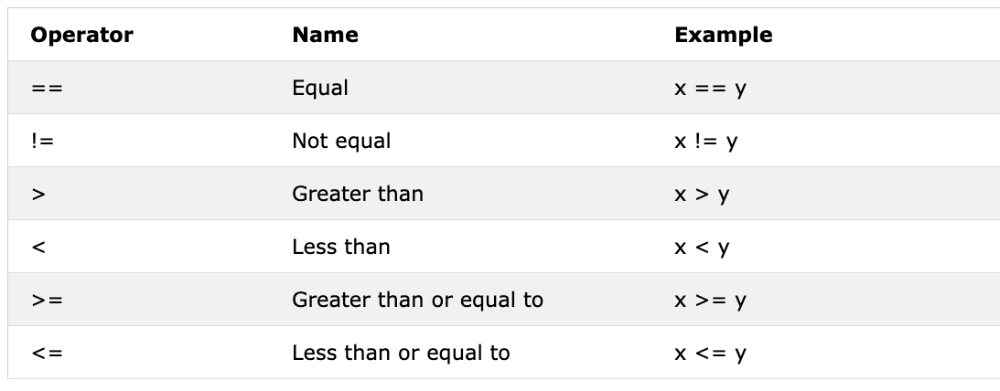

<div align="center">
  <h1> 30 Days Of Python: Day 3 - Operators</h1>
  <a class="header-badge" target="_blank" href="https://www.linkedin.com/in/asabeneh/">
  
  </a>
  <a class="header-badge" target="_blank" href="https://twitter.com/Asabeneh">
  
  </a>

<sub>Author:
<a href="https://www.linkedin.com/in/asabeneh/" target="_blank">Asabeneh Yetayeh</a><br>
<small> Second Edition: July, 2021</small>
</sub>
</div>

[<< Day 2](../02_Day_Variables_builtin_functions/02_variables_builtin_functions.md) | [Day 4 >>](../04_Day_Strings/04_strings.md)


- [📘 Day 3](#-day-3)
  - [Boolean](#boolean)
  - [Operators](#operators)
    - [Assignment Operators](#assignment-operators)
    - [Arithmetic Operators:](#arithmetic-operators)
    - [Comparison Operators](#comparison-operators)
    - [Logical Operators](#logical-operators)

# 📘 Day 3

## Boolean

ប្រភេទទិន្នន័យ ចំនួនប៊ូលីន តំណាងឱ្យតម្លៃមួយនៃតម្លៃពីរ: _True_ ឬ _False_ ។ ការប្រើប្រាស់ ប្រភេទទិន្នន័យទាំងនេះនឹងច្បាស់ នៅពេលដែលយើងចាប់ផ្តើមប្រើប្រតិបត្តិការប្រៀបធៀប។ អក្សរដំបូង **T** សម្រាប់ True និង **F** សម្រាប់ False គួរតែមានអក្សរធំមិនដូច JavaScript ទេ។
**Example: តម្លៃចំនួនប៊ូលីន**

```py
print(True)
print(False)
```

## Operators

ភាសា Python គាំទ្រប្រតិបត្តិការជាច្រើនប្រភេទ។ នៅក្នុងនេះ, យើងនឹងផ្តោតលើលើវាខ្លះៗ។

### Assignment Operators

ប្រតិបត្តិករចាត់តាំងត្រូវបានប្រើដើម្បីកំណត់តម្លៃទៅលើ អថេរ ។ យក = ជាឧទាហរណ៍។ សញ្ញាស្មើក្នុងគណិតវិទ្យាបង្ហាញថាតម្លៃពីរស្មើគ្នាប៉ុន្តែក្នុង Python វាមានន័យថា យើងកំពុងតែរក្សាតម្លៃនៅក្នុងអថេរមួយ ហើយយើងហៅវាថាចាត់តាំងតម្លៃទៅលើអថេរមួយ។ តារាងខាងក្រោមនេះបង្ហាញពីប្រភេទប្រតិបត្តិករចាត់តាំង Python ផ្សេងៗ, បានមកពី [w3school](https://www.w3schools.com/python/python_operators.asp).


### Arithmetic Operators

- បូក Addition(+): a + b 
- ដក Subtraction(-): a - b
- គុណ Multiplication(*): a * b
- ចែក Division(/): a / b
- ម៉ូឌុល (ផ្នែកដែលនៅសល់) Modulus(%): a % b
- បង្កត់ចុះ Floor division(//): a // b
- ស្វាយគុណ Exponentiation(**): a ** b


**Example:ចំនួនគត់**

```py
# ប្រតិបត្តិការនព្វន្ធ ក្នុង Python
# ចំនួនគត់

print('Addition: ', 1 + 2)        # 3
print('Subtraction: ', 2 - 1)     # 1
print('Multiplication: ', 2 * 3)  # 6
print ('Division: ', 4 / 2)       # 2.0  ការចែកក្នុង Python នឹងទទួលបានចំនួនទសភាគ
print('Division: ', 6 / 2)        # 3.0         
print('Division: ', 7 / 2)        # 3.5
print('Division without the remainder: ', 7 // 2)   # 3,  ការចែក ទទួលបានចំនួនគត់
print ('Division without the remainder: ',7 // 3)   # 2
print('Modulus: ', 3 % 2)         # 1, ការរកសំណល់
print('Exponentiation: ', 2 ** 3) # 9 មានន័យថា 2 * 2 * 2
```

**Example:ទសភាគ**

```py
# លេខទសភាគ
print('Floating Point Number, PI', 3.14)
print('Floating Point Number, gravity', 9.81)
```

**Example:ចំនួនកុំផ្លិច**

```py
# ចំនួនកុំផ្លិច
print('Complex number: ', 1 + 1j)
print('Multiplying complex numbers: ',(1 + 1j) * (1 - 1j))
```

Let's declare a variable and assign a number data type. I am going to use single character variable but remember do not develop a habit of declaring such types of variables. Variable names should be all the time mnemonic.

យើងអាចបង្កើត អថេរ ហើយកំណត់ប្រភេទទិន្នន័យ ខ្ញុំនឹងប្រើអថេរអក្សរតែមួយ ប៉ុន្តែចងចាំថាកុំបង្កើតទម្លាប់នៃការប្រកាសប្រភេទនៃអថេរដូចឆ្នេះ។ ឈ្មោះរបស់អថេរគួរតែចម្រុះគួរតែមានឈ្មោះជា mnemonic គឺស្រួលចាំនិងយល់។

**Example:**

```python
# បង្កើតអថេរនៅខាងលើមុន

a = 3 # a ជាឈ្មោះអថេរ និង 3 ជាចំនួនគត់
b = 2 # b ជាឈ្មោះអថេរ និង 2 ជាចំនួនគត់

# ប្រតិបត្តិការនព្វន្ធ និង ការដាក់ចម្លើយនៅក្នុងអថេរ
total = a + b
diff = a - b
product = a * b
division = a / b
remainder = a % b
floor_division = a // b
exponential = a ** b

print(total) 
print('a + b = ', total)
print('a - b = ', diff)
print('a * b = ', product)
print('a / b = ', division)
print('a % b = ', remainder)
print('a // b = ', floor_division)
print('a ** b = ', exponentiation)
```

**Example:**

```py
print('== Addition, Subtraction, Multiplication, Division, Modulus ==')

# Dបង្កើតអថេរនិងតម្លៃ 2 ហើយរៀបវាជាមួយគ្នា
num_one = 3
num_two = 4

# ប្រតិបត្តិការនព្វន្ធ
total = num_one + num_two
diff = num_two - num_one
product = num_one * num_two
div = num_two / num_one
remainder = num_two % num_one

# បង្ហាញចម្លើយជាមួយឈ្មោះរបស់វា
print('total: ', total)
print('difference: ', diff)
print('product: ', product)
print('division: ', div)
print('remainder: ', remainder)
```

យើងអាចចាប់ផ្តើមប្រើអ្វីដែលយើងតឹមតែរៀងដោយគណនា (area, volume,density,  weight, perimeter, distance, force).

**Example:**

```py
# ការគណនាផ្ទៃក្រឡារង្វង់
radius = 10                                 # កាំនៃរង្វង់
area_of_circle = 3.14 * radius ** 2         # ** មានន័យថាស្វាយគុណ
print('Area of a circle:', area_of_circle)

# ការគណនាផ្ទៃក្រឡានៃចតុកោណកែង
length = 10
width = 20
area_of_rectangle = length * width
print('Area of rectangle:', area_of_rectangle)

# ការគណនាទម្ងន់នៃវត្ថុមួយ
mass = 75
gravity = 9.81
weight = mass * gravity
print(weight, 'N')                        

# គណនាដង់ស៊ីតេនៃអង្គធាតុរាវ
mass = 75 # in Kg
volume = 0.075 # in cubic meter
density = mass / volume # 1000 Kg/m^3

```

### Comparison Operators

ក្នុង programming we compare values, យើងប្រៀបធៀបតម្លៃ យើងប្រើប្រតិបត្តិការប្រៀបធៀប ដើម្បីប្រៀបធៀបតម្លៃពីរ។  យើងពិនិត្យមើលថាតើតម្លៃមួយមានតម្លៃធំជាង ឬតិចជាង ឬស្មើនឹងតម្លៃផ្សេងទៀតឬអត់។ តារាងខាងក្រោមបង្ហាញប្រតិបត្តិការប្រៀបធៀប Python បានមកពី [w3shool](https://www.w3schools.com/python/python_operators.asp).


**Example: ប្រតិបត្តិករប្រៀបធៀប**

```py
print(3 > 2)     # True, ដោយសារតែ 3 គឺធំជាង 2
print(3 >= 2)    # True, ដោយសារតែ 3 គឺធំជាង 2
print(3 < 2)     # False,  ដោយសារតែ 3 គឺធំជាង 2
print(2 < 3)     # True, ដោយសារតែ 2 គឺតិចជាង 3
print(2 <= 3)    # True, ដោយសារតែ 2 iគឺតិចជាង 3
print(3 == 2)    # False, ដោយសារតែ 3 មិនស្មើនឹង 2
print(3 != 2)    # True, ដោយសារតែ 3 មិនស្មើនឹង 2
print(len('mango') == len('avocado'))  # False
print(len('mango') != len('avocado'))  # True
print(len('mango') < len('avocado'))   # True
print(len('milk') != len('meat'))      # False
print(len('milk') == len('meat'))      # True
print(len('tomato') == len('potato'))  # True
print(len('python') > len('dragon'))   # False


# ការប្រៀបធៀបអ្វីមួយផ្តល់ True ឬ False

print('True == True: ', True == True)
print('True == False: ', True == False)
print('False == False:', False == False)
```

ក្រៅពីប្រតិបត្តិការប្រៀបធៀបខាងលើ Python ប្រើ:

- _is_: ត្រឡប់មកវិញ true ប្រសិនបើអថេរទាំងពីរគឺដូចគ្នា(x is y)
- _is not_: ត្រឡប់មកវិញ true ប្រសិនបើអថេរទាំងពីរមិនដូចគ្នា(x is not y)
- _in_: ត្រឡប់មកវិញ true ប្រសិនបើបញ្ជីដែលត្រូវបានសួរមានវត្ថុនោះ(x in y)
- _not in_: Rត្រឡប់មកវិញ true ប្រសិនបើបញ្ជីដែលត្រូវបានសួរមិនមានវត្ថុនោះ(x in y)

```py
print('1 is 1', 1 is 1)                   # True - ដោយសារតែ តម្លៃដូចគ្នា
print('1 is not 2', 1 is not 2)           # True - ដោយសារតែ 1 មិនមែន 2
print('A in Asabeneh', 'A' in 'Asabeneh') # True - A មាននៅក្នុងក្រុមអក្សរ
print('B in Asabeneh', 'B' in 'Asabeneh') # False - គ្មានអក្សរ B
print('coding' in 'coding for all') # True - ដោយសារតែ "coding for all" មានពាក្យ "coding"
print('a in an:', 'a' in 'an')      # True
print('4 is 2 ** 2:', 4 is 2 ** 2)   # True
```

### Logical Operators

ខុសពីភាសាកម្មវិធីផ្សេងទៀត Python ប្រើពាក្យគន្លឹះ _and_, _or_ និង _not_ សម្រាប់ប្រតិបត្តិតក្ក។ ប្រតិបត្តិតក្កប្រើសម្រាប់ភ្ចាប់សេចក្តីពីរឬច្រើន។


```py
print(3 > 2 and 4 > 3) # True - ដោយសារតែ សេចក្តីទាំងពីរគឺពិត
print(3 > 2 and 4 < 3) # False - ដោយសារតែ សេចក្តីទី 2 មិនពិត
print(3 < 2 and 4 < 3) # False - ដោយសារតែ សេចក្តីទាំងពីរគឺមិនពិត
print('True and True: ', True and True)
print(3 > 2 or 4 > 3)  # True - ដោយសារតែ សេចក្តីទាំងពីរគឺពិត
print(3 > 2 or 4 < 3)  # True - ដោយសារតែ សេចក្តីមួយគឺពិត
print(3 < 2 or 4 < 3)  # False - ដោយសារតែ សេចក្តីទាំងពីរគឺមិនពិត
print('True or False:', True or False)
print(not 3 > 2)     # False - ដោយសារតែ 3 > 2 គឺពិត, ហើយ not True បាន False
print(not True)      # False - ការបដិសេធ, ប្រតិបត្តិ not ទទួលបាន true ទៅ false
print(not False)     # True
print(not not True)  # True
print(not not False) # False

```

[<< Day 2](../02_Day_Variables_builtin_functions/02_variables_builtin_functions.md) | [Day 4 >>](../04_Day_Strings/04_strings.md)
