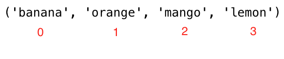
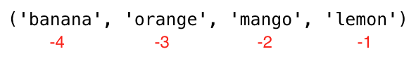

<div align="center">
  <h1> 30 Days Of Python: Day 6 - Tuples</h1>
  <a class="header-badge" target="_blank" href="https://www.linkedin.com/in/asabeneh/">
  
  </a>
  <a class="header-badge" target="_blank" href="https://twitter.com/Asabeneh">
  
  </a>

<sub>Author:
<a href="https://www.linkedin.com/in/asabeneh/" target="_blank">Asabeneh Yetayeh</a><br>
<small> Second Edition: July, 2021</small>
</sub>

</div>

[<< Day 5](../05_Day_Lists/05_lists.md) | [Day 7 >>](../07_Day_Sets/07_sets.md)


- [Day 6:](#day-6)
  - [Tuples](#tuples)
    - [Creating a Tuple](#creating-a-tuple)
    - [Tuple length](#tuple-length)
    - [Accessing Tuple Items](#accessing-tuple-items)
    - [Slicing tuples](#slicing-tuples)
    - [Changing Tuples to Lists](#changing-tuples-to-lists)
    - [Checking an Item in a Tuple](#checking-an-item-in-a-tuple)
    - [Joining Tuples](#joining-tuples)
    - [Deleting Tuples](#deleting-tuples)

# Day 6

## Tuples

Tuple គឺជាការប្រមូលផ្តុំនៃប្រភេទទិន្នន័យខុសគ្នា ដែលមានលំដាប់ និងមិនអាចផ្លាស់ប្តូរាបាន. យើងបង្កើត Tuples ដោយប្រើវង់ក្រចក, ()។  នៅពេលដែល tuple ត្រូវបានបង្កើតឡើង យើងមិនអាចផ្លាស់ប្តូរតម្លៃរបស់វាបានទេ។ យើងមិនអាចប្រើ វិធីសាស្រ្ត add, insert, remove នៅក្នុង tuple ព្រោះវាមិនអាចកែប្រែបាន។
ខុសពីបញ្ជី list, tuple មានវិធីសាស្រ្តមួយចំនួន។ វិធីសាស្ត្រដែលទាក់ទងនឹង tuples:

- tuple(): បង្កើត tuple
- count(): រាប់ចំនួនវត្ថុនៅក្នុង tuple
- index(): រកលេខរៀងនៃវត្ថុណាមួយនៅក្នុង tuple
- + operator: ដើម្បីបញ្ចូល tuples ពីរឬច្រើនជាងនេះនិងដើម្បីបង្កើត tuple ថ្មី

### Creating a Tuple

- Tuple ទទេ: បង្កើត tuple ទទេ
  
  ```py
  # syntax
  empty_tuple = ()
  # or using the tuple constructor
  empty_tuple = tuple()
  ```

- Tuple មានវត្ថុនៅក្នុងពីដើម
  
  ```py
  # syntax
  tpl = ('item1', 'item2','item3')
  ```

  ```py
  fruits = ('banana', 'orange', 'mango', 'lemon')
  ```

### Tuple length

យើងប្រើវិធីសាស្រ្ត _len()_ ដើម្បីរកចំនួនវត្ថុនៅក្នុង tuple។

```py
# syntax
tpl = ('item1', 'item2', 'item3')
len(tpl)
```

### Accessing Tuple Items

ការចូលប្រើវត្ថុរបស់ tuple

- Positive Indexing
  ស្រដៀងគ្នាទៅនឹង list យើងប្រើ indexing វិជ្ជមាន ឬ អវិជ្ជមានដើម្បីចូលទៅកាន់ចំណុចណាមួយនៃ tuple ។
  

  ```py
  # Syntax
  tpl = ('item1', 'item2', 'item3')
  first_item = tpl[0]
  second_item = tpl[1]
  ```

  ```py
  fruits = ('banana', 'orange', 'mango', 'lemon')
  first_fruit = fruits[0]
  second_fruit = fruits[1]
  last_index =len(fruits) - 1
  last_fruit = fruits[las_index]
  ```

- Negative indexing
  Indexing អវិជ្ជមាន មានន័យថាចាប់ផ្តើមពីចុងបញ្ចប់, -1 សំដៅទៅលើចំណុចចុងក្រោយ, -2 សំដៅទៅលើចុងក្រោយទីពីរ និង អវិជ្ជមាននៃប្រវែង list/tuple សំដៅទៅលើចំណុចដំបូង។
  

  ```py
  # Syntax
  tpl = ('item1', 'item2', 'item3','item4')
  first_item = tpl[-4]
  second_item = tpl[-3]
  ```

  ```py
  fruits = ('banana', 'orange', 'mango', 'lemon')
  first_fruit = fruits[-4]
  second_fruit = fruits[-3]
  last_fruit = fruits[-1]
  ```

### Slicing tuples

យើងអាចកាត់ sub-tuple ដោយកំណត់នូវអត្រានៃ index ដែលត្រូវចាប់ផ្តើម និងបញ្ចប់នៅក្នុង tuple, តម្លៃត្រឡប់មកវិញនឹងក្លាយជា tuple ថ្មី។

- កម្រិតនៃ index វិជ្ជមាន

  ```py
  # Syntax
  tpl = ('item1', 'item2', 'item3','item4')
  all_items = tpl[0:4]         # ទាំងអស់
  all_items = tpl[0:]         # ទាំងអស់
  middle_two_items = tpl[1:3]  # មិនមានវត្ថុនៅ index 3
  ```

  ```py
  fruits = ('banana', 'orange', 'mango', 'lemon')
  all_fruits = fruits[0:4]     # ទាំងអស់
  all_fruits = fruits[0:]       # ទាំងអស់
  orange_mango = fruits[1:3]  # មិនមានវត្ថុនៅ index 3
  orange_to_the_rest = fruits[1:]
  ```

- កម្រិតនៃ index អវិជ្ជមាន

  ```py
  # Syntax
  tpl = ('item1', 'item2', 'item3','item4')
  all_items = tpl[-4:]          # ទាំងអស់
  middle_two_items = tpl[-3:-1]  # មិនមានវត្ថុនៅ index 3 (-1)
  ```

  ```py
  fruits = ('banana', 'orange', 'mango', 'lemon')
  all_fruits = fruits[-4:]     # ទាំងអស់
  orange_mango = fruits[-3:-1]  # dមិនមានវត្ថុនៅ index 3
  orange_to_the_rest = fruits[-3:]
  ```

### Changing Tuples to Lists

យើងអាចផ្លាស់ប្តូរ tuples ទៅជា lists និង lists ទៅជា tuples។ Tuple គឺមិនប្រែប្រួល ប្រសិនបើយើងចង់កែប្រែ tuple យើងត្រូវផ្លាស់ប្តូរវាទៅជា list។

```py
# Syntax
tpl = ('item1', 'item2', 'item3','item4')
lst = list(tpl)
```

```py
fruits = ('banana', 'orange', 'mango', 'lemon')
fruits = list(fruits)
fruits[0] = 'apple'
print(fruits)     # ['apple', 'orange', 'mango', 'lemon']
fruits = tuple(fruits)
print(fruits)     # ('apple', 'orange', 'mango', 'lemon')
```

### Checking an Item in a Tuple

យើងអាចត្រួតពិនិត្យថាតើវត្ថយមានឬគ្មាននៅក្នុង tuple ដោយប្រើ _in_ វាត្រឡប់មកវិញជា ចំនួនប៊ូលីន boolean ។

```py
# Syntax
tpl = ('item1', 'item2', 'item3','item4')
'item2' in tpl # True
```

```py
fruits = ('banana', 'orange', 'mango', 'lemon')
print('orange' in fruits) # True
print('apple' in fruits) # False
fruits[0] = 'apple' # TypeError: 'tuple' object does not support item assignment
```

### Joining Tuples

យើងបញ្ចូលគ្នា tuples ពីរឬច្រើនទៀតដោយប្រើប្រតិបត្តិករ +

```py
# syntax
tpl1 = ('item1', 'item2', 'item3')
tpl2 = ('item4', 'item5','item6')
tpl3 = tpl1 + tpl2
```

```py
fruits = ('banana', 'orange', 'mango', 'lemon')
vegetables = ('Tomato', 'Potato', 'Cabbage','Onion', 'Carrot')
fruits_and_vegetables = fruits + vegetables
```

### Deleting Tuples

It is not possible to remove a single item in a tuple but it is possible to delete the tuple itself using _del_.
មិនអាចលុបវត្ថុក្នុង tuple បានទេ ប៉ុន្តែយើងអាចលុប tuple ផ្ទាល់តែម្តងដោយប្រើ _del_ ។

```py
# syntax
tpl1 = ('item1', 'item2', 'item3')
del tpl1

```

```py
fruits = ('banana', 'orange', 'mango', 'lemon')
del fruits
```

[<< Day 5](../05_Day_Lists/05_lists.md) | [Day 7 >>](../07_Day_Sets/07_sets.md)
