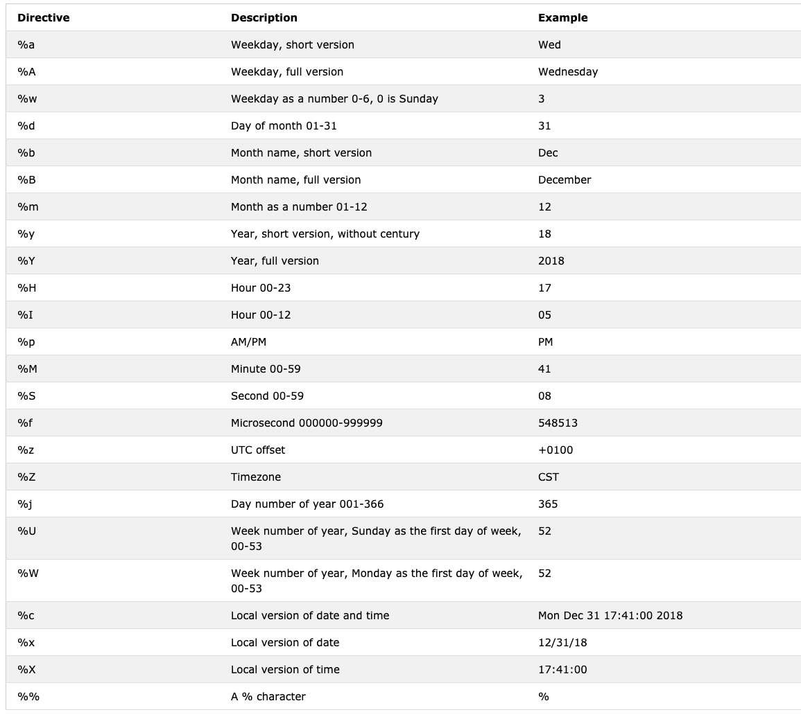

<div align="center">
  <h1> 30 Days Of Python: Day 16 - Python Date time </h1>
  <a class="header-badge" target="_blank" href="https://www.linkedin.com/in/asabeneh/">
  
  </a>
  <a class="header-badge" target="_blank" href="https://twitter.com/Asabeneh">
  
  </a>

  <sub>Author:
  <a href="https://www.linkedin.com/in/asabeneh/" target="_blank">Asabeneh Yetayeh</a><br>
  <small>Second Edition: July, 2021</small>
  </sub>

</div>

[<< Day 15](../15_Day_Python_type_errors/15_python_type_errors.md) | [Day 17 >>](../17_Day_Exception_handling/17_exception_handling.md)


- [📘 Day 16](#-day-16)
  - [Python *datetime*](#python-datetime)
    - [Getting *datetime* Information](#getting-datetime-information)
    - [Formatting Date Output Using *strftime*](#formatting-date-output-using-strftime)
    - [String to Time Using *strptime*](#string-to-time-using-strptime)
    - [Using *date* from *datetime*](#using-date-from-datetime)
    - [Time Objects to Represent Time](#time-objects-to-represent-time)
    - [Difference Between Two Points in Time Using](#difference-between-two-points-in-time-using)
    - [Difference Between Two Points in Time Using *timedelata*](#difference-between-two-points-in-time-using-timedelata)
  - [💻 Exercises: Day 16](#-exercises-day-16)
# 📘 Day 16

## Python *datetime*

Python has got _datetime_ module to handle date and time.

```py
import datetime
print(dir(datetime))
['MAXYEAR', 'MINYEAR', '__builtins__', '__cached__', '__doc__', '__file__', '__loader__', '__name__', '__package__', '__spec__', 'date', 'datetime', 'datetime_CAPI', 'sys', 'time', 'timedelta', 'timezone', 'tzinfo']
```

With dir or help built-in commands it is possible to know the available functions in a certain module. As you can see, in the datetime module there are many functions, but we will focus on _date_, _datetime_, _time_ and _timedelta_. Let se see them one by one.

### Getting *datetime* Information

```py
from datetime import datetime
now = datetime.now()
print(now)                      # 2021-07-08 07:34:46.549883
day = now.day                   # 8
month = now.month               # 7
year = now.year                 # 2021
hour = now.hour                 # 7
minute = now.minute             # 38
second = now.second
timestamp = now.timestamp()
print(day, month, year, hour, minute)
print('timestamp', timestamp)
print(f'{day}/{month}/{year}, {hour}:{minute}')  # 8/7/2021, 7:38
```

Timestamp or Unix timestamp is the number of seconds elapsed from 1st of January 1970 UTC.

### Formatting Date Output Using *strftime*

```py
from datetime import datetime
new_year = datetime(2020, 1, 1)
print(new_year)      # 2020-01-01 00:00:00
day = new_year.day
month = new_year.month
year = new_year.year
hour = new_year.hour
minute = new_year.minute
second = new_year.second
print(day, month, year, hour, minute) #1 1 2020 0 0
print(f'{day}/{month}/{year}, {hour}:{minute}')  # 1/1/2020, 0:0

```

Formatting date time using *strftime* method and the documentation can be found [here](https://strftime.org/).

```py
from datetime import datetime
# current date and time
now = datetime.now()
t = now.strftime("%H:%M:%S")
print("time:", t)
time_one = now.strftime("%m/%d/%Y, %H:%M:%S")
# mm/dd/YY H:M:S format
print("time one:", time_one)
time_two = now.strftime("%d/%m/%Y, %H:%M:%S")
# dd/mm/YY H:M:S format
print("time two:", time_two)
```

```sh
time: 01:05:01
time one: 12/05/2019, 01:05:01
time two: 05/12/2019, 01:05:01
```

Here are all the _strftime_ symbols we use to format time. An example of all the formats for this module.



### String to Time Using *strptime*
Here is a [documentation](https://www.programiz.com/python-programming/datetime/strptimet) hat helps to understand the format. 

```py
from datetime import datetime
date_string = "5 December, 2019"
print("date_string =", date_string)
date_object = datetime.strptime(date_string, "%d %B, %Y")
print("date_object =", date_object)
```

```sh
date_string = 5 December, 2019
date_object = 2019-12-05 00:00:00
```

### Using *date* from *datetime*

```py
from datetime import date
d = date(2020, 1, 1)
print(d)
print('Current date:', d.today())    # 2019-12-05
# date object of today's date
today = date.today()
print("Current year:", today.year)   # 2019
print("Current month:", today.month) # 12
print("Current day:", today.day)     # 5
```

### Time Objects to Represent Time

```py
from datetime import time
# time(hour = 0, minute = 0, second = 0)
a = time()
print("a =", a)
# time(hour, minute and second)
b = time(10, 30, 50)
print("b =", b)
# time(hour, minute and second)
c = time(hour=10, minute=30, second=50)
print("c =", c)
# time(hour, minute, second, microsecond)
d = time(10, 30, 50, 200555)
print("d =", d)
```

output  
a = 00:00:00  
b = 10:30:50  
c = 10:30:50  
d = 10:30:50.200555

### Difference Between Two Points in Time Using

```py
today = date(year=2019, month=12, day=5)
new_year = date(year=2020, month=1, day=1)
time_left_for_newyear = new_year - today
# Time left for new year:  27 days, 0:00:00
print('Time left for new year: ', time_left_for_newyear)

t1 = datetime(year = 2019, month = 12, day = 5, hour = 0, minute = 59, second = 0)
t2 = datetime(year = 2020, month = 1, day = 1, hour = 0, minute = 0, second = 0)
diff = t2 - t1
print('Time left for new year:', diff) # Time left for new year: 26 days, 23: 01: 00
```

### Difference Between Two Points in Time Using *timedelata*

```py
from datetime import timedelta
t1 = timedelta(weeks=12, days=10, hours=4, seconds=20)
t2 = timedelta(days=7, hours=5, minutes=3, seconds=30)
t3 = t1 - t2
print("t3 =", t3)
```

```sh
    date_string = 5 December, 2019
    date_object = 2019-12-05 00:00:00
    t3 = 86 days, 22:56:50
```

🌕 You are an extraordinary. You are 16 steps a head to your way to greatness. Now do some exercises for your brain and muscles.

## 💻 Exercises: Day 16

1. Get the current day, month, year, hour, minute and timestamp from datetime module
1. Format the current date using this format: "%m/%d/%Y, %H:%M:%S")
1. Today is 5 December, 2019. Change this time string to time.
1. Calculate the time difference between now and new year.
1. Calculate the time difference between 1 January 1970 and now.
1. Think, what can you use the datetime module for? Examples:
   - Time series analysis
   - To get a timestamp of any activities in an application
   - Adding posts on a blog 

🎉 CONGRATULATIONS ! 🎉

[<< Day 15](../15_Day_Python_type_errors/15_python_type_errors.md) | [Day 17 >>](../17_Day_Exception_handling/17_exception_handling.md)