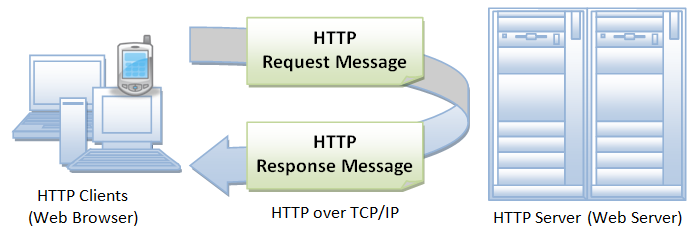
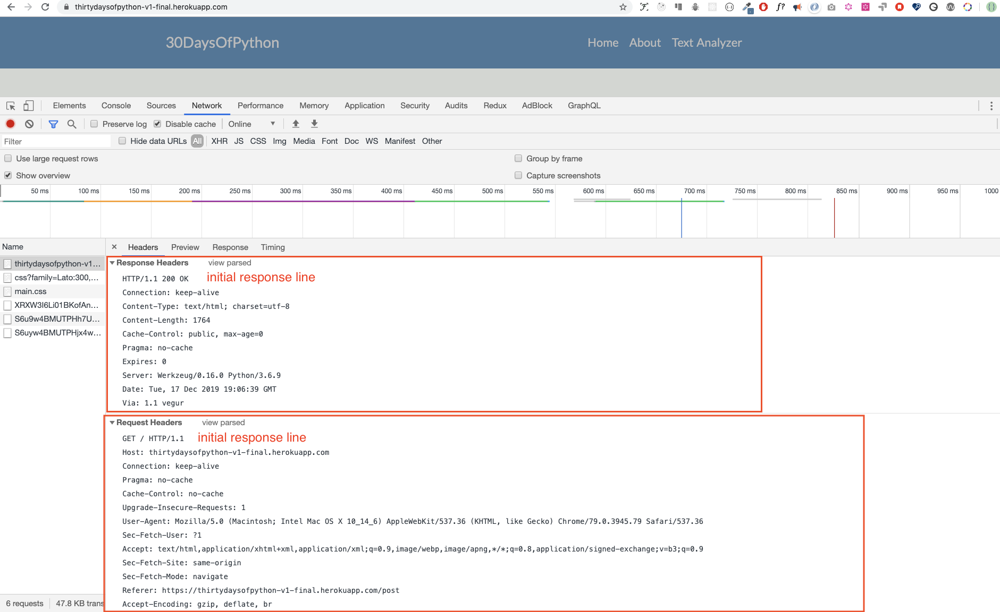

<div align="center">
  <h1> 30 Days Of Python: Day 28 - API </h1>
  <a class="header-badge" target="_blank" href="https://www.linkedin.com/in/asabeneh/">
  
  </a>
  <a class="header-badge" target="_blank" href="https://twitter.com/Asabeneh">
  
  </a>

<sub>Author:
<a href="https://www.linkedin.com/in/asabeneh/" target="_blank">Asabeneh Yetayeh</a><br>
<small>Second Edition: July, 2021</small>
</sub>

</div>
</div>

[<< Day 27](../27_Day_Python_with_mongodb/27_python_with_mongodb.md) | [Day 29 >>](../29_Day_Building_API/29_building_API.md)


- [📘 Day 28](#-day-28)
- [Application Programming Interface(API)](#application-programming-interfaceapi)
  - [API](#api)
  - [Building API](#building-api)
  - [HTTP(Hypertext Transfer Protocol)](#httphypertext-transfer-protocol)
  - [Structure of HTTP](#structure-of-http)
  - [Initial Request Line(Status Line)](#initial-request-linestatus-line)
    - [Initial Response Line(Status Line)](#initial-response-linestatus-line)
    - [Header Fields](#header-fields)
    - [The message body](#the-message-body)
    - [Request Methods](#request-methods)
  - [💻 Exercises: Day 28](#-exercises-day-28)

# 📘 Day 28

# Application Programming Interface(API)

## API

API មានន័យថា Application Programming Interface។ ប្រភេទ API យើងនឹងពិភាក្សាអំពីផ្នែកនេះគឺ Web APIs។
Web APIs គឺជា Interface ដែលត្រូវបានកំណត់ដែលតាមរយៈការទំនាក់ទំនងរវាងសហគ្រាសនិងកម្មវិធីដែលប្រើប្រាស់ធនធានរបស់វា,  ដែលក៏ជា Service Level Agreement (SLA) ដើម្បីកំណត់ផ្លូវសេវាកម្ម ឬ URL សម្រាប់អ្នកប្រើប្រាស់ API របស់វា។

ក្នុងបរិបទ web development, API ត្រូវបានកំណត់ថាជាលក្ខណៈសម្បត្តិ, ដូចជា Hypertext Transfer Protocol (HTTP) request messages, ជាមួយនឹងការកំណត់រចនាសម្ព័ន្ធនៃសារឆ្លើយតប, ជាធម្មតាក្នុង XML ឬ JavaScript Object Notation (JSON) format។

Web API បានចាកចេញពី Simple Object Access Protocol (SOAP) based web services និង service-oriented architecture (SOA) ឆ្ពោះទៅកាន់ការ representational state transfer (REST) style web resources។

Social media services, web APIs បានអនុញ្ញាត web communities ដើម្បីចែករំលែកខ្លឹមសារនិងទិន្នន័យរវាងសហគមន៍និង វេទិកាផ្សេងៗ។

ការប្រើប្រាស់ API, ខ្លឹមសារដែលត្រូវបានបង្កើតឡើងនៅក្នុងកន្លែងតែមួយដោយមានចលនាអាចត្រូវបានបង្ហោះ និងធ្វើតេស្តឡើងវិញទៅកាន់ទីតាំងជាច្រើននៅលើ Web ។

ឧទាហរណ៍, Twitter's REST API អនុញ្ញាត developers ការចូលទៅកាន់ទិន្នន័យសំខាន់របស់ Twitter និង Search API ផ្តល់នូវវិធីសាស្ត្រសម្រាប់ developers ដើម្បីទំនាក់ទំនងជាមួយ Twitter Search និង trends data។

កម្មវិធីជាច្រើនផ្តល់ API end points។ ឧទាហរណ៍ មួយចំនួននៃ API ដូចជាប្រទេស [API](https://restcountries.eu/rest/v2/all), [cat's breed API](https://api.thecatapi.com/v1/breeds).

ក្នុងផ្នែកនេះ យើងនឹងពិនិត្យមើល RESTful API ដែលប្រើ HTTP request methods ដើម្បី GET, PUT, POST និង DELETE data។

## Building API

RESTful API គឺជា application program interface (API) ដែលប្រើ HTTP requests ដើម្បី GET, PUT, POST និង DELETE data។ នៅក្នុងផ្នែកមុននេះយើងបានរៀនអំពី Python, flask និង mongoDB។ យើងនឹងប្រើចំណេះដឹងដែលយើងទទួលបានដើម្បីបង្កើត RESTful API ដោយប្រើ Python flask និង mongoDB database។ កម្មវិធីដែលមាន CRUD(Create, Read, Update, Delete) operation មាន API ដើម្បី create data, ដើម្បី get data, ដើម្បី update data ឬ ដើម្បី delete data ពី database។

ដើម្បីបង្កើត API, យើងគួរយល់ HTTP protocol និង HTTP request និង response cycle។

## HTTP(Hypertext Transfer Protocol)

HTTP គឺជា communication protocol ផ្លូវការរវាង client និង server។ A client។ ក្នុងករណីនេះ គឺ browser និង server គឺជាកន្លែងដែលអ្នកចូលទៅកាន់ទិន្នន័យ។ HTTP គឺជា network protocol ប្រើដើម្បីដឹកនាំធនធានដែលអាចជា files នៅលើ World Wide Web, វាអាចជា HTML files, image files, query results, scripts, ឬ other file types។

A browser គឺជា HTTP client ដោយសារវាត្រូវការដឺកនាំ requests ទៅ HTTP server (Web server), ដែលបន្ទាប់មកផ្ញើការឆ្លើយតបទៅកាន់ client។

## Structure of HTTP

HTTP ប្រើ client-server model។ HTTP client បើកការទំនាក់ទំនងហើយផ្ញើ request message ទៅ HTTP server និង HTTP server ត្រទ្បប់មកវិញ response message ដែលជា requested resources។ នៅពេលដែល request response cycle បញ្ចប់, server នឹងបិតទំនាក់ទំនង។



ទម្រង់នៃ request និង response messages មានលក្ខណៈដូចគ្នា។ សារទាំងពីរប្រភេទមាន

- ខ្សែដំបូង,
- 0 ឬច្រើនខ្សែ headers,
- បន្ទាត់ទទេ (i.e. a CRLF by itself), និង
- សារដែលមិនចាំបាច់ (e.g. a file, or query data, or query output)។

Lយើងមានឧទាហរណ៍មួយនៃ request និង response messages តាមរយៈការមើល site:https://thirtydaysofpython-v1-final.herokuapp.com/. Site នេះបានដាក់ចេញលើ Heroku free dyno និង ក្នុងរយៈពេលមួយខែអាចមិនដំណើរការដោយសារតែតម្រូវការខ្ពស់។ គាំទ្រការងារនេះដើម្បីធ្វើឱ្យ server ដំណើរការគ្រប់ពេល។



## Initial Request Line(Status Line)

ីnitial request line ខុសពី response។
Request line មាន 3 ផ្នែកដែលបែងចែកដោយចំណុចរវាង:

- ឈ្មោះ method(GET, POST, HEAD)
- ផ្លូវនៃ requested resource,
- Version របស់ HTTP កំពុងប្រើប្រាស់។ eg GET / HTTP/1.1

GET គឺជា HTTP ដែលជួយដល់ get ឬ read resource និង POST គឺជាការបង្កើត resource។

### Initial Response Line(Status Line)

The initial response line, ហៅថា status line, ក៏មានផ្នែកបីដែលបែងចែកដោយកន្លែង:

- HTTP version
- Response status code ដែលផ្តល់លទ្ធផលនៃ request, និងមូលហេតុដែលពណ៌នាអំពី status code. ឧទាហរណ៍នៃ status lines គឺ:
  HTTP/1.0 200 OK
  or
  HTTP/1.0 404 Not Found
  Notes:

Status codes ដែកគេប្រើច្រើងជាងគេគឺ:
200 OK: The request succeeded, and the resulting resource (e.g. file or script output) is returned in the message body.
500 Server Error
A complete list of HTTP status code can be found [here](https://httpstatuses.com/). It can be also found [here](https://httpstatusdogs.com/).

### Header Fields

ដូចដែលអ្នកបានឃើញនៅ screenshot ខាងលើ, header lines ផ្តល់ព័ត៌មានអំពី request ឬ response, ឬអំពី object បញ្ជូនទៅក្នុង message body។

```sh
GET / HTTP/1.1
Host: thirtydaysofpython-v1-final.herokuapp.com
Connection: keep-alive
Pragma: no-cache
Cache-Control: no-cache
Upgrade-Insecure-Requests: 1
User-Agent: Mozilla/5.0 (Macintosh; Intel Mac OS X 10_14_6) AppleWebKit/537.36 (KHTML, like Gecko) Chrome/79.0.3945.79 Safari/537.36
Sec-Fetch-User: ?1
Accept: text/html,application/xhtml+xml,application/xml;q=0.9,image/webp,image/apng,*/*;q=0.8,application/signed-exchange;v=b3;q=0.9
Sec-Fetch-Site: same-origin
Sec-Fetch-Mode: navigate
Referer: https://thirtydaysofpython-v1-final.herokuapp.com/post
Accept-Encoding: gzip, deflate, br
Accept-Language: en-GB,en;q=0.9,fi-FI;q=0.8,fi;q=0.7,en-CA;q=0.6,en-US;q=0.5,fr;q=0.4
```

### The message body

HTTP message អាចមានទិន្នន័យដែលត្រូវបានផ្ញើបន្ទាប់ពី header lines។ ក្នុង response, នេះគឺជាកន្លែងដែល requested resource ត្រូវបានបញ្ជូនត្រឡប់ទៅកាន់ client, ឬប្រហែលជា explanatory text ប្រសិនបើមាន error។ ក្នុង request, នេះគឺជាកន្លែងដែល user-entered data ឬ uploaded files ត្រូវបានបញ្ជូនទៅ server។

ប្រសិនបើ HTTP message មាន body, ជាធម្មតាមាន header lines ក្នុង message ដែលបកស្រាយ body។ ជាពិសេស,

The Content-Type: header អោយ MIME-type នៃ data ក្នុង body(text/html, application/json, text/plain, text/css, image/gif).
The Content-Length: header អោយចំនួន bytes ក្នុង body។

### Request Methods

GET, POST, PUT និង DELETE គឺជា HTTP request methods ដែលយើងបង្កើត API ឬ CRUD operation application។

1. GET: GET method ត្រូវបានប្រើដើម្បីទាញយកនិងទទួលបានព័ត៌មានពី server ដោយប្រើ URI។ Requests ប្រើ GET គួរតែទាញយកទិន្នន័យតែប៉ុណ្ណោះ ហើយមិនគួរមានផលប៉ះពាល់ផ្សេងទៀតទៅលើទិន្នន័យនោះទេ។

2. POST: POST request ប្រើដើម្បីបង្កើត data និងបញ្ចូន data ទៅកាន់ server, ឧទាហរណ៍, creating a new post, file upload, etc. using HTML forms។

3. PUT: ប្តូរទាំងអស់នូវ representations នៃ resource យើងចាប់យកជាមួយ uploaded content និងយើងប្រើដើម្បី កែប្រែទិន្នន័យ។

4. DELETE: លុបទិន្នន័យ

[<< Day 27](../27_Day_Python_with_mongodb/27_python_with_mongodb.md) | [Day 29 >>](../29_Day_Building_API/29_building_API.md)