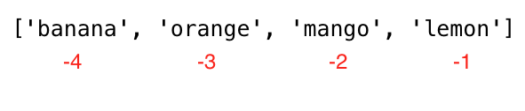

<div align="center">
  <h1> 30 Days Of Python: Day 5 - Lists</h1>
  <a class="header-badge" target="_blank" href="https://www.linkedin.com/in/asabeneh/">
  
  </a>
  <a class="header-badge" target="_blank" href="https://twitter.com/Asabeneh">
  
  </a>

<sub>Author:
<a href="https://www.linkedin.com/in/asabeneh/" target="_blank">Asabeneh Yetayeh</a><br>
<small> Second Edition: July - 2021</small>
</sub>

</div>

[<< Day 4](../04_Day_Strings/04_strings.md) | [Day 6 >>](../06_Day_Tuples/06_tuples.md)


- [Day 5](#day-5)
  - [Lists](#lists)
    - [How to Create a List](#how-to-create-a-list)
    - [Accessing List Items Using Positive Indexing](#accessing-list-items-using-positive-indexing)
    - [Accessing List Items Using Negative Indexing](#accessing-list-items-using-negative-indexing)
    - [Unpacking List Items](#unpacking-list-items)
    - [Slicing Items from a List](#slicing-items-from-a-list)
    - [Modifying Lists](#modifying-lists)
    - [Checking Items in a List](#checking-items-in-a-list)
    - [Adding Items to a List](#adding-items-to-a-list)
    - [Inserting Items into a List](#inserting-items-into-a-list)
    - [Removing Items from a List](#removing-items-from-a-list)
    - [Removing Items Using Pop](#removing-items-using-pop)
    - [Removing Items Using Del](#removing-items-using-del)
    - [Clearing List Items](#clearing-list-items)
    - [Copying a List](#copying-a-list)
    - [Joining Lists](#joining-lists)
    - [Counting Items in a List](#counting-items-in-a-list)
    - [Finding Index of an Item](#finding-index-of-an-item)
    - [Reversing a List](#reversing-a-list)
    - [Sorting List Items](#sorting-list-items)
  - [💻 Exercises: Day 5](#-exercises-day-5)
    - [Exercises: Level 1](#exercises-level-1)
    - [Exercises: Level 2](#exercises-level-2)

# Day 5

## Lists

파이썬에는 네 가지 컬렉션 자료형이 있습니다.

- List: 정렬되고 변경 가능(수정 가능)한 컬렉션입니다. 중복 값을 허용합니다.
- Tuple: 정렬되고 변경 불가능하거나 수정 불가능한(불변) 컬렉션입니다. 중복 값을 허용합니다.
- Set: 순서가 지정되지 않고 인덱스가 없고 수정할 수 없는 컬렉션이지만 새 아이템을 추가할 수 있습니다. 중복 값은 허용되지 않습니다.
- Dictionary: 정렬되지 않고 변경 가능(수정 가능)하며 인덱스가 있는 컬렉션입니다. 중복 값이 없습니다.

리스트는 정렬되고 수정(변경) 가능한 다양한 자료형의 컬렉션입니다. 목록은 비어 있거나 다른 자료형 아이템을 가질 수 있습니다.

### How to Create a List

파이썬에서 리스트는 두가지 방법으로 생성할 수 있습니다:

- list 내장 함수를 사용

```py
# syntax
lst = list()
```

```py
empty_list = list() # 이건 빈 리스트 입니다, 리스트 안에 아무 값도 없습니다
print(len(empty_list)) # 0
```

- 대괄호 사용, []

```py
# syntax
lst = []
```

```py
empty_list = [] # 이건 빈 리스트 입니다, 리스트 안에 아무 값도 없습니다
print(len(empty_list)) # 0
```

초기 값이 있는 리스트입니다. _len()_ 을 사용하여 리스트의 길이를 찾습니다.

```py
fruits = ['banana', 'orange', 'mango', 'lemon']                     # list of fruits
vegetables = ['Tomato', 'Potato', 'Cabbage','Onion', 'Carrot']      # list of vegetables
animal_products = ['milk', 'meat', 'butter', 'yoghurt']             # list of animal products
web_techs = ['HTML', 'CSS', 'JS', 'React','Redux', 'Node', 'MongDB'] # list of web technologies
countries = ['Finland', 'Estonia', 'Denmark', 'Sweden', 'Norway']

# Print the lists and its length
print('Fruits:', fruits)
print('Number of fruits:', len(fruits))
print('Vegetables:', vegetables)
print('Number of vegetables:', len(vegetables))
print('Animal products:',animal_products)
print('Number of animal products:', len(animal_products))
print('Web technologies:', web_techs)
print('Number of web technologies:', len(web_techs))
print('Countries:', countries)
print('Number of countries:', len(countries))
```

```sh
output
Fruits: ['banana', 'orange', 'mango', 'lemon']
Number of fruits: 4
Vegetables: ['Tomato', 'Potato', 'Cabbage', 'Onion', 'Carrot']
Number of vegetables: 5
Animal products: ['milk', 'meat', 'butter', 'yoghurt']
Number of animal products: 4
Web technologies: ['HTML', 'CSS', 'JS', 'React', 'Redux', 'Node', 'MongDB']
Number of web technologies: 7
Countries: ['Finland', 'Estonia', 'Denmark', 'Sweden', 'Norway']
Number of countries: 5
```

- 리스트는 서로 다른 자료형의 아이템을 가질 수 있습니다.

```py
 lst = ['Asabeneh', 250, True, {'country':'Finland', 'city':'Helsinki'}] # 다른 자료형을 가진 리스트
```

### Accessing List Items Using Positive Indexing

인덱스를 사용하여 리스트의 각 아이템에 액세스합니다. 리스트 인덱스는 0부터 시작합니다. 아래 그림은 인덱스가 시작되는 위치를 명확하게 보여줍니다.


```py
fruits = ['banana', 'orange', 'mango', 'lemon']
first_fruit = fruits[0] # 인덱스를 사용해 첫번째 아이템에 접근합니다
print(first_fruit)      # banana
second_fruit = fruits[1]
print(second_fruit)     # orange
last_fruit = fruits[3]
print(last_fruit) # lemon
# Last index
last_index = len(fruits) - 1
last_fruit = fruits[last_index]
```

### Accessing List Items Using Negative Indexing

음수 인덱스는 끝에서 시작하는 것을 의미하며 -1은 마지막 아이템을, -2는 마지막에서 두번쨰 아이템을 의미합니다.



```py
fruits = ['banana', 'orange', 'mango', 'lemon']
first_fruit = fruits[-4]
last_fruit = fruits[-1]
second_last = fruits[-2]
print(first_fruit)      # banana
print(last_fruit)       # lemon
print(second_last)      # mango
```

### Unpacking List Items

```py
lst = ['item','item2','item3', 'item4', 'item5']
first_item, second_item, third_item, *rest = lst
print(first_item)     # item1
print(second_item)    # item2
print(third_item)     # item3
print(rest)           # ['item4', 'item5']

```

```py
# First Example
fruits = ['banana', 'orange', 'mango', 'lemon','lime','apple']
first_fruit, second_fruit, third_fruit, *rest = lst
print(first_fruit)     # banana
print(second_fruit)    # orange
print(third_fruit)     # mango
print(rest)           # ['lemon','lime','apple']
# Second Example about unpacking list
first, second, third,*rest, tenth = [1,2,3,4,5,6,7,8,9,10]
print(first)          # 1
print(second)         # 2
print(third)          # 3
print(rest)           # [4,5,6,7,8,9]
print(tenth)          # 10
# Third Example about unpacking list
countries = ['Germany', 'France','Belgium','Sweden','Denmark','Finland','Norway','Iceland','Estonia']
gr, fr, bg, sw, *scandic, es = countries
print(gr)
print(fr)
print(bg)
print(sw)
print(scandic)
print(es)
```

### Slicing Items from a List

- 양수 인덱싱: start, end 및 step을 지정하여 양수 인덱스 범위를 지정할 수 있습니다. 반환 값은 새 리스트가 됩니다. (start의 디폴트값 = 0, end = len(lst) - 1 (마지막 아이템), step = 1)

```py
fruits = ['banana', 'orange', 'mango', 'lemon']
all_fruits = fruits[0:4] # 모든 fruits를 반환합니다
# 이것또한 위와 같은 값을 반환합니다
all_fruits = fruits[0:] # 우리가 어디서 멈출 지 설정하지 않으면, 모든 것을 포함합니다
orange_and_mango = fruits[1:3] # 첫번째 인덱스를 포함하지 않습니다
orange_mango_lemon = fruits[1:]
orange_and_lemon = fruits[::2] # 여기서 세번째 인자인 step을 사용했습니다. 모든 두번째 아이템을 포함합니다 - ['banana', 'mango']
```

- 음수 인덱싱: start, end 및 step을 지정하여 음수 인덱스의 범위를 지정할 수 있습니다. 반환 값은 새 리스트가 됩니다.

```py
fruits = ['banana', 'orange', 'mango', 'lemon']
all_fruits = fruits[-4:] # 모든 fruits를 반환합니다
orange_and_mango = fruits[-3:-1] # 마지막 인덱스를 포함하지 않습니다,['orange', 'mango']
orange_mango_lemon = fruits[-3:] # 이것은 -3 부터 시작하여 끝까지의 값을 줍니다,['orange', 'mango', 'lemon']
reverse_fruits = fruits[::-1] # 음수의 step은 리스트를 역순으로 가집니다,['lemon', 'mango', 'orange', 'banana']
```

### Modifying Lists

리스트는 변경 가능하거나 수정 가능한 순서가 있는 아이템들의 컬렉션입니다. 과일 리스트를 수정해봅시다.

```py
fruits = ['banana', 'orange', 'mango', 'lemon']
fruits[0] = 'avocado'
print(fruits)       #  ['avocado', 'orange', 'mango', 'lemon']
fruits[1] = 'apple'
print(fruits)       #  ['avocado', 'apple', 'mango', 'lemon']
last_index = len(fruits) - 1
fruits[last_index] = 'lime'
print(fruits)        #  ['avocado', 'apple', 'mango', 'lime']
```

### Checking Items in a List

*in* 연산자를 사용하여 아이템이 리스트의 구성원인지 확인합니다. 아래 예시를 봅시다.

```py
fruits = ['banana', 'orange', 'mango', 'lemon']
does_exist = 'banana' in fruits
print(does_exist)  # True
does_exist = 'lime' in fruits
print(does_exist)  # False
```

### Adding Items to a List

기존 리스트의 끝에 아이템을 추가하려면 *append()* 메서드를 사용합니다.

```py
# syntax
lst = list()
lst.append(item)
```

```py
fruits = ['banana', 'orange', 'mango', 'lemon']
fruits.append('apple')
print(fruits)           # ['banana', 'orange', 'mango', 'lemon', 'apple']
fruits.append('lime')   # ['banana', 'orange', 'mango', 'lemon', 'apple', 'lime']
print(fruits)
```

### Inserting Items into a List

*insert()* 메서드를 사용하여 목록의 지정된 인덱스에 하나의 아이템을 삽입할 수 있습니다. 다른 아이템들은 오른쪽으로 이동한다는 것에 주의합시다. *insert()* 메서드는 인덱스와 삽입할 아이템이라는 두 가지 인자를 가집니다.

```py
# syntax
lst = ['item1', 'item2']
lst.insert(index, item)
```

```py
fruits = ['banana', 'orange', 'mango', 'lemon']
fruits.insert(2, 'apple') # orange와 mango 사이에 apple을 삽입
print(fruits)           # ['banana', 'orange', 'apple', 'mango', 'lemon']
fruits.insert(3, 'lime')   # ['banana', 'orange', 'apple', 'lime', 'mango', 'lemon']
print(fruits)
```

### Removing Items from a List

remove 메서드는 리스트에서 지정된 아이템을 삭제합니다.

```py
# syntax
lst = ['item1', 'item2']
lst.remove(item)
```

```py
fruits = ['banana', 'orange', 'mango', 'lemon', 'banana']
fruits.remove('banana')
print(fruits)  # ['orange', 'mango', 'lemon', 'banana'] - 이 메서드는 리스트에서 첫번째로 존재하는 아이템을 삭제합니다
fruits.remove('lemon')
print(fruits)  # ['orange', 'mango', 'banana']
```

### Removing Items Using Pop

*pop()* 메서드는 지정된 인덱스를 제거합니다(또는 인덱스가 지정되지 않은 경우 마지막 아이템):

```py
# syntax
lst = ['item1', 'item2']
lst.pop()       # 마지막 아이템
lst.pop(index)
```

```py
fruits = ['banana', 'orange', 'mango', 'lemon']
fruits.pop()
print(fruits)       # ['banana', 'orange', 'mango']

fruits.pop(0)
print(fruits)       # ['orange', 'mango']
```

### Removing Items Using Del

*del* 키워드는 지정된 인덱스를 삭제하며 인덱스 범위 내의 아이템을 삭제하는 데도 사용할 수 있습니다. 또한 리스트를 완전히 삭제할 수도 있습니다.

```py
# syntax
lst = ['item1', 'item2']
del lst[index] # 하니의 아이템
del lst        # 리스트를 완전히 삭제
```

```py
fruits = ['banana', 'orange', 'mango', 'lemon', 'kiwi', 'lime']
del fruits[0]
print(fruits)       # ['orange', 'mango', 'lemon', 'kiwi', 'lime']
del fruits[1]
print(fruits)       # ['orange', 'lemon', 'kiwi', 'lime']
del fruits[1:3]     # 이것은 주어진 인덱스 사이의 아이템을 삭제합니다, 그러므로 인덱스가 3인 아이템은 삭제되지 않습니다!
print(fruits)       # ['orange', 'lime']
del fruits
print(fruits)       # NameError: name 'fruits' is not defined 가 발생해야합니다
```

### Clearing List Items

*clear()* 메서드를 사용해 리스트 비우기:

```py
# syntax
lst = ['item1', 'item2']
lst.clear()
```

```py
fruits = ['banana', 'orange', 'mango', 'lemon']
fruits.clear()
print(fruits)       # []
```

### Copying a List

다음의 방법으로 새 변수에 재할당하여 리스트를 복사할 수 있습니다:list2 = list1. 이제 list2는 list1의 참조이며, list2에서 변경한 내용은 원본 list1도 수정합니다. 하지만 원본을 수정하고 싶지 않고 다른 사본을 갖고 싶어하는 경우가 많습니다. 위의 문제를 피하는 한 가지 방법은 _copy()_ 를 사용하는 것입니다.

```py
# syntax
lst = ['item1', 'item2']
lst_copy = lst.copy()
```

```py
fruits = ['banana', 'orange', 'mango', 'lemon']
fruits_copy = fruits.copy()
print(fruits_copy)       # ['banana', 'orange', 'mango', 'lemon']
```

### Joining Lists

파이썬에서 두 개 이상의 목록을 결합하거나 연결하는 방법은 여러 가지가 있습니다.

- 플러스 연산자 (+)

```py
# syntax
list3 = list1 + list2
```

```py
positive_numbers = [1, 2, 3, 4, 5]
zero = [0]
negative_numbers = [-5,-4,-3,-2,-1]
integers = negative_numbers + zero + positive_numbers
print(integers) # [-5, -4, -3, -2, -1, 0, 1, 2, 3, 4, 5]
fruits = ['banana', 'orange', 'mango', 'lemon']
vegetables = ['Tomato', 'Potato', 'Cabbage', 'Onion', 'Carrot']
fruits_and_vegetables = fruits + vegetables
print(fruits_and_vegetables ) # ['banana', 'orange', 'mango', 'lemon', 'Tomato', 'Potato', 'Cabbage', 'Onion', 'Carrot']
```

- extend() 메서드를 사용하여 연결
  *extend()* 메서드를 사용하면 리스트에 리스트를 추가할 수 있습니다. 아래 예를 참조합시다.

```py
# syntax
list1 = ['item1', 'item2']
list2 = ['item3', 'item4', 'item5']
list1.extend(list2)
```

```py
num1 = [0, 1, 2, 3]
num2= [4, 5, 6]
num1.extend(num2)
print('Numbers:', num1) # Numbers: [0, 1, 2, 3, 4, 5, 6]
negative_numbers = [-5,-4,-3,-2,-1]
positive_numbers = [1, 2, 3,4,5]
zero = [0]

negative_numbers.extend(zero)
negative_numbers.extend(positive_numbers)
print('Integers:', negative_numbers) # Integers: [-5, -4, -3, -2, -1, 0, 1, 2, 3, 4, 5]
fruits = ['banana', 'orange', 'mango', 'lemon']
vegetables = ['Tomato', 'Potato', 'Cabbage', 'Onion', 'Carrot']
fruits.extend(vegetables)
print('Fruits and vegetables:', fruits ) # Fruits and vegetables: ['banana', 'orange', 'mango', 'lemon', 'Tomato', 'Potato', 'Cabbage', 'Onion', 'Carrot']
```

### Counting Items in a List

*count()* 메서드는 리스트에 아이템이 나타나는 횟수를 반환합니다:

```py
# syntax
lst = ['item1', 'item2']
lst.count(item)
```

```py
fruits = ['banana', 'orange', 'mango', 'lemon']
print(fruits.count('orange'))   # 1
ages = [22, 19, 24, 25, 26, 24, 25, 24]
print(ages.count(24))           # 3
```

### Finding Index of an Item

*index()* 메서드는 리스트에 있는 아이템의 인덱스를 반환합니다:

```py
# syntax
lst = ['item1', 'item2']
lst.index(item)
```

```py
fruits = ['banana', 'orange', 'mango', 'lemon']
print(fruits.index('orange'))   # 1
ages = [22, 19, 24, 25, 26, 24, 25, 24]
print(ages.index(24))           # 2, 처음 만난 것
```

### Reversing a List

*reverse()* 메서드는 리스트의 순서를 거꾸로 합니다.

```py
# syntax
lst = ['item1', 'item2']
lst.reverse()

```

```py
fruits = ['banana', 'orange', 'mango', 'lemon']
fruits.reverse()
print(fruits) # ['lemon', 'mango', 'orange', 'banana']
ages = [22, 19, 24, 25, 26, 24, 25, 24]
ages.reverse()
print(ages) # [24, 25, 24, 26, 25, 24, 19, 22]
```

### Sorting List Items

리스트를 정렬하려면 _sort()_ 메서드 또는 _sorted()_ 내장 함수를 사용할 수 있습니다. _sort()_ 메서드는 리스트 아이템을 오름차순으로 정렬하고 원래 리스트를 수정합니다. 만약 _sort()_ 메서드의 reverse의 인자가 true라면, 그것은 목록을 내림차순으로 배열할 것입니다.

- sort(): 이 메서드는 원래 리스트를 수정합니다

  ```py
  # syntax
  lst = ['item1', 'item2']
  lst.sort()                # 오름차순
  lst.sort(reverse=True)    # 내림차순
  ```

  **Example:**

  ```py
  fruits = ['banana', 'orange', 'mango', 'lemon']
  fruits.sort()
  print(fruits)             # 알파벳순으로 정렬, ['banana', 'lemon', 'mango', 'orange']
  fruits.sort(reverse=True)
  print(fruits) # ['orange', 'mango', 'lemon', 'banana']
  ages = [22, 19, 24, 25, 26, 24, 25, 24]
  ages.sort()
  print(ages) #  [19, 22, 24, 24, 24, 25, 25, 26]
 
  ages.sort(reverse=True)
  print(ages) #  [26, 25, 25, 24, 24, 24, 22, 19]
  ```

  sorted(): 원래 리스트를 수정하지 않고 정렬된 리스트를 반환합니다
  **Example:**

  ```py
  fruits = ['banana', 'orange', 'mango', 'lemon']
  print(sorted(fruits))   # ['banana', 'lemon', 'mango', 'orange']
  # 역순
  fruits = ['banana', 'orange', 'mango', 'lemon']
  fruits = sorted(fruits,reverse=True)
  print(fruits)     # ['orange', 'mango', 'lemon', 'banana']
  ```

🌕 당신은 성실하고 이미 많은 것을 성취했습니다. 여러분은 이제 막 5일차 도전을 마쳤고 위대함을 향한 5걸음 앞에 있습니다. 이제 여러분의 뇌와 근육을 위한 운동을 하세요.

## 💻 Exercises: Day 5

### Exercises: Level 1

1. 빈 리스트를 선언합니다
2. 5개 이상의 아이템을 갖는 리스트를 선언합니다
3. 당신의 리스트의 길이를 알아봅니다
4. 리스트의 첫번째, 중간의, 마지막 아이템을 얻어봅니다
5. mixed_data_types 라는 리스트를 선언하고, 당신의 이름, 나이, 키, 결혼 여부, 주소를 넣어봅시다
6. it_companies 라는 이름의 목록 변수를 선언하고 초기 값에 Facebook, Google, Microsoft, Apple, IBM, Oracle 및 Amazon을 할당합니다
7. _print()_ 를 사용하여 리스트를 프린트 합니다
8. 리스트에 있는 기업 수를 프린트 합니다
9. 첫번째, 중간, 마지막 기업을 프린트 합니다
10. 기업 중 하나를 수정하고 리스트를 프린트 합니다
11. it_companies 에 하나의 IT 기업을 추가합니다
12. 회사 리스트 중간에 IT 기업을 추가합니다
13. it_companies 이름 중 하나를 대문자로 변경합니다 (IBM 제외!)
14. '#;&nbsp; ' 라는 문자열로 it_companies 에 연결합니다
15. it_companies 리스트에 특정 기업이 존재하는 지 확인합니다
16. sort() 메서드를 사용해 리스트를 정렬합니다
17. reverse() 메서드를 사용하여 리스트를 내림차순으로 반전합니다
18. 리스트에서 처음 3개의 기업을 잘라냅니다
19. 리스트에서 마지막 3개의 기업을 잘라냅니다
20. 리스트에서 중간의 IT 기업 또는 기업들을 잘라냅니다
21. 리스트에서 첫번째 IT 기업을 삭제합니다
22. 리스트에서 중간의 IT 기업 또는 기업들을 삭제합니다
23. 리스트에서 마지막 IT 기업을 삭제합니다
24. 리스트에서 모든 IT 기업을 삭제합니다
25. IT 기업 리스트를 완전히 제거합니다
26. 다음 리스트를 연결합니다:

    ```py
    front_end = ['HTML', 'CSS', 'JS', 'React', 'Redux']
    back_end = ['Node','Express', 'MongoDB']
    ```

27. 26번 문제의 리스트를 연결한 후, 연결된 리스트를 복사해 full_stack 변수에 할당합니다. 그리고 Python, SQL, Redux를 삽입합니다.

### Exercises: Level 2

1. 다음은 10명의 학생의 나이 리스트입니다:

```sh
ages = [19, 22, 19, 24, 20, 25, 26, 24, 25, 24]
```

- 리스트를 정렬하고 최소값 및 최대값 찾습니다
- 리스트에 최소값 및 최대값을 다시 추가합니다
- 나이의 중위값을 찾습니다(중간 아이템 하나 또는 중간 아이템 두 개를 2로 나눈 값)
- 평균 나이를 구합니다(모든 아이템의 합을 개수로 나눈 값)
- 나이의 범위를 구합니다(최대값 빼기 최소값)
-  (최소값 - 평균)과 (최대값 - 평균)의 값을 비교하고 _abs()_ 메서드를 사용합니다.

1. [국가 목록](https://github.com/Asabeneh/30-Days-Of-Python/tree/master/data/countries.py) 에서 중간 국가를 찾습니다.
1. 국가 리스트를 두개의 리스트로 나눕니다. 짝수라면 두개의 리스트의 크기가 갖게, 아니라면 앞의 리스트가 하나의 국가를 더 갖도록 합니다.
1. ['China', 'Russia', 'USA', 'Finland', 'Sweden', 'Norway', 'Denmark']. 앞의 세개 국가와 나머지를 scandic countries로 unpack합니다.

🎉 CONGRATULATIONS ! 🎉

[<< Day 4](../04_Day_Strings/04_strings.md) | [Day 6 >>](../06_Day_Tuples/06_tuples.md)
