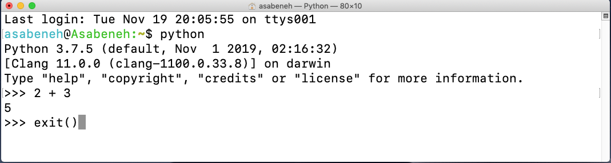
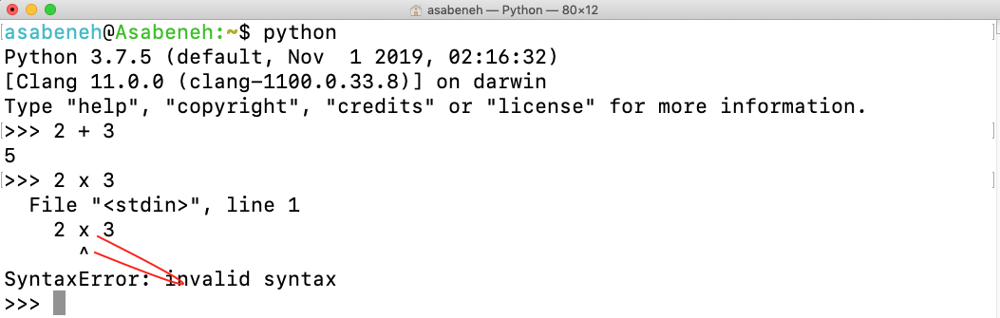
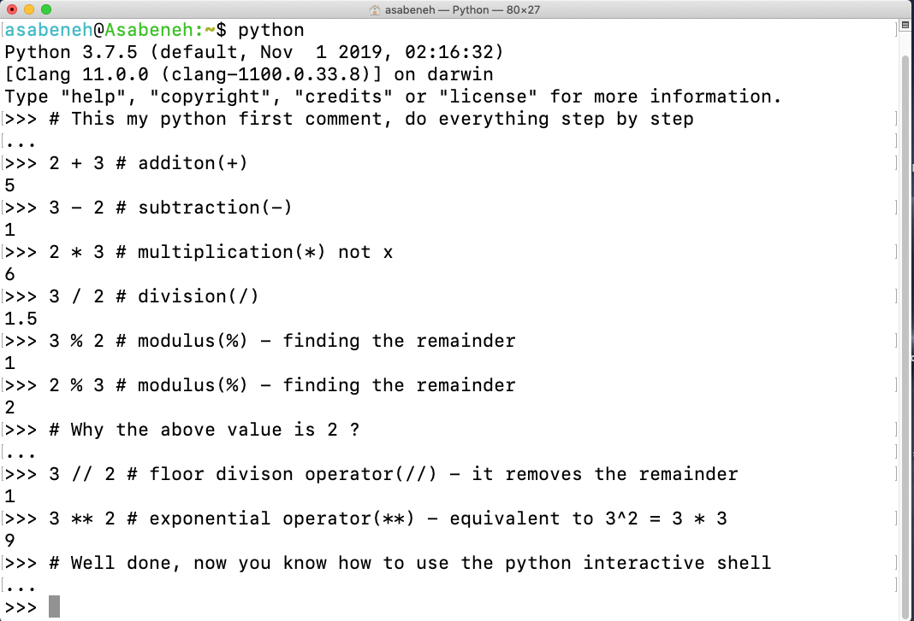
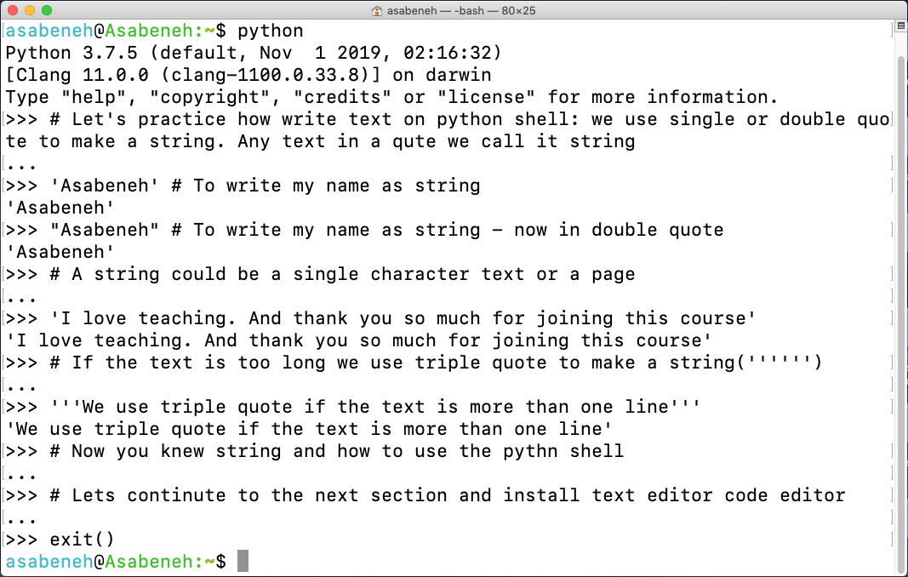
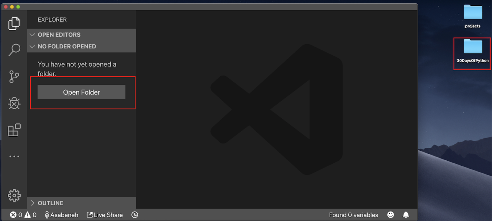
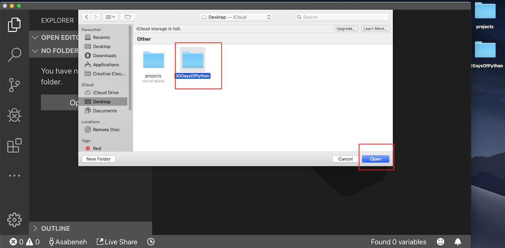
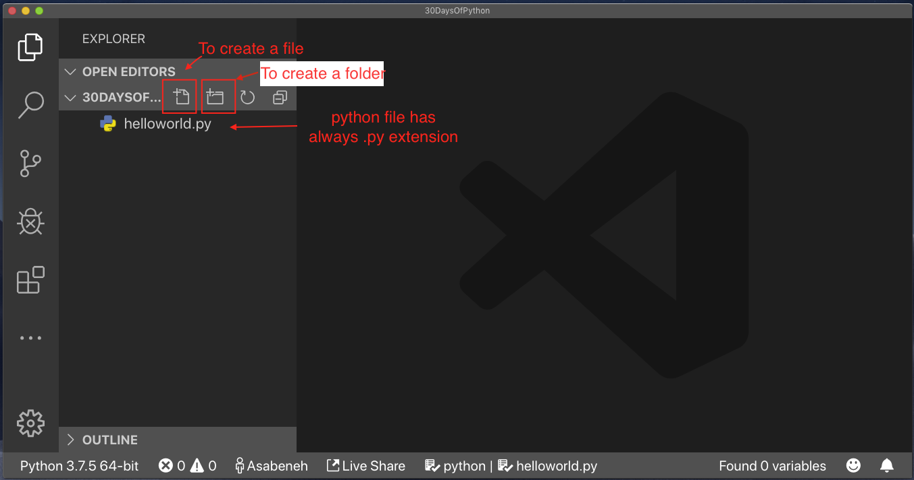

# 🐍 30 Days Of Python 

|# Day | Topics                                                    |
|------|:---------------------------------------------------------:|
| 01  |  [Introduction](./readme_ko.md)|
| 02  |  [Variables, Built-in Functions](../02_Day_Variables_builtin_functions/02_variables_builtin_functions.md)|
| 03  |  [Operators](../03_Day_Operators/03_operators.md)|
| 04  |  [Strings](../04_Day_Strings/04_strings.md)|
| 05  |  [Lists](../05_Day_Lists/05_lists.md)|
| 06  |  [Tuples](../06_Day_Tuples/06_tuples.md)|
| 07  |  [Sets](../07_Day_Sets/07_sets.md)|
| 08  |  [Dictionaries](../08_Day_Dictionaries/08_dictionaries.md)|
| 09  |  [Conditionals](../09_Day_Conditionals/09_conditionals.md)|
| 10  |  [Loops](../10_Day_Loops/10_loops.md)|
| 11  |  [Functions](../11_Day_Functions/11_functions.md)|
| 12  |  [Modules](../12_Day_Modules/12_modules.md)|
| 13  |  [List Comprehension](../13_Day_List_comprehension/13_list_comprehension.md)|
| 14  |  [Higher Order Functions](../14_Day_Higher_order_functions/14_higher_order_functions.md)|     
| 15  |  [Python Type Errors](../15_Day_Python_type_errors/15_python_type_errors.md)| 
| 16 |  [Python Date time](../16_Day_Python_date_time/16_python_datetime.md) |     
| 17 |  [Exception Handling](../17_Day_Exception_handling/17_exception_handling.md)|    
| 18 |  [Regular Expressions](../18_Day_Regular_expressions/18_regular_expressions.md)|    
| 19 |  [File Handling](../19_Day_File_handling/19_file_handling.md)|
| 20 |  [Python Package Manager](../20_Day_Python_package_manager/20_python_package_manager.md)|
| 21 |  [Classes and Objects](../21_Day_Classes_and_objects/21_classes_and_objects.md)|
| 22 |  [Web Scraping](../22_Day_Web_scraping/22_web_scraping.md)|
| 23 |  [Virtual Environment](../23_Day_Virtual_environment/23_virtual_environment.md)|
| 24 |  [Statistics](../24_Day_Statistics/24_statistics.md)|
| 25 |  [Pandas](../25_Day_Pandas/25_pandas.md)|
| 26 |  [Python web](../26_Day_Python_web/26_python_web.md)|
| 27 |  [Python with MongoDB](../27_Day_Python_with_mongodb/27_python_with_mongodb.md)|
| 28 |  [API](../28_Day_API/28_API.md)|
| 29 |  [Building API](../29_Day_Building_API/29_building_API.md)|
| 30 |  [Conclusions](../30_Day_Conclusions/30_conclusions.md)|

🧡🧡🧡 HAPPY CODING 🧡🧡🧡

<div>
<small>Support the <strong>author</strong> to create more educational materials</small> <br />  
<a href = "https://www.paypal.me/asabeneh"></a>
</div>

<div align="center">
  <h1> 30 Days Of Python: Day 1 - Introduction</h1>
  <a class="header-badge" target="_blank" href="https://www.linkedin.com/in/asabeneh/">
  
  </a>
  <a class="header-badge" target="_blank" href="https://twitter.com/Asabeneh">
  
  </a>

  <sub>Author:
  <a href="https://www.linkedin.com/in/asabeneh/" target="_blank">Asabeneh Yetayeh</a><br>
  <small> Second Edition: July, 2021</small>
  </sub>
</div>


[Day 2 >>](../02_Day_Variables_builtin_functions/02_variables_builtin_functions.md)


- [🐍 30 Days Of Python](#-30-days-of-python)
- [📘 Day 1](#-day-1)
  - [환영합니다](#환영합니다)
  - [소개](#소개)
  - [왜 Python이느냐?](#왜-python이느냐?)
  - [환경 설정](#환경-설정)
    - [Python 설치](#python-설치)
    - [Python 셸](#python-셸)
    - [Visual Studio Code 설치](#visual-studio-code-설치)
      - [visual studio code를 사용하기](#visual-studio-code를-사용하기)
  - [Python 기본](#python-기본)
    - [Python 구문](#python-구문)
    - [Python 들여쓰기](#python-들여쓰기)
    - [주석](#주석)
    - [데이터 타입](#데이터-타입)
      - [Number](#number)
      - [String](#string)
      - [Booleans](#booleans)
      - [List](#list)
      - [Dictionary](#dictionary)
      - [Tuple](#tuple)
      - [Set](#set)
    - [데이터 타입 체크](#데이터-타입-체크)
    - [Python 파일](#python-파일)
  - [💻 Exercises - Day 1](#-exercises---day-1)
    - [Exercise: Level 1](#exercise-level-1)
    - [Exercise: Level 2](#exercise-level-2)
    - [Exercise: Level 3](#exercise-level-3)

# 📘 Day 1

## 환영합니다

_30 days of Python_에 참여하기로 결정하신 것을 **축하드립니다**. 이 챌린지에서는 Python 프로그래머가 되기 위해 필요한 모든 것과 프로그래밍의 전체 개념을 배우게 됩니다. 챌린지가 끝나면 _30DaysOfPython_프로그래밍 챌린지 인증서를 받게 됩니다.

챌린지에 적극적으로 참여하고 싶다면 [30DaysOfPython challenge](https://t.me/ThirtyDaysOfPython) 텔레그램 그룹에 가입할 수 있습니다. 

## 소개

Python은 범용 프로그래밍을 위한 고급 프로그래밍 언어입니다. 오픈 소스, 인터프리터, 객체 지향 프로그래밍 언어입니다. Python은 네덜란드 프로그래머 Guido van Rossum이 만들었습니다. Python 프로그래밍 언어의 이름은 영국 스케치 코미디 시리즈 *Month Python's Flying Circus* 에서 파생되었습니다.  첫 번째 버전은 1991년 2월 20일에 출시되었습니다. 이 30일간의 Python 챌린지는 최신 버전의 Python인 Python 3를 차근차근 배울 수 있도록 도와줄 것입니다. 주제는 30일로 나뉘며, 매일 이해하기 쉬운 설명, 실제 사례, 많은 실습 및 프로젝트가 포함된 여러 주제가 포함됩니다.

이 챌린지는 Python 프로그래밍 언어를 배우고자 하는 초보자와 전문가를 위해 고안되었습니다. 챌린지를 완료하는 데 30~100일이 소요될 수 있으며 텔레그램 그룹에 적극적으로 참여하는 사람들이 챌린지를 완료할 확률이 높습니다.
시각적 학습자이거나 동영상을 선호하는 경우 이 [완전 초보를 위한 Python 동영상](https://www.youtube.com/watch?v=11OYpBrhdyM)으로 시작할 수 있습니다.

## 왜 Python이느냐?

인간의 언어에 매우 가깝고 배우기 쉽고 사용하기 쉬운 프로그래밍 언어입니다.
Python은 다양한 산업 및 회사(Google 포함)에서 사용됩니다. 웹 응용 프로그램, 데스크톱 응용 프로그램, 시스템 관리 및 기계 학습 라이브러리를 개발하는 데 사용되었습니다. Python은 데이터 과학 및 기계 학습 커뮤니티에서 널리 사용되는 언어입니다. 이것이 Python 학습을 시작하도록 설득하기에 충분하기를 바랍니다. Python은 세상을 지배하고 있으니 지배 당하기 전에 Python을 지배하십시오.
## 환경 설정

### Python 설치

Python 스크립트를 실행하려면 Python을 설치해야 합니다. Python을 [다운로드](https://www.python.org/)합시다.
Windows 사용자인 경우. 빨간색 동그라미 친 버튼을 클릭합니다.


macOS 사용자인 경우. 빨간색 동그라미 친 버튼을 클릭합니다.

[](https://www.python.org/)

Python이 설치되어 있는지 확인하려면 장치 터미널에 다음 명령을 작성하십시오.

```shell
python --version
```


터미널에서 보시다시피 저는 현재 _Python 3.7.5_ 버전을 사용하고 있습니다. 귀하의 Python 버전은 내 버전과 다를 수 있지만 3.6 이상이어야 합니다. Python 버전을 볼 수 있다면 잘한 것입니다. 이제 컴퓨터에 Python이 설치되었습니다. 다음 섹션으로 계속 진행하십시오.

### Python 셸

Python은 해석된 스크립팅 언어이므로 컴파일할 필요가 없습니다. 코드를 한 줄씩 실행한다는 의미입니다. Python은 _Python Shell(Python Interactive Shell)_과 함께 제공됩니다. 단일 Python 명령을 실행하고 결과를 얻는 데 사용됩니다.

Python Shell은 사용자의 Python 코드를 기다립니다. 코드를 입력하면 코드를 해석하여 다음 줄에 결과를 표시합니다.
터미널이나 명령 프롬프트(cmd)를 열고 쓰기:

```shell
python
```


Python 대화형 셸이 열리고 Python 코드(Python 스크립트)를 작성하기를 기다립니다. 기호 >>> 옆에 Python 스크립트를 작성하고 Enter를 누릅니다.
Python 스크립팅 셸에서 첫 번째 스크립트를 작성해 보겠습니다.


훌륭합니다. Python 대화형 셸에서 첫 번째 Python 스크립트를 작성했습니다. Python 대화형 셸을 어떻게 닫습니까?
셸을 닫으려면 기호 옆에 >> **exit()** 명령을 작성하고 Enter 키를 누릅니다.



이제 Python 대화형 셸을 여는 방법과 종료하는 방법을 알았습니다.

Python은 Python이 이해하는 스크립트를 작성하면 결과를 제공하고 그렇지 않으면 오류를 반환합니다. 고의적인 실수를 하고 Python이 무엇을 반환하는지 봅시다.



반환된 오류에서 볼 수 있듯이 Python은 우리가 저지른 실수와 _Syntax Error: invalid syntax_를 알고 있을 정도로 영리합니다. Python에서 x를 곱셈으로 사용하는 것은 (x)가 Python에서 유효한 구문이 아니기 때문에 구문 오류입니다. (**x**) 대신 곱셈에 별표(*)를 사용합니다. 반환된 오류는 수정해야 할 사항을 명확하게 보여줍니다.

프로그램에서 오류를 식별하고 제거하는 프로세스를 *디버깅*이라고 합니다. **x** 대신 *를 넣어 디버깅해 봅시다.


버그가 수정되었고 코드가 실행되었으며 예상했던 결과를 얻었습니다. 프로그래머로서 매일 이러한 종류의 오류를 보게 될 것입니다. 디버깅 방법을 아는 것이 좋습니다. 디버깅을 잘하려면 어떤 종류의 오류가 발생했는지 이해해야 합니다. 발생할 수 있는 Python 오류 중 일부는 *SyntaxError*, *IndexError*, *NameError*, *ModuleNotFoundError*, *KeyError*, *ImportError*, *AttributeError*, *TypeError*, *ValueError*, *ZeroDivisionError* 등입니다. 이후 섹션에서 다른 Python **_오류 유형_**에 대해 자세히 알아볼 것입니다.

Python 대화형 셸을 사용하는 방법을 더 연습해 보겠습니다. 터미널이나 명령 프롬프트로 이동하여 **python**이라는 단어를 씁니다.


Python 대화형 셸이 열립니다. 몇 가지 기본적인 수학 연산(더하기, 빼기, 곱하기, 나누기, 나머지, 지수)을 수행해 보겠습니다.

Python 코드를 작성하기 전에 먼저 몇 가지 수학을 수행해 보겠습니다:

- 2 + 3 = 5
- 3 - 2 = 1
- 3 \* 2 = 6
- 3 / 2 = 1.5
- 3 ^ 2 = 3 x 3 = 9

Python에는 다음과 같은 추가 작업이 있습니다:

- 3 % 2 = 1 => 나머지를 구함
- 3 // 2 = 1 => 나머지를 제거

위의 수학식을 Python 코드로 바꿔봅시다. Python 셸이 열렸으며 셸 맨 처음에 주석을 작성하겠습니다.

_comment_는 Python에 의해 실행되지 않는 코드의 일부입니다. 따라서 코드를 더 읽기 쉽게 만들기 위해 코드에 일부 텍스트를 남길 수 있습니다. Python은 주석 부분을 실행하지 않습니다. Python에서 주석은 해시(#) 기호로 시작합니다.
이것이 Python에서 주석을 작성하는 방법입니다

```shell
 # 주석은 해시로 시작합니다.
 # (#) 심볼로 시작하기 때문에 이것은 파이썬 주석입니다.
```



다음 섹션으로 이동하기 전에 Python 대화형 셸에서 더 많은 연습을 해 보겠습니다. 셸에서 _exit()_를 작성하여 열린 셸을 닫았다가 다시 열어 Python 셸에서 텍스트를 쓰는 방법을 연습해 봅시다.



### Visual Studio Code 설치

Python 대화형 셸은 작은 스크립트 코드를 시도하고 테스트하는 데 적합하지만 큰 프로젝트에는 적합하지 않습니다. 실제 작업 환경에서 개발자는 다양한 코드 편집기를 사용하여 코드를 작성합니다. 이 30일간의 Python 프로그래밍 챌린지에서는 Visual Studio 코드를 사용합니다. Visual Studio Code는 매우 인기 있는 오픈 소스 텍스트 편집기입니다. 나는 vscode의 팬이고 Visual Studio 코드를 [다운로드](https://code.visualstudio.com/)하는 것을 추천하고 싶지만, 다른 편집자를 선호한다면 가지고 있는 것을 자유롭게 따르십시오.

[](https://code.visualstudio.com/)

Visual Studio Code를 설치하셨다면 어떻게 사용하는지 알아보겠습니다.
비디오를 선호하는 경우 Python용 Visual Studio Code[비디오 자습서](https://www.youtube.com/watch?v=bn7Cx4z-vSo)를 따를 수 있습니다.

#### visual studio code를 사용하기

Visual Studio 아이콘을 두 번 클릭하여 Visual Studio 코드를 엽니다. 열면 이런 종류의 인터페이스가 나타납니다. 레이블이 지정된 아이콘을 따라해보세요.


바탕 화면에 30DaysOfPython이라는 폴더를 만듭니다. 그런 다음 Visual Studio 코드를 사용하여 엽시다.





파일을 열면 30DaysOfPython 프로젝트의 디렉토리 내부에 파일과 폴더를 생성하기 위한 바로 가기가 표시됩니다. 아래에서 볼 수 있듯이 첫 번째 파일인 helloworld.py를 만들었습니다. 당신도 똑같이 할 수 있습니다.



하루동안 오래 코딩을 한 후에 코드 편집기를 닫고 싶습니까? 이렇게 열린 프로젝트를 닫으면 됩니다.


축하합니다. 개발 환경 설정을 완료했습니다. 코딩을 시작해 봅시다.

## Python 기본

### Python 구문

Python 스크립트는 Python 대화형 셸 또는 코드 편집기에서 작성할 수 있습니다. Python 파일의 확장자는 .py입니다.

### Python 들여 쓰기

들여쓰기는 텍스트의 공백입니다. 많은 언어에서 들여쓰기는 코드 가독성을 높이는 데 사용되지만 Python은 들여쓰기를 사용하여 코드 블록을 만듭니다. 다른 프로그래밍 언어에서는 중괄호를 사용하여 들여쓰기 대신 코드 블록을 만듭니다. Python 코드를 작성할 때 흔히 발생하는 버그 중 하나는 잘못된 들여쓰기입니다.


### 주석

주석은 코드를 더 읽기 쉽게 만들고 코드에 설명을 남기기 위해 매우 중요합니다. Python은 코드의 주석 부분을 실행하지 않습니다.
Python에서 해시(#)로 시작하는 모든 텍스트는 주석입니다.

**예시:한 문장 주석**

```shell
    # This is the first comment
    # This is the second comment
    # Python is eating the world
```

**예시: 여러 문장 주석**

Triple quote can be used for multiline comment if it is not assigned to a variable

```shell
"""This is multiline comment
multiline comment takes multiple lines.
python is eating the world
"""
```

### 데이터 타입

Python에는 여러 유형의 데이터 유형이 있습니다. 가장 일반적인 것부터 시작하겠습니다. 다른 데이터 유형은 다른 섹션에서 자세히 다룰 것입니다. 당분간 다양한 데이터 유형을 살펴보고 익숙해지도록 합시다. 지금은 명확하게 이해하지 않아도 됩니다.

#### Number

- Integer: 정수(음수, 영 그리고 양수)
    예시:
    ... -3, -2, -1, 0, 1, 2, 3 ...
- Float: 십진수
    예시
    ... -3.5, -2.25, -1.0, 0.0, 1.1, 2.2, 3.5 ...
- Complex
    예시
    1 + j, 2 + 4j

#### String

작은따옴표 또는 큰따옴표 아래에 있는 하나 이상의 문자 모음입니다. 문자열이 두 문장 이상인 경우 삼중 따옴표를 사용합니다.

**예시:**

```py
'Asabeneh'
'Finland'
'Python'
'I love teaching'
'I hope you are enjoying the first day of 30DaysOfPython Challenge'
```

#### Boolean

부울 데이터 유형은 True 또는 False 값입니다. T와 F는 항상 대문자여야 합니다.

**예시:**

```python
    True  #  불이 켜져있나요? 그러면 참입니다.
    False # 불이 꺼져있나요? 그러면 거짓입니다.
```

#### List

Python 리스트는 다른 데이터 유형 항목을 저장할 수 있는 정렬된 컬렉션입니다. 리스트는 JavaScript의 배열과 비슷합니다.

**Example:**

```py
[0, 1, 2, 3, 4, 5]  # 모두 동일한 데이터 유형 - 숫자 리스트
['Banana', 'Orange', 'Mango', 'Avocado'] # 모두 동일한 데이터 유형 - 문자열 리스트(과일)
['Finland','Estonia', 'Sweden','Norway'] # 모두 동일한 데이터 유형 - 문자열 리스트(국가)
['Banana', 10, False, 9.81] # 리스트의 다양한 데이터 유형 - 문자열, 정수, 부울 및 부동 소수점
```

#### Dictionary

Python 사전 개체는 키 값 쌍 형식의 정렬되지 않은 데이터 모음입니다.

**Example:**

```py
{
'first_name':'Asabeneh',
'last_name':'Yetayeh',
'country':'Finland', 
'age':250, 
'is_married':True,
'skills':['JS', 'React', 'Node', 'Python']
}
```

#### Tuple

튜플은 목록과 같은 다양한 데이터 유형의 정렬된 모음이지만 튜플이 생성되면 수정할 수 없습니다. 그것들은 변할 수 없습니다.

**Example:**

```py
('Asabeneh', 'Pawel', 'Brook', 'Abraham', 'Lidiya') # Names
```

```py
('Earth', 'Jupiter', 'Neptune', 'Mars', 'Venus', 'Saturn', 'Uranus', 'Mercury') # planets
```

#### Set

집합은 목록 및 튜플과 유사한 데이터 유형의 모음입니다. 목록 및 튜플과 달리 집합은 순서가 지정된 항목 모음이 아닙니다. 수학에서와 마찬가지로 Python에서 set은 고유한 항목만 저장합니다.

이후 섹션에서는 각각의 모든 Python 데이터 유형에 대해 자세히 설명합니다.

**Example:**

```py
{2, 4, 3, 5}
{3.14, 9.81, 2.7} # order is not important in set
```

### 데이터 타입 체크

특정 데이터/변수의 데이터 유형을 확인하기 위해 **type** 기능을 사용합니다. 다음 터미널에서 다양한 Python 데이터 유형을 볼 수 있습니다:


### Python 파일

먼저 프로젝트 폴더인 30DaysOfPython을 엽니다. 이 폴더가 없으면 30DaysOfPython이라는 폴더 이름을 만듭니다. 이 폴더 안에 helloworld.py라는 파일을 만듭니다. 이제 Visual Studio 코드를 사용하여 Python 대화형 셸에서 수행한 작업을 수행해 보겠습니다.

Python 대화형 셸은 **print**를 사용하지 않고 인쇄했지만 Visual Studio 코드에서 결과를 보려면 내장 함수 *print()를 사용해야 합니다. *print()* 내장 함수는 *print('arument1', 'argument2', 'argument3')*와 같이 하나 이상의 인수를 사용합니다. 아래 예를 참조하십시오.

**Example:**

파일 이름은 helloworld.py.

```py
# Day 1 - 30DaysOfPython Challenge

print(2 + 3)             # addition(+)
print(3 - 1)             # subtraction(-)
print(2 * 3)             # multiplication(*)
print(3 / 2)             # division(/)
print(3 ** 2)            # exponential(**)
print(3 % 2)             # modulus(%)
print(3 // 2)            # Floor division operator(//)

# Checking data types
print(type(10))          # Int
print(type(3.14))        # Float
print(type(1 + 3j))      # Complex number
print(type('Asabeneh'))  # String
print(type([1, 2, 3]))   # List
print(type({'name':'Asabeneh'})) # Dictionary
print(type({9.8, 3.14, 2.7}))    # Set
print(type((9.8, 3.14, 2.7)))    # Tuple
```

Python 파일을 실행하려면 아래 이미지를 확인하세요. Visual Studio Code에서 녹색 버튼을 실행하거나 터미널에 *python helloworld.py*를 입력하여 Python 파일을 실행할 수 있습니다.


🌕  좋습니다. 당신은 방금 1일차 도전을 완료했고 당신은 위대한 여정에 있습니다. 이제 뇌와 근육을 위한 몇 가지 훈련을 해봅시다.

## 💻 Exercises - Day 1

### Exercise: Level 1

1. 사용 중인 Python 버전 확인
2. Python 대화형 셸을 열고 다음 작업을 수행합니다. 피연산자는 3과 4입니다.
   - 더하기(+)
   - 빼기(-)
   - 곱하기(\*)
   - 나머지(%)
   - 나누기(/)
   - 지수(\*\*)
   - 정수 나누기(//)
3. Python 대화형 셸에 문자열을 씁니다. 문자열은 다음과 같습니다:
   - 이름
   - 가족 이름
   - 국가 이름
   - I am enjoying 30 days of python
4. 다음 데이터의 데이터 유형을 확인하십시오.:
   - 10
   - 9.8
   - 3.14
   - 4 - 4j
   - ['Asabeneh', 'Python', 'Finland']
   - 이름
   - 가족 이름
   - 국가 이름

### Exercise: Level 2

1. 30DaysOfPython 폴더 안에 day_1이라는 폴더를 만듭니다. day_1 폴더 안에 python 파일 helloworld.py를 만들고 질문 1, 2, 3, 4를 반복하세요. Python 파일에서 작업할 때 _print()_를 사용하는 것을 잊지 마세요. 파일을 저장한 디렉토리로 이동하여 실행합니다.

### Exercise: Level 3

1. Number(Integer, Float, Complex), String, Boolean, List, Tuple, Set 및 Dictionary와 같은 다양한 Python 데이터 유형에 대한 예제를 작성합니다.
2. 참고 [Euclidian distance](https://en.wikipedia.org/wiki/Euclidean_distance#:~:text=In%20mathematics%2C%20the%20Euclidean%20distance,being%20called%20the%20Pythagorean%20distance.) (2, 3) 과 (10, 8) 사이

🎉 축하합니다 ! 🎉

[Day 2 >>](../02_Day_Variables_builtin_functions/02_variables_builtin_functions.md)