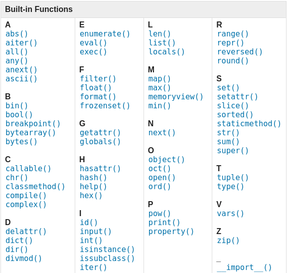
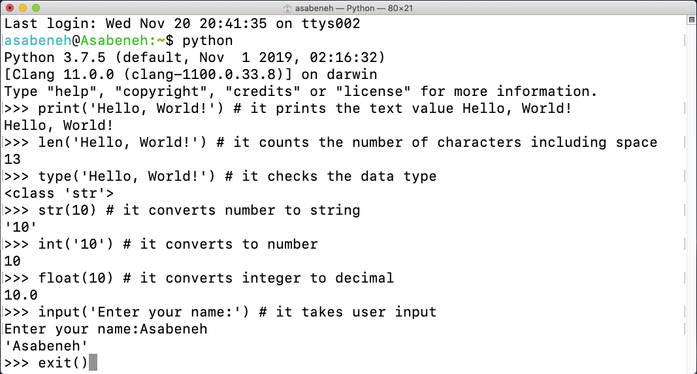

<div align="center">
  <h1> 30 Dias de Python: Dia 2 - Variaveis, Builtin Functions</h1>
  <a class="header-badge" target="_blank" href="https://www.linkedin.com/in/asabeneh/">
  
  </a>
  <a class="header-badge" target="_blank" href="https://twitter.com/Asabeneh">
  
  </a>

<sub>Author:
<a href="https://www.linkedin.com/in/asabeneh/" target="_blank">Asabeneh Yetayeh</a><br>
<small> Segunda edição: July, 2021</small>
</sub>

</div>

[<< Dia 1](../README.md) | [Dia 3 >>](../03_Day_Operators/03_operators.md)


- [📘 Dia 2](#-dia-2)
  - [Built in functions](#built-in-functions)
  - [Variaveis](#Variaveis)
    - [Declarando múltiplas váriaveis em uma linha](#Declarando-múltiplas-variaveis-em-uma-linha)
  - [Tipos de dados](#Tipos-de-Dados)
  - [Checando tipos de dados e type Casting](#Checando-tipos-de-dados-e-Casting)
  - [Numeros](#Numeros)
  - [💻 Exercicios - Dia 2](#-Exercicios---Dia-2)
    - [Exercicios: Level 1](#Exercicios-level-1)
    - [Exercicios: Level 2](#Exercicios-level-2)

# 📘 Dia 2

## Built in functions

Em Python, temos muitas built-in functions. As built-in functions estão disponíveis globalmente para seu uso, o que significa que você pode fazer uso das built-in functions sem importar ou configurar. Algumas das built-in functions do Python mais usadas são as seguintes: _print()_, _len()_, _type()_, _int()_, _float()_, _str()_, _input()_, _list()_, _dict()_, _min()_, _max()_, _sum()_, _sorted()_, _open()_, _file()_, _help()_ e _dir()_ . Na tabela a seguir, você verá uma lista gigantesca de funções do Python retiradas da [documentação do python](https://docs.python.org/3.9/library/functions.html).


Vamos abrir o shell do Python e começar a usar algumas built-in functions.



Vamos praticar mais usando diferentes built-in functions


Como você pode ver no terminal acima, O Python possui palavras reservadas. Não usamos palavras reservadas para declarar variáveis ​​ou funções. Abordaremos as variáveis ​​na próxima seção.

Acredito que agora você já esteja familiarizado com as built-in functions. Vamos fazer mais uma prática de built-in functions e passaremos para a próxima seção.


## Variaveis

As variáveis ​​armazenam dados na memória do computador. Variáveis ​​mnemônicas são recomendadas para uso em muitas linguagens de programação. Uma variável mnemônica é um nome de variável que pode ser facilmente lembrado e associado. Uma variável refere-se a um endereço de memória no qual os dados são armazenados.
Número no início, caractere especial e hífen não são permitidos ao nomear uma variável. Uma variável pode ter um nome curto (como x, y, z), mas um nome mais descritivo tipo (nome, sobrenome, idade, país) é altamente recomendado.

Regras da nomeclatura de variáveis no ​​​​Python

- O nome de uma variável deve começar com uma letra ou underline
- O nome de uma variável não pode começar com um número
- Um nome de variável só pode conter caracteres alfanuméricos e underlines (A-z, 0-9 e \_ )
- O interpretador Python ​​diferencia maiúsculas de minúsculas (nome, nome, nome e PRIMEIRO NOME) são variáveis ​​diferentes) então tome cuidado com isso. 

Aqui estão alguns exemplos de nomes de variáveis ​​válidos:

```shell
firstname
lastname
age
country
city
first_name
last_name
capital_city
_if # if we want to use reserved word as a variable
year_2021
year2021
current_year_2021
birth_year
num1
num2
```

Nomes invalidos de variaveis

```shell
first-name
first@name
first$name
num-1
1num
```

Usaremos o estilo de nomenclatura de variáveis ​​Python padrão que foi adotado por muitos desenvolvedores Python. Os desenvolvedores Python usam a convenção de nomenclatura de variáveis ​​​​snake case (snake_case). Usamos underline após cada palavra para uma variável contendo mais de uma palavra (por exemplo, primeiro_nome, sobrenome, velocidade_de_rotação_do_motor).  O exemplo abaixo é um exemplo de nomenclatura padrão de variáveis, o underline é necessário quando o nome da variável tem mais de uma palavra (isso é uma boa prática).

Quando atribuímos um determinado tipo de dado a uma variável, isso é chamado de declaração de variável. Por exemplo, no exemplo abaixo, meu primeiro nome é atribuído a uma variável first_name. O sinal de igual é um operador de atribuição. Atribuir significa armazenar dados na variável (dar um valor a uma variavel). O sinal de igual em Python não é igualdade como em Matemática.

_Exemplo:_

```py
# Variables in Python
first_name = 'Asabeneh'
last_name = 'Yetayeh'
country = 'Finland'
city = 'Helsinki'
age = 250
is_married = True
skills = ['HTML', 'CSS', 'JS', 'React', 'Python']
person_info = {
   'firstname':'Asabeneh',
   'lastname':'Yetayeh',
   'country':'Finland',
   'city':'Helsinki'
   }
```

Vamos usar as funções _print()_ e _len()_. A função de impressão aceita um número ilimitado de argumentos. Um argumento é um valor que podemos passar ou colocar entre parênteses, veja o exemplo abaixo.

**Exemplo:**

```py
print('Hello, World!') # The text Hello, World! is an argument
print('Hello',',', 'World','!') # it can take multiple arguments, four arguments have been passed
print(len('Hello, World!')) # it takes only one argument
```

Vamos imprimir e também encontrar o comprimento das variáveis ​​declaradas no topo:

**Exemplo:**

```py
# Printing the values stored in the variables

print('First name:', first_name)
print('First name length:', len(first_name))
print('Last name: ', last_name)
print('Last name length: ', len(last_name))
print('Country: ', country)
print('City: ', city)
print('Age: ', age)
print('Married: ', is_married)
print('Skills: ', skills)
print('Person information: ', person_info)
```

### Declarando múltiplas variaveis em uma linha

Múltiplas variáveis ​​também podem ser declaradas em uma linha:

**Exemplo:**

```py
first_name, last_name, country, age, is_married = 'Asabeneh', 'Yetayeh', 'Helsink', 250, True

print(first_name, last_name, country, age, is_married)
print('First name:', first_name)
print('Last name: ', last_name)
print('Country: ', country)
print('Age: ', age)
print('Married: ', is_married)
```

Podemos obter a entrada do usuário usando a função _input()_. Vamos atribuir os dados que obtemos de um usuário às variáveis ​​first_name e age.

**Exemplo:**

```py
first_name = input('What is your name: ')
age = input('How old are you? ')

print(first_name)
print(age)
```

## Tipos de Dados

Existem vários tipos de dados no Python. Para identificar o tipo de dados, usamos a função _type_. Gostaria de pedir que você se concentrasse em compreender muito bem os diferentes tipos de dados. Quando se trata de programação, tudo se resume a tipos de dados. Introduzi os tipos de dados logo no início e depois veremos de novo, porque cada tópico está relacionado aos tipos de dados. Abordaremos os tipos de dados com mais detalhes em suas respectivas seções.

## Checando tipos de dados e Casting

- Checando tipos de dados: Para verificar o tipo de dados de determinados dados/variáveis, usamos o _type_
  **Exemplo:**

```py
# Different python data types
# Let's declare variables with various data types

first_name = 'Asabeneh'     # str
last_name = 'Yetayeh'       # str
country = 'Finland'         # str
city= 'Helsinki'            # str
age = 250                   # int, it is not my real age, don't worry about it

# Printing out types
print(type('Asabeneh'))     # str
print(type(first_name))     # str
print(type(10))             # int
print(type(3.14))           # float
print(type(1 + 1j))         # complex
print(type(True))           # bool
print(type([1, 2, 3, 4]))     # list
print(type({'name':'Asabeneh','age':250, 'is_married':250}))    # dict
print(type((1,2)))                                              # tuple
print(type(zip([1,2],[3,4])))                                   # set
```

- Type Casting: Podemos converter um tipo de dado em outro tipo de dado. Nós podemos usar esses tipos para fazer o casting _int()_, _float()_, _str()_, _list_, _set_
 Quando fazemos operações aritméticas, os números das strings devem ser primeiro convertidos para int ou float, caso contrário, retornará um erro. Se concatenarmos um número com uma string, o número deverá primeiro ser convertido em uma string. Falaremos sobre concatenação na seção String.

  **Exemplo:**

```py
# int to float
num_int = 10
print('num_int',num_int)         # 10
num_float = float(num_int)
print('num_float:', num_float)   # 10.0

# float to int
gravity = 9.81
print(int(gravity))             # 9

# int to str
num_int = 10
print(num_int)                  # 10
num_str = str(num_int)
print(num_str)                  # '10'

# str to int or float
num_str = '10.6'
print('num_int', int(num_str))      # 10
print('num_float', float(num_str))  # 10.6

# str to list
first_name = 'Asabeneh'
print(first_name)               # 'Asabeneh'
first_name_to_list = list(first_name)
print(first_name_to_list)            # ['A', 's', 'a', 'b', 'e', 'n', 'e', 'h']
```

## Numeros

Numeros e tipos de dados em python:

1. Inteiros: Inteiros são considerados os(negativos, zero números positivos) 
   Exemplo:
   ... -3, -2, -1, 0, 1, 2, 3 ...

2. Float(Números Decimais)
   Exemplo:
   ... -3.5, -2.25, -1.0, 0.0, 1.1, 2.2, 3.5 ...

3. Números Complexos
   Exemplo:
   1 + j, 2 + 4j, 1 - 1j

🌕 Você é incrível. Você acabou de completar os desafios do dia 2 e está dois passos à frente no caminho para a grandeza. Agora faça alguns exercícios para o cérebro e os músculos.

## 💻 Exercicios - Dia 2

### Exercicios: Level 1

1. Dentro de 30DiasDePython crie uma pasta chamada dia_2. Dentro desta pasta crie um arquivo chamado variáveis.py
2. Escreva um comentário em python dizendo: 'Dia 2/30 dias de programação em python'
3. Declare uma variável de primeiro nome e atribua um valor a ela
4. Declare uma variavel de sobrenome e atribua um valor a ela
5. Declare uma variavel de nome completo e atribua um valor a ela
6. Declare uma variavel do seu país e atribua um valor a ela
7. Declare uma variavel da sua cidade e atribua um valor a ela
8. Declare uma variavel da sua idade e atribua um valor a ela
9. Declare uma variavel ano e atribua um valor a ela
10. Declare uma variavel is_married e atribua um valor a ela
11. Declare uma variavel is_true e atribua um valor a ela 
12. Declare uma variavel is_light_on e atribua um valor a ela
13. Declare multiplas variaveis em uma linha

### Exercicios: Level 2

1. Verifique o tipo de dados de todas as suas variáveis ​​usando a função integrada type()
1. Usando a função integrada _len()_, encontre o comprimento do seu primeiro nome
1. Compare o comprimento do seu nome e do seu sobrenome
1. Declare 5 como num_one e 4 como num_two
    1. Adicione num_one e num_two e atribua o valor a uma variável total
    2. Subtraia num_two de num_one e atribua o valor a uma variável diff
    3. Multiplique num_two e num_one e atribua o valor a um produto variável
    4. Divida num_one por num_two e atribua o valor a uma divisão variável
    5. Use a divisão de módulo para encontrar num_dois dividido por num_um e atribua o valor a uma variável restante
    6. Calcule num_one elevado a num_two e atribua o valor a uma variável exp
    7. Encontre a divisão mínima de num_one por num_two e atribua o valor a uma variável floor_division
2. O raio de um círculo é de 30 metros.
    1. Calcule a área de um círculo e atribua o valor a um nome de variável de _area_of_circle_
    2. Calcule a circunferência de um círculo e atribua o valor a um nome de variável _circum_of_circle_
    3. Pegue o raio como entrada do usuário e calcule a área.
1. Use a função de entrada integrada para obter nome, sobrenome, país e idade de um usuário e armazenar o valor em seus nomes de variáveis ​​correspondentes
1. Execute help('keywords') no Python shell ou em seu arquivo para verificar as palavras ou palavras-chave reservadas do Python

🎉 PARABÉNS ! 🎉

[<< Day 1](../README.md) | [Day 3 >>](../03_Day_Operators/03_operators.md)
