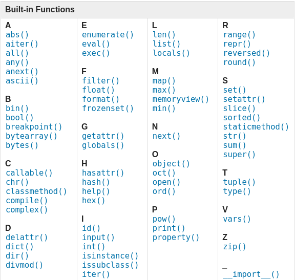
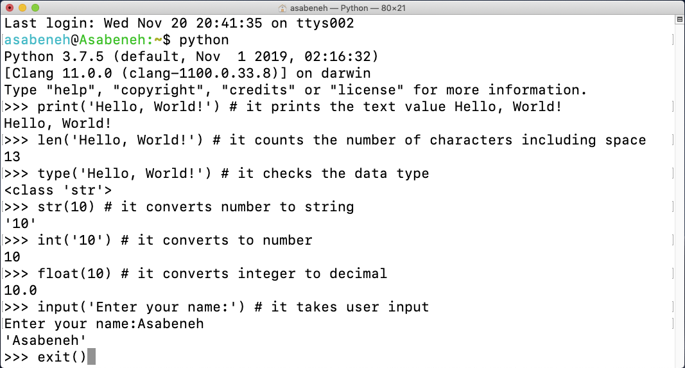
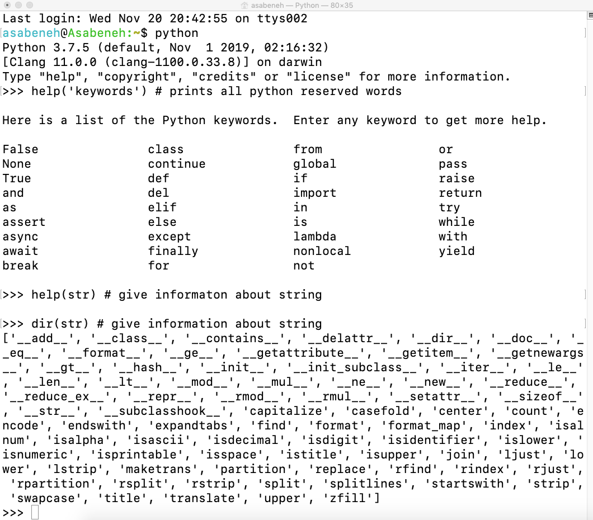
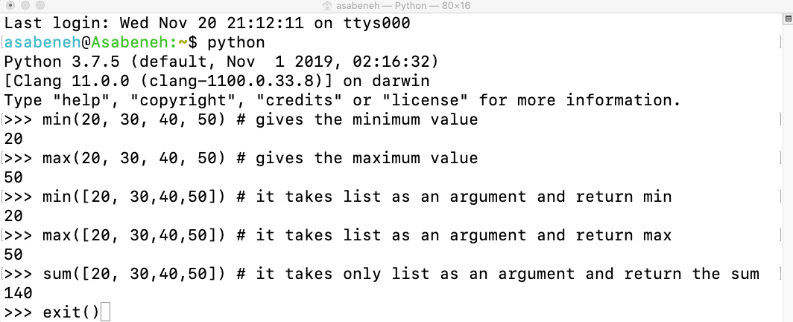

<div align="center">
  <h1> 30 Dias de Python: Dia 2 - Variáveis e Funções Integradas</h1>
  <a class="header-badge" target="_blank" href="https://www.linkedin.com/in/asabeneh/">
  
  </a>
  <a class="header-badge" target="_blank" href="https://twitter.com/Asabeneh">
  
  </a>

<sub>Autor:
<a href="https://www.linkedin.com/in/asabeneh/" target="_blank">Asabeneh Yetayeh</a><br>
<small> Segunda edição: Julho, 2021</small>
</sub>

</div>

[<< Dia 1](./README.md) | [Dia 3 >>](./03_operators_pt.md)


- [📘 Dia 2](#-dia-2)
  - [Funções integradas](#funções-integradas)
  - [Variáveis](#variáveis)
    - [Declarando múltiplas variáveis em uma linha](#declarando-múltiplas-variáveis-em-uma-linha)
  - [Tipos de dados](#tipos-de-dados)
  - [Verificando tipos de dados e casting](#verificando-tipos-de-dados-e-casting)
  - [Números](#números)
  - [💻 Exercícios - Dia 2](#-exercícios---dia-2)
    - [Exercícios: Nível 1](#exercícios-nível-1)
    - [Exercícios: Nível 2](#exercícios-nível-2)

# 📘 Dia 2

## Funções integradas

Em Python temos muitas funções integradas (_built-in functions_). Elas estão disponíveis globalmente, o que significa que você pode usá-las sem importar ou configurar nada. Algumas das funções integradas mais usadas são: _print()_, _len()_, _type()_, _int()_, _float()_, _str()_, _input()_, _list()_, _dict()_, _min()_, _max()_, _sum()_, _sorted()_, _open()_, _file()_, _help()_ e _dir()_. Na tabela a seguir você verá uma lista completa das funções integradas do Python, retirada da [documentação do Python](https://docs.python.org/3/library/functions.html).



Vamos abrir o shell do Python e começar a usar algumas das funções integradas mais comuns.



Vamos praticar mais usando diferentes funções integradas.



Como você pode ver no terminal acima, o Python possui palavras reservadas. Não usamos palavras reservadas para declarar variáveis ou funções. Abordaremos as variáveis na próxima seção.

Acredito que agora você já esteja familiarizado com as funções integradas. Vamos fazer mais uma prática e depois partiremos para a próxima seção.



## Variáveis

As variáveis armazenam dados na memória do computador. Em muitas linguagens de programação, é recomendado usar variáveis mnemônicas. Uma variável mnemônica é um nome fácil de lembrar e associar. Uma variável se refere a um endereço de memória onde os dados são armazenados.
Número no início, caracteres especiais e hífen não são permitidos ao nomear uma variável. Uma variável pode ter um nome curto (como x, y, z), mas um nome mais descritivo (firstname, lastname, age, country) é altamente recomendado.

Regras de nomenclatura de variáveis em Python

- O nome de uma variável deve começar com uma letra ou o caractere underscore
- O nome de uma variável não pode começar com um número
- Um nome de variável só pode conter caracteres alfanuméricos e underscores (A-z, 0-9 e \_ )
- Os nomes de variáveis diferenciam maiúsculas de minúsculas (firstname, Firstname, FirstName e FIRSTNAME são variáveis diferentes)

Aqui estão alguns exemplos de nomes de variáveis válidos:

```shell
firstname
lastname
age
country
city
first_name
last_name
capital_city
_if # se quisermos usar uma palavra reservada como variável
year_2021
year2021
current_year_2021
birth_year
num1
num2
```

Nomes inválidos de variáveis

```shell
first-name
first@name
first$name
num-1
1num
```

Usaremos o estilo padrão de nomenclatura de variáveis em Python, adotado por muitos desenvolvedores. Os desenvolvedores Python usam a convenção _snake case_ (snake_case). Usamos o underscore após cada palavra quando a variável contém mais de uma palavra (por exemplo, first_name, last_name, engine_rotation_speed). O exemplo abaixo mostra a nomenclatura padrão; o underscore é necessário quando o nome da variável tem mais de uma palavra.

Quando atribuímos um determinado tipo de dado a uma variável, isso é chamado de declaração de variável. Por exemplo, no exemplo abaixo, meu primeiro nome é atribuído à variável first_name. O sinal de igual é um operador de atribuição. Atribuir significa armazenar dados na variável. O sinal de igual em Python não é igualdade como em Matemática.

_Exemplo:_

```py
# Variáveis em Python
first_name = 'Asabeneh'
last_name = 'Yetayeh'
country = 'Finland'
city = 'Helsinki'
age = 250
is_married = True
skills = ['HTML', 'CSS', 'JS', 'React', 'Python']
person_info = {
   'firstname':'Asabeneh',
   'lastname':'Yetayeh',
   'country':'Finland',
   'city':'Helsinki'
   }
```

Vamos usar as funções integradas _print()_ e _len()_. A função print aceita um número ilimitado de argumentos. Um argumento é um valor que podemos passar ou colocar entre os parênteses da função; veja o exemplo abaixo.

**Exemplo:**

```py
print('Hello, World!') # O texto Hello, World! é um argumento
print('Hello',',', 'World','!') # pode receber vários argumentos; quatro argumentos foram passados
print(len('Hello, World!')) # recebe apenas um argumento
```

Vamos imprimir e também encontrar o comprimento das variáveis declaradas acima:

**Exemplo:**

```py
# Imprimindo os valores armazenados nas variáveis

print('First name:', first_name)
print('First name length:', len(first_name))
print('Last name: ', last_name)
print('Last name length: ', len(last_name))
print('Country: ', country)
print('City: ', city)
print('Age: ', age)
print('Married: ', is_married)
print('Skills: ', skills)
print('Person information: ', person_info)
```

### Declarando múltiplas variáveis em uma linha

Múltiplas variáveis também podem ser declaradas em uma linha:

**Exemplo:**

```py
first_name, last_name, country, age, is_married = 'Asabeneh', 'Yetayeh', 'Helsink', 250, True

print(first_name, last_name, country, age, is_married)
print('First name:', first_name)
print('Last name: ', last_name)
print('Country: ', country)
print('Age: ', age)
print('Married: ', is_married)
```

Obtendo entrada do usuário com a função integrada _input()_. Vamos atribuir os dados recebidos do usuário às variáveis first_name e age.

**Exemplo:**

```py
first_name = input('What is your name: ')
age = input('How old are you? ')

print(first_name)
print(age)
```

## Tipos de dados

Existem vários tipos de dados em Python. Para identificar o tipo de dado usamos a função integrada _type_. Gostaria que você se concentrasse em compreender muito bem os diferentes tipos de dados. Quando se trata de programação, tudo se resume a tipos de dados. Apresentei os tipos de dados no início e eles voltam agora, porque cada tópico está relacionado a eles. Abordaremos os tipos de dados com mais detalhes em suas respectivas seções.

## Verificando tipos de dados e casting

- Verificar tipos de dados: para verificar o tipo de determinado dado/variável usamos _type_
  **Exemplos:**

```py
# Diferentes tipos de dados em Python
# Vamos declarar variáveis com vários tipos de dados

first_name = 'Asabeneh'     # str
last_name = 'Yetayeh'       # str
country = 'Finland'         # str
city= 'Helsinki'            # str
age = 250                   # int, não é minha idade real, não se preocupe

# Imprimindo os tipos
print(type('Asabeneh'))          # str
print(type(first_name))          # str
print(type(10))                  # int
print(type(3.14))                # float
print(type(1 + 1j))              # complex
print(type(True))                # bool
print(type([1, 2, 3, 4]))        # list
print(type({'name':'Asabeneh'})) # dict
print(type((1,2)))               # tuple
print(type(zip([1,2],[3,4])))    # zip
```

- Casting: converter um tipo de dado em outro. Usamos _int()_, _float()_, _str()_, _list_, _set_
  Quando fazemos operações aritméticas, números em string devem ser primeiro convertidos para int ou float; caso contrário, ocorrerá um erro. Se concatenarmos um número com uma string, o número deve primeiro ser convertido para string. Falaremos sobre concatenação na seção de Strings.

  **Exemplos:**

```py
# int para float
num_int = 10
print('num_int',num_int)         # 10
num_float = float(num_int)
print('num_float:', num_float)   # 10.0

# float para int
gravity = 9.81
print(int(gravity))             # 9

# int para str
num_int = 10
print(num_int)                  # 10
num_str = str(num_int)
print(num_str)                  # '10'

# str para int ou float
num_str = '10.6'
num_float = float(num_str)  # Converte a string para float primeiro
num_int = int(num_float)    # Depois converte o float para inteiro
print('num_int', int(num_str))      # 10
print('num_float', float(num_str))  # 10.6
num_int = int(num_float)
print('num_int', int(num_int))      # 10

# str para list
first_name = 'Asabeneh'
print(first_name)               # 'Asabeneh'
first_name_to_list = list(first_name)
print(first_name_to_list)            # ['A', 's', 'a', 'b', 'e', 'n', 'e', 'h']
```

## Números

Tipos numéricos em Python:

1. Inteiros: números inteiros (negativos, zero e positivos)
   Exemplo:
   ... -3, -2, -1, 0, 1, 2, 3 ...

2. Números de ponto flutuante (números decimais)
   Exemplo:
   ... -3.5, -2.25, -1.0, 0.0, 1.1, 2.2, 3.5 ...

3. Números complexos
   Exemplo:
   1 + j, 2 + 4j, 1 - 1j

🌕 Você é incrível. Você acabou de completar os desafios do dia 2 e está dois passos à frente no caminho para a grandeza. Agora faça alguns exercícios para o cérebro e os músculos.

## 💻 Exercícios - Dia 2

### Exercícios: Nível 1

1. Dentro de 30DaysOfPython crie uma pasta chamada day_2. Dentro dessa pasta crie um arquivo chamado variables.py
2. Escreva um comentário em Python dizendo 'Day 2: 30 Days of python programming'
3. Declare uma variável de primeiro nome e atribua um valor a ela
4. Declare uma variável de sobrenome e atribua um valor a ela
5. Declare uma variável de nome completo e atribua um valor a ela
6. Declare uma variável de país e atribua um valor a ela
7. Declare uma variável de cidade e atribua um valor a ela
8. Declare uma variável de idade e atribua um valor a ela
9. Declare uma variável de ano e atribua um valor a ela
10. Declare uma variável is_married e atribua um valor a ela
11. Declare uma variável is_true e atribua um valor a ela
12. Declare uma variável is_light_on e atribua um valor a ela
13. Declare múltiplas variáveis em uma linha

### Exercícios: Nível 2

1. Verifique o tipo de dados de todas as suas variáveis usando a função integrada type()
2. Usando a função integrada _len()_, encontre o comprimento do seu primeiro nome
3. Compare o comprimento do seu primeiro nome e do seu sobrenome
4. Declare 5 como num_one e 4 como num_two
5. Some num_one e num_two e atribua o valor a uma variável total
6. Subtraia num_two de num_one e atribua o valor a uma variável diff
7. Multiplique num_two e num_one e atribua o valor a uma variável product
8. Divida num_one por num_two e atribua o valor a uma variável division
9. Use o módulo para encontrar o resto de num_two dividido por num_one e atribua o valor a uma variável remainder
10. Calcule num_one elevado a num_two e atribua o valor a uma variável exp
11. Encontre a divisão inteira (floor division) de num_one por num_two e atribua o valor a uma variável floor_division
12. O raio de um círculo é 30 metros.
    1. Calcule a área de um círculo e atribua o valor a uma variável chamada _area_of_circle_
    2. Calcule a circunferência de um círculo e atribua o valor a uma variável chamada _circum_of_circle_
    3. Receba o raio como entrada do usuário e calcule a área.
13. Use a função integrada input para obter nome, sobrenome, país e idade de um usuário e armazenar o valor nas variáveis correspondentes
14. Execute help('keywords') no shell do Python ou no seu arquivo para verificar as palavras reservadas ou palavras-chave do Python

🎉 PARABÉNS ! 🎉

[<< Dia 1](./README.md) | [Dia 3 >>](./03_operators_pt.md)
