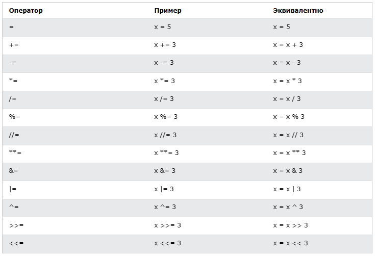
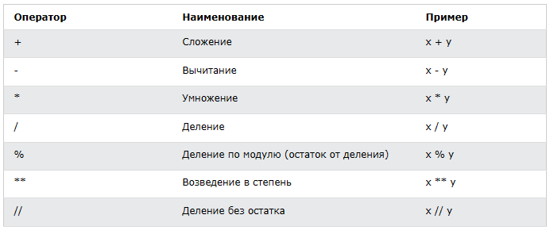
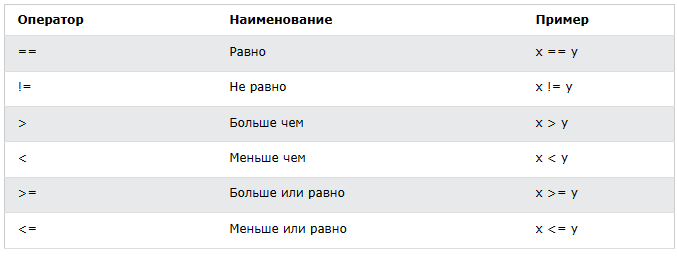
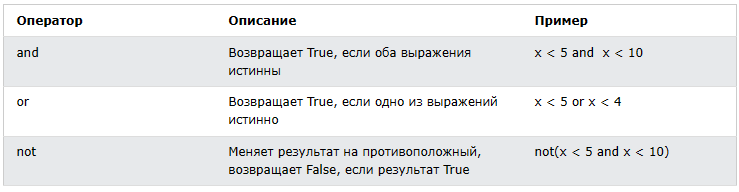

<div align="center">
  <h1> 30 Dias de Python: Dia 3 - Operadores</h1>
  <a class="header-badge" target="_blank" href="https://www.linkedin.com/in/asabeneh/">
  
  </a>
  <a class="header-badge" target="_blank" href="https://twitter.com/Asabeneh">
  
  </a>

<sub>Autor:
<a href="https://www.linkedin.com/in/asabeneh/" target="_blank">Asabeneh Yetayeh</a><br>
<small> Segunda edição: Julho, 2021</small>
</sub>
</div>

[<< Dia 2](./02_variables_builtin_functions_pt.md) | [Dia 4 >>](./04_strings_pt.md)


- [📘 Dia 3](#-dia-3)
  - [Booleano](#booleano)
  - [Operadores](#operadores)
    - [Operadores de atribuição](#operadores-de-atribuição)
    - [Operadores aritméticos](#operadores-aritméticos)
    - [Operadores de comparação](#operadores-de-comparação)
    - [Operadores lógicos](#operadores-lógicos)
  - [💻 Exercícios - Dia 3](#-exercícios---dia-3)

# 📘 Dia 3

## Booleano

Um tipo de dado booleano representa um dos dois valores: _True_ ou _False_. O uso desses tipos ficará claro quando começarmos a usar o operador de comparação. A primeira letra **T** de True e **F** de False devem ser maiúsculas, diferente do JavaScript.

**Exemplo: Valores booleanos**

```py
print(True)
print(False)
```

## Operadores

A linguagem Python oferece suporte a vários tipos de operadores. Nesta seção, vamos focar em alguns deles.

### Operadores de atribuição

Os operadores de atribuição são usados para atribuir valores a variáveis. Vamos tomar = como exemplo. O sinal de igual na matemática mostra que dois valores são iguais; porém, em Python, significa que estamos armazenando um valor em determinada variável — chamamos isso de atribuição. A tabela abaixo mostra os diferentes tipos de operadores de atribuição em Python, retirada do [w3school](https://www.w3schools.com/python/python_operators.asp).



### Operadores aritméticos

- Adição(+): a + b
- Subtração(-): a - b
- Multiplicação(*): a * b
- Divisão(/): a / b
- Módulo(%): a % b
- Divisão inteira(//): a // b
- Exponenciação(**): a ** b



**Exemplo: Inteiros**

```py
# Operações aritméticas em Python
# Inteiros

print('Addition: ', 1 + 2)        # 3
print('Subtraction: ', 2 - 1)     # 1
print('Multiplication: ', 2 * 3)  # 6
print ('Division: ', 4 / 2)       # 2.0  A divisão em Python retorna número de ponto flutuante
print('Division: ', 6 / 2)        # 3.0
print('Division: ', 7 / 2)        # 3.5
print('Division without the remainder: ', 7 // 2)   # 3, retorna sem a parte decimal ou o resto
print ('Division without the remainder: ',7 // 3)   # 2
print('Modulus: ', 3 % 2)         # 1, retorna o resto
print('Exponentiation: ', 2 ** 3) # 8 significa 2 * 2 * 2
```

**Exemplo: Floats**

```py
# Números de ponto flutuante
print('Floating Point Number, PI', 3.14)
print('Floating Point Number, gravity', 9.81)
```

**Exemplo: Números complexos**

```py
# Números complexos
print('Complex number: ', 1 + 1j)
print('Multiplying complex numbers: ',(1 + 1j) * (1 - 1j))
```

Vamos declarar uma variável e atribuir um tipo numérico. Vou usar variáveis de um único caractere, mas lembre-se de não criar o hábito de declarar esse tipo de variável. Os nomes das variáveis devem ser sempre mnemônicos.

**Exemplo:**

```python
# Declarando as variáveis primeiro no topo

a = 3 # a é um nome de variável e 3 é um tipo de dado inteiro
b = 2 # b é um nome de variável e 2 é um tipo de dado inteiro

# Operações aritméticas e atribuição do resultado a uma variável
total = a + b
diff = a - b
product = a * b
division = a / b
remainder = a % b
floor_division = a // b
exponential = a ** b

# Eu deveria ter usado sum em vez de total, mas sum é uma função integrada — evite sobrescrever funções integradas
print(total) # se você não rotular o print com alguma string, nunca saberá de onde vem o resultado
print('a + b = ', total)
print('a - b = ', diff)
print('a * b = ', product)
print('a / b = ', division)
print('a % b = ', remainder)
print('a // b = ', floor_division)
print('a ** b = ', exponential)
```

**Exemplo:**

```py
print('== Addition, Subtraction, Multiplication, Division, Modulus ==')

# Declarando valores e organizando-os juntos
num_one = 3
num_two = 4

# Operações aritméticas
total = num_one + num_two
diff = num_two - num_one
product = num_one * num_two
div = num_two / num_one
remainder = num_two % num_one

# Imprimindo valores com rótulo
print('total: ', total)
print('difference: ', diff)
print('product: ', product)
print('division: ', div)
print('remainder: ', remainder)
```

Vamos começar a conectar os pontos e usar o que já sabemos para calcular (área, volume, densidade, peso, perímetro, distância, força).

**Exemplo:**

```py
# Calculando a área de um círculo
radius = 10                                 # raio de um círculo
area_of_circle = 3.14 * radius ** 2         # dois * significam expoente ou potência
print('Area of a circle:', area_of_circle)

# Calculando a área de um retângulo
length = 10
width = 20
area_of_rectangle = length * width
print('Area of rectangle:', area_of_rectangle)

# Calculando o peso de um objeto
mass = 75
gravity = 9.81
weight = mass * gravity
print(weight, 'N')                         # Adicionando unidade ao peso

# Calculando a densidade de um líquido
mass = 75 # em Kg
volume = 0.075 # em metro cúbico
density = mass / volume # 1000 Kg/m^3
print(density, 'Kg/m^3') # Adicionando unidade à densidade

```

### Operadores de comparação

Na programação comparamos valores; usamos operadores de comparação para comparar dois valores. Verificamos se um valor é maior, menor ou igual a outro. A tabela a seguir mostra os operadores de comparação em Python, retirada do [w3shool](https://www.w3schools.com/python/python_operators.asp).


**Exemplo: Operadores de comparação**

```py
print(3 > 2)     # True, porque 3 é maior que 2
print(3 >= 2)    # True, porque 3 é maior que 2
print(3 < 2)     # False, porque 3 é maior que 2
print(2 < 3)     # True, porque 2 é menor que 3
print(2 <= 3)    # True, porque 2 é menor que 3
print(3 == 2)    # False, porque 3 não é igual a 2
print(3 != 2)    # True, porque 3 não é igual a 2
print(len('mango') == len('avocado'))  # False
print(len('mango') != len('avocado'))  # True
print(len('mango') < len('avocado'))   # True
print(len('milk') != len('meat'))      # False
print(len('milk') == len('meat'))      # True
print(len('tomato') == len('potato'))  # True
print(len('python') > len('dragon'))   # False


# Comparar algo resulta em True ou False

print('True == True: ', True == True)
print('True == False: ', True == False)
print('False == False:', False == False)
```

Além dos operadores de comparação acima, o Python usa:

- _is_: Retorna true se ambas as variáveis forem o mesmo objeto (x is y)
- _is not_: Retorna true se ambas as variáveis não forem o mesmo objeto (x is not y)
- _in_: Retorna True se a lista consultada contiver determinado item (x in y)
- _not in_: Retorna True se a lista consultada não tiver determinado item (x not in y)

```py
print('1 is 1', 1 is 1)                   # True - porque os valores dos dados são iguais
print('1 is not 2', 1 is not 2)           # True - porque 1 não é 2
print('A in Asabeneh', 'A' in 'Asabeneh') # True - A encontrado na string
print('B not in Asabeneh', 'B' in 'Asabeneh') # False - não há B maiúsculo
print('coding' in 'coding for all') # True - porque coding for all contém a palavra coding
print('a in an:', 'a' in 'an')      # True
print('4 is 2 ** 2:', 4 is 2 ** 2)   # True
```

### Operadores lógicos

Diferente de outras linguagens de programação, o Python usa as palavras-chave _and_, _or_ e _not_ para operadores lógicos. Os operadores lógicos são usados para combinar declarações condicionais:



```py
print(3 > 2 and 4 > 3) # True - porque ambas as declarações são verdadeiras
print(3 > 2 and 4 < 3) # False - porque a segunda declaração é falsa
print(3 < 2 and 4 < 3) # False - porque ambas as declarações são falsas
print('True and True: ', True and True)
print(3 > 2 or 4 > 3)  # True - porque ambas as declarações são verdadeiras
print(3 > 2 or 4 < 3)  # True - porque uma das declarações é verdadeira
print(3 < 2 or 4 < 3)  # False - porque ambas as declarações são falsas
print('True or False:', True or False)
print(not 3 > 2)     # False - porque 3 > 2 é verdadeiro, então not True resulta em False
print(not True)      # False - Negação, o operador not transforma true em false
print(not False)     # True
print(not not True)  # True
print(not not False) # False

```

🌕 Você tem energia ilimitada. Você acabou de completar os desafios do dia 3 e está três passos à frente no caminho para a grandeza. Agora faça alguns exercícios para o cérebro e os músculos.

## 💻 Exercícios - Dia 3

1. Declare sua idade como variável inteira
2. Declare sua altura como variável float
3. Declare uma variável que armazene um número complexo
4. Escreva um script que peça ao usuário a base e a altura do triângulo e calcule a área desse triângulo (area = 0.5 x b x h).

```py
    Enter base: 20
    Enter height: 10
    The area of the triangle is 100
```

5. Escreva um script que peça ao usuário o lado a, o lado b e o lado c do triângulo. Calcule o perímetro do triângulo (perimeter = a + b + c).

```py
Enter side a: 5
Enter side b: 4
Enter side c: 3
The perimeter of the triangle is 12
```

6. Obtenha o comprimento e a largura de um retângulo usando prompt. Calcule sua área (area = length x width) e perímetro (perimeter = 2 x (length + width))
7. Obtenha o raio de um círculo usando prompt. Calcule a área (area = pi x r x r) e a circunferência (c = 2 x pi x r) onde pi = 3.14.
8. Calcule a inclinação (slope), o intercepto x e o intercepto y de y = 2x -2
9. A inclinação é (m = y2-y1/x2-x1). Encontre a inclinação e a [distância euclidiana](https://en.wikipedia.org/wiki/Euclidean_distance#:~:text=In%20mathematics%2C%20the%20Euclidean%20distance,being%20called%20the%20Pythagorean%20distance.) entre o ponto (2, 2) e o ponto (6,10)
10. Compare as inclinações das tarefas 8 e 9.
11. Calcule o valor de y (y = x^2 + 6x + 9). Tente usar diferentes valores de x e descubra para qual valor de x y será 0.
12. Encontre o comprimento de 'python' e 'dragon' e faça uma comparação falsa (falsy).
13. Use o operador _and_ para verificar se 'on' é encontrado tanto em 'python' quanto em 'dragon'
14. _I hope this course is not full of jargon_. Use o operador _in_ para verificar se _jargon_ está na frase.
15. Não há 'on' em dragon e python
16. Encontre o comprimento do texto _python_, converta o valor para float e depois para string
17. Números pares são divisíveis por 2 e o resto é zero. Como você verifica se um número é par ou não usando Python?
18. Verifique se a divisão inteira de 7 por 3 é igual ao valor int convertido de 2.7.
19. Verifique se o type de '10' é igual ao type de 10
20. Verifique se int('9.8') é igual a 10
21. Escreva um script que peça ao usuário as horas e a taxa por hora. Calcule o pagamento da pessoa.

```py
Enter hours: 40
Enter rate per hour: 28
Your weekly earning is 1120
```

22. Escreva um script que peça ao usuário o número de anos. Calcule o número de segundos que uma pessoa pode viver. Assuma que uma pessoa pode viver cem anos

```py
Enter number of years you have lived: 100
You have lived for 3153600000 seconds.
```

23. Escreva um script Python que exiba a seguinte tabela

```py
1 1 1 1 1
2 1 2 4 8
3 1 3 9 27
4 1 4 16 64
5 1 5 25 125
```

🎉 PARABÉNS ! 🎉

[<< Dia 2](./02_variables_builtin_functions_pt.md) | [Dia 4 >>](./04_strings_pt.md)
