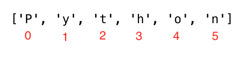

<div align="center">
  <h1> 30 Dias de Python: Dia 4 - Strings</h1>
  <a class="header-badge" target="_blank" href="https://www.linkedin.com/in/asabeneh/">
  
  </a>
  <a class="header-badge" target="_blank" href="https://twitter.com/Asabeneh">
  
  </a>

<sub>Autor:
<a href="https://www.linkedin.com/in/asabeneh/" target="_blank">Asabeneh Yetayeh</a><br>
<small> Segunda edição: Julho, 2021</small>
</sub>

</div>

[<< Dia 3](./03_operators_pt.md) | [Dia 5 >>](./05_lists_pt.md)


- [Dia 4](#dia-4)
  - [Strings](#strings)
    - [Criando uma string](#criando-uma-string)
    - [Concatenação de strings](#concatenação-de-strings)
    - [Sequências de escape em strings](#sequências-de-escape-em-strings)
    - [Formatação de strings](#formatação-de-strings)
      - [Formatação antiga de strings (operador %)](#formatação-antiga-de-strings-operador-)
      - [Nova formatação de strings (str.format)](#nova-formatação-de-strings-strformat)
      - [Interpolação de strings / f-Strings (Python 3.6+)](#interpolação-de-strings--f-strings-python-36)
    - [Strings em Python como sequências de caracteres](#strings-em-python-como-sequências-de-caracteres)
      - [Desempacotando caracteres](#desempacotando-caracteres)
      - [Acessando caracteres em strings por índice](#acessando-caracteres-em-strings-por-índice)
      - [Fatiando strings em Python](#fatiando-strings-em-python)
      - [Invertendo uma string](#invertendo-uma-string)
      - [Pulando caracteres ao fatiar](#pulando-caracteres-ao-fatiar)
    - [Métodos de string](#métodos-de-string)
  - [💻 Exercícios - Dia 4](#-exercícios---dia-4)

# Dia 4

## Strings

Texto é um tipo de dado string. Qualquer tipo de dado escrito como texto é uma string. Qualquer dado entre aspas simples, duplas ou triplas é string. Existem diferentes métodos de string e funções integradas para lidar com tipos string. Para verificar o comprimento de uma string use o método len().

### Criando uma string

```py
letter = 'P'                # Uma string pode ser um único caractere ou um conjunto de textos
print(letter)               # P
print(len(letter))          # 1
greeting = 'Hello, World!'  # String pode ser feita com aspas simples ou duplas, "Hello, World!"
print(greeting)             # Hello, World!
print(len(greeting))        # 13
sentence = "I hope you are enjoying 30 days of Python Challenge"
print(sentence)
```

Uma string de múltiplas linhas é criada usando aspas simples triplas (''') ou aspas duplas triplas ("""). Veja o exemplo abaixo.

```py
multiline_string = '''I am a teacher and enjoy teaching.
I didn't find anything as rewarding as empowering people.
That is why I created 30 days of python.'''
print(multiline_string)

# Outra forma de fazer a mesma coisa
multiline_string = """I am a teacher and enjoy teaching.
I didn't find anything as rewarding as empowering people.
That is why I created 30 days of python."""
print(multiline_string)
```

### Concatenação de strings

Podemos conectar strings. Mesclar ou conectar strings é chamado de concatenação. Veja o exemplo abaixo:

```py
first_name = 'Asabeneh'
last_name = 'Yetayeh'
space = ' '
full_name = first_name  +  space + last_name
print(full_name) # Asabeneh Yetayeh
# Verificando o comprimento de uma string usando a função integrada len()
print(len(first_name))  # 8
print(len(last_name))   # 7
print(len(first_name) > len(last_name)) # True
print(len(full_name)) # 16
```

### Sequências de escape em strings

Em Python e em outras linguagens de programação, \ seguido de um caractere é uma sequência de escape. Vamos ver os caracteres de escape mais comuns:

- \n: nova linha
- \t: Tab (significa 8 espaços)
- \\\\: Barra invertida (backslash)
- \\': Aspas simples (')
- \\": Aspas duplas (")

Agora, vamos ver o uso das sequências de escape acima com exemplos.

```py
print('I hope everyone is enjoying the Python Challenge.\nAre you ?') # quebra de linha
print('Days\tTopics\tExercises') # adicionando espaço de tabulação ou 4 espaços
print('Day 1\t5\t5')
print('Day 2\t6\t20')
print('Day 3\t5\t23')
print('Day 4\t1\t35')
print('This is a backslash  symbol (\\)') # Para escrever uma barra invertida
print('In every programming language it starts with \"Hello, World!\"') # para escrever aspas duplas dentro de aspas simples

# saída
I hope every one is enjoying the Python Challenge.
Are you ?
Days  Topics  Exercises
Day 1	5	    5
Day 2	6	    20
Day 3	5	    23
Day 4	1	    35
This is a backslash  symbol (\)
In every programming language it starts with "Hello, World!"
```

### Formatação de strings

#### Formatação antiga de strings (operador %)

Em Python existem muitas formas de formatar strings. Nesta seção, veremos algumas delas.
O operador "%" é usado para formatar um conjunto de variáveis envoltas em uma "tupla" (uma lista de tamanho fixo), juntamente com uma string de formato, que contém texto normal junto com "especificadores de argumento", símbolos especiais como "%s", "%d", "%f", "%.<small>número de dígitos</small>f".

- %s - String (ou qualquer objeto com representação em string, como números)
- %d - Inteiros
- %f - Números de ponto flutuante
- "%.<small>número de dígitos</small>f" - Números de ponto flutuante com precisão fixa

```py
# Apenas strings
first_name = 'Asabeneh'
last_name = 'Yetayeh'
language = 'Python'
formated_string = 'I am %s %s. I teach %s' %(first_name, last_name, language)
print(formated_string)

# Strings e números
radius = 10
pi = 3.14
area = pi * radius ** 2
formated_string = 'The area of circle with a radius %d is %.2f.' %(radius, area) # 2 refere-se aos 2 dígitos significativos após o ponto

python_libraries = ['Django', 'Flask', 'NumPy', 'Matplotlib','Pandas']
formated_string = 'The following are python libraries:%s' % (python_libraries)
print(formated_string) # "The following are python libraries:['Django', 'Flask', 'NumPy', 'Matplotlib','Pandas']"
```

#### Nova formatação de strings (str.format)

Este formato foi introduzido na versão 3 do Python.

```py

first_name = 'Asabeneh'
last_name = 'Yetayeh'
language = 'Python'
formated_string = 'I am {} {}. I teach {}'.format(first_name, last_name, language)
print(formated_string)
a = 4
b = 3

print('{} + {} = {}'.format(a, b, a + b))
print('{} - {} = {}'.format(a, b, a - b))
print('{} * {} = {}'.format(a, b, a * b))
print('{} / {} = {:.2f}'.format(a, b, a / b)) # limita a dois dígitos após o decimal
print('{} % {} = {}'.format(a, b, a % b))
print('{} // {} = {}'.format(a, b, a // b))
print('{} ** {} = {}'.format(a, b, a ** b))

# saída
4 + 3 = 7
4 - 3 = 1
4 * 3 = 12
4 / 3 = 1.33
4 % 3 = 1
4 // 3 = 1
4 ** 3 = 64

# Strings e números
radius = 10
pi = 3.14
area = pi * radius ** 2
formated_string = 'The area of a circle with a radius {} is {:.2f}.'.format(radius, area) # 2 dígitos após o decimal
print(formated_string)

```

#### Interpolação de strings / f-Strings (Python 3.6+)

Outra nova formatação de string é a interpolação, f-strings. As strings começam com f e podemos injetar os dados em suas posições correspondentes.

```py
a = 4
b = 3
print(f'{a} + {b} = {a +b}')
print(f'{a} - {b} = {a - b}')
print(f'{a} * {b} = {a * b}')
print(f'{a} / {b} = {a / b:.2f}')
print(f'{a} % {b} = {a % b}')
print(f'{a} // {b} = {a // b}')
print(f'{a} ** {b} = {a ** b}')
```

### Strings em Python como sequências de caracteres

As strings em Python são sequências de caracteres e compartilham seus métodos básicos de acesso com outras sequências ordenadas de objetos em Python – listas e tuplas. A forma mais simples de extrair caracteres individuais de strings (e membros individuais de qualquer sequência) é desempacotá-los em variáveis correspondentes.

#### Desempacotando caracteres

```
language = 'Python'
a,b,c,d,e,f = language # desempacotando caracteres da sequência em variáveis
print(a) # P
print(b) # y
print(c) # t
print(d) # h
print(e) # o
print(f) # n
```

#### Acessando caracteres em strings por índice

Na programação a contagem começa do zero. Portanto, a primeira letra de uma string está no índice zero e a última letra é o comprimento da string menos um.



```py
language = 'Python'
first_letter = language[0]
print(first_letter) # P
second_letter = language[1]
print(second_letter) # y
last_index = len(language) - 1
last_letter = language[last_index]
print(last_letter) # n
```

Se quisermos começar pela direita, podemos usar indexação negativa. -1 é o último índice.

```py
language = 'Python'
last_letter = language[-1]
print(last_letter) # n
second_last = language[-2]
print(second_last) # o
```

#### Fatiando strings em Python

Em Python podemos fatiar strings em substrings.

```py
language = 'Python'
first_three = language[0:3] # começa no índice zero e vai até 3, mas não inclui 3
print(first_three) #Pyt
last_three = language[3:6]
print(last_three) # hon
# Outra forma
last_three = language[-3:]
print(last_three)   # hon
last_three = language[3:]
print(last_three)   # hon
```

#### Invertendo uma string

Podemos inverter strings facilmente em Python.

```py
greeting = 'Hello, World!'
print(greeting[::-1]) # !dlroW ,olleH
```

#### Pulando caracteres ao fatiar

É possível pular caracteres ao fatiar passando o argumento step para o método de fatia.

```py
language = 'Python'
pto = language[0:6:2] #
print(pto) # Pto
```

### Métodos de string

Existem muitos métodos de string que nos permitem formatar strings. Veja alguns dos métodos de string no exemplo a seguir:

- capitalize(): Converte o primeiro caractere da string para letra maiúscula

```py
challenge = 'thirty days of python'
print(challenge.capitalize()) # 'Thirty days of python'
```

- count(): retorna as ocorrências de uma substring na string, count(substring, start=.., end=..). O start é o índice inicial para a contagem e end é o último índice a contar.

```py
challenge = 'thirty days of python'
print(challenge.count('y')) # 3
print(challenge.count('y', 7, 14)) # 1,
print(challenge.count('th')) # 2`
```

- endswith(): Verifica se uma string termina com um final especificado

```py
challenge = 'thirty days of python'
print(challenge.endswith('on'))   # True
print(challenge.endswith('tion')) # False
```

- expandtabs(): Substitui o caractere de tabulação por espaços; o tamanho padrão da tabulação é 8. Recebe o tamanho da tabulação como argumento

```py
challenge = 'thirty\tdays\tof\tpython'
print(challenge.expandtabs())   # 'thirty  days    of      python'
print(challenge.expandtabs(10)) # 'thirty    days      of        python'
```

- find(): Retorna o índice da primeira ocorrência de uma substring; se não encontrada, retorna -1

```py
challenge = 'thirty days of python'
print(challenge.find('y'))  # 5
print(challenge.find('th')) # 0
```

- rfind(): Retorna o índice da última ocorrência de uma substring; se não encontrada, retorna -1

```py
challenge = 'thirty days of python'
print(challenge.rfind('y'))  # 16
print(challenge.rfind('th')) # 17
```

- format(): formata a string em uma saída mais agradável
   Mais sobre formatação de strings neste [link](https://www.programiz.com/python-programming/methods/string/format)

```py
first_name = 'Asabeneh'
last_name = 'Yetayeh'
age = 250
job = 'teacher'
country = 'Finland'
sentence = 'I am {} {}. I am a {}. I am {} years old. I live in {}.'.format(first_name, last_name, job, age, country)
print(sentence) # I am Asabeneh Yetayeh. I am 250 years old. I am a teacher. I live in Finland.

radius = 10
pi = 3.14
area = pi * radius ** 2
result = 'The area of a circle with radius {} is {}'.format(str(radius), str(area))
print(result) # The area of a circle with radius 10 is 314
```

- index(): Retorna o menor índice de uma substring; argumentos adicionais indicam índice inicial e final (padrão 0 e comprimento da string - 1). Se a substring não for encontrada, levanta um ValueError.

```py
challenge = 'thirty days of python'
sub_string = 'da'
print(challenge.index(sub_string))  # 7
print(challenge.index(sub_string, 9)) # error
```

- rindex(): Retorna o maior índice de uma substring; argumentos adicionais indicam índice inicial e final (padrão 0 e comprimento da string - 1)

```py
challenge = 'thirty days of python'
sub_string = 'da'
print(challenge.rindex(sub_string))  # 7
print(challenge.rindex(sub_string, 9)) # error
print(challenge.rindex('on', 8)) # 19
```

- isalnum(): Verifica caracteres alfanuméricos

```py
challenge = 'ThirtyDaysPython'
print(challenge.isalnum()) # True

challenge = '30DaysPython'
print(challenge.isalnum()) # True

challenge = 'thirty days of python'
print(challenge.isalnum()) # False, espaço não é um caractere alfanumérico

challenge = 'thirty days of python 2019'
print(challenge.isalnum()) # False
```

- isalpha(): Verifica se todos os elementos da string são caracteres do alfabeto (a-z e A-Z)

```py
challenge = 'thirty days of python'
print(challenge.isalpha()) # False, espaço é novamente excluído
challenge = 'ThirtyDaysPython'
print(challenge.isalpha()) # True
num = '123'
print(num.isalpha())      # False
```

- isdecimal(): Verifica se todos os caracteres em uma string são decimais (0-9)

```py
challenge = 'thirty days of python'
print(challenge.isdecimal())  # False
challenge = '123'
print(challenge.isdecimal())  # True
challenge = '\u00B2'
print(challenge.isdigit())   # True
challenge = '12 3'
print(challenge.isdecimal())  # False, espaço não permitido
```

- isdigit(): Verifica se todos os caracteres em uma string são números (0-9 e alguns outros caracteres unicode para números)

```py
challenge = 'Thirty'
print(challenge.isdigit()) # False
challenge = '30'
print(challenge.isdigit())   # True
challenge = '\u00B2'
print(challenge.isdigit())   # True
```

- isnumeric(): Verifica se todos os caracteres em uma string são números ou relacionados a números (como isdigit(), mas aceita mais símbolos, como ½)

```py
num = '10'
print(num.isnumeric()) # True
num = '\u00BD' # ½
print(num.isnumeric()) # True
num = '10.5'
print(num.isnumeric()) # False
```

- isidentifier(): Verifica um identificador válido — verifica se uma string é um nome de variável válido

```py
challenge = '30DaysOfPython'
print(challenge.isidentifier()) # False, porque começa com um número
challenge = 'thirty_days_of_python'
print(challenge.isidentifier()) # True
```

- islower(): Verifica se todos os caracteres alfabéticos na string estão em minúsculas

```py
challenge = 'thirty days of python'
print(challenge.islower()) # True
challenge = 'Thirty days of python'
print(challenge.islower()) # False
```

- isupper(): Verifica se todos os caracteres alfabéticos na string estão em maiúsculas

```py
challenge = 'thirty days of python'
print(challenge.isupper()) #  False
challenge = 'THIRTY DAYS OF PYTHON'
print(challenge.isupper()) # True
```

- join(): Retorna uma string concatenada

```py
web_tech = ['HTML', 'CSS', 'JavaScript', 'React']
result = ' '.join(web_tech)
print(result) # 'HTML CSS JavaScript React'
```

```py
web_tech = ['HTML', 'CSS', 'JavaScript', 'React']
result = '# '.join(web_tech)
print(result) # 'HTML# CSS# JavaScript# React'
```

- strip(): Remove todos os caracteres fornecidos do início e do fim da string

```py
challenge = 'thirty days of pythoonnn'
print(challenge.strip('noth')) # 'irty days of py'
```

- replace(): Substitui a substring por uma string fornecida

```py
challenge = 'thirty days of python'
print(challenge.replace('python', 'coding')) # 'thirty days of coding'
```

- split(): Divide a string, usando a string fornecida ou espaço como separador

```py
challenge = 'thirty days of python'
print(challenge.split()) # ['thirty', 'days', 'of', 'python']
challenge = 'thirty, days, of, python'
print(challenge.split(', ')) # ['thirty', 'days', 'of', 'python']
```

- title(): Retorna uma string no formato de título

```py
challenge = 'thirty days of python'
print(challenge.title()) # Thirty Days Of Python
```

- swapcase(): Converte todos os caracteres maiúsculos para minúsculos e todos os minúsculos para maiúsculos

```py
challenge = 'thirty days of python'
print(challenge.swapcase())   # THIRTY DAYS OF PYTHON
challenge = 'Thirty Days Of Python'
print(challenge.swapcase())  # tHIRTY dAYS oF pYTHON
```

- startswith(): Verifica se a string começa com a string especificada

```py
challenge = 'thirty days of python'
print(challenge.startswith('thirty')) # True

challenge = '30 days of python'
print(challenge.startswith('thirty')) # False
```

🌕 Você é uma pessoa extraordinária e tem um potencial notável. Você acabou de completar os desafios do dia 4 e está quatro passos à frente no caminho para a grandeza. Agora faça alguns exercícios para o cérebro e os músculos.

## 💻 Exercícios - Dia 4

1. Concatene as strings 'Thirty', 'Days', 'Of', 'Python' em uma única string, 'Thirty Days Of Python'.
2. Concatene as strings 'Coding', 'For' , 'All' em uma única string, 'Coding For All'.
3. Declare uma variável chamada company e atribua a ela o valor inicial "Coding For All".
4. Imprima a variável company usando _print()_.
5. Imprima o comprimento da string company usando o método _len()_ e _print()_.
6. Altere todos os caracteres para letras maiúsculas usando o método _upper()_.
7. Altere todos os caracteres para letras minúsculas usando o método _lower()_.
8. Use os métodos capitalize(), title(), swapcase() para formatar o valor da string _Coding For All_.
9. Corte (slice) a primeira palavra da string _Coding For All_.
10. Verifique se a string _Coding For All_ contém a palavra Coding usando o método index, find ou outros métodos.
11. Substitua a palavra coding na string 'Coding For All' por Python.
12. Altere "Python for Everyone" para "Python for All" usando o método replace ou outros métodos.
13. Divida a string 'Coding For All' usando espaço como separador (split()).
14. "Facebook, Google, Microsoft, Apple, IBM, Oracle, Amazon" — divida a string na vírgula.
15. Qual é o caractere no índice 0 da string _Coding For All_.
16. Qual é o último índice da string _Coding For All_.
17. Qual caractere está no índice 10 da string "Coding For All".
18. Crie um acrônimo ou abreviação para o nome 'Python For Everyone'.
19. Crie um acrônimo ou abreviação para o nome 'Coding For All'.
20. Use index para determinar a posição da primeira ocorrência de C em Coding For All.
21. Use index para determinar a posição da primeira ocorrência de F em Coding For All.
22. Use rfind para determinar a posição da última ocorrência de l em Coding For All People.
23. Use index ou find para encontrar a posição da primeira ocorrência da palavra 'because' na seguinte frase: 'You cannot end a sentence with because because because is a conjunction'
24. Use rindex para encontrar a posição da última ocorrência da palavra because na seguinte frase: 'You cannot end a sentence with because because because is a conjunction'
25. Fatia a frase 'because because because' na seguinte sentença: 'You cannot end a sentence with because because because is a conjunction'
26. Encontre a posição da primeira ocorrência da palavra 'because' na seguinte frase: 'You cannot end a sentence with because because because is a conjunction'
27. Fatia a frase 'because because because' na seguinte sentença: 'You cannot end a sentence with because because because is a conjunction'
28. A string 'Coding For All' começa com a substring _Coding_?
29. A string 'Coding For All' termina com a substring _coding_?
30. '&nbsp;&nbsp; Coding For All &nbsp;&nbsp;&nbsp; &nbsp;' &nbsp;, remova os espaços à esquerda e à direita na string fornecida.
31. Qual das seguintes variáveis retorna True quando usamos o método isidentifier():
    - 30DaysOfPython
    - thirty_days_of_python
32. A seguinte lista contém os nomes de algumas bibliotecas Python: ['Django', 'Flask', 'Bottle', 'Pyramid', 'Falcon']. Una a lista com uma string de hash com espaço.
33. Use a sequência de escape de nova linha para separar as seguintes frases.
    ```py
    I am enjoying this challenge.
    I just wonder what is next.
    ```
34. Use uma sequência de escape de tabulação para escrever as seguintes linhas.
    ```py
    Name      Age     Country   City
    Asabeneh  250     Finland   Helsinki
    ```
35. Use o método de formatação de string para exibir o seguinte:

```sh
radius = 10
area = 3.14 * radius ** 2
The area of a circle with radius 10 is 314 meters square.
```

36. Faça o seguinte usando métodos de formatação de string:

```sh
8 + 6 = 14
8 - 6 = 2
8 * 6 = 48
8 / 6 = 1.33
8 % 6 = 2
8 // 6 = 1
8 ** 6 = 262144
```

🎉 PARABÉNS ! 🎉

[<< Dia 3](./03_operators_pt.md) | [Dia 5 >>](./05_lists_pt.md)
