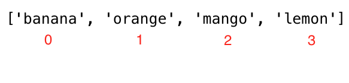

<div align="center">
  <h1> 30 Dias de Python: Dia 5 - Listas</h1>
  <a class="header-badge" target="_blank" href="https://www.linkedin.com/in/asabeneh/">
  
  </a>
  <a class="header-badge" target="_blank" href="https://twitter.com/Asabeneh">
  
  </a>

<sub>Autor:
<a href="https://www.linkedin.com/in/asabeneh/" target="_blank">Asabeneh Yetayeh</a><br>
<small> Segunda edição: Julho, 2021</small>
</sub>

</div>

[<< Dia 4](./04_strings_pt.md) | [Dia 6 >>](./06_tuples_pt.md)


- [Dia 5](#dia-5)
  - [Listas](#listas)
    - [Como Criar uma Lista](#como-criar-uma-lista)
    - [Acessando Itens da Lista Usando Indexação Positiva](#acessando-itens-da-lista-usando-indexação-positiva)
    - [Acessando Itens da Lista Usando Indexação Negativa](#acessando-itens-da-lista-usando-indexação-negativa)
    - [Desempacotando Itens de uma Lista](#desempacotando-itens-de-uma-lista)
    - [Fatiando Itens de uma Lista](#fatiando-itens-de-uma-lista)
    - [Modificando Listas](#modificando-listas)
    - [Verificando Itens em uma Lista](#verificando-itens-em-uma-lista)
    - [Adicionando Itens a uma Lista](#adicionando-itens-a-uma-lista)
    - [Inserindo Itens em uma Lista](#inserindo-itens-em-uma-lista)
    - [Removendo Itens de uma Lista](#removendo-itens-de-uma-lista)
    - [Removendo Itens Usando Pop](#removendo-itens-usando-pop)
    - [Removendo Itens Usando Del](#removendo-itens-usando-del)
    - [Limpando Itens da Lista](#limpando-itens-da-lista)
    - [Copiando uma Lista](#copiando-uma-lista)
    - [Unindo Listas](#unindo-listas)
    - [Contando Itens em uma Lista](#contando-itens-em-uma-lista)
    - [Encontrando o Índice de um Item](#encontrando-o-índice-de-um-item)
    - [Invertendo uma Lista](#invertendo-uma-lista)
    - [Ordenando Itens de uma Lista](#ordenando-itens-de-uma-lista)
  - [💻 Exercícios: Dia 5](#-exercícios-dia-5)
    - [Exercícios: Nível 1](#exercícios-nível-1)
    - [Exercícios: Nível 2](#exercícios-nível-2)

# Dia 5

## Listas

Existem quatro tipos de dados de coleção em Python:

- Lista (List): é uma coleção ordenada e alterável (modificável). Permite membros duplicados.
- Tupla (Tuple): é uma coleção ordenada e inalterável ou não modificável (imutável). Permite membros duplicados.
- Conjunto (Set): é uma coleção não ordenada, sem índice e não modificável, mas podemos adicionar novos itens ao conjunto. Membros duplicados não são permitidos.
- Dicionário (Dictionary): é uma coleção não ordenada, alterável (modificável) e indexada. Sem membros duplicados.

Uma lista é uma coleção de diferentes tipos de dados que é ordenada e modificável (mutável). Uma lista pode estar vazia ou pode conter itens de tipos de dados diferentes.

### Como Criar uma Lista

Em Python podemos criar listas de duas maneiras:

- Usando a função integrada list

```py
# sintaxe
lst = list()
```

```py
empty_list = list() # esta é uma lista vazia, sem itens na lista
print(len(empty_list)) # 0
```

- Usando colchetes, []

```py
# sintaxe
lst = []
```

```py
empty_list = [] # esta é uma lista vazia, sem itens na lista
print(len(empty_list)) # 0
```

Listas com valores iniciais. Usamos _len()_ para encontrar o comprimento de uma lista.

```py
fruits = ['banana', 'orange', 'mango', 'lemon']                     # lista de frutas
vegetables = ['Tomato', 'Potato', 'Cabbage','Onion', 'Carrot']      # lista de vegetais
animal_products = ['milk', 'meat', 'butter', 'yoghurt']             # lista de produtos animais
web_techs = ['HTML', 'CSS', 'JS', 'React','Redux', 'Node', 'MongDB'] # lista de tecnologias web
countries = ['Finland', 'Estonia', 'Denmark', 'Sweden', 'Norway'] 

# Imprime as listas e seu comprimento
print('Fruits:', fruits)
print('Number of fruits:', len(fruits))
print('Vegetables:', vegetables)
print('Number of vegetables:', len(vegetables))
print('Animal products:',animal_products)
print('Number of animal products:', len(animal_products))
print('Web technologies:', web_techs)
print('Number of web technologies:', len(web_techs))
print('Countries:', countries)
print('Number of countries:', len(countries))
```

```sh
output
Fruits: ['banana', 'orange', 'mango', 'lemon']
Number of fruits: 4
Vegetables: ['Tomato', 'Potato', 'Cabbage', 'Onion', 'Carrot']
Number of vegetables: 5
Animal products: ['milk', 'meat', 'butter', 'yoghurt']
Number of animal products: 4
Web technologies: ['HTML', 'CSS', 'JS', 'React', 'Redux', 'Node', 'MongDB']
Number of web technologies: 7
Countries: ['Finland', 'Estonia', 'Denmark', 'Sweden', 'Norway']
Number of countries: 5
```

- Listas podem ter itens de tipos de dados diferentes

```py
 lst = ['Asabeneh', 250, True, {'country':'Finland', 'city':'Helsinki'}] # lista contendo diferentes tipos de dados
```

### Acessando Itens da Lista Usando Indexação Positiva

Acessamos cada item de uma lista usando seu índice. O índice de uma lista começa em 0. A imagem abaixo mostra claramente onde o índice começa


```py
fruits = ['banana', 'orange', 'mango', 'lemon']
first_fruit = fruits[0] # estamos acessando o primeiro item usando seu índice
print(first_fruit)      # banana
second_fruit = fruits[1]
print(second_fruit)     # orange
last_fruit = fruits[3]
print(last_fruit) # lemon
# Último índice
last_index = len(fruits) - 1
last_fruit = fruits[last_index]
```

### Acessando Itens da Lista Usando Indexação Negativa

Indexação negativa significa começar do final; -1 se refere ao último item, -2 se refere ao penúltimo item.


```py
fruits = ['banana', 'orange', 'mango', 'lemon']
first_fruit = fruits[-4]
last_fruit = fruits[-1]
second_last = fruits[-2]
print(first_fruit)      # banana
print(last_fruit)       # lemon
print(second_last)      # mango
```

### Desempacotando Itens de uma Lista

```py
lst = ['item1','item2','item3', 'item4', 'item5']
first_item, second_item, third_item, *rest = lst
print(first_item)     # item1
print(second_item)    # item2
print(third_item)     # item3
print(rest)           # ['item4', 'item5']

```

```py
# Primeiro exemplo
fruits = ['banana', 'orange', 'mango', 'lemon','lime','apple']
first_fruit, second_fruit, third_fruit, *rest = fruits 
print(first_fruit)     # banana
print(second_fruit)    # orange
print(third_fruit)     # mango
print(rest)           # ['lemon','lime','apple']
# Segundo exemplo sobre desempacotamento de listas
first, second, third,*rest, tenth = [1,2,3,4,5,6,7,8,9,10]
print(first)          # 1
print(second)         # 2
print(third)          # 3
print(rest)           # [4,5,6,7,8,9]
print(tenth)          # 10
# Terceiro exemplo sobre desempacotamento de listas
countries = ['Germany', 'France','Belgium','Sweden','Denmark','Finland','Norway','Iceland','Estonia']
gr, fr, bg, sw, *scandic, es = countries
print(gr) 
print(fr)
print(bg)
print(sw)
print(scandic)
print(es)
```

### Fatiando Itens de uma Lista

- Indexação positiva: Podemos especificar um intervalo de índices positivos indicando início, fim e passo; o valor retornado será uma nova lista. (valores padrão para início = 0, fim = len(lst) - 1 (último item), passo = 1)

```py
fruits = ['banana', 'orange', 'mango', 'lemon']
all_fruits = fruits[0:4] # retorna todas as frutas
# isso também dará o mesmo resultado do exemplo acima
all_fruits = fruits[0:] # se não definirmos onde parar, ele pega todo o restante
orange_and_mango = fruits[1:3] # não inclui o primeiro índice
orange_mango_lemon = fruits[1:]
orange_and_lemon = fruits[::2] # aqui usamos um terceiro argumento, o passo. Ele pegará a cada 2 itens - ['banana', 'mango']
```

- Indexação negativa: Podemos especificar um intervalo de índices negativos indicando início, fim e passo; o valor retornado será uma nova lista.

```py
fruits = ['banana', 'orange', 'mango', 'lemon']
all_fruits = fruits[-4:] # retorna todas as frutas
orange_and_mango = fruits[-3:-1] # não inclui o último índice,['orange', 'mango']
orange_mango_lemon = fruits[-3:] # isso dará início em -3 até o final,['orange', 'mango', 'lemon']
reverse_fruits = fruits[::-1] # um passo negativo pegará a lista em ordem inversa,['lemon', 'mango', 'orange', 'banana']
```

### Modificando Listas

Lista é uma coleção ordenada de itens mutável ou modificável. Vamos modificar a lista de frutas.

```py
fruits = ['banana', 'orange', 'mango', 'lemon']
fruits[0] = 'avocado'
print(fruits)       #  ['avocado', 'orange', 'mango', 'lemon']
fruits[1] = 'apple'
print(fruits)       #  ['avocado', 'apple', 'mango', 'lemon']
last_index = len(fruits) - 1
fruits[last_index] = 'lime'
print(fruits)        #  ['avocado', 'apple', 'mango', 'lime']
```

### Verificando Itens em uma Lista

Verificando se um item é membro de uma lista usando o operador *in*. Veja o exemplo abaixo.

```py
fruits = ['banana', 'orange', 'mango', 'lemon']
does_exist = 'banana' in fruits
print(does_exist)  # True
does_exist = 'lime' in fruits
print(does_exist)  # False
```

### Adicionando Itens a uma Lista

Para adicionar um item ao final de uma lista existente usamos o método *append()*.

```py
# sintaxe
lst = list()
lst.append(item)
```

```py
fruits = ['banana', 'orange', 'mango', 'lemon']
fruits.append('apple')
print(fruits)           # ['banana', 'orange', 'mango', 'lemon', 'apple']
fruits.append('lime')   # ['banana', 'orange', 'mango', 'lemon', 'apple', 'lime']
print(fruits)
```

### Inserindo Itens em uma Lista

Podemos usar o método *insert()* para inserir um único item em um índice especificado de uma lista. Note que os outros itens são deslocados para a direita. O método *insert()* recebe dois argumentos: índice e o item a inserir.

```py
# sintaxe
lst = ['item1', 'item2']
lst.insert(index, item)
```

```py
fruits = ['banana', 'orange', 'mango', 'lemon']
fruits.insert(2, 'apple') # insere apple entre orange e mango
print(fruits)           # ['banana', 'orange', 'apple', 'mango', 'lemon']
fruits.insert(3, 'lime')   # ['banana', 'orange', 'apple', 'lime', 'mango', 'lemon']
print(fruits)
```

### Removendo Itens de uma Lista

O método remove remove um item especificado de uma lista

```py
# sintaxe
lst = ['item1', 'item2']
lst.remove(item)
```

```py
fruits = ['banana', 'orange', 'mango', 'lemon', 'banana']
fruits.remove('banana')
print(fruits)  # ['orange', 'mango', 'lemon', 'banana'] - este método remove a primeira ocorrência do item na lista
fruits.remove('lemon')
print(fruits)  # ['orange', 'mango', 'banana']
```

### Removendo Itens Usando Pop

O método *pop()* remove o índice especificado (ou o último item se o índice não for especificado):

```py
# sintaxe
lst = ['item1', 'item2']
lst.pop()       # último item
lst.pop(index)
```

```py
fruits = ['banana', 'orange', 'mango', 'lemon']
fruits.pop()
print(fruits)       # ['banana', 'orange', 'mango']

fruits.pop(0)
print(fruits)       # ['orange', 'mango']
```

### Removendo Itens Usando Del

A palavra-chave *del* remove o índice especificado e também pode ser usada para excluir itens dentro de um intervalo de índices. Também pode excluir a lista completamente

```py
# sintaxe
lst = ['item1', 'item2']
del lst[index] # apenas um único item
del lst        # para excluir a lista completamente
```

```py
fruits = ['banana', 'orange', 'mango', 'lemon', 'kiwi', 'lime']
del fruits[0]
print(fruits)       # ['orange', 'mango', 'lemon', 'kiwi', 'lime']
del fruits[1]
print(fruits)       # ['orange', 'lemon', 'kiwi', 'lime']
del fruits[1:3]     # isso exclui itens entre os índices dados, então não exclui o item com índice 3!
print(fruits)       # ['orange', 'lime']
del fruits
print(fruits)       # Isso deve gerar: NameError: name 'fruits' is not defined
```

### Limpando Itens da Lista

O método *clear()* esvazia a lista:

```py
# sintaxe
lst = ['item1', 'item2']
lst.clear()
```

```py
fruits = ['banana', 'orange', 'mango', 'lemon']
fruits.clear()
print(fruits)       # []
```

### Copiando uma Lista

É possível copiar uma lista reatribuindo-a a uma nova variável da seguinte forma: list2 = list1. Agora, list2 é uma referência de list1; qualquer alteração que fizermos em list2 também modificará a original, list1. Mas há muitos casos em que não queremos modificar a original, e sim ter uma cópia diferente. Uma forma de evitar o problema acima é usando _copy()_.

```py
# sintaxe
lst = ['item1', 'item2']
lst_copy = lst.copy()
```

```py
fruits = ['banana', 'orange', 'mango', 'lemon']
fruits_copy = fruits.copy()
print(fruits_copy)       # ['banana', 'orange', 'mango', 'lemon']
```

### Unindo Listas

Existem várias maneiras de unir, ou concatenar, duas ou mais listas em Python.

- Operador de soma (+)

```py
# sintaxe
list3 = list1 + list2
```

```py
positive_numbers = [1, 2, 3, 4, 5]
zero = [0]
negative_numbers = [-5,-4,-3,-2,-1]
integers = negative_numbers + zero + positive_numbers
print(integers) # [-5, -4, -3, -2, -1, 0, 1, 2, 3, 4, 5]
fruits = ['banana', 'orange', 'mango', 'lemon']
vegetables = ['Tomato', 'Potato', 'Cabbage', 'Onion', 'Carrot']
fruits_and_vegetables = fruits + vegetables
print(fruits_and_vegetables ) # ['banana', 'orange', 'mango', 'lemon', 'Tomato', 'Potato', 'Cabbage', 'Onion', 'Carrot']
```

- Unindo com o método extend()
  O método *extend()* permite anexar uma lista dentro de outra lista. Veja o exemplo abaixo.

```py
# sintaxe
list1 = ['item1', 'item2']
list2 = ['item3', 'item4', 'item5']
list1.extend(list2) # ['item1', 'item2', 'item3', 'item4', 'item5']
```

```py
num1 = [0, 1, 2, 3]
num2= [4, 5, 6]
num1.extend(num2)
print('Numbers:', num1) # Numbers: [0, 1, 2, 3, 4, 5, 6]
negative_numbers = [-5,-4,-3,-2,-1]
positive_numbers = [1, 2, 3,4,5]
zero = [0]

negative_numbers.extend(zero)
negative_numbers.extend(positive_numbers)
print('Integers:', negative_numbers) # Integers: [-5, -4, -3, -2, -1, 0, 1, 2, 3, 4, 5]
fruits = ['banana', 'orange', 'mango', 'lemon']
vegetables = ['Tomato', 'Potato', 'Cabbage', 'Onion', 'Carrot']
fruits.extend(vegetables)
print('Fruits and vegetables:', fruits ) # Fruits and vegetables: ['banana', 'orange', 'mango', 'lemon', 'Tomato', 'Potato', 'Cabbage', 'Onion', 'Carrot']
```

### Contando Itens em uma Lista

O método *count()* retorna o número de vezes que um item aparece em uma lista:

```py
# sintaxe
lst = ['item1', 'item2']
lst.count(item)
```

```py
fruits = ['banana', 'orange', 'mango', 'lemon']
print(fruits.count('orange'))   # 1
ages = [22, 19, 24, 25, 26, 24, 25, 24]
print(ages.count(24))           # 3
```

### Encontrando o Índice de um Item

O método *index()* retorna o índice de um item na lista:

```py
# sintaxe
lst = ['item1', 'item2']
lst.index(item)
```

```py
fruits = ['banana', 'orange', 'mango', 'lemon']
print(fruits.index('orange'))   # 1
ages = [22, 19, 24, 25, 26, 24, 25, 24]
print(ages.index(24))           # 2, a primeira ocorrência
```

### Invertendo uma Lista

O método *reverse()* inverte a ordem de uma lista.

```py
# sintaxe
lst = ['item1', 'item2']
lst.reverse()

```

```py
fruits = ['banana', 'orange', 'mango', 'lemon']
fruits.reverse()
print(fruits) # ['lemon', 'mango', 'orange', 'banana']
ages = [22, 19, 24, 25, 26, 24, 25, 24]
ages.reverse()
print(ages) # [24, 25, 24, 26, 25, 24, 19, 22]
```

### Ordenando Itens de uma Lista

Para ordenar listas podemos usar o método _sort()_ ou a função integrada _sorted()_. O método _sort()_ reordena os itens da lista em ordem crescente e modifica a lista original. Se o argumento reverse do método _sort()_ for igual a true, ele organizará a lista em ordem decrescente.

- sort(): este método modifica a lista original

  ```py
  # sintaxe
  lst = ['item1', 'item2']
  lst.sort()                # crescente
  lst.sort(reverse=True)    # decrescente
  ```

  **Exemplo:**

  ```py
  fruits = ['banana', 'orange', 'mango', 'lemon']
  fruits.sort()
  print(fruits)             # ordenado em ordem alfabética, ['banana', 'lemon', 'mango', 'orange']
  fruits.sort(reverse=True)
  print(fruits) # ['orange', 'mango', 'lemon', 'banana']
  ages = [22, 19, 24, 25, 26, 24, 25, 24]
  ages.sort()
  print(ages) #  [19, 22, 24, 24, 24, 25, 25, 26]
 
  ages.sort(reverse=True)
  print(ages) #  [26, 25, 25, 24, 24, 24, 22, 19]
  ```

  sorted(): retorna a lista ordenada sem modificar a lista original
  **Exemplo:**

  ```py
  fruits = ['banana', 'orange', 'mango', 'lemon']
  print(sorted(fruits))   # ['banana', 'lemon', 'mango', 'orange']
  # Ordem inversa
  fruits = ['banana', 'orange', 'mango', 'lemon']
  fruits = sorted(fruits,reverse=True)
  print(fruits)     # ['orange', 'mango', 'lemon', 'banana']
  ```

🌕 Você é diligente e já conquistou bastante. Você acabou de completar os desafios do dia 5 e está cinco passos à frente no seu caminho para a grandeza. Agora faça alguns exercícios para o cérebro e os músculos.

## 💻 Exercícios: Dia 5

### Exercícios: Nível 1

1. Declare uma lista vazia
2. Declare uma lista com mais de 5 itens
3. Encontre o comprimento da sua lista
4. Obtenha o primeiro item, o item do meio e o último item da lista
5. Declare uma lista chamada mixed_data_types, coloque seus dados (nome, idade, altura, estado civil, endereço)
6. Declare uma variável de lista chamada it_companies e atribua os valores iniciais Facebook, Google, Microsoft, Apple, IBM, Oracle e Amazon.
7. Imprima a lista usando _print()_
8. Imprima o número de empresas na lista
9. Imprima a primeira, a do meio e a última empresa
10. Imprima a lista depois de modificar uma das empresas
11. Adicione uma empresa de TI a it_companies
12. Insira uma empresa de TI no meio da lista de empresas
13. Altere um dos nomes de it_companies para letras maiúsculas (IBM excluída!)
14. Una os it_companies com uma string '#;&nbsp; '
15. Verifique se uma determinada empresa existe na lista it_companies.
16. Ordene a lista usando o método sort()
17. Inverta a lista em ordem decrescente usando o método reverse()
18. Corte (slice) as 3 primeiras empresas da lista
19. Corte (slice) as 3 últimas empresas da lista
20. Corte (slice) a empresa ou empresas de TI do meio da lista
21. Remova a primeira empresa de TI da lista
22. Remova a empresa ou empresas de TI do meio da lista
23. Remova a última empresa de TI da lista
24. Remova todas as empresas de TI da lista
25. Destrua a lista de empresas de TI
26. Una as seguintes listas:

    ```py
    front_end = ['HTML', 'CSS', 'JS', 'React', 'Redux']
    back_end = ['Node','Express', 'MongoDB']
    ```

27. Depois de unir as listas na questão 26. Copie a lista unida e atribua-a a uma variável full_stack, depois insira Python e SQL depois de Redux.

### Exercícios: Nível 2

1. A seguir está uma lista com as idades de 10 estudantes:

```sh
ages = [19, 22, 19, 24, 20, 25, 26, 24, 25, 24]
```

- Ordene a lista e encontre a idade mínima e máxima
- Adicione a idade mínima e a idade máxima novamente à lista
- Encontre a idade mediana (um item do meio ou dois itens do meio divididos por dois)
- Encontre a idade média (soma de todos os itens dividida pelo seu número)
- Encontre a amplitude das idades (máximo menos mínimo)
- Compare o valor de (mínimo - média) e (máximo - média), use o método _abs()_

1. Encontre o país ou países do meio na [lista de países](https://github.com/Asabeneh/30-Days-Of-Python/tree/master/data/countries.py)
1. Divida a lista de países em duas listas iguais; se for par, se não, um país mais para a primeira metade.
1. ['China', 'Russia', 'USA', 'Finland', 'Sweden', 'Norway', 'Denmark']. Desempacote os três primeiros países e o restante como países escandinavos.

🎉 PARABÉNS ! 🎉

[<< Dia 4](./04_strings_pt.md) | [Dia 6 >>](./06_tuples_pt.md)
