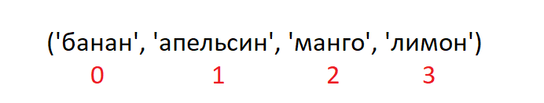
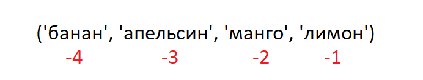

<div align="center">
  <h1> 30 Dias de Python: Dia 6 - Tuplas</h1>
  <a class="header-badge" target="_blank" href="https://www.linkedin.com/in/asabeneh/">
  
  </a>
  <a class="header-badge" target="_blank" href="https://twitter.com/Asabeneh">
  
  </a>

<sub>Autor:
<a href="https://www.linkedin.com/in/asabeneh/" target="_blank">Asabeneh Yetayeh</a><br>
<small> Segunda edição: Julho, 2021</small>
</sub>

</div>

[<< Dia 5](./05_lists_pt.md) | [Dia 7 >>](./07_sets_pt.md)


- [Dia 6:](#dia-6)
  - [Tuplas](#tuplas)
    - [Criando uma Tupla](#criando-uma-tupla)
    - [Comprimento de uma Tupla](#comprimento-de-uma-tupla)
    - [Acessando Itens de uma Tupla](#acessando-itens-de-uma-tupla)
    - [Fatiando Tuplas](#fatiando-tuplas)
    - [Convertendo Tuplas em Listas](#convertendo-tuplas-em-listas)
    - [Verificando um Item em uma Tupla](#verificando-um-item-em-uma-tupla)
    - [Unindo Tuplas](#unindo-tuplas)
    - [Excluindo Tuplas](#excluindo-tuplas)
  - [💻 Exercícios: Dia 6](#-exercícios-dia-6)
    - [Exercícios: Nível 1](#exercícios-nível-1)
    - [Exercícios: Nível 2](#exercícios-nível-2)

# Dia 6:

## Tuplas

Uma tupla é uma coleção de diferentes tipos de dados que é ordenada e inalterável (imutável). As tuplas são escritas com parênteses, (). Uma vez que uma tupla é criada, não podemos alterar seus valores. Não podemos usar os métodos add, insert ou remove em uma tupla porque ela não é modificável (mutável). Diferente da lista, a tupla tem poucos métodos. Métodos relacionados a tuplas:

- tuple(): para criar uma tupla vazia
- count(): para contar o número de um item especificado em uma tupla
- index(): para encontrar o índice de um item especificado em uma tupla
- operador `+`: para unir duas ou mais tuplas e criar uma nova tupla

### Criando uma Tupla

- Tupla vazia: Criando uma tupla vazia
  
  ```py
  # sintaxe
  empty_tuple = ()
  # ou usando o construtor tuple
  empty_tuple = tuple()
  ```

- Tupla com valores iniciais
  
  ```py
  # sintaxe
  tpl = ('item1', 'item2','item3')
  ```

  ```py
  fruits = ('banana', 'orange', 'mango', 'lemon')
  ```

### Comprimento de uma Tupla

Usamos o método _len()_ para obter o comprimento de uma tupla.

```py
# sintaxe
tpl = ('item1', 'item2', 'item3')
len(tpl)
```

### Acessando Itens de uma Tupla

- Indexação positiva
  De forma semelhante ao tipo de dado lista, usamos indexação positiva ou negativa para acessar itens da tupla.
  

  ```py
  # Sintaxe
  tpl = ('item1', 'item2', 'item3')
  first_item = tpl[0]
  second_item = tpl[1]
  ```

  ```py
  fruits = ('banana', 'orange', 'mango', 'lemon')
  first_fruit = fruits[0]
  second_fruit = fruits[1]
  last_index =len(fruits) - 1
  last_fruit = fruits[last_index]
  ```

- Indexação negativa
  Indexação negativa significa começar do final; -1 se refere ao último item, -2 se refere ao penúltimo, e o negativo do comprimento da lista/tupla se refere ao primeiro item.
  

  ```py
  # Sintaxe
  tpl = ('item1', 'item2', 'item3','item4')
  first_item = tpl[-4]
  second_item = tpl[-3]
  ```

  ```py
  fruits = ('banana', 'orange', 'mango', 'lemon')
  first_fruit = fruits[-4]
  second_fruit = fruits[-3]
  last_fruit = fruits[-1]
  ```

### Fatiando Tuplas

Podemos extrair uma sub-tupla especificando um intervalo de índices de onde começar e onde terminar na tupla; o valor retornado será uma nova tupla com os itens especificados.

- Intervalo de índices positivos

  ```py
  # Sintaxe
  tpl = ('item1', 'item2', 'item3','item4')
  all_items = tpl[0:4]         # todos os itens
  all_items = tpl[0:]         # todos os itens
  middle_two_items = tpl[1:3]  # não inclui o item no índice 3
  ```

  ```py
  fruits = ('banana', 'orange', 'mango', 'lemon')
  all_fruits = fruits[0:4]    # todos os itens
  all_fruits= fruits[0:]      # todos os itens
  orange_mango = fruits[1:3]  # não inclui o item no índice 3
  orange_to_the_rest = fruits[1:]
  ```

- Intervalo de índices negativos

  ```py
  # Sintaxe
  tpl = ('item1', 'item2', 'item3','item4')
  all_items = tpl[-4:]         # todos os itens
  middle_two_items = tpl[-3:-1]  # não inclui o item no índice 3 (-1)
  ```

  ```py
  fruits = ('banana', 'orange', 'mango', 'lemon')
  all_fruits = fruits[-4:]    # todos os itens
  orange_mango = fruits[-3:-1]  # não inclui o item no índice 3
  orange_to_the_rest = fruits[-3:]
  ```

### Convertendo Tuplas em Listas

Podemos converter tuplas em listas e listas em tuplas. A tupla é imutável; se quisermos modificar uma tupla, devemos convertê-la em uma lista.

```py
# Sintaxe
tpl = ('item1', 'item2', 'item3','item4')
lst = list(tpl)
```

```py
fruits = ('banana', 'orange', 'mango', 'lemon')
fruits = list(fruits)
fruits[0] = 'apple'
print(fruits)     # ['apple', 'orange', 'mango', 'lemon']
fruits = tuple(fruits)
print(fruits)     # ('apple', 'orange', 'mango', 'lemon')
```

### Verificando um Item em uma Tupla

Podemos verificar se um item existe ou não em uma tupla usando _in_, que retorna um booleano.

```py
# Sintaxe
tpl = ('item1', 'item2', 'item3','item4')
'item2' in tpl # True
```

```py
fruits = ('banana', 'orange', 'mango', 'lemon')
print('orange' in fruits) # True
print('apple' in fruits) # False
fruits[0] = 'apple' # TypeError: 'tuple' object does not support item assignment
```

### Unindo Tuplas

Podemos unir duas ou mais tuplas usando o operador +

```py
# sintaxe
tpl1 = ('item1', 'item2', 'item3')
tpl2 = ('item4', 'item5','item6')
tpl3 = tpl1 + tpl2
```

```py
fruits = ('banana', 'orange', 'mango', 'lemon')
vegetables = ('Tomato', 'Potato', 'Cabbage','Onion', 'Carrot')
fruits_and_vegetables = fruits + vegetables
```

### Excluindo Tuplas

Não é possível remover um único item de uma tupla, mas é possível excluir a própria tupla usando _del_.

```py
# sintaxe
tpl1 = ('item1', 'item2', 'item3')
del tpl1

```

```py
fruits = ('banana', 'orange', 'mango', 'lemon')
del fruits
```

🌕 Você é muito corajoso, você chegou até aqui. Você acabou de completar os desafios do dia 6 e está seis passos à frente no seu caminho para a grandeza. Agora faça alguns exercícios para o cérebro e os músculos.

## 💻 Exercícios: Dia 6

### Exercícios: Nível 1

1. Crie uma tupla vazia
2. Crie uma tupla contendo os nomes das suas irmãs e irmãos (irmãos imaginários também valem)
3. Una as tuplas de irmãos e irmãs e atribua o resultado a siblings
4. Quantos irmãos você tem?
5. Modifique a tupla siblings e adicione o nome do seu pai e da sua mãe, atribuindo o resultado a family_members

### Exercícios: Nível 2

1. Desempacote siblings e parents de family_members
1. Crie tuplas de frutas, vegetais e produtos animais. Una as três tuplas e atribua o resultado a uma variável chamada food_stuff_tp.
1. Converta a tupla food_stuff_tp em uma lista food_stuff_lt
1. Corte (slice) o item ou itens do meio da tupla food_stuff_tp ou da lista food_stuff_lt.
1. Corte (slice) os três primeiros e os três últimos itens da lista food_stuff_lt
1. Exclua completamente a tupla food_stuff_tp
1. Verifique se um item existe em uma tupla:

- Verifique se 'Estonia' é um país nórdico
- Verifique se 'Iceland' é um país nórdico

  ```py
  nordic_countries = ('Denmark', 'Finland','Iceland', 'Norway', 'Sweden')
  ```

🎉 PARABÉNS ! 🎉

[<< Dia 5](./05_lists_pt.md) | [Dia 7 >>](./07_sets_pt.md)
