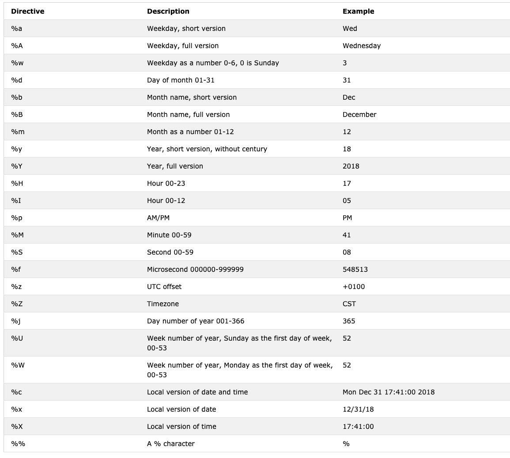

<div align="center">
  <h1> 30 Dias de Python: Dia 16 - Data e Hora em Python </h1>
  <a class="header-badge" target="_blank" href="https://www.linkedin.com/in/asabeneh/">
  
  </a>
  <a class="header-badge" target="_blank" href="https://twitter.com/Asabeneh">
  
  </a>

  <sub>Autor:
  <a href="https://www.linkedin.com/in/asabeneh/" target="_blank">Asabeneh Yetayeh</a><br>
  <small>Segunda edição: Julho, 2021</small>
  </sub>
</div>

[<< Dia 15](./15_python_type_errors_pt.md) | [Dia 17 >>](./17_exception_handling_pt.md)


- [📘 Dia 16](#-dia-16)
  - [*datetime* em Python](#datetime-em-python)
    - [Obtendo Informações de *datetime*](#obtendo-informações-de-datetime)
    - [Formatando a Saída da Data Usando *strftime*](#formatando-a-saída-da-data-usando-strftime)
    - [String para Hora Usando *strptime*](#string-para-hora-usando-strptime)
    - [Usando *date* de *datetime*](#usando-date-de-datetime)
    - [Objetos Time para Representar Hora](#objetos-time-para-representar-hora)
    - [Diferença Entre Dois Pontos no Tempo Usando](#diferença-entre-dois-pontos-no-tempo-usando)
    - [Diferença Entre Dois Pontos no Tempo Usando *timedelta*](#diferença-entre-dois-pontos-no-tempo-usando-timedelta)
  - [💻 Exercícios: Dia 16](#-exercícios-dia-16)
# 📘 Dia 16

## *datetime* em Python

O Python tem o módulo _datetime_ para lidar com data e hora.

```py
import datetime
print(dir(datetime))
['MAXYEAR', 'MINYEAR', '__builtins__', '__cached__', '__doc__', '__file__', '__loader__', '__name__', '__package__', '__spec__', 'date', 'datetime', 'datetime_CAPI', 'sys', 'time', 'timedelta', 'timezone', 'tzinfo']
```

Com os comandos integrados dir ou help é possível saber quais funções estão disponíveis em determinado módulo. Como você pode ver, no módulo datetime existem muitas funções, mas vamos focar em _date_, _datetime_, _time_ e _timedelta_. Vamos vê-las uma por uma.

### Obtendo Informações de *datetime*

```py
from datetime import datetime
now = datetime.now()
print(now)                      # 2021-07-08 07:34:46.549883
day = now.day                   # 8
month = now.month               # 7
year = now.year                 # 2021
hour = now.hour                 # 7
minute = now.minute             # 38
second = now.second
timestamp = now.timestamp()
print(day, month, year, hour, minute)
print('timestamp', timestamp)
print(f'{day}/{month}/{year}, {hour}:{minute}')  # 8/7/2021, 7:38
```

Timestamp, ou Unix timestamp, é o número de segundos transcorridos desde 1º de janeiro de 1970 UTC.

### Formatando a Saída da Data Usando *strftime*

```py
from datetime import datetime
new_year = datetime(2020, 1, 1)
print(new_year)      # 2020-01-01 00:00:00
day = new_year.day
month = new_year.month
year = new_year.year
hour = new_year.hour
minute = new_year.minute
second = new_year.second
print(day, month, year, hour, minute) #1 1 2020 0 0
print(f'{day}/{month}/{year}, {hour}:{minute}')  # 1/1/2020, 0:0

```

Formatando data e hora usando o método *strftime*; a documentação pode ser encontrada [aqui](https://strftime.org/).

```py
from datetime import datetime
# data e hora atual
now = datetime.now()
t = now.strftime("%H:%M:%S")
print("time:", t)           # time: 18:21:40
time_one = now.strftime("%m/%d/%Y, %H:%M:%S")
# formato mm/dd/YY H:M:S
print("time one:", time_one)        # time one: 06/28/2022, 18:21:40
time_two = now.strftime("%d/%m/%Y, %H:%M:%S")
# formato dd/mm/YY H:M:S
print("time two:", time_two)        # time two: 28/06/2022, 18:21:40
```

```sh
time: 01:05:01
time one: 12/05/2019, 01:05:01
time two: 05/12/2019, 01:05:01
```

Aqui estão todos os símbolos de _strftime_ que usamos para formatar a hora. Um exemplo de todos os formatos deste módulo.



### String para Hora Usando *strptime*
Aqui está uma [documentação](https://www.programiz.com/python-programming/datetime/strptime) que ajuda a entender o formato. 

```py
from datetime import datetime
date_string = "5 December, 2019"
print("date_string =", date_string)     # date_string = 5 December, 2019
date_object = datetime.strptime(date_string, "%d %B, %Y")
print("date_object =", date_object)     # date_object = 2019-12-05 00:00:00
```

```sh
date_string = 5 December, 2019
date_object = 2019-12-05 00:00:00
```

### Usando *date* de *datetime*

```py
from datetime import date
d = date(2020, 1, 1)
print(d)        # 2020-01-01
print('Current date:', d.today())    # 2019-12-05
# objeto date da data de hoje
today = date.today()
print("Current year:", today.year)   # 2019
print("Current month:", today.month) # 12
print("Current day:", today.day)     # 5
```

### Objetos Time para Representar Hora

```py
from datetime import time
# time(hour = 0, minute = 0, second = 0)
a = time()
print("a =", a)     # a = 00:00:00
# time(hour, minute e second)
b = time(10, 30, 50)
print("b =", b)     # b = 10:30:50
# time(hour, minute e second)
c = time(hour=10, minute=30, second=50)
print("c =", c)     # c = 10:30:50
# time(hour, minute, second, microsecond)
d = time(10, 30, 50, 200555)
print("d =", d)     # d = 10:30:50.200555
```

saída  
a = 00:00:00  
b = 10:30:50  
c = 10:30:50  
d = 10:30:50.200555

### Diferença Entre Dois Pontos no Tempo Usando

```py
from datetime import date, datetime
today = date(year=2019, month=12, day=5)
new_year = date(year=2020, month=1, day=1)
time_left_for_newyear = new_year - today
# Tempo restante para o ano novo:  27 days, 0:00:00
print('Time left for new year: ', time_left_for_newyear)  # Time left for new year:  27 days, 0:00:00

t1 = datetime(year = 2019, month = 12, day = 5, hour = 0, minute = 59, second = 0)
t2 = datetime(year = 2020, month = 1, day = 1, hour = 0, minute = 0, second = 0)
diff = t2 - t1
print('Time left for new year:', diff) # Time left for new year: 26 days, 23: 01: 00
```

### Diferença Entre Dois Pontos no Tempo Usando *timedelta*

```py
from datetime import timedelta
t1 = timedelta(weeks=12, days=10, hours=4, seconds=20)
t2 = timedelta(days=7, hours=5, minutes=3, seconds=30)
t3 = t1 - t2
print("t3 =", t3)
```

```sh
    date_string = 5 December, 2019
    date_object = 2019-12-05 00:00:00
    t3 = 86 days, 22:56:50
```

🌕 Você é extraordinário(a). Você está dezesseis passos à frente no caminho para a grandeza. Agora faça alguns exercícios para o cérebro e os músculos.

## 💻 Exercícios: Dia 16

1. Obtenha o dia, mês, ano, hora, minuto e timestamp atuais a partir do módulo datetime
2. Formate a data atual usando este formato: "%m/%d/%Y, %H:%M:%S")
3. Hoje é 5 de dezembro de 2019. Transforme essa string de tempo em um objeto de tempo.
4. Calcule a diferença de tempo entre agora e o ano novo.
5. Calcule a diferença de tempo entre 1º de janeiro de 1970 e agora.
6. Pense: para que você pode usar o módulo datetime? Exemplos:
   - Análise de séries temporais
   - Para obter um timestamp de qualquer atividade em uma aplicação
   - Adicionar posts em um blog 

🎉 PARABÉNS ! 🎉

[<< Dia 15](./15_python_type_errors_pt.md) | [Dia 17 >>](./17_exception_handling_pt.md)
