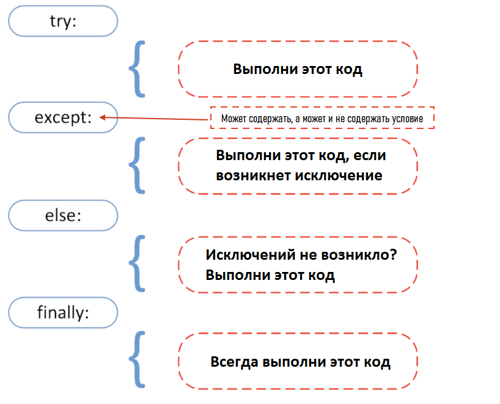

<div align="center">
  <h1> 30 Dias de Python: Dia 17 - Tratamento de Exceções </h1>
  <a class="header-badge" target="_blank" href="https://www.linkedin.com/in/asabeneh/">
  
  </a>
  <a class="header-badge" target="_blank" href="https://twitter.com/Asabeneh">
  
  </a>

<sub>Autor:
<a href="https://www.linkedin.com/in/asabeneh/" target="_blank">Asabeneh Yetayeh</a><br>
<small> Segunda edição: Julho, 2021</small>
</sub>

</div>

[<< Dia 16](./16_python_datetime_pt.md) | [Dia 18 >>](./18_regular_expressions_pt.md)


- [📘 Dia 17](#-dia-17)
  - [Tratamento de Exceções](#tratamento-de-exceções)
  - [Empacotamento e Desempacotamento de Argumentos em Python](#empacotamento-e-desempacotamento-de-argumentos-em-python)
    - [Desempacotamento](#desempacotamento)
      - [Desempacotando Listas](#desempacotando-listas)
      - [Desempacotando Dicionários](#desempacotando-dicionários)
    - [Empacotamento](#empacotamento)
    - [Empacotando Listas](#empacotando-listas)
      - [Empacotando Dicionários](#empacotando-dicionários)
  - [Spread (Espalhamento) em Python](#spread-espalhamento-em-python)
  - [Enumerate](#enumerate)
  - [Zip](#zip)
  - [💻 Exercícios: Dia 17](#-exercícios-dia-17)

# 📘 Dia 17

## Tratamento de Exceções

Python usa _try_ e _except_ para tratar erros de forma elegante. Uma saída (ou tratamento) elegante de erros é um idioma de programação simples - um programa detecta uma condição de erro grave e "sai graciosamente", de maneira controlada como resultado. Frequentemente, o programa imprime uma mensagem de erro descritiva em um terminal ou log como parte dessa saída elegante, o que torna nossa aplicação mais robusta. A causa de uma exceção é geralmente externa ao próprio programa. Um exemplo de exceção pode ser uma entrada incorreta, um nome de arquivo errado, a impossibilidade de encontrar um arquivo, ou um dispositivo de E/S com defeito. O tratamento elegante de erros evita que nossas aplicações travem.

Já vimos os diferentes tipos de _erro_ em Python na seção anterior. Se usarmos _try_ e _except_ em nosso programa, ele não lançará erros dentro desses blocos.



```py
try:
    código deste bloco, se tudo correr bem
except:
    código deste bloco é executado se algo der errado
```

**Exemplo:**

```py
try:
    print(10 + '5')
except:
    print('Something went wrong')
```

No exemplo acima, o segundo operando é uma string. Poderíamos mudá-lo para float ou int para somá-lo ao número e fazer funcionar. Mas sem nenhuma alteração, o segundo bloco, _except_, será executado.

**Exemplo:**

```py
try:
    name = input('Enter your name:')
    year_born = input('Year you were born:')
    age = 2019 - year_born
    print(f'You are {name}. And your age is {age}.')
except:
    print('Something went wrong')
```

```sh
Something went wrong
```

No exemplo acima, o bloco de exceção será executado, mas não sabemos exatamente qual foi o problema. Para analisar o problema, podemos usar os diferentes tipos de erro com o except.

No exemplo a seguir, o erro será tratado e também nos dirá o tipo de erro que ocorreu.

```py
try:
    name = input('Enter your name:')
    year_born = input('Year you were born:')
    age = 2019 - year_born
    print(f'You are {name}. And your age is {age}.')
except TypeError:
    print('Type error occured')
except ValueError:
    print('Value error occured')
except ZeroDivisionError:
    print('zero division error occured')
```

```sh
Enter your name:Asabeneh
Year you born:1920
Type error occured
```

No código acima, a saída será _TypeError_.
Agora, vamos adicionar um bloco adicional:

```py
try:
    name = input('Enter your name:')
    year_born = input('Year you born:')
    age = 2019 - int(year_born)
    print(f'You are {name}. And your age is {age}.')
except TypeError:
    print('Type error occur')
except ValueError:
    print('Value error occur')
except ZeroDivisionError:
    print('zero division error occur')
else:
    print('I usually run with the try block')
finally:
    print('I alway run.')
```

```sh
Enter your name:Asabeneh
Year you born:1920
You are Asabeneh. And your age is 99.
I usually run with the try block
I alway run.
```

Também podemos abreviar o código acima da seguinte forma:

```py
try:
    name = input('Enter your name:')
    year_born = input('Year you born:')
    age = 2019 - int(year_born)
    print(f'You are {name}. And your age is {age}.')
except Exception as e:
    print(e)

```

## Empacotamento e Desempacotamento de Argumentos em Python

Usamos dois operadores:

- \* para tuplas
- \*\* para dicionários

Vamos usar um exemplo abaixo. Ele recebe apenas argumentos, mas temos uma lista. Podemos desempacotar a lista e transformá-la em argumentos.

### Desempacotamento

#### Desempacotando Listas

```py
def sum_of_five_nums(a, b, c, d, e):
    return a + b + c + d + e

lst = [1, 2, 3, 4, 5]
print(sum_of_five_nums(lst)) # TypeError: sum_of_five_nums() missing 4 required positional arguments: 'b', 'c', 'd', and 'e'
```

Quando executamos este código, ele lança um erro, porque essa função espera números (e não uma lista) como argumentos. Vamos desempacotar/desestruturar a lista.

```py
def sum_of_five_nums(a, b, c, d, e):
    return a + b + c + d + e

lst = [1, 2, 3, 4, 5]
print(sum_of_five_nums(*lst))  # 15
```

Também podemos usar o desempacotamento na função integrada range, que espera um início e um fim.

```py
numbers = range(2, 7)  # chamada normal com argumentos separados
print(list(numbers)) # [2, 3, 4, 5, 6]
args = [2, 7]
numbers = range(*args)  # chamada com argumentos desempacotados de uma lista
print(numbers)      # [2, 3, 4, 5,6]

```

Uma lista ou tupla também pode ser desempacotada assim:

```py
countries = ['Finland', 'Sweden', 'Norway', 'Denmark', 'Iceland']
fin, sw, nor, *rest = countries
print(fin, sw, nor, rest)   # Finland Sweden Norway ['Denmark', 'Iceland']
numbers = [1, 2, 3, 4, 5, 6, 7]
one, *middle, last = numbers
print(one, middle, last)      #  1 [2, 3, 4, 5, 6] 7
```

#### Desempacotando Dicionários

```py
def unpacking_person_info(name, country, city, age):
    return f'{name} lives in {country}, {city}. He is {age} year old.'
dct = {'name':'Asabeneh', 'country':'Finland', 'city':'Helsinki', 'age':250}
print(unpacking_person_info(**dct)) # Asabeneh lives in Finland, Helsinki. He is 250 years old.
```

### Empacotamento

Às vezes nunca sabemos quantos argumentos precisam ser passados para uma função Python. Podemos usar o método de empacotamento para permitir que nossa função aceite um número ilimitado ou arbitrário de argumentos.

### Empacotando Listas

```py
def sum_all(*args):
    s = 0
    for i in args:
        s += i
    return s
print(sum_all(1, 2, 3))             # 6
print(sum_all(1, 2, 3, 4, 5, 6, 7)) # 28
```

#### Empacotando Dicionários

```py
def packing_person_info(**kwargs):
    # verifica o tipo de kwargs e é um dict
    # print(type(kwargs))
    # Imprimindo os itens do dicionário
    for key in kwargs:
        print(f"{key} = {kwargs[key]}")
    return kwargs

print(packing_person_info(name="Asabeneh",
      country="Finland", city="Helsinki", age=250))
```

```sh
name = Asabeneh
country = Finland
city = Helsinki
age = 250
{'name': 'Asabeneh', 'country': 'Finland', 'city': 'Helsinki', 'age': 250}
```

## Spread (Espalhamento) em Python

Assim como em JavaScript, o espalhamento (spread) também é possível em Python. Vamos verificar em um exemplo abaixo:

```py
lst_one = [1, 2, 3]
lst_two = [4, 5, 6, 7]
lst = [0, *lst_one, *lst_two]
print(lst)          # [0, 1, 2, 3, 4, 5, 6, 7]
country_lst_one = ['Finland', 'Sweden', 'Norway']
country_lst_two = ['Denmark', 'Iceland']
nordic_countries = [*country_lst_one, *country_lst_two]
print(nordic_countries)  # ['Finland', 'Sweden', 'Norway', 'Denmark', 'Iceland']
```

## Enumerate

Se estivermos interessados no índice de uma lista, usamos a função integrada _enumerate_ para obter o índice de cada item da lista.

```py
for index, item in enumerate([20, 30, 40]):
    print(index, item)
```

```py
countries = ['Finland', 'Sweden', 'Norway', 'Denmark', 'Iceland']
for index, i in enumerate(countries):
    if i == 'Finland':
        print(f'The country {i} has been found at index {index}')
```

```sh
The country Finland has been found at index 0.
```

## Zip

Às vezes gostaríamos de combinar listas ao percorrê-las em um loop. Veja o exemplo abaixo:

```py
fruits = ['banana', 'orange', 'mango', 'lemon', 'lime']                    
vegetables = ['Tomato', 'Potato', 'Cabbage','Onion', 'Carrot']
fruits_and_veges = []
for f, v in zip(fruits, vegetables):
    fruits_and_veges.append({'fruit':f, 'veg':v})

print(fruits_and_veges)
```

```sh
[{'fruit': 'banana', 'veg': 'Tomato'}, {'fruit': 'orange', 'veg': 'Potato'}, {'fruit': 'mango', 'veg': 'Cabbage'}, {'fruit': 'lemon', 'veg': 'Onion'}, {'fruit': 'lime', 'veg': 'Carrot'}]
```

🌕 Você é uma pessoa determinada. Você está dezessete passos à frente no seu caminho para a grandeza. Agora faça alguns exercícios para o cérebro e os músculos.

## 💻 Exercícios: Dia 17

1. names = ['Finland', 'Sweden', 'Norway','Denmark','Iceland', 'Estonia','Russia']. Desempacote os cinco primeiros países e armazene-os em uma variável nordic_countries, armazene Estonia e Russia em es e ru, respectivamente.


🎉 PARABÉNS ! 🎉

[<< Dia 16](./16_python_datetime_pt.md) | [Dia 18 >>](./18_regular_expressions_pt.md)
