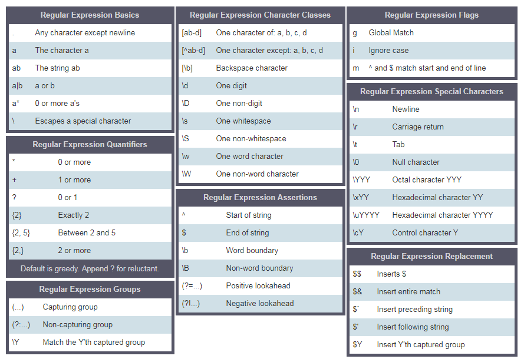

<div align="center">
  <h1> 30 Dias de Python: Dia 18 - Expressões Regulares </h1>
  <a class="header-badge" target="_blank" href="https://www.linkedin.com/in/asabeneh/">
  
  </a>
  <a class="header-badge" target="_blank" href="https://twitter.com/Asabeneh">
  
  </a>

<sub>Autor:
<a href="https://www.linkedin.com/in/asabeneh/" target="_blank">Asabeneh Yetayeh</a><br>
<small> Segunda edição: Julho, 2021</small>
</sub>

</div>

[<< Dia 17](./17_exception_handling_pt.md) | [Dia 19 >>](./19_file_handling_pt.md)


- [📘 Dia 18](#-dia-18)
  - [Expressões Regulares](#expressões-regulares)
    - [O Módulo *re*](#o-módulo-re)
    - [Métodos do Módulo *re*](#métodos-do-módulo-re)
      - [Match](#match)
      - [Search](#search)
      - [Buscando Todas as Ocorrências com *findall*](#buscando-todas-as-ocorrências-com-findall)
      - [Substituindo uma Substring](#substituindo-uma-substring)
  - [Dividindo Texto com RegEx Split](#dividindo-texto-com-regex-split)
  - [Escrevendo Padrões RegEx](#escrevendo-padrões-regex)
    - [Colchetes](#colchetes)
    - [Caractere de Escape (\\) em RegEx](#caractere-de-escape--em-regex)
    - [Uma ou mais vezes (+)](#uma-ou-mais-vezes-)
    - [Ponto (.)](#ponto-)
    - [Zero ou mais vezes (\*)](#zero-ou-mais-vezes-)
    - [Zero ou uma vez (?)](#zero-ou-uma-vez-)
    - [Quantificadores em RegEx](#quantificadores-em-regex)
    - [Acento Circunflexo ^](#acento-circunflexo-)
  - [💻 Exercícios: Dia 18](#-exercícios-dia-18)
    - [Exercícios: Nível 1](#exercícios-nível-1)
    - [Exercícios: Nível 2](#exercícios-nível-2)
    - [Exercícios: Nível 3](#exercícios-nível-3)

# 📘 Dia 18

## Expressões Regulares

Uma expressão regular ou RegEx é uma sequência de texto especial que ajuda a encontrar padrões em dados. Uma RegEx pode ser usada para verificar se algum padrão existe em um tipo de dado diferente. Para usar RegEx em python, primeiro devemos importar o módulo RegEx, chamado *re*.

### O Módulo *re*

Após importar o módulo, podemos usá-lo para detectar ou encontrar padrões.

```py
import re
```

### Métodos do Módulo *re*

Para encontrar um padrão usamos diferentes conjuntos de caracteres do *re* que permitem buscar uma correspondência em uma string.

- *re.match()*: busca apenas no início da primeira linha da string e retorna objetos correspondentes se encontrados, senão retorna None.
- *re.search*: Retorna um objeto de correspondência se houver um em qualquer parte da string, incluindo strings multilinha.
- *re.findall*: Retorna uma lista contendo todas as correspondências
- *re.split*: Recebe uma string, a divide nos pontos de correspondência e retorna uma lista
- *re.sub*: Substitui uma ou várias correspondências dentro de uma string

#### Match

```py
# sintaxe
re.match(substring, string, re.I)
# substring é uma string ou um padrão, string é o texto onde buscamos um padrão, re.I ignora maiúsculas/minúsculas
```

```py
import re

txt = 'I love to teach python and javaScript'
# Retorna um objeto com span e match
match = re.match('I love to teach', txt, re.I)
print(match)  # <re.Match object; span=(0, 15), match='I love to teach'>
# Podemos obter a posição inicial e final da correspondência como uma tupla usando span
span = match.span()
print(span)     # (0, 15)
# Vamos encontrar a posição de início e fim a partir do span
start, end = span
print(start, end)  # 0 15
substring = txt[start:end]
print(substring)       # I love to teach
```

Como você pode ver no exemplo acima, o padrão que estamos procurando (ou a substring que estamos procurando) é *I love to teach*. A função match retorna um objeto **somente** se o texto começar com o padrão.

```py
import re

txt = 'I love to teach python and javaScript'
match = re.match('I like to teach', txt, re.I)
print(match)  # None
```

A string não começa com *I like to teach*, portanto não houve correspondência e o método match retornou None.

#### Search

```py
# sintaxe
re.search(substring, string, re.I)
# substring é um padrão, string é o texto onde buscamos um padrão, re.I é a flag que ignora maiúsculas/minúsculas
```

```py
import re

txt = '''Python is the most beautiful language that a human being has ever created.
I recommend python for a first programming language'''

# Retorna um objeto com span e match
match = re.search('first', txt, re.I)
print(match)  # <re.Match object; span=(100, 105), match='first'>
# Podemos obter a posição inicial e final da correspondência como uma tupla usando span
span = match.span()
print(span)     # (100, 105)
# Vamos encontrar a posição de início e fim a partir do span
start, end = span
print(start, end)  # 100 105
substring = txt[start:end]
print(substring)       # first
```

Como você pode ver, o search é muito melhor que o match, porque ele pode procurar o padrão em todo o texto. O search retorna um objeto de correspondência com a primeira ocorrência encontrada, caso contrário, retorna *None*. Uma função *re* muito melhor é *findall*. Essa função verifica o padrão em toda a string e retorna todas as correspondências em uma lista.

#### Buscando Todas as Ocorrências com *findall*

*findall()* retorna todas as correspondências em uma lista

```py
txt = '''Python is the most beautiful language that a human being has ever created.
I recommend python for a first programming language'''

# Retorna uma lista
matches = re.findall('language', txt, re.I)
print(matches)  # ['language', 'language']
```

Como você pode ver, a palavra *language* foi encontrada duas vezes na string. Vamos praticar mais um pouco.
Agora vamos procurar tanto pela palavra Python quanto python na string:

```py
txt = '''Python is the most beautiful language that a human being has ever created.
I recommend python for a first programming language'''

# Retorna uma lista
matches = re.findall('python', txt, re.I)
print(matches)  # ['Python', 'python']

```

Como estamos usando *re.I*, tanto letras minúsculas quanto maiúsculas são incluídas. Se não tivermos a flag re.I, então teremos que escrever nosso padrão de forma diferente. Vamos verificar:

```py
txt = '''Python is the most beautiful language that a human being has ever created.
I recommend python for a first programming language'''

matches = re.findall('Python|python', txt)
print(matches)  # ['Python', 'python']

#
matches = re.findall('[Pp]ython', txt)
print(matches)  # ['Python', 'python']

```

#### Substituindo uma Substring

```py
txt = '''Python is the most beautiful language that a human being has ever created.
I recommend python for a first programming language'''

match_replaced = re.sub('Python|python', 'JavaScript', txt, re.I)
print(match_replaced)  # JavaScript is the most beautiful language that a human being has ever created.I recommend python for a first programming language
# OU
match_replaced = re.sub('[Pp]ython', 'JavaScript', txt, re.I)
print(match_replaced)  # JavaScript is the most beautiful language that a human being has ever created.I recommend python for a first programming language
```

Vamos adicionar mais um exemplo. A string a seguir é realmente difícil de ler, a menos que removamos o símbolo %. Substituir o % por uma string vazia vai limpar o texto.

```py

txt = '''%I a%m te%%a%%che%r% a%n%d %% I l%o%ve te%ach%ing.
T%he%re i%s n%o%th%ing as r%ewarding a%s e%duc%at%i%ng a%n%d e%m%p%ow%er%ing p%e%o%ple.
I fo%und te%a%ching m%ore i%n%t%er%%es%ting t%h%an any other %jobs.
D%o%es thi%s m%ot%iv%a%te %y%o%u to b%e a t%e%a%cher?'''

matches = re.sub('%', '', txt)
print(matches)
```

```sh
I am teacher and I love teaching.
There is nothing as rewarding as educating and empowering people.
I found teaching more interesting than any other jobs. Does this motivate you to be a teacher?
```

## Dividindo Texto com RegEx Split

```py
txt = '''I am teacher and  I love teaching.
There is nothing as rewarding as educating and empowering people.
I found teaching more interesting than any other jobs.
Does this motivate you to be a teacher?'''
print(re.split('\n', txt)) # dividindo usando \n - símbolo de fim de linha
```

```sh
['I am teacher and  I love teaching.', 'There is nothing as rewarding as educating and empowering people.', 'I found teaching more interesting than any other jobs.', 'Does this motivate you to be a teacher?']
```

## Escrevendo Padrões RegEx

Para declarar uma variável do tipo string usamos aspas simples ou duplas. Para declarar uma variável RegEx usamos *r''*.
O padrão a seguir identifica apenas apple em minúsculas; para torná-lo insensível a maiúsculas/minúsculas, devemos reescrever nosso padrão ou adicionar uma flag.

```py
import re

regex_pattern = r'apple'
txt = 'Apple and banana are fruits. An old cliche says an apple a day a doctor way has been replaced by a banana a day keeps the doctor far far away. '
matches = re.findall(regex_pattern, txt)
print(matches)  # ['apple']

# Para tornar insensível a maiúsculas/minúsculas, adicionamos a flag
matches = re.findall(regex_pattern, txt, re.I)
print(matches)  # ['Apple', 'apple']
# ou podemos usar um conjunto de caracteres
regex_pattern = r'[Aa]pple'  # isso significa que a primeira letra pode ser Apple ou apple
matches = re.findall(regex_pattern, txt)
print(matches)  # ['Apple', 'apple']

```

* []: Um conjunto de caracteres
  - [a-c] significa a ou b ou c
  - [a-z] significa qualquer letra de a até z
  - [A-Z] significa qualquer caractere de A até Z
  - [0-3] significa 0 ou 1 ou 2 ou 3
  - [0-9] significa qualquer número de 0 a 9
  - [A-Za-z0-9] qualquer caractere único, que seja a a z, A a Z ou 0 a 9
- \\: usado para escapar caracteres especiais
  - \d significa: corresponde onde a string contém dígitos (números de 0-9)
  - \D significa: corresponde onde a string não contém dígitos
- . : qualquer caractere, exceto o caractere de nova linha (\n)
- ^: começa com
  - r'^substring' ex: r'^love', uma frase que começa com a palavra love
  - r'[^abc] significa não a, não b, não c.
- $: termina com
  - r'substring$' ex: r'love$', frase que termina com a palavra love
- *: zero ou mais vezes
  - r'[a]*' significa que a é opcional ou pode ocorrer muitas vezes.
- +: uma ou mais vezes
  - r'[a]+' significa pelo menos uma vez (ou mais)
- ?: zero ou uma vez
  - r'[a]?' significa zero vezes ou uma vez
- {3}: Exatamente 3 caracteres
- {3,}: Pelo menos 3 caracteres
- {3,8}: De 3 a 8 caracteres
- |: Ou
  - r'apple|banana' significa apple ou banana
- (): Captura e agrupamento



Vamos usar exemplos para esclarecer os metacaracteres acima

### Colchetes

Vamos usar colchetes para incluir letras minúsculas e maiúsculas

```py
regex_pattern = r'[Aa]pple' # este colchete significa A ou a
txt = 'Apple and banana are fruits. An old cliche says an apple a day a doctor way has been replaced by a banana a day keeps the doctor far far away.'
matches = re.findall(regex_pattern, txt)
print(matches)  # ['Apple', 'apple']
```

Se quisermos procurar por banana, escrevemos o padrão da seguinte forma:

```py
regex_pattern = r'[Aa]pple|[Bb]anana' # este colchete significa A ou a
txt = 'Apple and banana are fruits. An old cliche says an apple a day a doctor way has been replaced by a banana a day keeps the doctor far far away.'
matches = re.findall(regex_pattern, txt)
print(matches)  # ['Apple', 'banana', 'apple', 'banana']
```

Usando o colchete e o operador ou, conseguimos extrair Apple, apple, Banana e banana.

### Caractere de Escape (\\) em RegEx

```py
regex_pattern = r'\d'  # d é um caractere especial que significa dígitos
txt = 'This regular expression example was made on December 6,  2019 and revised on July 8, 2021'
matches = re.findall(regex_pattern, txt)
print(matches)  # ['6', '2', '0', '1', '9', '8', '2', '0', '2', '1'], isso não é o que queremos
```

### Uma ou mais vezes (+)

```py
regex_pattern = r'\d+'  # d é um caractere especial que significa dígitos, + significa uma ou mais vezes
txt = 'This regular expression example was made on December 6,  2019 and revised on July 8, 2021'
matches = re.findall(regex_pattern, txt)
print(matches)  # ['6', '2019', '8', '2021'] - agora sim, muito melhor!
```

### Ponto (.)

```py
regex_pattern = r'[a].'  # o colchete significa a e o . significa qualquer caractere, exceto nova linha
txt = '''Apple and banana are fruits'''
matches = re.findall(regex_pattern, txt)
print(matches)  # ['an', 'an', 'an', 'a ', 'ar']

regex_pattern = r'[a].+'  # . qualquer caractere, + qualquer caractere uma ou mais vezes
matches = re.findall(regex_pattern, txt)
print(matches)  # ['and banana are fruits']
```

### Zero ou mais vezes (\*)

Zero ou muitas vezes. O padrão pode não ocorrer ou pode ocorrer muitas vezes.

```py
regex_pattern = r'[a].*'  # . qualquer caractere, * qualquer caractere zero ou mais vezes
txt = '''Apple and banana are fruits'''
matches = re.findall(regex_pattern, txt)
print(matches)  # ['and banana are fruits']
```

### Zero ou uma vez (?)

Zero ou uma vez. O padrão pode não ocorrer ou pode ocorrer uma vez.

```py
txt = '''I am not sure if there is a convention how to write the word e-mail.
Some people write it as email others may write it as Email or E-mail.'''
regex_pattern = r'[Ee]-?mail'  # ? significa aqui que o '-' é opcional
matches = re.findall(regex_pattern, txt)
print(matches)  # ['e-mail', 'email', 'Email', 'E-mail']
```

### Quantificadores em RegEx

Podemos especificar o tamanho da substring que estamos procurando em um texto, usando chaves. Vamos imaginar que estamos interessados em uma substring com 4 caracteres de comprimento:

```py
txt = 'This regular expression example was made on December 6,  2019 and revised on July 8, 2021'
regex_pattern = r'\d{4}'  # exatamente quatro vezes
matches = re.findall(regex_pattern, txt)
print(matches)  # ['2019', '2021']

txt = 'This regular expression example was made on December 6,  2019 and revised on July 8, 2021'
regex_pattern = r'\d{1,4}'
matches = re.findall(regex_pattern, txt)
print(matches)  # ['6', '2019', '8', '2021'] 
```

### Acento Circunflexo ^

- Começa com

```py
txt = 'This regular expression example was made on December 6,  2019 and revised on July 8, 2021'
regex_pattern = r'^This'  # ^ significa começa com
matches = re.findall(regex_pattern, txt)
print(matches)  # ['This']
```

- Negação

```py
txt = 'This regular expression example was made on December 6,  2019 and revised on July 8, 2021'
regex_pattern = r'[^A-Za-z ]+'  # ^ dentro do conjunto de caracteres significa negação, não A a Z, não a a z, sem espaço
matches = re.findall(regex_pattern, txt)
print(matches)  # ['6,', '2019', '8', '2021']
```

## 💻 Exercícios: Dia 18

### Exercícios: Nível 1

 1. Qual é a palavra mais frequente no parágrafo a seguir?

```py
    paragraph = 'I love teaching. If you do not love teaching what else can you love. I love Python if you do not love something which can give you all the capabilities to develop an application what else can you love.
```

```sh
    [
    (6, 'love'),
    (5, 'you'),
    (3, 'can'),
    (2, 'what'),
    (2, 'teaching'),
    (2, 'not'),
    (2, 'else'),
    (2, 'do'),
    (2, 'I'),
    (1, 'which'),
    (1, 'to'),
    (1, 'the'),
    (1, 'something'),
    (1, 'if'),
    (1, 'give'),
    (1, 'develop'),
    (1, 'capabilities'),
    (1, 'application'),
    (1, 'an'),
    (1, 'all'),
    (1, 'Python'),
    (1, 'If')
    ]
```

2. A posição de algumas partículas no eixo horizontal x é -12, -4, -3 e -1 na direção negativa, 0 na origem, e 4 e 8 na direção positiva. Extraia esses números de todo esse texto e encontre a distância entre as duas partículas mais afastadas.

```py
points = ['-12', '-4', '-3', '-1', '0', '4', '8']
sorted_points =  [-12, -4, -3, -1, -1, 0, 2, 4, 8]
distance = 8 -(-12) # 20
```

### Exercícios: Nível 2

1. Escreva um padrão que identifique se uma string é um nome de variável válido em python

    ```sh
    is_valid_variable('first_name') # True
    is_valid_variable('first-name') # False
    is_valid_variable('1first_name') # False
    is_valid_variable('firstname') # True
    ```

### Exercícios: Nível 3

1. Limpe o texto a seguir. Após a limpeza, conte as três palavras mais frequentes na string.

    ```py
    sentence = '''%I $am@% a %tea@cher%, &and& I lo%#ve %tea@ching%;. There $is nothing; &as& mo@re rewarding as educa@ting &and& @emp%o@wering peo@ple. ;I found tea@ching m%o@re interesting tha@n any other %jo@bs. %Do@es thi%s mo@tivate yo@u to be a tea@cher!?'''

    print(clean_text(sentence));
    I am a teacher and I love teaching There is nothing as more rewarding as educating and empowering people I found teaching more interesting than any other jobs Does this motivate you to be a teacher
    print(most_frequent_words(cleaned_text)) # [(3, 'I'), (2, 'teaching'), (2, 'teacher')]
    ```

🎉 PARABÉNS ! 🎉

[<< Dia 17](./17_exception_handling_pt.md) | [Dia 19 >>](./19_file_handling_pt.md)
