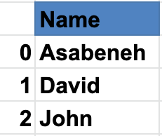
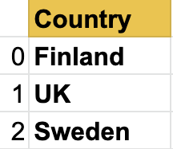
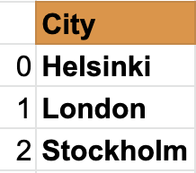
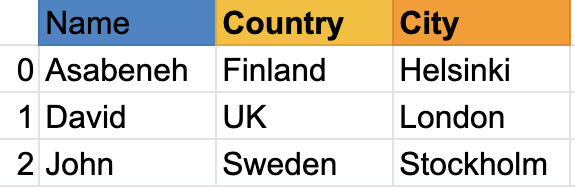
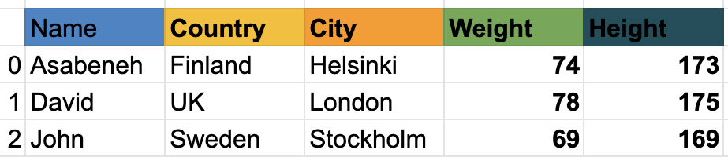

<div align="center">
  <h1> 30 Dias de Python: Dia 25 - Pandas </h1>
  <a class="header-badge" target="_blank" href="https://www.linkedin.com/in/asabeneh/">
  
  </a>
  <a class="header-badge" target="_blank" href="https://twitter.com/Asabeneh">
  
  </a>

  <sub>Autor:
  <a href="https://www.linkedin.com/in/asabeneh/" target="_blank">Asabeneh Yetayeh</a><br>
  <small>Segunda edição: Julho, 2021</small>
  </sub>

</div>

[<< Dia 24](./24_statistics_pt.md) | [Dia 26 >>](./26_python_web_pt.md)


- [📘 Dia 25](#-dia-25)
  - [Pandas](#pandas)
    - [Instalando o Pandas](#instalando-o-pandas)
    - [Importando o Pandas](#importando-o-pandas)
    - [Criando uma Série Pandas com índice padrão](#criando-uma-série-pandas-com-índice-padrão)
    - [Criando uma Série Pandas com índice personalizado](#criando-uma-série-pandas-com-índice-personalizado)
    - [Criando uma Série Pandas a partir de um Dicionário](#criando-uma-série-pandas-a-partir-de-um-dicionário)
    - [Criando uma Série Pandas constante](#criando-uma-série-pandas-constante)
    - [Criando uma Série Pandas usando Linspace](#criando-uma-série-pandas-usando-linspace)
  - [DataFrames](#dataframes)
    - [Criando DataFrames a partir de uma Lista de Listas](#criando-dataframes-a-partir-de-uma-lista-de-listas)
    - [Criando um DataFrame usando um Dicionário](#criando-um-dataframe-usando-um-dicionário)
    - [Criando DataFrames a partir de uma Lista de Dicionários](#criando-dataframes-a-partir-de-uma-lista-de-dicionários)
  - [Lendo um arquivo CSV usando Pandas](#lendo-um-arquivo-csv-usando-pandas)
    - [Exploração de Dados](#exploração-de-dados)
  - [Modificando um DataFrame](#modificando-um-dataframe)
    - [Criando um DataFrame](#criando-um-dataframe)
    - [Adicionando uma nova coluna](#adicionando-uma-nova-coluna)
    - [Modificando valores de uma coluna](#modificando-valores-de-uma-coluna)
    - [Formatando colunas de um DataFrame](#formatando-colunas-de-um-dataframe)
  - [Verificando os tipos de dados dos valores das colunas](#verificando-os-tipos-de-dados-dos-valores-das-colunas)
    - [Indexação Booleana](#indexação-booleana)
  - [Exercícios: Dia 25](#exercícios-dia-25)

# 📘 Dia 25

## Pandas

Pandas é uma biblioteca de código aberto, de alto desempenho e fácil de usar, que fornece estruturas de dados e ferramentas de análise de dados para a linguagem de programação Python.
O Pandas adiciona estruturas de dados e ferramentas projetadas para trabalhar com dados em formato de tabela, que são as *Series* e os *DataFrames*.
O Pandas fornece ferramentas de manipulação de dados:

- remodelagem (reshaping)
- combinação (merging)
- ordenação (sorting)
- fatiamento (slicing)
- agregação (aggregation)
- imputação (imputation)

Se você estiver usando o anaconda, não precisa instalar o pandas.

### Instalando o Pandas

Para Mac:
```py
pip install conda
conda install pandas
```

Para Windows:
```py
pip install conda
pip install pandas
```

A estrutura de dados do Pandas é baseada em *Series* e *DataFrames*.

Uma *series* é uma *coluna* e um DataFrame é uma *tabela multidimensional* composta por uma coleção de *series*. Para criar uma série pandas, devemos usar o numpy para criar um array unidimensional ou uma lista Python.
Vejamos um exemplo de série:

Série Pandas de nomes



Série de países



Série de cidades



Como você pode ver, uma série pandas é apenas uma coluna de dados. Se quisermos ter várias colunas, usamos data frames. O exemplo abaixo mostra os DataFrames do pandas.

Vejamos um exemplo de data frame do pandas:



Um data frame é uma coleção de linhas e colunas. Observe a tabela abaixo; ela tem muito mais colunas do que o exemplo acima:



Em seguida, veremos como importar o pandas e como criar Series e DataFrames usando o pandas.

### Importando o Pandas

```python
import pandas as pd # importando o pandas como pd
import numpy  as np # importando o numpy como np
```

### Criando uma Série Pandas com índice padrão

```python
nums = [1, 2, 3, 4,5]
s = pd.Series(nums)
print(s)
```

```sh
    0    1
    1    2
    2    3
    3    4
    4    5
    dtype: int64
```

### Criando uma Série Pandas com índice personalizado

```python
nums = [1, 2, 3, 4, 5]
s = pd.Series(nums, index=[1, 2, 3, 4, 5])
print(s)
```

```sh
    1    1
    2    2
    3    3
    4    4
    5    5
    dtype: int64
```

```python
fruits = ['Orange','Banana','Mango']
fruits = pd.Series(fruits, index=[1, 2, 3])
print(fruits)
```

```sh
    1    Orange
    2    Banana
    3    Mango
    dtype: object
```

### Criando uma Série Pandas a partir de um Dicionário

```python
dct = {'name':'Asabeneh','country':'Finland','city':'Helsinki'}
```

```python
s = pd.Series(dct)
print(s)
```

```sh
    name       Asabeneh
    country     Finland
    city       Helsinki
    dtype: object
```

### Criando uma Série Pandas constante

```python
s = pd.Series(10, index = [1, 2, 3])
print(s)
```

```sh
    1    10
    2    10
    3    10
    dtype: int64
```

### Criando uma Série Pandas usando Linspace

```python
s = pd.Series(np.linspace(5, 20, 10)) # linspace(início, fim, itens)
print(s)
```

```sh
    0     5.000000
    1     6.666667
    2     8.333333
    3    10.000000
    4    11.666667
    5    13.333333
    6    15.000000
    7    16.666667
    8    18.333333
    9    20.000000
    dtype: float64
```

## DataFrames

Os data frames do pandas podem ser criados de diferentes formas.

### Criando DataFrames a partir de uma Lista de Listas

```python
data = [
    ['Asabeneh', 'Finland', 'Helsink'],
    ['David', 'UK', 'London'],
    ['John', 'Sweden', 'Stockholm']
]
df = pd.DataFrame(data, columns=['Names','Country','City'])
print(df)
```

<table border="1" class="dataframe">
  <thead>
    <tr style="text-align: right;">
      <th></th>
      <th>Names</th>
      <th>Country</th>
      <th>City</th>
    </tr>
  </thead>
  <tbody>
    <tr>
      <td>0</td>
      <td>Asabeneh</td>
      <td>Finland</td>
      <td>Helsink</td>
    </tr>
    <tr>
      <td>1</td>
      <td>David</td>
      <td>UK</td>
      <td>London</td>
    </tr>
    <tr>
      <td>2</td>
      <td>John</td>
      <td>Sweden</td>
      <td>Stockholm</td>
    </tr>
  </tbody>
</table>

### Criando um DataFrame usando um Dicionário

```python
data = {'Name': ['Asabeneh', 'David', 'John'], 'Country':[
    'Finland', 'UK', 'Sweden'], 'City': ['Helsiki', 'London', 'Stockholm']}
df = pd.DataFrame(data)
print(df)
```

<table border="1" class="dataframe">
  <thead>
    <tr style="text-align: right;">
      <th></th>
      <th>Name</th>
      <th>Country</th>
      <th>City</th>
    </tr>
  </thead>
  <tbody>
    <tr>
      <td>0</td>
      <td>Asabeneh</td>
      <td>Finland</td>
      <td>Helsiki</td>
    </tr>
    <tr>
      <td>1</td>
      <td>David</td>
      <td>UK</td>
      <td>London</td>
    </tr>
    <tr>
      <td>2</td>
      <td>John</td>
      <td>Sweden</td>
      <td>Stockholm</td>
    </tr>
  </tbody>
</table>

### Criando DataFrames a partir de uma Lista de Dicionários

```python
data = [
    {'Name': 'Asabeneh', 'Country': 'Finland', 'City': 'Helsinki'},
    {'Name': 'David', 'Country': 'UK', 'City': 'London'},
    {'Name': 'John', 'Country': 'Sweden', 'City': 'Stockholm'}]
df = pd.DataFrame(data)
print(df)
```

<table border="1" class="dataframe">
  <thead>
    <tr style="text-align: right;">
      <th></th>
      <th>Name</th>
      <th>Country</th>
      <th>City</th>
    </tr>
  </thead>
  <tbody>
    <tr>
      <td>0</td>
      <td>Asabeneh</td>
      <td>Finland</td>
      <td>Helsinki</td>
    </tr>
    <tr>
      <td>1</td>
      <td>David</td>
      <td>UK</td>
      <td>London</td>
    </tr>
    <tr>
      <td>2</td>
      <td>John</td>
      <td>Sweden</td>
      <td>Stockholm</td>
    </tr>
  </tbody>
</table>

## Lendo um arquivo CSV usando Pandas

Para baixar o arquivo CSV necessário neste exemplo, o console/linha de comando é suficiente:

```sh
curl -O https://raw.githubusercontent.com/Asabeneh/30-Days-Of-Python/master/data/weight-height.csv
```

Coloque o arquivo baixado no seu diretório de trabalho.

```python
import pandas as pd

df = pd.read_csv('weight-height.csv')
print(df)
```

### Exploração de Dados

Vamos ler apenas as primeiras 5 linhas usando head()

```python
print(df.head()) # devolve cinco linhas, podemos aumentar o número de linhas passando um argumento ao método head()
```


<table border="1" class="dataframe">
  <thead>
    <tr style="text-align: right;">
      <th></th>
      <th>Gender</th>
      <th>Height</th>
      <th>Weight</th>
    </tr>
  </thead>
  <tbody>
    <tr>
      <td>0</td>
      <td>Male</td>
      <td>73.847017</td>
      <td>241.893563</td>
    </tr>
    <tr>
      <td>1</td>
      <td>Male</td>
      <td>68.781904</td>
      <td>162.310473</td>
    </tr>
    <tr>
      <td>2</td>
      <td>Male</td>
      <td>74.110105</td>
      <td>212.740856</td>
    </tr>
    <tr>
      <td>3</td>
      <td>Male</td>
      <td>71.730978</td>
      <td>220.042470</td>
    </tr>
    <tr>
      <td>4</td>
      <td>Male</td>
      <td>69.881796</td>
      <td>206.349801</td>
    </tr>
  </tbody>
</table>

Vamos também explorar os últimos registros do dataframe usando o método tail().

```python
print(df.tail()) # tail devolve as últimas cinco linhas, podemos aumentar o número de linhas passando um argumento ao método tail
```

<table border="1" class="dataframe">
  <thead>
    <tr style="text-align: right;">
      <th></th>
      <th>Gender</th>
      <th>Height</th>
      <th>Weight</th>
    </tr>
  </thead>
  <tbody>
    <tr>
      <td>9995</td>
      <td>Female</td>
      <td>66.172652</td>
      <td>136.777454</td>
    </tr>
    <tr>
      <td>9996</td>
      <td>Female</td>
      <td>67.067155</td>
      <td>170.867906</td>
    </tr>
    <tr>
      <td>9997</td>
      <td>Female</td>
      <td>63.867992</td>
      <td>128.475319</td>
    </tr>
    <tr>
      <td>9998</td>
      <td>Female</td>
      <td>69.034243</td>
      <td>163.852461</td>
    </tr>
    <tr>
      <td>9999</td>
      <td>Female</td>
      <td>61.944246</td>
      <td>113.649103</td>
    </tr>
  </tbody>
</table>

Como você pode ver, o arquivo csv tem três colunas: Gender, Height e Weight. Se o DataFrame tivesse muitas linhas, seria difícil conhecer todas as colunas. Portanto, devemos usar um método para conhecer as colunas. Também não sabemos o número de linhas. Vamos usar o método shape.

```python
print(df.shape) # como você pode ver, 10000 linhas e três colunas
```

    (10000, 3)

Vamos obter todas as colunas usando columns.

```python
print(df.columns)
```

    Index(['Gender', 'Height', 'Weight'], dtype='object')

Agora, vamos obter uma coluna específica usando a chave da coluna

```python
heights = df['Height'] # isso agora é uma série
```

```python
print(heights)
```

```sh
    0       73.847017
    1       68.781904
    2       74.110105
    3       71.730978
    4       69.881796
              ...
    9995    66.172652
    9996    67.067155
    9997    63.867992
    9998    69.034243
    9999    61.944246
    Name: Height, Length: 10000, dtype: float64
```

```python
weights = df['Weight'] # isso agora é uma série
```

```python
print(weights)
```

```sh
    0       241.893563
    1       162.310473
    2       212.740856
    3       220.042470
    4       206.349801
               ...
    9995    136.777454
    9996    170.867906
    9997    128.475319
    9998    163.852461
    9999    113.649103
    Name: Weight, Length: 10000, dtype: float64
```

```python
print(len(heights) == len(weights))
```

    True

O método describe() fornece valores estatísticos descritivos de um conjunto de dados.

```python
print(heights.describe()) # fornece informações estatísticas sobre os dados de altura
```

```sh
    count    10000.000000
    mean        66.367560
    std          3.847528
    min         54.263133
    25%         63.505620
    50%         66.318070
    75%         69.174262
    max         78.998742
    Name: Height, dtype: float64
```

```python
print(weights.describe())
```

```sh
    count    10000.000000
    mean       161.440357
    std         32.108439
    min         64.700127
    25%        135.818051
    50%        161.212928
    75%        187.169525
    max        269.989699
    Name: Weight, dtype: float64
```

```python
print(df.describe())  # describe também pode fornecer informações estatísticas de um DataFrame
```

<table border="1" class="dataframe">
  <thead>
    <tr style="text-align: right;">
      <th></th>
      <th>Height</th>
      <th>Weight</th>
    </tr>
  </thead>
  <tbody>
    <tr>
      <td>count</td>
      <td>10000.000000</td>
      <td>10000.000000</td>
    </tr>
    <tr>
      <td>mean</td>
      <td>66.367560</td>
      <td>161.440357</td>
    </tr>
    <tr>
      <td>std</td>
      <td>3.847528</td>
      <td>32.108439</td>
    </tr>
    <tr>
      <td>min</td>
      <td>54.263133</td>
      <td>64.700127</td>
    </tr>
    <tr>
      <td>25%</td>
      <td>63.505620</td>
      <td>135.818051</td>
    </tr>
    <tr>
      <td>50%</td>
      <td>66.318070</td>
      <td>161.212928</td>
    </tr>
    <tr>
      <td>75%</td>
      <td>69.174262</td>
      <td>187.169525</td>
    </tr>
    <tr>
      <td>max</td>
      <td>78.998742</td>
      <td>269.989699</td>
    </tr>
  </tbody>
</table>

Assim como o describe(), o método info() também fornece informações sobre o conjunto de dados.

## Modificando um DataFrame

Modificando um DataFrame:
    * Podemos criar um novo DataFrame
    * Podemos criar uma nova coluna e adicioná-la ao DataFrame,
    * podemos remover uma coluna existente de um DataFrame,
    * podemos modificar uma coluna existente em um DataFrame,
    * podemos alterar o tipo de dado dos valores de uma coluna no DataFrame

### Criando um DataFrame

Como sempre, primeiro importamos os pacotes necessários. Vamos importar o pandas e o numpy, os dois melhores amigos de todos os tempos.

```python
import pandas as pd
import numpy as np
data = [
    {"Name": "Asabeneh", "Country":"Finland","City":"Helsinki"},
    {"Name": "David", "Country":"UK","City":"London"},
    {"Name": "John", "Country":"Sweden","City":"Stockholm"}]
df = pd.DataFrame(data)
print(df)
```

<table border="1" class="dataframe">
  <thead>
    <tr style="text-align: right;">
      <th></th>
      <th>Name</th>
      <th>Country</th>
      <th>City</th>
    </tr>
  </thead>
  <tbody>
    <tr>
      <td>0</td>
      <td>Asabeneh</td>
      <td>Finland</td>
      <td>Helsinki</td>
    </tr>
    <tr>
      <td>1</td>
      <td>David</td>
      <td>UK</td>
      <td>London</td>
    </tr>
    <tr>
      <td>2</td>
      <td>John</td>
      <td>Sweden</td>
      <td>Stockholm</td>
    </tr>
  </tbody>
</table>

Adicionar uma coluna a um DataFrame é como adicionar uma chave a um dicionário.

Primeiro vamos usar o exemplo anterior para criar um DataFrame. Depois de criar o DataFrame, vamos começar a modificar as colunas e os valores das colunas.

### Adicionando uma nova coluna

Vamos adicionar uma coluna weight no DataFrame

```python
weights = [74, 78, 69]
df['Weight'] = weights
df
```

<table border="1" class="dataframe">
  <thead>
    <tr style="text-align: right;">
      <th></th>
      <th>Name</th>
      <th>Country</th>
      <th>City</th>
      <th>Weight</th>
    </tr>
  </thead>
  <tbody>
    <tr>
      <td>0</td>
      <td>Asabeneh</td>
      <td>Finland</td>
      <td>Helsinki</td>
      <td>74</td>
    </tr>
    <tr>
      <td>1</td>
      <td>David</td>
      <td>UK</td>
      <td>London</td>
      <td>78</td>
    </tr>
    <tr>
      <td>2</td>
      <td>John</td>
      <td>Sweden</td>
      <td>Stockholm</td>
      <td>69</td>
    </tr>
  </tbody>
</table>

Vamos adicionar também uma coluna height no DataFrame

```python
heights = [173, 175, 169]
df['Height'] = heights
print(df)
```

<table border="1" class="dataframe">
  <thead>
    <tr style="text-align: right;">
      <th></th>
      <th>Name</th>
      <th>Country</th>
      <th>City</th>
      <th>Weight</th>
      <th>Height</th>
    </tr>
  </thead>
  <tbody>
    <tr>
      <td>0</td>
      <td>Asabeneh</td>
      <td>Finland</td>
      <td>Helsinki</td>
      <td>74</td>
      <td>173</td>
    </tr>
    <tr>
      <td>1</td>
      <td>David</td>
      <td>UK</td>
      <td>London</td>
      <td>78</td>
      <td>175</td>
    </tr>
    <tr>
      <td>2</td>
      <td>John</td>
      <td>Sweden</td>
      <td>Stockholm</td>
      <td>69</td>
      <td>169</td>
    </tr>
  </tbody>
</table>

Como você pode ver no DataFrame acima, adicionamos novas colunas, Weight e Height. Vamos adicionar uma coluna adicional chamada BMI (Body Mass Index/Índice de Massa Corporal), calculando o IMC a partir da massa e da altura. O IMC é a massa dividida pela altura ao quadrado (em metros) - Weight/Height * Height.

Como você pode ver, a altura está em centímetros, então devemos alterá-la para metros. Vamos modificar a linha Height.

### Modificando valores de uma coluna

```python
df['Height'] = df['Height'] * 0.01
df
```

<table border="1" class="dataframe">
  <thead>
    <tr style="text-align: right;">
      <th></th>
      <th>Name</th>
      <th>Country</th>
      <th>City</th>
      <th>Weight</th>
      <th>Height</th>
    </tr>
  </thead>
  <tbody>
    <tr>
      <td>0</td>
      <td>Asabeneh</td>
      <td>Finland</td>
      <td>Helsinki</td>
      <td>74</td>
      <td>1.73</td>
    </tr>
    <tr>
      <td>1</td>
      <td>David</td>
      <td>UK</td>
      <td>London</td>
      <td>78</td>
      <td>1.75</td>
    </tr>
    <tr>
      <td>2</td>
      <td>John</td>
      <td>Sweden</td>
      <td>Stockholm</td>
      <td>69</td>
      <td>1.69</td>
    </tr>
  </tbody>
</table>

```python
# Usar funções deixa nosso código limpo, mas você pode calcular o IMC sem uma
def calculate_bmi ():
    weights = df['Weight']
    heights = df['Height']
    bmi = []
    for w,h in zip(weights, heights):
        b = w/(h*h)
        bmi.append(b)
    return bmi

bmi = calculate_bmi()

```


```python
df['BMI'] = bmi
df
```

<table border="1" class="dataframe">
  <thead>
    <tr style="text-align: right;">
      <th></th>
      <th>Name</th>
      <th>Country</th>
      <th>City</th>
      <th>Weight</th>
      <th>Height</th>
      <th>BMI</th>
    </tr>
  </thead>
  <tbody>
    <tr>
      <td>0</td>
      <td>Asabeneh</td>
      <td>Finland</td>
      <td>Helsinki</td>
      <td>74</td>
      <td>1.73</td>
      <td>24.725183</td>
    </tr>
    <tr>
      <td>1</td>
      <td>David</td>
      <td>UK</td>
      <td>London</td>
      <td>78</td>
      <td>1.75</td>
      <td>25.469388</td>
    </tr>
    <tr>
      <td>2</td>
      <td>John</td>
      <td>Sweden</td>
      <td>Stockholm</td>
      <td>69</td>
      <td>1.69</td>
      <td>24.158818</td>
    </tr>
  </tbody>
</table>

### Formatando colunas de um DataFrame

Os valores da coluna BMI do DataFrame são float com muitos dígitos significativos após a vírgula. Vamos mudar para um único dígito significativo após o ponto.

```python
df['BMI'] = round(df['BMI'], 1)
print(df)
```

<table border="1" class="dataframe">
  <thead>
    <tr style="text-align: right;">
      <th></th>
      <th>Name</th>
      <th>Country</th>
      <th>City</th>
      <th>Weight</th>
      <th>Height</th>
      <th>BMI</th>
    </tr>
  </thead>
  <tbody>
    <tr>
      <td>0</td>
      <td>Asabeneh</td>
      <td>Finland</td>
      <td>Helsinki</td>
      <td>74</td>
      <td>1.73</td>
      <td>24.7</td>
    </tr>
    <tr>
      <td>1</td>
      <td>David</td>
      <td>UK</td>
      <td>London</td>
      <td>78</td>
      <td>1.75</td>
      <td>25.5</td>
    </tr>
    <tr>
      <td>2</td>
      <td>John</td>
      <td>Sweden</td>
      <td>Stockholm</td>
      <td>69</td>
      <td>1.69</td>
      <td>24.2</td>
    </tr>
  </tbody>
</table>

As informações no DataFrame ainda parecem incompletas, vamos adicionar as colunas birth year e current year.

```python
birth_year = ['1769', '1985', '1990']
current_year = pd.Series(2020, index=[0, 1,2])
df['Birth Year'] = birth_year
df['Current Year'] = current_year
df
```

<table border="1" class="dataframe">
  <thead>
    <tr style="text-align: right;">
      <th></th>
      <th>Name</th>
      <th>Country</th>
      <th>City</th>
      <th>Weight</th>
      <th>Height</th>
      <th>BMI</th>
      <th>Birth Year</th>
      <th>Current Year</th>
    </tr>
  </thead>
  <tbody>
    <tr>
      <td>0</td>
      <td>Asabeneh</td>
      <td>Finland</td>
      <td>Helsinki</td>
      <td>74</td>
      <td>1.73</td>
      <td>24.7</td>
      <td>1769</td>
      <td>2020</td>
    </tr>
    <tr>
      <td>1</td>
      <td>David</td>
      <td>UK</td>
      <td>London</td>
      <td>78</td>
      <td>1.75</td>
      <td>25.5</td>
      <td>1985</td>
      <td>2020</td>
    </tr>
    <tr>
      <td>2</td>
      <td>John</td>
      <td>Sweden</td>
      <td>Stockholm</td>
      <td>69</td>
      <td>1.69</td>
      <td>24.2</td>
      <td>1990</td>
      <td>2020</td>
    </tr>
  </tbody>
</table>

## Verificando os tipos de dados dos valores das colunas

```python
print(df.Weight.dtype)
```

```sh
    dtype('int64')
```

```python
df['Birth Year'].dtype # devolve um objeto string, devemos mudar isso para número

```

```python
df['Birth Year'] = df['Birth Year'].astype('int')
print(df['Birth Year'].dtype) # vamos verificar o tipo de dado agora
```

```sh
    dtype('int32')
```

Agora o mesmo para o current year:

```python
df['Current Year'] = df['Current Year'].astype('int')
df['Current Year'].dtype
```

```sh
    dtype('int32')
```

Agora, os valores das colunas birth year e current year são inteiros. Podemos calcular a idade.

```python
ages = df['Current Year'] - df['Birth Year']
ages
```

    0    251
    1     35
    2     30
    dtype: int32

```python
df['Ages'] = ages
print(df)
```

<table border="1" class="dataframe">
  <thead>
    <tr style="text-align: right;">
      <th></th>
      <th>Name</th>
      <th>Country</th>
      <th>City</th>
      <th>Weight</th>
      <th>Height</th>
      <th>BMI</th>
      <th>Birth Year</th>
      <th>Current Year</th>
      <th>Ages</th>
    </tr>
  </thead>
  <tbody>
    <tr>
      <td>0</td>
      <td>Asabeneh</td>
      <td>Finland</td>
      <td>Helsinki</td>
      <td>74</td>
      <td>1.73</td>
      <td>24.7</td>
      <td>1769</td>
      <td>2019</td>
      <td>250</td>
    </tr>
    <tr>
      <td>1</td>
      <td>David</td>
      <td>UK</td>
      <td>London</td>
      <td>78</td>
      <td>1.75</td>
      <td>25.5</td>
      <td>1985</td>
      <td>2019</td>
      <td>34</td>
    </tr>
    <tr>
      <td>2</td>
      <td>John</td>
      <td>Sweden</td>
      <td>Stockholm</td>
      <td>69</td>
      <td>1.69</td>
      <td>24.2</td>
      <td>1990</td>
      <td>2019</td>
      <td>29</td>
    </tr>
  </tbody>
</table>

A pessoa na primeira linha viveu até agora 251 anos. É improvável que alguém viva tanto tempo. Ou é um erro de digitação ou os dados foram manipulados. Então, vamos substituir esse valor pela média das colunas, sem incluir o valor discrepante (outlier).

mean = (35 + 30)/ 2

```python
mean = (35 + 30)/ 2
print('Média: ',mean)	# é bom adicionar uma descrição à saída, assim sabemos o que é o quê
```

```sh
   Média:  32.5
```

### Indexação Booleana

```python
print(df[df['Ages'] > 120])
```

<table border="1" class="dataframe">
  <thead>
    <tr style="text-align: right;">
      <th></th>
      <th>Name</th>
      <th>Country</th>
      <th>City</th>
      <th>Weight</th>
      <th>Height</th>
      <th>BMI</th>
      <th>Birth Year</th>
      <th>Current Year</th>
      <th>Ages</th>
    </tr>
  </thead>
  <tbody>
    <tr>
      <td>0</td>
      <td>Asabeneh</td>
      <td>Finland</td>
      <td>Helsinki</td>
      <td>74</td>
      <td>1.73</td>
      <td>24.7</td>
      <td>1769</td>
      <td>2020</td>
      <td>251</td>
    </tr>
  </tbody>
</table>


```python
print(df[df['Ages'] < 120])
```

<table border="1" class="dataframe">
  <thead>
    <tr style="text-align: right;">
      <th></th>
      <th>Name</th>
      <th>Country</th>
      <th>City</th>
      <th>Weight</th>
      <th>Height</th>
      <th>BMI</th>
      <th>Birth Year</th>
      <th>Current Year</th>
      <th>Ages</th>
    </tr>
  </thead>
  <tbody>
    <tr>
      <td>1</td>
      <td>David</td>
      <td>UK</td>
      <td>London</td>
      <td>78</td>
      <td>1.75</td>
      <td>25.5</td>
      <td>1985</td>
      <td>2020</td>
      <td>35</td>
    </tr>
    <tr>
      <td>2</td>
      <td>John</td>
      <td>Sweden</td>
      <td>Stockholm</td>
      <td>69</td>
      <td>1.69</td>
      <td>24.2</td>
      <td>1990</td>
      <td>2020</td>
      <td>30</td>
    </tr>
  </tbody>
</table>

## Exercícios: Dia 25

1. Leia o arquivo hacker_news.csv do diretório data
1. Obtenha as primeiras cinco linhas
1. Obtenha as últimas cinco linhas
1. Obtenha a coluna title como uma série pandas
1. Conte o número de linhas e colunas
    - Filtre os títulos que contêm python
    - Filtre os títulos que contêm JavaScript
    - Explore os dados e tente entendê-los

🎉 PARABÉNS ! 🎉

[<< Dia 24](./24_statistics_pt.md) | [Dia 26 >>](./26_python_web_pt.md)
