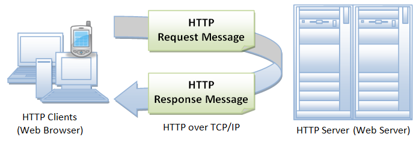
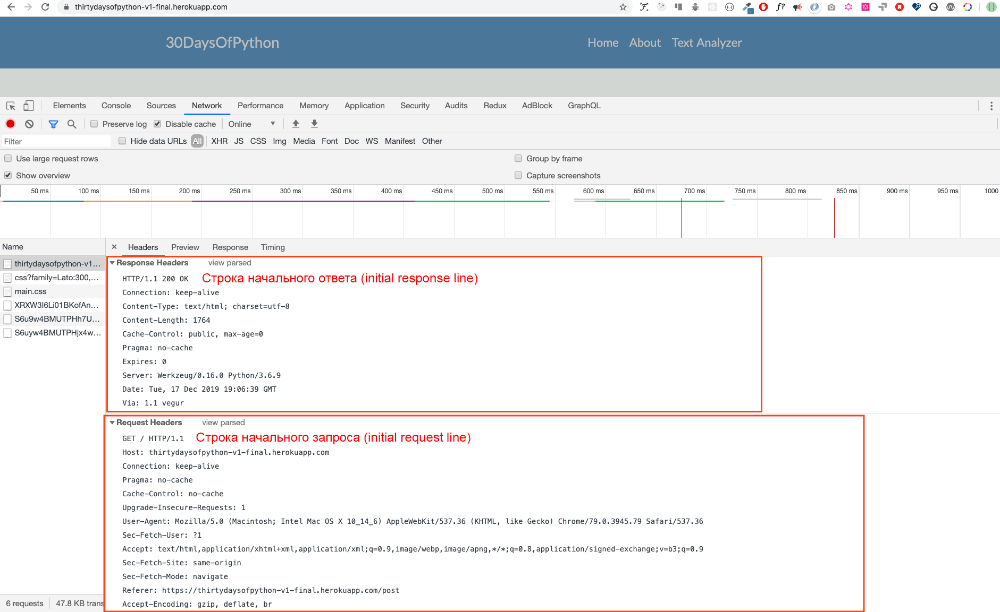

<div align="center">
  <h1> 30 Dias de Python: Dia 28 - API </h1>
  <a class="header-badge" target="_blank" href="https://www.linkedin.com/in/asabeneh/">
  
  </a>
  <a class="header-badge" target="_blank" href="https://twitter.com/Asabeneh">
  
  </a>

<sub>Autor:
<a href="https://www.linkedin.com/in/asabeneh/" target="_blank">Asabeneh Yetayeh</a><br>
<small>Segunda edição: Julho, 2021</small>
</sub>

</div>

[<< Dia 27](./27_python_with_mongodb_pt.md) | [Dia 29 >>](./29_building_API_pt.md)


- [📘 Dia 28](#-dia-28)
- [Interface de Programação de Aplicações (API)](#interface-de-programação-de-aplicações-api)
  - [API](#api)
  - [Construindo uma API](#construindo-uma-api)
  - [HTTP (Hypertext Transfer Protocol)](#http-hypertext-transfer-protocol)
  - [Estrutura do HTTP](#estrutura-do-http)
  - [Linha de Requisição Inicial (Linha de Status)](#linha-de-requisição-inicial-linha-de-status)
    - [Linha de Resposta Inicial (Linha de Status)](#linha-de-resposta-inicial-linha-de-status)
    - [Campos de Cabeçalho](#campos-de-cabeçalho)
    - [O corpo da mensagem](#o-corpo-da-mensagem)
    - [Métodos de Requisição](#métodos-de-requisição)
  - [💻 Exercícios: Dia 28](#-exercícios-dia-28)

# 📘 Dia 28

# Interface de Programação de Aplicações (API)

## API

API significa Application Programming Interface (Interface de Programação de Aplicações). O tipo de API que abordaremos nesta seção serão as APIs Web.
As APIs Web são as interfaces definidas através das quais ocorrem interações entre uma empresa e as aplicações que usam seus recursos, o que também é um Acordo de Nível de Serviço (SLA) para especificar o provedor funcional e expor o caminho de serviço ou URL para os usuários da sua API.

No contexto do desenvolvimento web, uma API é definida como um conjunto de especificações, como mensagens de requisição HTTP (Hypertext Transfer Protocol), junto com uma definição da estrutura das mensagens de resposta, geralmente em formato XML ou JSON (JavaScript Object Notation).

As Web APIs vêm se afastando dos serviços web baseados em SOAP (Simple Object Access Protocol) e da arquitetura orientada a serviços (SOA) em direção a recursos web de estilo REST (Representational State Transfer) mais direto.

Os serviços de mídias sociais, as APIs web, permitiram que comunidades web compartilhassem conteúdo e dados entre comunidades e diferentes plataformas.

Usando uma API, conteúdo criado em um único lugar pode ser dinamicamente publicado e atualizado em vários locais na web.

Por exemplo, a API REST do Twitter permite que desenvolvedores acessem os dados principais do Twitter, e a API Search fornece métodos para os desenvolvedores interagirem com os dados de busca e tendências do Twitter.

Muitas aplicações fornecem endpoints de API. Alguns exemplos de API são a [API de países](https://restcountries.eu/rest/v2/all), a [API de raças de gatos](https://api.thecatapi.com/v1/breeds).

Nesta seção, vamos abordar uma API RESTful que usa métodos de requisição HTTP para GET, PUT, POST e DELETE de dados.

## Construindo uma API

Uma API RESTful é uma interface de programação de aplicações (API) que usa requisições HTTP para GET, PUT, POST e DELETE de dados. Nas seções anteriores, aprendemos sobre python, flask e mongoDB. Vamos usar o conhecimento que adquirimos para desenvolver uma API RESTful usando Python flask e o banco de dados mongoDB. Toda aplicação que possui operação CRUD (Create, Read, Update, Delete) tem uma API para criar dados, obter dados, atualizar dados ou excluir dados de um banco de dados.

Para construir uma API, é bom entender o protocolo HTTP e o ciclo de requisição e resposta HTTP.

## HTTP (Hypertext Transfer Protocol)

HTTP é um protocolo de comunicação estabelecido entre um cliente e um servidor. Um cliente, neste caso, é um navegador e o servidor é o lugar onde você acessa os dados. HTTP é um protocolo de rede usado para entregar recursos, que podem ser arquivos na World Wide Web, sejam eles arquivos HTML, arquivos de imagem, resultados de consultas, scripts ou outros tipos de arquivo.

Um navegador é um cliente HTTP porque envia requisições para um servidor HTTP (servidor web), que então envia respostas de volta ao cliente.

## Estrutura do HTTP

HTTP usa o modelo cliente-servidor. Um cliente HTTP abre uma conexão e envia uma mensagem de requisição para um servidor HTTP, e o servidor HTTP retorna uma mensagem de resposta, que é o recurso solicitado. Quando o ciclo de requisição-resposta é concluído, o servidor fecha a conexão.



O formato das mensagens de requisição e resposta é similar. Ambos os tipos de mensagem têm:

- uma linha inicial,
- zero ou mais linhas de cabeçalho,
- uma linha em branco (ou seja, um CRLF por si só), e
- um corpo de mensagem opcional (por exemplo, um arquivo, dados de consulta ou o resultado de uma consulta).

Vamos ver um exemplo de mensagens de requisição e resposta navegando neste site: https://thirtydaysofpython-v1-final.herokuapp.com/. Este site foi implantado no dyno gratuito do Heroku e, em alguns meses, pode não funcionar por causa de muitas requisições. Apoie este trabalho para manter o servidor funcionando o tempo todo.



## Linha de Requisição Inicial (Linha de Status)

A linha de requisição inicial é diferente da resposta.
Uma linha de requisição tem três partes, separadas por espaços:

- nome do método (GET, POST, HEAD)
- caminho do recurso solicitado,
- a versão do HTTP sendo usada. ex: GET / HTTP/1.1

GET é o método HTTP mais comum, que ajuda a obter ou ler um recurso, e POST é um método de requisição comum para criar um recurso.

### Linha de Resposta Inicial (Linha de Status)

A linha de resposta inicial, chamada linha de status, também tem três partes separadas por espaços:

- versão do HTTP
- Código de status da resposta que dá o resultado da requisição, e uma razão que descreve o código de status. Exemplos de linhas de status são:
  HTTP/1.0 200 OK
  ou
  HTTP/1.0 404 Not Found
  Notas:

Os códigos de status mais comuns são:
200 OK: A requisição foi bem-sucedida, e o recurso resultante (por exemplo, um arquivo ou a saída de um script) é retornado no corpo da mensagem.
500 Server Error
Uma lista completa dos códigos de status HTTP pode ser encontrada [aqui](https://httpstatuses.com/). Também pode ser encontrada [aqui](https://httpstatusdogs.com/).

### Campos de Cabeçalho

Como você viu na captura de tela acima, as linhas de cabeçalho fornecem informações sobre a requisição ou resposta, ou sobre o objeto enviado no corpo da mensagem.

```sh
GET / HTTP/1.1
Host: thirtydaysofpython-v1-final.herokuapp.com
Connection: keep-alive
Pragma: no-cache
Cache-Control: no-cache
Upgrade-Insecure-Requests: 1
User-Agent: Mozilla/5.0 (Macintosh; Intel Mac OS X 10_14_6) AppleWebKit/537.36 (KHTML, like Gecko) Chrome/79.0.3945.79 Safari/537.36
Sec-Fetch-User: ?1
Accept: text/html,application/xhtml+xml,application/xml;q=0.9,image/webp,image/apng,*/*;q=0.8,application/signed-exchange;v=b3;q=0.9
Sec-Fetch-Site: same-origin
Sec-Fetch-Mode: navigate
Referer: https://thirtydaysofpython-v1-final.herokuapp.com/post
Accept-Encoding: gzip, deflate, br
Accept-Language: en-GB,en;q=0.9,fi-FI;q=0.8,fi;q=0.7,en-CA;q=0.6,en-US;q=0.5,fr;q=0.4
```

### O corpo da mensagem

Uma mensagem HTTP pode ter um corpo de dados enviado depois das linhas de cabeçalho. Em uma resposta, é aqui que o recurso solicitado é retornado ao cliente (o uso mais comum do corpo da mensagem), ou talvez um texto explicativo se houver um erro. Em uma requisição, é aqui que os dados inseridos pelo usuário ou arquivos enviados são mandados para o servidor.

Se uma mensagem HTTP inclui um corpo, geralmente há linhas de cabeçalho na mensagem que descrevem o corpo. Em particular,

O cabeçalho Content-Type: informa o tipo MIME dos dados no corpo (text/html, application/json, text/plain, text/css, image/gif).
O cabeçalho Content-Length: informa o número de bytes no corpo.

### Métodos de Requisição

GET, POST, PUT e DELETE são os métodos de requisição HTTP que vamos implementar em uma API ou em uma aplicação de operação CRUD.

1. GET: o método GET é usado para recuperar e obter informações de um determinado servidor usando uma URI dada. Requisições usando GET devem apenas recuperar dados e não devem ter nenhum outro efeito sobre os dados.

2. POST: a requisição POST é usada para criar dados e enviar dados ao servidor, por exemplo, para criar um novo post, fazer upload de um arquivo, etc., usando formulários HTML.

3. PUT: substitui todas as representações atuais do recurso alvo pelo conteúdo enviado e o usamos para modificar ou atualizar dados.

4. DELETE: remove dados

## 💻 Exercícios: Dia 28

1. Leia sobre API e HTTP

🎉 PARABÉNS ! 🎉

[<< Dia 27](./27_python_with_mongodb_pt.md) | [Dia 29 >>](./29_building_API_pt.md)
