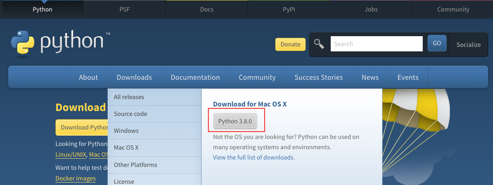

# 🐍 30 Dias de python

|# Day | Topics                                                    |
|------|:---------------------------------------------------------:|
| 01  |  [Introdução](./readme.md)|
| 02  |  [Variaveis, Built-in Functions](./02_Dia_Variaveis_BuiltIn_Functions/README.md)|
| 03  |  [Operadores](./03_Day_Operators/03_operators.md)|
| 04  |  [Strings](./04_Day_Strings/04_strings.md)|
| 05  |  [Listas](./05_Day_Lists/05_lists.md)|
| 06  |  [Tuplas](./06_Day_Tuples/06_tuples.md)|
| 07  |  [Conjuntos](./07_Day_Sets/07_sets.md)|
| 08  |  [Dicionários](./08_Day_Dictionaries/08_dictionaries.md)|
| 09  |  [Condicionais](./09_Day_Conditionals/09_conditionals.md)|
| 10  |  [Loops](./10_Day_Loops/10_loops.md)|
| 11  |  [Funções](./11_Day_Functions/11_functions.md)|
| 12  |  [Modulos](./12_Day_Modules/12_modules.md)|
| 13  |  [Compreensão de Listas](./13_Day_List_comprehension/13_list_comprehension.md)|
| 14  |  [Higher Order Functions](./14_Day_Higher_order_functions/14_higher_order_functions.md)|
| 15  |  [Tripos de Erros](./15_Day_Python_type_errors/15_python_type_errors.md)|
| 16 |  [Python Date time](./16_Day_Python_date_time/16_python_datetime.md) |
| 17 |  [Manipulação de Excessão](./17_Day_Exception_handling/17_exception_handling.md)|
| 18 |  [Regex (Expressões Regulares)](./18_Day_Regular_expressions/18_regular_expressions.md)|
| 19 |  [Manipulação De Arquivos](./19_Day_File_handling/19_file_handling.md)|
| 20 |  [Gerenciador De Pacotes](./20_Day_Python_package_manager/20_python_package_manager.md)|
| 21 |  [Classes e Objetos](./21_Day_Classes_and_objects/21_classes_and_objects.md)|
| 22 |  [Web Scraping](./22_Day_Web_scraping/22_web_scraping.md)|
| 23 |  [Ambiente Virtual](./23_Day_Virtual_environment/23_virtual_environment.md)|
| 24 |  [Estatisticas](./24_Day_Statistics/24_statistics.md)|
| 25 |  [Pandas](./25_Day_Pandas/25_pandas.md)|
| 26 |  [Python web](./26_Day_Python_web/26_python_web.md)|
| 27 |  [Python com MongoDB](./27_Day_Python_with_mongodb/27_python_with_mongodb.md)|
| 28 |  [API](./28_Day_API/28_API.md)|
| 29 |  [Construindo API's](./29_Day_Building_API/29_building_API.md)|
| 30 |  [Conclusão](./30_Day_Conclusions/30_conclusions.md)|

🧡🧡🧡 CODANDO FELIZ 🧡🧡🧡

<div>
<small>Ajudem o <strong>autor</strong> a criar mais materiais educacionais</small> <br />  
<a href = "https://www.paypal.me/asabeneh"></a>
</div>

<div align="center">
  <h1> 30 Dias De Python: Dia 1 - Introdução</h1>
  <a class="header-badge" target="_blank" href="https://www.linkedin.com/in/asabeneh/">
  
  </a>
  <a class="header-badge" target="_blank" href="https://twitter.com/Asabeneh">
  
  </a>

  <sub>Autor:
  <a href="https://www.linkedin.com/in/asabeneh/" target="_blank">Asabeneh Yetayeh</a><br>
  <small> Segunda Edição: July, 2021</small>
  </sub>
</div>

[Dia 2 >>](./02_Dia_Variaveis_BuiltIn_Functions/README.md)


- [🐍 30 Dias De Python](#-30-dias-de-python)
- [📘 Dia 1](#Dia-1)
  - [Bem Vindo](#welcome)
  - [Introdução](#introdução)
  - [Por quê Python ?](#Por-quê-python)
  - [Setup do ambiente](#Setup-do-ambiente)
    - [Instalando o Python](#instalando-o-python)
    - [Python Shell](#python-shell)
    - [Instalando o Visual Studio Code](#instalando-o-visual-studio-code)
      - [Como usar o visual studio code](#como-usar-o-visual-studio-code)
  - [Basico de Python](#basico-de-python)
    - [Sintaxe do Python](#Sintaxe-do-python)
    - [Indentação do Python](#indentaçao-do-python)
    - [Comentários](#comentarios)
    - [Tipos de dados](#tipos-de-dados)
      - [Numeros](#numeros)
      - [Strings](#strings)
      - [Booleanos](#booleanos)
      - [Listas](#listas)
      - [Dicionários](#dicionarios)
      - [Tuplas](#tupla)
      - [Set](#set)
    - [Checando tipos de dados](#checando-tipos-de-dados)
    - [Arquivo Python](#arquivo-python)
  - [💻 Exercicios - Dia 1](#-exercicios-dia-1)
    - [Exercicio: Level 1](#exercicio-level-1)
    - [Exercicio: Level 2](#exercicio-level-2)
    - [Exercicio: Level 3](#exercicio-level-3)

# 📘 Dia 1

## Bem Vindo!

**Parabéns** por decidir participar do desafio de programação  _30 dias de Python_ . E nesse desafio você vai aprender tudo o que você precisa para se tornar um programador python e todo o conceito de programação. No final do desafio você receberá o certificado do desafio de programação _30DiasDePython_.

Se você quiser se envolver ativamente no desafio, você pode se juntar ao grupo do telegram [30DaysOfPython challenge](https://t.me/ThirtyDaysOfPython).  

## Introdução

Python é uma linguagem de programação de alto nível para programação de uso geral. É uma linguagem de programação de código aberto, interpretada e orientada a objetos. Python foi criado por um programador holandês, Guido van Rossum. O nome da linguagem de programação Python foi derivado de uma série de comédia britânica, _Monty Python's Flying Circus_.  A primeira versão foi lançada em 20 de fevereiro de 1991. Este desafio de 30 dias de Python irá ajudá-lo a aprender a versão mais recente do Python, Python 3, passo a passo. Os tópicos são divididos em 30 dias, onde cada dia contém diversos tópicos com explicações fáceis de entender, exemplos do mundo real, muitos exercícios práticos e projetos.

Este desafio foi desenvolvido para iniciantes e profissionais que desejam aprender a linguagem de programação python. Pode levar de 30 a 100 dias para completar o desafio, as pessoas que participam ativamente do grupo de telegramas têm grande probabilidade de completar o desafio.

Este desafio é fácil de ler, escrito originalmente em inglês coloquial e traduzido para um português, envolvente, motivador e ao mesmo tempo muito exigente. Você precisa destinar muito tempo para terminar este desafio. Se você é um dos que aprendem melhor vendo, você pode assistir às vídeo-aulas em <a href="https://www.youtube.com/channel/UC7PNRuno1rzYPb1xLa4yktw"> 
Canal do Youtube do Washera</a> Você pode começar pelo [Video de Python para iniciantes absolutos](https://youtu.be/OCCWZheOesI). Se inscreva no canal, comente suas dúvidas nos vídeos do YouTube e seja proativo, o autor eventualmente notará você.

O autor gosta de ouvir sua opinião sobre o desafio, compartilhe o artigo do autor dando um feedback com sua opinião sobre o desafio 30DiasDePython. E você pode deixar seu feedback sobre o artigo em: [link](https://testimonial-vdzd.onrender.com/)

## Por quê Python?

É uma linguagem de programação muito próxima da linguagem humana, com uma sintaxe simples! e por isso fácil de aprender e usar. 
Python é usado por vários setores e empresas (incluindo o Google). Ele tem sido usado para desenvolver aplicações web, aplicativos de desktop, administração de sistemas e bibliotecas de machine learning. Python é uma linguagem altamente adotada na comunidade de data science e machine learning. Espero que isso seja suficiente para convencê-lo a começar a aprender Python. 

## Setup do ambiente

### Instalando o Python
Para executar um script escrito em Python, você precisa instalar o Python. Vamos para a página [download](https://www.python.org/) python.
Se você for um usuario de windows. Clique no botão circulado em vermelho.

[](https://www.python.org/)

Se você for um usuário de MacOs. Clique no botão circulado em vermelho.

[](https://www.python.org/)

Para verificar se o python está instalado, digite o seguinte comando no terminal do seu dispositivo.
```shell
python --version
```


Como você pode ver no terminal, estou usando a versão _Python 3.7.5_ no momento. Sua versão do Python pode ser diferente da minha, mas deve ser 3.6 ou superior. Se você conseguir ver a versão python, muito bem. Python foi instalado em sua máquina. Continue para a próxima seção.

### Python Shell

Python é uma linguagem de script interpretada, portanto não precisa ser compilada. Isso significa que executa o código linha por linha. O Python vem com um _Python Shell (Shell Interativo do Python)_, também conhecido como REPL (Read Eval Print Loop). E é usado para executar um único comando python e obter o resultado.

O Python Shell aguarda o código Python do usuário. Ao inserir o código, ele o interpreta e mostra o resultado na próxima linha.
Abra seu terminal ou prompt de comando (cmd) e escreva:

```shell
python
```


O shell interativo do Python é aberto e aguarda que você escreva o código em Python (script Python). E você escreverá seu script Python próximo a este símbolo >>> e clique em Enter.
Vamos escrever nosso primeiro scripts no shell de script Python.


Muito bem, você escreveu seu primeiro script Python no shell interativo Python. Como fechamos o shell interativo do Python?
Para fechar o shell, próximo a este símbolo >> escreva o comando **exit()** e pressione Enter.


Agora você sabe como abrir o shell interativo do Python e como sair dele.

Python fornecerá resultados se você escrever scripts que Python entenda; caso contrário, retornará erros. Vamos cometer um erro proposital e ver o que o Python retornará.


Como você pode ver no erro retornado, Python é tão inteligente que sabe o erro que cometemos e que foi _Syntax Error: Invalid Syntax_. Usar x como multiplicação em Python é um erro de sintaxe porque (x) não é uma sintaxe válida em Python. Em vez de (**x**) usamos asterisco (*) para multiplicação. O erro retornado mostra claramente o que corrigir.

O processo de identificação e remoção de erros de um programa é chamado de _depuração_. Vamos depurá-lo colocando * no lugar de **x**.


Nosso bug foi corrigido, o código foi executado e obtivemos o resultado que esperávamos. Como programador, você verá esse tipo de erro diariamente. É bom saber como depurar. Para ser bom em depuração, você deve entender que tipo de erros está enfrentando. Alguns dos erros do Python que você pode encontrar são _SyntaxError_, _IndexError_, _NameError_, _ModuleNotFoundError_, _KeyError_, _ImportError_, _AttributeError_, _TypeError_, _ValueError_, _ZeroDivisionError_ etc. Veremos mais sobre diferentes tipos de erros no Python mais tarde, em outras seções! 

Vamos praticar mais como usar o shell interativo Python. Vá para o seu terminal ou prompt de comando e escreva a palavra **python**.


O shell interativo do Python é aberto. Vamos fazer algumas operações matemáticas básicas (adição, subtração, multiplicação, divisão, módulo, exponencial).

Vamos fazer algumas contas antes de escrever qualquer código Python:

- 2 + 3 is 5
- 3 - 2 is 1
- 3 \* 2 is 6
- 3 / 2 is 1.5
- 3 ** 2 is the same as 3 * 3

Em python temos as seguintes operações adicionais:

- 3 % 2 = 1 => que significa encontrar o resto ou (módulo da divisão)
- 3 // 2 = 1 => que significa remover o resto da divisão

Vamos mudar as expressões matemáticas acima para código Python. O shell Python foi aberto e vamos escrever um comentário logo no início do shell.

Um _comentário_ é uma parte do código que não é executada por python o comentário é ignorado pelo interpretador Python. Portanto, podemos deixar algum texto em nosso código para torná-lo mais legível. Python não executa a parte de comentários. Um comentário em python começa com o símbolo hash(#).
É assim que você escreve um comentário em python:

```shell
 # comment starts with hash
 # this is a python comment, because it starts with a (#) symbol
```


Antes de passarmos para a próxima seção, vamos praticar mais no shell interativo do Python. Feche o shell aberto escrevendo _exit()_ no shell e abra-o novamente e vamos praticar como escrever um texto no shell Python.


### Instalando o Visual Studio Code

O shell interativo Python é bom para testar pequenos códigos de script, mas não será para um grande projeto. No ambiente de trabalho real, os desenvolvedores usam diferentes editores de código para escrever códigos. Neste desafio de programação de 30 dias De Python usaremos código do visual studio. O Visual Studio Code é um editor de texto de código aberto muito popular. Sou fã do vscode e recomendo [download](https://code.visualstudio.com/) visual studio code, mas se você é a adépito a outros editores, fique à vontade para seguir com o que tiver.

[](https://code.visualstudio.com/)

Se você instalou o Visual Studio Code, vamos ver como usá-lo.
Se preferir um vídeo, você pode seguir este tutorial da instalação e configuração do Visual Studio Code para Python [Video tutorial](https://www.youtube.com/watch?v=bn7Cx4z-vSo)

#### Como usar o Visual Studio Code

Abra o visual studio code clicando duas vezes no ícone do visual studio. Ao abri-lo, você obterá esse tipo de interface. Tente interagir com os ícones rotulados.


Crie uma pasta chamada 30DiasDePython no seu desktop. Em seguida, abra-a usando o visual studio code.


Após abri-lo você verá atalhos para criação de arquivos e pastas dentro do diretório do projeto 30DiasDePython. Como você pode ver abaixo, criei o primeiro arquivo, helloworld.py. Você pode fazer o mesmo.


Depois de um longo dia codando, você deseja fechar seu editor de código fonte, certo? É assim que você fechará o projeto aberto.


Parabéns, você concluiu a configuração do ambiente de desenvolvimento. Vamos começar a codar.

## Basico de Python

### Sintaxe do Python

Um script Python pode ser escrito no shell interativo Python ou no editor de código. Um arquivo Python possui uma extensão .py.

### Identação do Python

Uma identação é um espaço em branco em um texto. A identação em muitas linguagens é usada para aumentar a legibilidade do código, mas o Python usa a identação para criar blocos de códigos. Em outras linguagens de programação, chaves são usadas para criar blocos de códigos em vez de a identação. Um dos bugs comuns ao escrever código um python é o erro de identação.


### Comentários

Os comentários são muito importantes para tornar o código mais legível e para deixar comentários em nosso código. Python não executa partes de comentários do nosso código.
Qualquer texto que comece com hash(#) em Python é um comentário.

**Exemplo: de um comentário de uma linha**

```shell
    # This is the first comment
    # This is the second comment
    # Python is eating the world
```

**Exemplo: de um Comentário de multiplas linhas conhecido como docstring**

Aspas triplas podem ser usadas para comentários de múltiplas linhas se não estiverem atribuídas a uma variável

```shell
"""This is multiline comment
multiline comment takes multiple lines.
python is eating the world
"""
```

### Tipos de dados

Em Python existem vários tipos de dados. Vamos começar com os mais comuns. Diferentes tipos de dados serão abordados em detalhes em outras seções. Por enquanto, vamos examinar os diferentes tipos de dados e nos familiarizar com eles. Você não precisa ter um entendimento claro agora.

#### Números

- Inteiro: É considerado Inteiro(números negativos, zero e positivos)
    Exemplo:
    ... -3, -2, -1, 0, 1, 2, 3 ...
- Float: Números decimais
    Exemplo:
    ... -3.5, -2.25, -1.0, 0.0, 1.1, 2.2, 3.5 ...
- Complexos
    Exemplo:
    1 + j, 2 + 4j

#### Strings

Uma coleção de um ou mais caracteres entre aspas simples ou duplas são considerados strings. Se uma string tiver mais de uma frase, usamos aspas triplas.

**Exemplo:**

```py
'Asabeneh'
'Finland'
'Python'
'I love teaching'
'I hope you are enjoying the first day of 30DaysOfPython Challenge'
```

#### Booleanos

Um tipo de dado booleano é um valor True ou False. T e F devem estar sempre maiúsculos. 

**Exemplo:**

```python
    True  #  Is the light on? If it is on, then the value is True
    False # Is the light on? If it is off, then the value is False
```

#### Listas

A lista em Python é uma coleção ordenada que permite armazenar itens de diferentes tipos de dados. Uma lista é semelhante a um array em JavaScript.

**Exemplo:**

```py
[0, 1, 2, 3, 4, 5]  # all are the same data types - a list of numbers
['Banana', 'Orange', 'Mango', 'Avocado'] # all the same data types - a list of strings (fruits)
['Finland','Estonia', 'Sweden','Norway'] # all the same data types - a list of strings (countries)
['Banana', 10, False, 9.81] # different data types in the list - string, integer, boolean and float
```

#### Dicionário

Um objeto de dicionário Python é uma coleção não ordenada de dados em um formato de par de valores-chave.

**Exemplo:**

```py
{
'first_name':'Asabeneh',
'last_name':'Yetayeh',
'country':'Finland', 
'age':250, 
'is_married':True,
'skills':['JS', 'React', 'Node', 'Python']
}
```

#### Tupla

Uma tupla é uma coleção ordenada de diferentes tipos de dados, como uma lista, mas as tuplas não podem ser modificadas (são imutáveis) depois de criadas. Eles são imutáveis.

**Exemplo:**

```py
('Asabeneh', 'Pawel', 'Brook', 'Abraham', 'Lidiya') # Names
```

```py
('Earth', 'Jupiter', 'Neptune', 'Mars', 'Venus', 'Saturn', 'Uranus', 'Mercury') # planets
```

#### Set

O set é uma coleção de tipos de dados semelhantes a uma lista e uma tupla. Ao contrário da lista e da tupla, set não é uma coleção ordenada de itens. Como na matemática, o conjunto em Python armazena apenas itens exclusivos.

Nas seções posteriores, entraremos em detalhes sobre cada tipo de dados Python.

**Exemplo:**

```py
{2, 4, 3, 5}
{3.14, 9.81, 2.7} # order is not important in set
```

### Checando Tipos de Dados

Para checar um determinado tipo de dado dados/variáveis, usamos a função **type**. No terminal a seguir você verá diferentes tipos de dados python:


### Arquivo Python

Primeiro abra a pasta do seu projeto, 30DiasDePython. Se você não tiver essa pasta, crie um nome de pasta chamada 30DiasDePython. Dentro desta pasta, crie um arquivo chamado helloworld.py. Agora, vamos fazer o que fizemos no shell interativo python usando o visual studio code.

O shell interativo do Python estava imprimindo sem usar **print** mas no visual studio code para ver nosso resultado deveríamos usar uma função integrada _print(). A função interna _print()_ recebe um ou mais argumentos da seguinte maneira _print('arument1', 'argument2', 'argument3')_. Veja os exemplos abaixo.

**Exemplo:**

O nome do arquivo é helloworld.py

```py
# Day 1 - 30DaysOfPython Challenge

print(2 + 3)             # addition(+)
print(3 - 1)             # subtraction(-)
print(2 * 3)             # multiplication(*)
print(3 / 2)             # division(/)
print(3 ** 2)            # exponential(**)
print(3 % 2)             # modulus(%)
print(3 // 2)            # Floor division operator(//)

# Checking data types
print(type(10))          # Int
print(type(3.14))        # Float
print(type(1 + 3j))      # Complex number
print(type('Asabeneh'))  # String
print(type([1, 2, 3]))   # List
print(type({'name':'Asabeneh'})) # Dictionary
print(type({9.8, 3.14, 2.7}))    # Set
print(type((9.8, 3.14, 2.7)))    # Tuple
```

Para executar o arquivo python verifique a imagem abaixo. Você pode executar o arquivo python executando o botão verde em Visual Studio Code ou digitando _python helloworld.py_ no seu terminal.


🌕  Você é incrível. Você acabou de completar o desafio do primeiro dia e está a caminho da grandeza. Agora faça alguns exercícios para o cérebro e os músculos.

## 💻 Exercicios - Dia 1

### Exercicio: Level 1

1. Cheque a versão do python que você esta usando
2. Abra o shell interativo python e execute as seguintes operações. Os operandos são 3 e 4.
   - adição(+)
   - subtração(-)
   - multiplicação(\*)
   - modulo(%)
   - divisão(/)
   - exponencial(\*\*)
   - Divisão inteira(//)
3. Escreva strings no shell interativo python. As strings são as seguintes:
   - Seu nome
   - Seu sobrenome
   - Seu país
   - Eu estou aproveitando o 30 dias de python
4. Verifique os tipos de dados dos seguintes dados:
   - 10
   - 9.8
   - 3.14
   - 4 - 4j
   - ['Asabeneh', 'Python', 'Finland']
   - Seu nome
   - O seu sobrenome
   - Seu país

### Exercicio: Level 2

1. Crie uma pasta chamada dia_1 dentro da pasta 30DiasDePython. Dentro da pasta day_1, crie um arquivo python helloworld.py e repita as perguntas 1, 2, 3 e 4. Lembre-se de usar _print()_ quando estiver trabalhando em um arquivo python. Navegue até o diretório onde você salvou seu arquivo e execute-o.

### Exercicio: Level 3

1. Escreva um exemplo para diferentes tipos de dados Python, como Número (Inteiro, Flutuante, Complex), Strings, Booleanos, Listas, Tuplas, Set e Dicionário.
2. Ache a [Distancia Euclidiana](https://en.wikipedia.org/wiki/Euclidean_distance#:~:text=In%20mathematics%2C%20the%20Euclidean%20distance,being%20called%20the%20Pythagorean%20distance.) entre (2, 3) e (10, 8)

🎉 PARABÉNS ! 🎉

[Day 2 >>](./02_Dia_Variaveis_BuiltIn_Functions/README.md)
