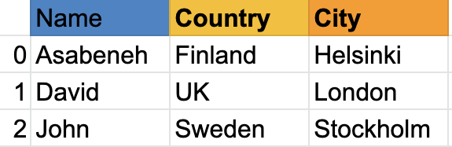

# 30 días de desafío de programación en Python: Día 25 - Pandas

- [Día 25](#-día-25)
  - [Pandas](#pandas)
  - [InstalarPandas](#instalarpandas)
  - [ImportarPandas](#importarpandas)
  - [Crear serie de Pandas con índice por defecto](#crear-serie-de-pandas-con-índice-por-defecto)
  - [Crear serie de Pandas con índice personalizado](#crear-serie-de-pandas-con-índice-personalizado)
  - [Crear serie de Pandas a partir de un diccionario](#crear-serie-de-pandas-a-partir-de-un-diccionario)
  - [Crear serie de Pandas constante](#crear-serie-de-pandas-constante)
  - [Crear serie de Pandas con Linspace](#crear-serie-de-pandas-con-linspace)
  - [DataFrames](#dataframes)
    - [Crear DataFrame a partir de una lista de listas](#crear-dataframe-a-partir-de-una-lista-de-listas)
    - [Crear DataFrame a partir de un diccionario](#crear-dataframe-a-partir-de-un-diccionario)
    - [Crear DataFrame a partir de una lista de diccionarios](#crear-dataframe-a-partir-de-una-lista-de-diccionarios)
  - [Leer archivos CSV con Pandas](#leer-archivos-csv-con-pandas)
    - [Exploración de datos](#exploración-de-datos)
  - [Modificar DataFrame](#modificar-dataframe)
    - [Crear DataFrame](#crear-dataframe)
    - [Añadir nueva columna](#añadir-nueva-columna)
    - [Modificar valores de una columna](#modificar-valores-de-una-columna)
    - [Formatear columnas del DataFrame](#formatear-columnas-del-dataframe)
  - [Comprobar tipos de datos de columnas](#comprobar-tipos-de-datos-de-columnas)
    - [Indexación booleana](#indexación-booleana)
  - [Ejercicios: Día 25](#ejercicios-día-25)
  
# 📘 Día 25

## Pandas

Pandas es una librería open source, de alto rendimiento y fácil de usar para el manejo y análisis de estructuras de datos en Python.
Pandas aporta estructuras y herramientas para manejar datos tabulares: *Series* y *DataFrames*.
Pandas proporciona utilidades para operaciones de datos como:

- reshape (remodelar)
- merge (fusionar)
- sort (ordenar)
- slice (rebanar)
- aggregate (agregar)
- interpolate (interpolar)

Si usas Anaconda no es necesario instalar pandas.

### InstalarPandas

Para Mac:
```sh
pip install conda
conda install pandas
```

Para Windows:
```sh
pip install conda
pip install pandas
```

Las estructuras de datos de Pandas se basan en *Series* y *DataFrames*.

Una *Serie* es una columna, mientras que un DataFrame es una tabla multidimensional compuesta por un conjunto de *Series*. Para crear una serie de Pandas, debemos usar un array unidimensional de NumPy o una lista de Python.
Veamos un ejemplo de una serie:

Serie de Pandas de nombres

 

Serie de países

 

Serie de ciudades


Como puedes ver, una serie de Pandas es simplemente una columna de datos. Si queremos tener varias columnas, usamos un DataFrame. El siguiente ejemplo muestra un DataFrame de Pandas.

Veamos un ejemplo de un DataFrame de Pandas:



Un DataFrame es una colección de filas y columnas. Mira la tabla a continuación; tiene más columnas que el ejemplo anterior:


A continuación, veremos cómo importar Pandas y cómo crear Series y DataFrames con Pandas.

### Importar Pandas

```python
import pandas as pd # importar pandas como pd
import numpy  as np # importar numpy como np
```

### Crear serie de Pandas con índice por defecto

```python
nums = [1, 2, 3, 4,5]
s = pd.Series(nums)
print(s)
```

```sh
0    1
1    2
2    3
3    4
4    5
dtype: int64
```

### Crear serie de Pandas con índice personalizado

```python
nums = [1, 2, 3, 4, 5]
s = pd.Series(nums, index=[1, 2, 3, 4, 5])
print(s)
```

```sh
1    1
2    2
3    3
4    4
5    5
dtype: int64
```

```python
fruits = ['Orange','Banana','Mango']
fruits = pd.Series(fruits, index=[1, 2, 3])
print(fruits)
```

```sh
1    Orange
2    Banana
3    Mango
dtype: object
```

### Crear serie de Pandas a partir de un diccionario

```python
dct = {'name':'Asabeneh','country':'Finland','city':'Helsinki'}
```

```python
s = pd.Series(dct)
print(s)
```

```sh
name       Asabeneh
country     Finland
city       Helsinki
dtype: object
```

### Crear serie de Pandas constante

```python
s = pd.Series(10, index = [1, 2, 3])
print(s)
```

```sh
1    10
2    10
3    10
dtype: int64
```

### Crear serie de Pandas con Linspace

```python
s = pd.Series(np.linspace(5, 20, 10)) # linspace(inicio, fin, número_de_elementos)
print(s)
```

```sh
0     5.000000
1     6.666667
2     8.333333
3    10.000000
4    11.666667
5    13.333333
6    15.000000
7    16.666667
8    18.333333
9    20.000000
dtype: float64
```

## DataFrames

Pandas DataFrame se puede crear de diferentes maneras:

- Crear a partir de una lista de listas
- Crear a partir de un diccionario
- Crear a partir de una lista de diccionarios
- Crear a partir de un archivo CSV

### Crear DataFrame a partir de una lista de listas

```python
data = [
    ['Asabeneh', 'Finland', 'Helsinki'], 
    ['David', 'UK', 'London'],
    ['John', 'Sweden', 'Stockholm']
]
df = pd.DataFrame(data, columns=['Name', 'Country', 'City'])
print(df)
```

```sh
        Name Country      City
0   Asabeneh Finland  Helsinki
1      David      UK    London
2       John  Sweden Stockholm
```

### Crear DataFrame a partir de un diccionario

```python
data = {'Name': ['Asabeneh', 'David', 'John'], 'Country':[
    'Finland', 'UK', 'Sweden'], 'City': ['Helsinki', 'London', 'Stockholm']}
df = pd.DataFrame(data)
print(df)
```

```sh
        Name Country      City
0   Asabeneh Finland  Helsinki
1      David      UK    London
2       John  Sweden Stockholm
```

### Crear DataFrame a partir de una lista de diccionarios

```python
data = [
    {'Name': 'Asabeneh', 'Country': 'Finland', 'City': 'Helsinki'},
    {'Name': 'David', 'Country': 'UK', 'City': 'London'},
    {'Name': 'John', 'Country': 'Sweden', 'City': 'Stockholm'}]
df = pd.DataFrame(data)
print(df)
```

```sh
        Name Country      City
0   Asabeneh Finland  Helsinki
1      David      UK    London
2       John  Sweden Stockholm
```

## Leer archivos CSV con Pandas

Leamos el archivo en el directorio de datos, leeremos el archivo weight-height.csv pasando la ruta del archivo como parámetro a la función pd.read_csv(). Usemos el método head() para ver las primeras cinco filas.

```python
import pandas as pd

df = pd.read_csv('./data/weight-height.csv')
print(df.head()) # por defecto muestra las primeras 5 filas
```

```sh
   Gender     Height      Weight
0    Male  73.847017  241.893563
1    Male  68.781904  162.310473
2    Male  74.110105  212.740856
3    Male  71.730978  220.042470
4    Male  69.881796  206.349801
```

Veamos las últimas cinco filas usando el método tail():

```python
print(df.tail()) # últimas 5 filas
```

```sh
      Gender     Height      Weight
9995  Female  66.172652  136.777454
9996  Female  67.067155  170.867906
9997  Female  63.867992  128.475319
9998  Female  69.034243  163.852461
9999  Female  61.944246  113.649103
```

### Exploración de datos

Obtenemos el número de filas y columnas con la propiedad shape:
```python
print(df.shape) # número de filas y columnas
```

```sh
(10000, 3)
```

Como puedes ver, este conjunto de datos tiene 10000 filas y 3 columnas. Obtengamos más información sobre los datos:

```python
print(df.columns) # nombres de las columnas
print(df.head(10)) # primeras 10 filas
print(df.tail(10)) # últimas 10 filas
print(df['Gender'].value_counts()) # contar cuántos hay de cada uno
print(df.describe()) # resumen estadístico de los datos
```

```sh
Index(['Gender', 'Height', 'Weight'], dtype='object')
   Gender     Height      Weight
0    Male  73.847017  241.893563
1    Male  68.781904  162.310473
2    Male  74.110105  212.740856
3    Male  71.730978  220.042470
4    Male  69.881796  206.349801
5    Male  68.767792  152.212156
6    Male  67.961960  183.927889
7    Male  68.563817  175.929316
8    Male  71.267570  196.028855
9    Male  72.040119  205.801386
      Gender     Height      Weight
9990  Female  64.744846  139.725595
9991  Female  62.109532  132.451630
9992  Female  62.593008  130.727432
9993  Female  62.100222  131.220717
9994  Female  63.421888  133.330246
9995  Female  66.172652  136.777454
9996  Female  67.067155  170.867906
9997  Female  63.867992  128.475319
9998  Female  69.034243  163.852461
9999  Female  61.944246  113.649103
Gender
Male      5000
Female    5000
Name: count, dtype: int64
            Height        Weight
count  10000.000000  10000.000000
mean      66.367560    161.440357
std        3.847528     32.108439
min       54.263133     64.700127
25%       63.505620    135.818051
50%       66.318070    161.212928
75%       69.174262    187.169525
max       78.998742    269.989699
```

## Modificar DataFrame

### Crear DataFrame

Primero, creemos un DataFrame usando lo que aprendimos anteriormente:

```python
# importar pandas y numpy
import pandas as pd
import numpy as np
# datos
data = [
    {"Name": "Juan Pérez", "Country":"China", "City":"Shanghái"},
    {"Name": "Luis", "Country":"China", "City":"Pekín"},
    {"Name": "Carlos", "Country":"China", "City":"Cantón"}]
# crear DataFrame
df = pd.DataFrame(data)
print(df)
```

```sh
         Name Country      City
0  Juan Pérez   China  Shanghái
1        Luis   China     Pekín
2      Carlos   China     Cantón
```

### Añadir nueva columna

```python
weights = [74, 78, 69]
df['Weight'] = weights
df
```

```sh
         Name Country      City  Weight
0  Juan Pérez   China  Shanghái      74
1        Luis   China     Pekín      78
2      Carlos   China     Cantón      69
```

```python
heights = [173, 175, 169]
df['Height'] = heights
df
```

```sh
         Name Country      City  Weight  Height
0  Juan Pérez   China  Shanghái      74     173
1        Luis   China     Pekín      78     175
2      Carlos   China     Cantón      69     169
```

### Modificar valores de una columna

Podemos modificar una columna de tres maneras:

1. Asignación directa:
```python
df['Name'] = ['Miguel', 'Ana', 'Sofía']
df
```

```sh
     Name Country      City  Weight  Height
0  Miguel   China  Shanghái      74     173
1     Ana   China     Pekín      78     175
2   Sofía   China     Cantón      69     169
```

2. Modificando con loc:
```python
df.loc[1, 'Name'] = 'Lucía'
df
```

```sh
    Name Country      City  Weight  Height
0 Miguel   China  Shanghái      74     173
1  Lucía   China     Pekín      78     175
2  Sofía   China     Cantón      69     169
```

3. Modificando con iloc:
```python
print('Datos originales:\n', df)
df.iloc[1, 0] = 'Paco'
print('Datos modificados:\n', df)
```

```sh
Datos originales:
      Name Country      City  Weight  Height
0  Miguel   China  Shanghái      74     173
1   Lucía   China     Pekín      78     175
2   Sofía   China     Cantón      69     169
Datos modificados:
    Name Country      City  Weight  Height
0 Miguel   China  Shanghái      74     173
1   Paco   China     Pekín      78     175
2  Sofía   China     Cantón      69     169
```

### Formatear columnas del DataFrame

```python
# añadir columna BMI: peso(kg) / altura^2(m). Redondear a 2 decimales.
df['BMI'] = np.round(df['Weight'] / ((df['Height'] * 0.01) ** 2), 2)
print(df)
```

```sh
     Name Country      City  Weight  Height    BMI
0 Miguel   China  Shanghái      74     173  24.73
1   Paco   China     Pekín      78     175  25.47
2  Sofía   China     Cantón      69     169  24.16
```

## Comprobar tipos de datos de columnas

```python
print(df.dtypes)
```

```sh
Name        object
Country     object
City        object
Weight       int64
Height       int64
BMI        float64
dtype: object
```

### Indexación booleana

```python
# crear DataFrame
df = pd.DataFrame({
    'name': ['Juan', 'Luis', 'Carlos', 'Pedro'],
    'country': ['China', 'Estados Unidos', 'Reino Unido', 'España'],
    'age': [25, 15, 22, 28],
    'empleado': [True, False, True, False]
})

print(df)
```

```sh
    name        country  age  empleado
0   Juan          China   25      True
1   Luis  Estados Unidos   15     False
2 Carlos   Reino Unido    22      True
3  Pedro         España   28     False
```

Filtrando edad > 20 y empleado == True:
```python
print(df[(df['age'] > 20) & (df['empleado'] == True)])
```

```sh
     name      country  age  empleado
0    Juan        China   25      True
2  Carlos  Reino Unido   22      True
```

## Ejercicios: Día 25

1. Lee el archivo [hacker_news.csv](../data/hacker_news.csv) y muestra las primeras cinco filas.
2. Obtén la columna de títulos.
3. Obtén el número de filas y columnas.
4. Obtén las primeras diez y las últimas diez filas.
5. Obtén la segunda y cuarta fila, columnas 2 a 4.
6. Filtra las filas cuyo tema sea Python.
7. Cuenta cuántas filas tienen tema Python.
8. Filtra las filas con votos mayores a 200.
9. Ordena el DataFrame por votos (ascendente).
10. Ordena el DataFrame por votos (descendente).
11. Excluye las filas con tema Python y ordena por votos.

🎉 ¡Felicidades! 🎉

[<< Día 24](./24_statistics_sp.md) | [Día 26 >>](./26_python_web_sp.md)