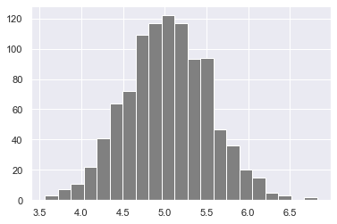
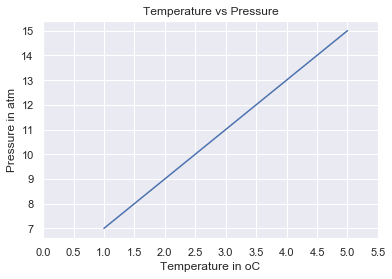
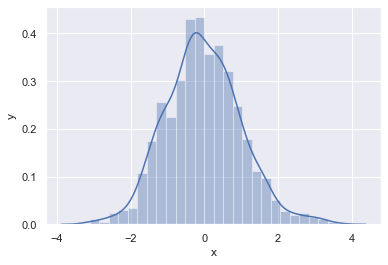

🧳 [Part 1: Day 1 - 3](https://github.com/Asabeneh/30-Days-Of-Python)  
🧳 [Part 2: Day 4 - 6](https://github.com/Asabeneh/30-Days-Of-Python/blob/master/readme4-6.md)  
🧳 [Part 3: Day 7 - 9](https://github.com/Asabeneh/30-Days-Of-Python/blob/master/readme7-9.md)  
🧳 [Part 4: Day 10 - 12](https://github.com/Asabeneh/30-Days-Of-Python/blob/master/readme10-12.md)  
🧳 [Part 5: Day 13 - 15](https://github.com/Asabeneh/30-Days-Of-Python/blob/master/readme13-15.md)  
🧳 [Part 6: Day 16 - 18](https://github.com/Asabeneh/30-Days-Of-Python/blob/master/readme16-18.md)  
🧳 [Part 7: Day 19 - 21](https://github.com/Asabeneh/30-Days-Of-Python/blob/master/readme19-21.md)  
🧳 [Part 8: Day 22 - 24](https://github.com/Asabeneh/30-Days-Of-Python/blob/master/readme22-24.md)  
🧳 [Part 9: Day 25 - 27](#) 🔒  
🧳 [Part 10: Day 28 - 30](#) 🔒

---

- [📘 Day 22](#%f0%9f%93%98-day-22)
  - [Python Web Scraping](#python-web-scraping)
    - [What is web scrapping](#what-is-web-scrapping)
  - [💻 Exercises: Day 22](#%f0%9f%92%bb-exercises-day-22)
- [📘 Day 23](#%f0%9f%93%98-day-23)
  - [Setting up Virtual Environments](#setting-up-virtual-environments)
- [How to import numpy](#how-to-import-numpy)
- [How to check the version of the numpy package](#how-to-check-the-version-of-the-numpy-package)
- [Checking the available methods](#checking-the-available-methods)
- [Creating python List](#creating-python-list)
- [Checking data types](#checking-data-types)
- [Creating Numpy(Numerical Python) array from python list](#creating-numpynumerical-python-array-from-python-list)
- [We can always convert an array back to a python list using tolist().](#we-can-always-convert-an-array-back-to-a-python-list-using-tolist)
- [Numpy array from tuple](#numpy-array-from-tuple)
- [Creating tuple in Python](#creating-tuple-in-python)
- [Mathematical Operation](#mathematical-operation)
- [Addition](#addition)
- [Multiplication](#multiplication)
- [Converting type from float to int](#converting-type-from-float-to-int)
- [Converting type from int to str](#converting-type-from-int-to-str)
- [2 Dimension Array](#2-dimension-array)
- [2 Dimension Array](#2-dimension-array-1)
    - [Reverse only the row positions](#reverse-only-the-row-positions)
    - [Reverse the row and column positions](#reverse-the-row-and-column-positions)
  - [How to represent missing values and infinite?](#how-to-represent-missing-values-and-infinite)
      - [Generating Random Numbers](#generating-random-numbers)
  - [Numpy and Statistics](#numpy-and-statistics)
    - [NumPy Statistical Functions with Example](#numpy-statistical-functions-with-example)
    - [How to create repeating sequences?](#how-to-create-repeating-sequences)
    - [How to generate random numbers?](#how-to-generate-random-numbers)
- [Summery](#summery)
  - [💻 Exercises: Day 24](#%f0%9f%92%bb-exercises-day-24)

# 📘 Day 22

## Python Web Scraping

### What is web scrapping

The internet is full huge amount of data which can be used for different uses. To collect this data we need to know how scrape data on a website.

Web scraping is the process of extracting and collecting data from websites and storing the data into a local machine or into a database.

In this section, we will use beautifulsoup and requests package to scape data. The beautifulsoup package we are using beautifulsoup 4.

To start scraping a website you need _requests_, _beautifoulSoup4_ and _website_ to be scrapped.

```sh
pip install requests
pip installl install beautifulsoup4
```

To scrape a data on a website it needs basic understanding of HTML tags and css selectors. We target content from a website using HTML tag, class or an id.
Let's import the requests and BeautifulSoup module

```py
import requests
from bs4 import BeautifulSoup
```

Let's declare url variable for the website which we are going to scrape.

```py

import requests
from bs4 import BeautifulSoup
url = 'http://mlr.cs.umass.edu/ml/datasets.html'

# Lets use the requests get method to fetch the data from url

response = requests.get(url)
# lets check the status
status = response.status_code
print(status) # 200 means the fetching was successful
```

```sh
200
```

Using beautifulSoup to parse content from the page

```py
import requests
from bs4 import BeautifulSoup
url = 'http://mlr.cs.umass.edu/ml/datasets.html'

response = requests.get(url)
content = response.content # we get all the content from the website
soup = BeautifulSoup(content, 'html.parser') # beautiful soup will give a chance to parse
print(soup.title) # <title>UCI Machine Learning Repository: Data Sets</title>
print(soup.title.get_text()) # UCI Machine Learning Repository: Data Sets
print(soup.body) # gives the whole page on the website
# print(soup.body)
print(response.status_code)

tables = soup.find_all('table', {'cellpadding':'3'})
# We are targeting the table with cellpadding attribute and the attribute value
# We can select using id, class or HTML tag , for more information check the beautifulsoup doc
table = tables[0] # the result is list, we are taking out from the list
for td in table.find('tr').find_all('td'):
    print(td.text)
```

If you run the above code, you can see that the extraction is half done. You can continue doing it because it is part of exercise 1.
For reference check the beautiful [soup documentation](https://www.crummy.com/software/BeautifulSoup/bs4/doc/#quick-start)

## 💻 Exercises: Day 22

1. Extract the table in this url (http://mlr.cs.umass.edu/ml/datasets.html) and change it to a json file
2. Scrape the presidents table and store the data as json(https://en.wikipedia.org/wiki/List_of_presidents_of_the_United_States)

# 📘 Day 23

## Setting up Virtual Environments

To start with project, it would be better to have a virtual environment. Virtual environment can help us to create an isolated or separate environment. This will help us to avoid conflicts in dependencies across projects. If you write pip freeze on your terminal you will see all the installed packages on your computer. If we use virtualenv, we will access only packages which are specific for that project. Open your terminal and install virtualenv

```sh
asabeneh@Asabeneh:~/Desktop/30DaysOfPython/flask_project$ pip install virtualenv
```

After installing the virtualenv package go to your project folder and create a virtual env by writing:
``sh
asabeneh@Asabeneh:~/Desktop/30DaysOfPython/flask_project\$ virtualenv venv

````
The venv name could another name too but I prefer to call it venv. Let's check if the the venv is create by using ls command.
```sh
asabeneh@Asabeneh:~/Desktop/30DaysOfPython/flask_project$ ls
venv/
````

Let's activate the virtual environment by writing the following command at our project folder.

```sh
asabeneh@Asabeneh:~/Desktop/30DaysOfPython/flask_project$ source venv/bin/activate

```

After you write the activation command, your project directory will start with venv. See the example below.

```sh
(venv) asabeneh@Asabeneh:~/Desktop/30DaysOfPython/flask_project$
```

Now, lets check the available package in this project by writing pip freeze. You will not see any package.

We are going to do a small flask project so let's install flask to this project.

```sh
(venv) asabeneh@Asabeneh:~/Desktop/30DaysOfPython/flask_project$ pip install Flask
```

Now, let's write pip freeze to see the install packages in the project

```sh
(venv) asabeneh@Asabeneh:~/Desktop/30DaysOfPython/flask_project$ pip freeze
Click==7.0
Flask==1.1.1
itsdangerous==1.1.0
Jinja2==2.10.3
MarkupSafe==1.1.1
Werkzeug==0.16.0
```

When you finish you should dactivate active project using _deactivate_.

```sh
(venv) asabeneh@Asabeneh:~/Desktop/30DaysOfPython$ deactivate
```

The necessary modules to work on flask are installed. Now, you project directory is ready for flask project. You should include the venv to your .gitignore file not to push it to github.

## 💻 Exercises: Day 23

  1. Create a project directory with a virtual environment based on the example give above.
# Day 24

## Python for Statistical Analysis

### Statistics

Statistics is the discipline that concerns the _collection_, _organization_, _displaying_, _analysis_, _interpretation_ and _presentation_ of data.
Statistics is a sub field of mathematics that is universally agreed to be a prerequisite for a deeper understanding of data science and machine learning. Statistics is a very broad field but we will focus in this section only on the most relevant part.
After completing this challenge, you may go to web development, data analysis, machine learning and data science path. Whatever path you may follow, at some point you will in your career you will get data which you may work on.

### Data

What is data? Data is any set of characters that is gathered and translated for some purpose, usually analysis. It can be any character, including text and numbers, pictures, sound, or video. If data is not put into context, it doesn't do anything to a human or computer. To make sense from data we need to work on the data using different tools.
The work flow of data analysis, data science or machine learning starts from data.
Either we create or get data. Data can be found as small or big data format. Most of the data types we will get have been covered in the file handling section.

### Statistics Module

The python _statistics_ module provides functions for calculating mathematical statistics of numeric data. The module is not intended to be a competitor to third-party libraries such as NumPy, SciPy, or proprietary full-featured statistics packages aimed at professional statisticians such as Minitab, SAS and Matlab. It is aimed at the level of graphing and scientific calculators.

## NumPy

In the first section we defined python as a great general-purpose programming language on its own, but with the help of other popular libraries (numpy, scipy, matplotlib, pandas etc) it becomes a powerful environment for scientific computing.

Numpy is the core library for scientific computing in Python. It provides a high-performance multidimensional array object, and tools for working with arrays.

So far, we have been using vscode but from now on I would recommend using Jupyter Notebook. To access jupter notebook let's install [anaconda](https://www.anaconda.com/). If you are using anaconda most of the common packages are included and you don't have install packages if you installed anaconda.

```sh
asabeneh@Asabeneh:~/Desktop/30DaysOfPython$ pip install numpy
```

### Importing NumPy

Jupyter notebook is available if your are in favor of [jupyter notebook](https://github.com/Asabeneh/30-Days-Of-Python/blob/master/r)

```py
# How to import numpy
import numpy as np
# How to check the version of the numpy package
print('numpy:', np.__version__)
# Checking the available methods
print(dir(np))
```

### Creating numpy array using

```py
# Creating python List
python_list = [1,2,3,4,5]
# Checking data types
print(type (python_list))
print(python_list)
two_dimensional_list = [[0,1,2], [3,4,5], [6,7,8]]
print(two_dimensional_list)
```

```sh
<class 'numpy.ndarray'>
[1 2 3 4 5]
```

```py
# Creating Numpy(Numerical Python) array from python list
numpy_array_from_list = np.array(python_list)
print(type (numpy_array_from_list))
print(numpy_array_from_list)
```

Creating list with a float data type

```py
python_list = [1,2,3,4,5]
numy_array_from_list2 = np.array(python_list, dtype=float)
print(numy_array_from_list2)
```

```sh
array([1., 2., 3., 4., 5.])
```

Creating list with a boolean data type

```py
numpy_bool_array = np.array([0, 1, -1, 0, 0], dtype=bool)
print(numpy_bool_array)
```

```sh
array([False,  True,  True, False, False])
```

Creating multidimensional array using numpy

```py
two_dimensional_list = [[0,1,2], [3,4,5], [6,7,8]]
numpy_two_dimensional_list = np.array(two_dimensional_list)
print(type (numpy_two_dimensional_list))
print(numpy_two_dimensional_list)
```

```sh
array([[0, 1, 2],
      [3, 4, 5],
      [6, 7, 8]])
```

### Converting numpy array to list

```py
# We can always convert an array back to a python list using tolist().
np_to_list = numpy_array_from_list.tolist()
print(type (np_to_list))
print('one dimensional array:', np_to_list)
print('two dimensional array: ', numpy_two_dimensional_list.tolist())
```

```sh
<class 'list'>
one dimensional array: [1, 2, 3, 4, 5]
two dimensional array:  [[0, 1, 2], [3, 4, 5], [6, 7, 8]]
```

### Creating numpy array from tuple

```py
# Numpy array from tuple
# Creating tuple in Python

python_tuple = (1,2,3,4,5)
print(type (python_tuple))
print('python_tuple: ', python_tuple)

numpy_array_from_tuple = np.array(python_tuple)
print(type (numpy_array_from_tuple))
print('numpy_array_from_tuple: ', numpy_array_from_tuple)
```

```sh
<class 'tuple'>
python_tuple:  (1, 2, 3, 4, 5)
<class 'numpy.ndarray'>
numpy_array_from_tuple:  array([1, 2, 3, 4, 5])
```

### Shape of numpy array

The shape method provide the shape of the array as a tuple. The first is the row and the second is the column

```py
nums = np.array([1, 2, 3, 4, 5])
print(nums)
print('shape of nums: ', nums.shape)
print(numpy_two_dimensional_list)
print('shape of numpy_two_dimensional_list: ', numpy_two_dimensional_list.shape)
three_by_four_array = np.array([[0, 1, 2, 3],
      [4,5,6,7],
      [8,9,10, 11]])
print(three_by_four_array.shape)
```

```sh
[1 2 3 4 5]
shape of nums:  (5,)
[[0 1 2]
[3 4 5]
[6 7 8]]
shape of numpy_two_dimensional_list:  (3, 3)
(3, 4)
```

### Data type of numpy array

Type of data types: str, int, float, complex, bool, list, None

```py
int_lists = [-3, -2, -1, 0, 1, 2,3]
int_array = np.array(int_lists)
float_array = np.array(int_lists, dtype=float)

print(int_array)
print(int_array.dtype)
print(float_array)
print(float_array.dtype)
```

```sh
[-3 -2 -1  0  1  2  3]
int64
[-3. -2. -1.  0.  1.  2.  3.]
float64
```

### Size of a numpy array¶

Instead of len size is used to get the length of items in a numpy array

```py
numpy_array_from_list = np.array([1, 2, 3, 4, 5])
two_dimensional_list = np.array([[0, 1, 2],
                              [3, 4, 5],
                              [6, 7, 8]])
print(len(numpy_array_from_list)) # 5
print(len(two_dimensional_list))  # 3
```

### Mathematical Operation

```py
# Mathematical Operation
# Addition
print('original array: ', numpy_array_from_list)
ten_plus_original = numpy_array_from_list  + 10
print(ten_plus_original)
ten_minus_original = numpy_array_from_list  - 10
print(ten_minus_original)
# Multiplication
ten_times_original = numpy_array_from_list * 10
print(ten_times_original)
```

```sh
original array:  [1 2 3 4 5]
[11 12 13 14 15]
[-9 -8 -7 -6 -5]
[10 20 30 40 50]
```

### Checking numpy array data types

```py
#Int,  Float numbers

numpy_int_list = np.array([1,2,3,4])
numpy_float_list = np.array([1.1, 2.0,3.2])
numpy_float_list2 = np.array([1.1,2.0,3.2])

print(numpy_int_list.dtype)
print(numpy_float_list2.dtype)
print(numpy_float_list.dtype)
```

```sh
int64
float64
float64
```

### Converting types

```py
# Converting type from float to int
numpy_float_list = np.array([1.1, 2.0,3.2])
numpy_float_list.astype('int')
print(numpy_float_list)
```

```sh
array([1, 2, 3])
```

```py
# Converting type from int to str
numpy_float_list.astype('int').astype('str')
```

```sh
array(['1', '2', '3'], dtype='<U21')
```

### Dimensional Arrays

```py
# 2 Dimension Array
two_dimension_array = np.array([(1,2,3),(4,5,6), (7,8,9)])
print(type (two_dimension_array))
print(two_dimension_array)
print('Shape: ', two_dimension_array.shape)
print('Size:', two_dimension_array.size)
print('Data type:', two_dimension_array.dtype)
```

```sh
<class 'numpy.ndarray'>
[[1 2 3]
 [4 5 6]
 [7 8 9]]
Shape:  (3, 3)
Size: 9
Data type: int64
```

### Getting items from a numpy array

```py
# 2 Dimension Array
two_dimension_array = np.array([[1,2,3],[4,5,6], [7,8,9]])
first_row = two_dimension_array[0]
second_row = two_dimension_array[1]
third_row = two_dimension_array[2]
print('First row:', first_row)
print('Second row:', second_row)
print('Third row: ', third_row)
```

```sh
First row: [1 2 3]
Second row: [4 5 6]
Third row:  [7 8 9]
```

```py
first_column= two_dimension_array[:,0]
second_column = two_dimension_array[:,1]
third_column = two_dimension_array[:,2]
print('First column:', first_column)
print('Second column:', second_column)
print('Third column: ', third_column)
print(two_dimension_array)

```

```sh
First column: [1 4 7]
Second column: [2 5 8]
Third column:  [3 6 9]
[[1 2 3]
 [4 5 6]
 [7 8 9]]
```

Slicing in numpy is similar to slicing in python list

```py
first_two_rows_and_columns = two_dimension_array[0:2, 0:2]
print(first_two_rows_and_columns)
```

```sh
array([[1, 2],
       [4, 5]])
```

### How to reverse the rows and the whole array?

````python
two_dimension_array[::]
    array([[1, 2, 3],
           [4, 5, 6],
           [7, 8, 9]])


### Reverse only the row positions


```python
two_dimension_array[::-1,]
````

    array([[7, 8, 9],
           [4, 5, 6],
           [1, 2, 3]])

### Reverse the row and column positions

```python
two_dimension_array[::-1,::-1]
```

    array([[9, 8, 7],
           [6, 5, 4],
           [3, 2, 1]])

## How to represent missing values and infinite?

```python
print(two_dimension_array)
two_dimension_array[1,1] = 55
two_dimension_array[1,2] =44
print(two_dimension_array)
```

    [[1 2 3]
     [4 5 6]
     [7 8 9]]
    [[ 1  2  3]
     [ 4 55 44]
     [ 7  8  9]]

```python
# Numpy Zeroes
# numpy.zeros(shape, dtype=float, order='C')
numpy_zeroes = np.zeros((3,3),dtype=int,order='C')
numpy_zeroes
```

    array([[0, 0, 0],
           [0, 0, 0],
           [0, 0, 0]])

```python
# Numpy Zeroes
numpy_ones = np.ones((3,3),dtype=int,order='C')
print(numpy_ones)
```

    [[1 1 1]
     [1 1 1]
     [1 1 1]]

```python
twoes = numpy_ones * 2
```

```python
# Reshape
# numpy.reshape(), numpy.flatten()
first_shape  = np.array([(1,2,3), (4,5,6)])
print(first_shape)
reshaped = first_shape.reshape(3,2)
print(reshaped)

```

    [[1 2 3]
     [4 5 6]]
    [[1 2]
     [3 4]
     [5 6]]

```python
flattened = reshaped.flatten()
flattened
```

    array([1, 2, 3, 4, 5, 6])

```python
## Horitzontal Stack
np_list_one = np.array([1,2,3])
np_list_two = np.array([4,5,6])

print(np_list_one + np_list_two)

print('Horizontal Append:', np.hstack((np_list_one, np_list_two)))
```

    [5 7 9]
    Horizontal Append: [1 2 3 4 5 6]

```python
## Vertical Stack
print('Vertical Append:', np.vstack((np_list_one, np_list_two)))
```

    Vertical Append: [[1 2 3]
     [4 5 6]]

#### Generating Random Numbers

```python
# Generate a random float  number
random_float = np.random.random()
random_float
```

    0.6661632875670657

```python
# Generate a random float  number
random_floats = np.random.random(5)
random_floats
```

    array([0.12945387, 0.1859908 , 0.47805876, 0.51996342, 0.52458233])

```python
# Generating a random integers between 0 and 10
random_int = np.random.randint(0, 11)
random_int
```

    7

```python
# Generating a random integers between 2 and 11, and creating a one row array
random_int = np.random.randint(2,10, size=4)
random_int
```

    array([5, 8, 8, 9])

```python
# Generating a random integers between 0 and 10
random_int = np.random.randint(2,10, size=(3,3))
random_int
```

    array([[8, 9, 5],
           [9, 8, 3],
           [2, 3, 8]])

```python
# Generate random numbers
# np.random.normal(mu, sigma, size)
normal_array = np.random.normal(79, 15, 80)
normal_array

```

    array([ 76.67233671,  87.8686846 ,  64.80771996,  79.44136527,
            68.83066184, 102.85967631,  74.40838573,  58.56053793,
            93.76814784,  82.16082568,  86.80548555,  77.95291907,
            97.71514434,  95.94083876,  82.53018033,  73.74619803,
            67.07970869, 102.20984782,  81.67766599,  73.82096132,
            90.17632538, 102.87342877,  84.19855251,  81.11888938,
            63.42782472,  75.3734846 ,  79.04423914,  56.52607352,
            58.30505483,  54.69555571,  63.25792739,  88.75239018,
            85.44533248,  59.76883843,  39.72683784,  78.1029094 ,
            54.19952262,  82.383277  ,  87.01010766,  73.09642208,
            81.99276776,  82.58990091,  72.71303439, 101.73499367,
            73.65596295,  81.89611334,  96.14703307,  74.9629613 ,
            84.79491744,  90.77830881,  70.69085365,  69.27799996,
            74.07836137,  56.79410721,  76.08072393,  83.28246182,
            83.66382654,  80.79644627,  83.39674788,  73.68044176,
            59.74405724,  47.50763054,  50.99870066,  85.53776901,
            80.61131428,  62.66726385,  69.8289171 ,  58.2394869 ,
            86.5158869 ,  86.92976422,  65.12965299, 101.9918336 ,
            73.3855881 ,  99.29788439,  82.48238578,  83.14592314,
           109.13987986,  87.18461073,  73.18647475,  76.04712709,

           ])

## Numpy and Statistics

```python
import matplotlib.pyplot as plt
import seaborn as sns
sns.set()
plt.hist(normal_array, color="grey", bins=50)
```

    (array([ 1.,  0.,  1.,  2.,  0.,  1.,  3.,  3.,  4.,  2.,  4., 10.,  7.,
            12., 15., 13., 20., 26., 16., 32., 36., 42., 38., 37., 35., 54.,
            50., 40., 40., 55., 56., 49., 45., 29., 37., 26., 26., 23., 28.,
            12., 22., 10., 11.,  5.,  3.,  6.,  4.,  4.,  3.,  2.]),
     array([ 26.42484343,  28.2913796 ,  30.15791576,  32.02445192,
             33.89098809,  35.75752425,  37.62406041,  39.49059657,
             41.35713274,  43.2236689 ,  45.09020506,  46.95674123,
             48.82327739,  50.68981355,  52.55634972,  54.42288588,
             56.28942204,  58.1559582 ,  60.02249437,  61.88903053,
             63.75556669,  65.62210286,  67.48863902,  69.35517518,
             71.22171134,  73.08824751,  74.95478367,  76.82131983,
             78.687856  ,  80.55439216,  82.42092832,  84.28746449,
             86.15400065,  88.02053681,  89.88707297,  91.75360914,
             93.6201453 ,  95.48668146,  97.35321763,  99.21975379,
            101.08628995, 102.95282611, 104.81936228, 106.68589844,
            108.5524346 , 110.41897077, 112.28550693, 114.15204309,
            116.01857926, 117.88511542, 119.75165158]),
     <a list of 50 Patch objects>)

```python

```

```python
# numpy.asarray()
# Asarray
# The asarray()function is used when you want to convert an input to an array.
# The input could be a lists, tuple, ndarray, etc.
```

```python
four_by_four_matrix = np.matrix(np.ones((4,4), dtype=float))
```

```python
four_by_four_matrix
```

    matrix([[1., 1., 1., 1.],
            [1., 1., 1., 1.],
            [1., 1., 1., 1.],
            [1., 1., 1., 1.]])

```python
np.asarray(four_by_four_matrix)[2] = 2
four_by_four_matrix
```

    matrix([[1., 1., 1., 1.],
            [1., 1., 1., 1.],
            [2., 2., 2., 2.],
            [1., 1., 1., 1.]])

```python
# numpy.arange() in Python with Example
# Whay is Arrange?
# Sometimes, you want to create values that are evenly spaced within a defined interval.
# For instance, you want to create values from 1 to 10; you can use numpy.arange() function

```

```python
# creating list using range(starting, stop, step)
lst = range(0, 11, 2)
lst
```

    range(0, 11, 2)

```python
for l in lst:
    print(l)
```

    0
    2
    4
    6
    8
    10

```python
# Similar to range arange numpy.arange(start, stop, step)
whole_numbers = np.arange(0, 20, 1)
whole_numbers
```

    array([ 0,  1,  2,  3,  4,  5,  6,  7,  8,  9, 10, 11, 12, 13, 14, 15, 16,
           17, 18, 19])

```python
natural_numbers = np.arange(1, 20, 1)
natural_numbers
```

    array([ 1,  2,  3,  4,  5,  6,  7,  8,  9, 10, 11, 12, 13, 14, 15, 16, 17,
           18, 19])

```python
odd_numbers = np.arange(1, 20, 2)
odd_numbers
```

    array([ 1,  3,  5,  7,  9, 11, 13, 15, 17, 19])

```python
even_numbers = np.arange(2, 20, 2)
even_numbers
```

    array([ 2,  4,  6,  8, 10, 12, 14, 16, 18])

```python
# numpy.linspace()
# numpy.logspace() in Python with Example
# For instance, it can be used to create 10 values from 1 to 5 evenly spaced.
np.linspace(1.0, 5.0, num=10)
```

    array([1.        , 1.44444444, 1.88888889, 2.33333333, 2.77777778,
           3.22222222, 3.66666667, 4.11111111, 4.55555556, 5.        ])

```python
# not to include the last value in the interval
np.linspace(1.0, 5.0, num=5, endpoint=False)
```

    array([1. , 1.8, 2.6, 3.4, 4.2])

```python
# LogSpace
# LogSpace returns even spaced numbers on a log scale. Logspace has the same parameters as np.linspace.

# Syntax:

# numpy.logspace(start, stop, num, endpoint)
```

```python
np.logspace(2, 4.0, num=4)
```

    array([  100.        ,   464.15888336,  2154.43469003, 10000.        ])

```python
# to check the size of an array
x = np.array([1,2,3], dtype=np.complex128)
```

```python
x
```

    array([1.+0.j, 2.+0.j, 3.+0.j])

```python
x.itemsize
```

    16

```python
# indexing and Slicing NumPy Arrays in Python
np_list = np.array([(1,2,3), (4,5,6)])
np_list

```

    array([[1, 2, 3],
           [4, 5, 6]])

```python
print('First row: ', np_list[0])
print('Second row: ', np_list[1])

```

    First row:  [1 2 3]
    Second row:  [4 5 6]

```python
print('First column: ', np_list[:,0])
print('Second column: ', np_list[:,1])
print('Third column: ', np_list[:,2])

```

    First column:  [1 4]
    Second column:  [2 5]
    Third column:  [3 6]

### NumPy Statistical Functions with Example

NumPy has quite a few useful statistical functions for finding minimum, maximum, percentile standard deviation and variance, etc from the given elements in the array.
The functions are explained as follows −
Statistical function
Numpy is equipped with the robust statistical function as listed below

- Numpy Functions
  - Min np.min()
  - Max np.max()
  - Mean np.mean()
  - Median np.median()
  - Standard deviation np.std()

```python
np_normal_dis = np.random.normal(5, 0.5, 100)
np_normal_dis
## min, max, mean, median, sd
print('min: ', two_dimension_array.min())
print('max: ', two_dimension_array.max())
print('mean: ',two_dimension_array.mean())
# print('median: ', two_dimension_array.median())
print('sd: ', two_dimension_array.std())
```

    min:  1
    max:  55
    mean:  14.777777777777779
    sd:  18.913709183069525

```python
print(two_dimension_array)
print('Column with minimum: ', np.amin(two_dimension_array,axis=0))
print('Column with maximum: ', np.amax(two_dimension_array,axis=0))
print('=== Row ==')
print('Row with minimum: ', np.amin(two_dimension_array,axis=1))
print('Row with maximum: ', np.amax(two_dimension_array,axis=1))
```

    [[ 1  2  3]
     [ 4 55 44]
     [ 7  8  9]]
    Column with minimum:  [1 2 3]
    Column with maximum:  [ 7 55 44]
    === Row ==
    Row with minimum:  [1 4 7]
    Row with maximum:  [ 3 55  9]

### How to create repeating sequences?

```python
a = [1,2,3]

# Repeat whole of 'a' two times
print('Tile:   ', np.tile(a, 2))

# Repeat each element of 'a' two times
print('Repeat: ', np.repeat(a, 2))

```

    Tile:    [1 2 3 1 2 3]
    Repeat:  [1 1 2 2 3 3]

### How to generate random numbers?

```python
# One random number between [0,1)
one_random_num = np.random.random()
one_random_in = np.random
print(one_random_num)
```

    0.4763968133790438

```python
# Random numbers between [0,1) of shape 2,3
r = np.random.random(size=[2,3])
print(r)
```

    [[0.67018871 0.71699922 0.36490538]
     [0.78086531 0.5779336  0.81444353]]

```python
print(np.random.choice(['a', 'e', 'i', 'o', 'u'], size=10))
```

    ['i' 'u' 'e' 'o' 'a' 'i' 'e' 'u' 'o' 'i']

```python

```

```python
## Random numbers between [0, 1] of shape 2, 2
rand = np.random.rand(2,2)
rand
```

    array([[0.66811333, 0.1139411 ],
           [0.90955775, 0.14954203]])

```python
rand2 = np.random.randn(2,2)
rand2

```

    array([[-0.84819546, -0.39626819],
           [ 0.9172979 ,  0.03661474]])

```python
# Random integers between [0, 10) of shape 2,5
rand_int = np.random.randint(0, 10, size=[5,3])
rand_int
```

    array([[2, 7, 0],
           [0, 2, 7],
           [5, 9, 4],
           [6, 0, 8],
           [4, 6, 2]])

```python

```

```python
from scipy import stats
np_normal_dis = np.random.normal(5, 0.5, 1000)
np_normal_dis
## min, max, mean, median, sd
print('min: ', np.min(np_normal_dis))
print('max: ', np.max(np_normal_dis))
print('mean: ', np.mean(np_normal_dis))
print('median: ', np.median(np_normal_dis))
print('mode: ', stats.mode(np_normal_dis))
print('sd: ', np.std(np_normal_dis))
```

    min:  3.566493784430423
    max:  6.823091905048957
    mean:  5.034308251615374
    median:  5.0317142506545505
    mode:  ModeResult(mode=array([3.56649378]), count=array([1]))
    sd:  0.5050902240094916

```python
plt.hist(np_normal_dis, color="grey", bins=21)
```

    (array([  3.,   7.,  11.,  22.,  41.,  64.,  72., 109., 117., 122., 117.,
             93.,  94.,  47.,  36.,  20.,  15.,   5.,   3.,   0.,   2.]),
     array([3.56649378, 3.72156989, 3.87664599, 4.03172209, 4.18679819,
            4.34187429, 4.49695039, 4.65202649, 4.80710259, 4.96217869,
            5.11725479, 5.2723309 , 5.427407  , 5.5824831 , 5.7375592 ,
            5.8926353 , 6.0477114 , 6.2027875 , 6.3578636 , 6.5129397 ,
            6.6680158 , 6.82309191]),
     <a list of 21 Patch objects>)



```python
# numpy.dot(): Dot Product in Python using Numpy
# Dot Product
# Numpy is powerful library for matrices computation. For instance, you can compute the dot product with np.dot

# Syntax

# numpy.dot(x, y, out=None)
```

```python
## Linear algebra
### Dot product: product of two arrays
f = np.array([1,2])
g = np.array([4,5])
### 1*4+2*5
np.dot(f, g)
```

    14

```python
## Linear algebra
### Dot product: product of two arrays
f = np.array([1,2,3])
g = np.array([4,5,3])
### 1*4+2*5 + 3*6
np.dot(f, g)
```

    23

```python
# NumPy Matrix Multiplication with np.matmul()
```

```python
### Matmul: matruc product of two arrays
h = [[1,2],[3,4]]
i = [[5,6],[7,8]]
### 1*5+2*7 = 19
np.matmul(h, i)
```

    array([[19, 22],
           [43, 50]])

```python
## Determinant 2*2 matrix
### 5*8-7*6np.linalg.det(i)
```

```python
np.linalg.det(i)
```

    -1.999999999999999

```python
Z = np.zeros((8,8))
Z[1::2,::2] = 1
Z[::2,1::2] = 1
```

```python
Z
```

    array([[0., 1., 0., 1., 0., 1., 0., 1.],
           [1., 0., 1., 0., 1., 0., 1., 0.],
           [0., 1., 0., 1., 0., 1., 0., 1.],
           [1., 0., 1., 0., 1., 0., 1., 0.],
           [0., 1., 0., 1., 0., 1., 0., 1.],
           [1., 0., 1., 0., 1., 0., 1., 0.],
           [0., 1., 0., 1., 0., 1., 0., 1.],
           [1., 0., 1., 0., 1., 0., 1., 0.]])

```python
new_list = [ x + 2 for x in range(0, 11)]
```

```python
new_list
```

    [2, 3, 4, 5, 6, 7, 8, 9, 10, 11, 12]

```python
np_arr = np.array(range(0, 11))
np_arr + 2
```

    array([ 2,  3,  4,  5,  6,  7,  8,  9, 10, 11, 12])

```python
x = np.array([1,2,3,4,5])
y = x * 2 + 5
y
```

    array([ 7,  9, 11, 13, 15])

```python
plt.plot(x,y)
plt.xlabel('Temperature in oC')
plt.ylabel('Pressure in atm')
plt.title('Temperature vs Pressure')
plt.xticks(np.arange(0, 6, step=0.5))
plt.show()
```



```python
x = np.random.normal(size=1000)
ax = sns.distplot(x);
ax.set(xlabel="x", ylabel='y')

```

    [Text(0, 0.5, 'y'), Text(0.5, 0, 'x')]



# Summery

To summarise, the main differences with python lists are:

1. Arrays support vectorised operations, while lists don’t.
1. Once an array is created, you cannot change its size. You will have to create a new array or overwrite the existing one.
1. Every array has one and only one dtype. All items in it should be of that dtype.
1. An equivalent numpy array occupies much less space than a python list of lists.
1. numpy arrays support boolean indexing.

## 💻 Exercises: Day 24
1. Repeat all the examples

[<< Part 7 ](https://github.com/Asabeneh/30-Days-Of-Python/blob/master/readme19-21.md) | [Part 9 >>](https://github.com/Asabeneh/30-Days-Of-Python/blob/master/readme25-27.md)

---
